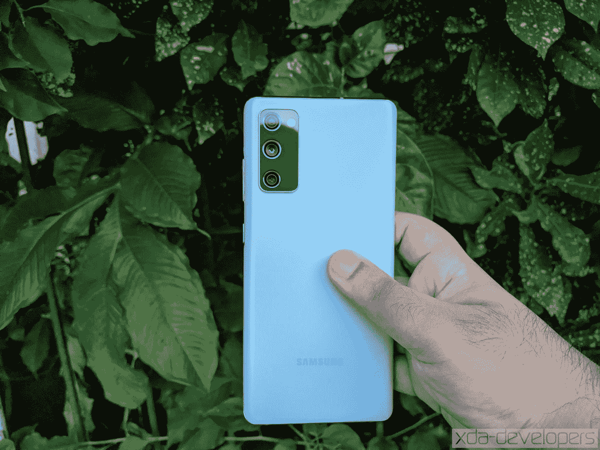
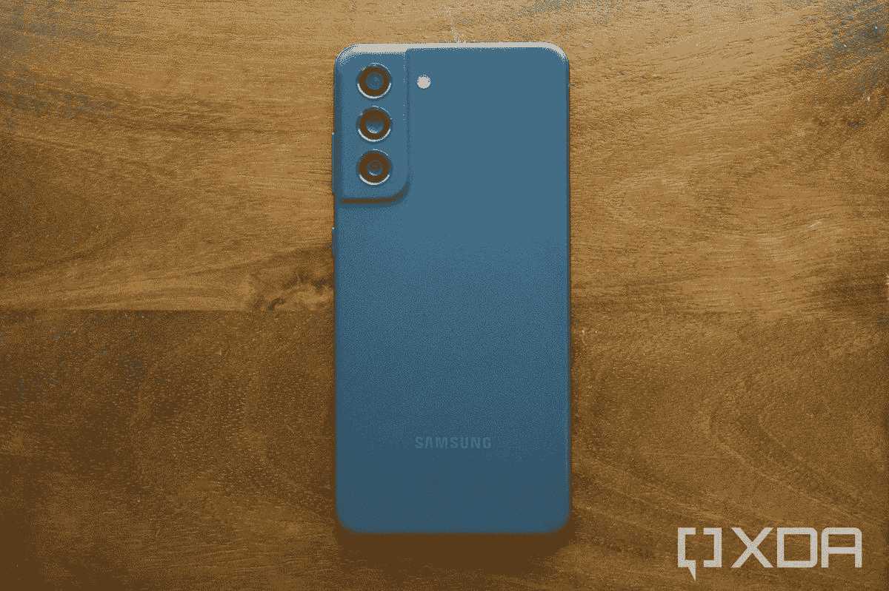
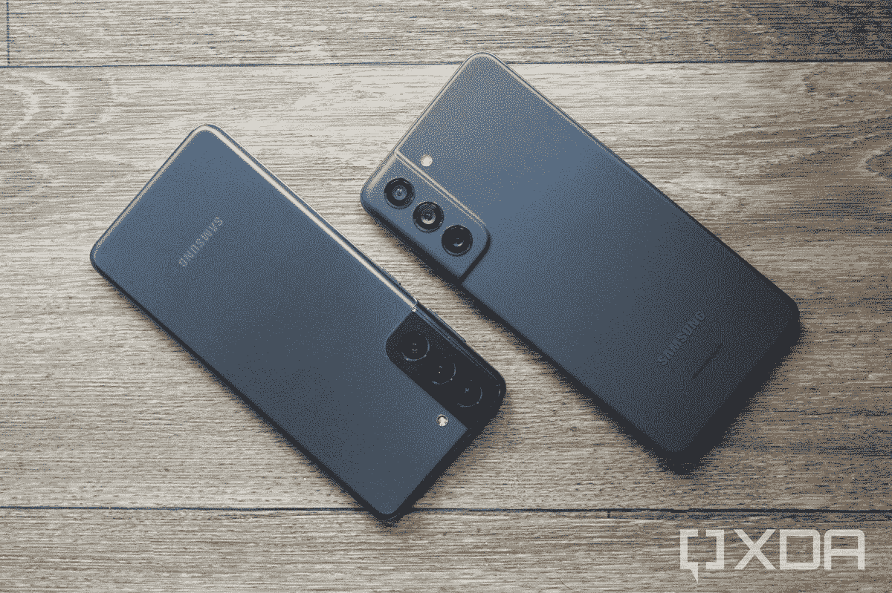

# 2022 年会有三星 Galaxy S22 FE 吗？

> 原文：<https://www.xda-developers.com/samsung-galaxy-s22-fe/>

随着 Galaxy S20 FE 的发布，三星在 2019 年开始发布“粉丝版”手机。我们终于在 1 月份收到了一部续集， [Galaxy S21 FE](https://www.xda-developers.com/samsung-galaxy-s21-fe-review/) ，它现在已经被 [Galaxy S22，Galaxy S22 Plus](https://www.xda-developers.com/samsung-galaxy-s22-hands-on/) 和 [Galaxy S22 Ultra](https://www.xda-developers.com/samsung-galaxy-s22-ultra-hands-on/) 的到来所掩盖。即使你现在利用最好的 [Galaxy S22 交易](https://www.xda-developers.com/best-samsung-galaxy-s22-deals/)，几个月后也可能会出现另一款 FE 手机。那么，三星会发布一款 Galaxy S22 FE 吗？即使最终有一个星系 S22 FE，那还有意义吗？

## 骚动的粉丝版

Galaxy S20 FE 粉丝版[是 2020 年最好的智能手机之一。它没有任何令人难以置信的创新或独家软件功能，但它确实吸收了人们喜欢的 Galaxy S 系列的几乎所有东西(一个用户界面，三年的 Android OS 更新，旗舰硬件等。)和削减一些次要的角落。结果是一款更便宜的设备，在美国的零售价为 699.99 美元，经常低至 550 美元。在美国，800 美元左右的旗舰手机并没有太多选择，即使在 Murica 以外，骁龙驱动的版本的广泛可用性也使它成为最畅销的手机。](https://www.xda-developers.com/samsung-galaxy-s20-fe-review/)

 <picture></picture> 

The Galaxy S20 FE

然而，Galaxy S21 粉丝版并不那么令人兴奋。虽然最初的 Galaxy S20 FE 于 2020 年下半年上市(完美定位在 Galaxy S20 和 Galaxy S21 系列之间)，但 Galaxy S21 FE 于 1 月份发布，比正式发布的 [Galaxy S22 系列](https://www.xda-developers.com/samsung-galaxy-s22-hands-on/)早一个月。这意味着它的芯片组已经有一年的历史了(骁龙 888/Exynos 2100)，尽管它的价格仍然是 699 美元，但它没有原来的 FE 那么高的价值。它的内存也更少，除非你买了 256GB 的型号，并放弃了 microSD 卡插槽。

三星尚未证实是否会发布另一款粉丝版手机，但基于其为品牌建立的遗产，这似乎是可能的。如果该公司能够在今年和明年的手机之间发布它，就像第一代一样，那么它就有理由存在。然而，我们也知道三星并不害怕扔掉它的廉价设备，尝试一些不同的东西 Galaxy S10 Lite，Note 10 Lite 和 S10e 从来没有直接的续集。所以它也可以走这条路。如果我们必须打赌，我们会说 Galaxy S22 FE 的可能性是积极的，除非三星有其他激烈的计划。

 <picture></picture> 

The Galaxy S21 FE

## Galaxy S22 FE 会是什么样子？

假设三星将生产 Galaxy S22 FE，那么这款手机会是什么样子呢？嗯，之前的两款粉丝版手机都非常接近之前的基本款 Galaxy S 手机，所以 Galaxy S22 FE 可能会是 Galaxy S22 的一个小设计迭代。一个塑料建筑是可能的，可能稍微差一些的相机。例如，Galaxy S21 FE 上的长焦镜头比普通 Galaxy S21 上的相同镜头质量要低。

内部硬件可能会接近 Galaxy S22，在美国采用相同的[骁龙 8 Gen 1](https://www.xda-developers.com/qualcomm-snapdragon-8-gen-1/) 芯片组，在其他地区采用 Exynos 芯片。*Galaxy S22 FE 的所有型号都有 8GB 内存，就像 Galaxy S20 FE 一样，这比基本型号 S21 FE 的 6GB 内存要多。遗憾的是，microSD 卡和耳机插孔不太可能回归。*

 *现有的两款 FE 手机的屏幕都比之前的 Galaxy S 手机略大，所以如果这种模式在第三款手机上继续下去，Galaxy S22 FE 的显示屏应该比 Galaxy S22 的 6.1 英寸面板更大。

## 今后

我们现在还不知道三星是否会推出 Galaxy S22 FE。上一款有点令人失望，但如果它卖得好(或者如果三星认为它可以解决自己的缺点)，那么我们可能仍会在今年晚些时候或明年初看到一款新机型。

 <picture></picture> 

Galaxy S21 (left) and Galaxy S21 FE (right)

三星的手机阵容已经相当拥挤，从最便宜的 [Galaxy A03](https://www.xda-developers.com/galaxy-a13-galaxy-a03s-united-states/) 到高端的 [Galaxy S22 Ultra](https://www.xda-developers.com/samsung-galaxy-s22-ultra-hands-on/) 和 [Galaxy Z Fold 3](https://www.xda-developers.com/samsung-galaxy-z-fold-3/) ，每 100 美元至少有一款手机。粉丝版阵容在定价上从未与基本的 Galaxy S 手机相差太远，尽管 [Galaxy A50 系列](https://www.xda-developers.com/samsung-galaxy-a53-specifications-leaks/)没有让 FE 引人注目的旗舰骁龙芯片组，但硬件通常足够接近，大多数人不会分辨出性能差异(除了在游戏时)。

如果三星能够更快地发布下一款 FE 设备，具有与最初的 Galaxy S20 FE 相同的性价比，它可能有理由存在。我们将不得不等待，看看三星会拿出什么。

 <picture></picture> 

Samsung Galaxy S22

三星 Galaxy S22 是 2022 年的入门级旗舰产品，以适合许多口袋和预算的形式带来了顶级的性能和相机功能。*