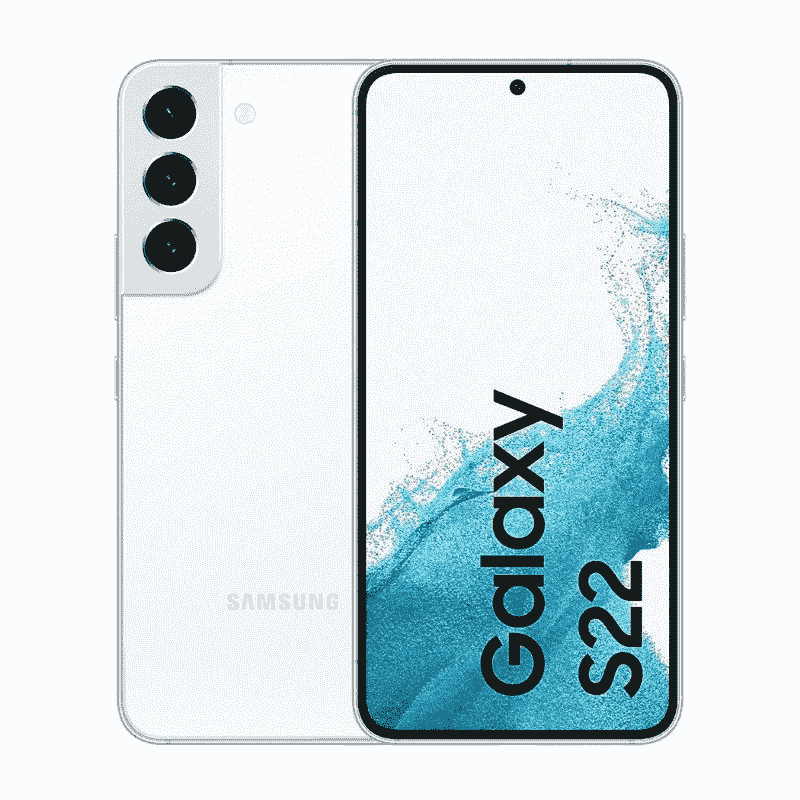
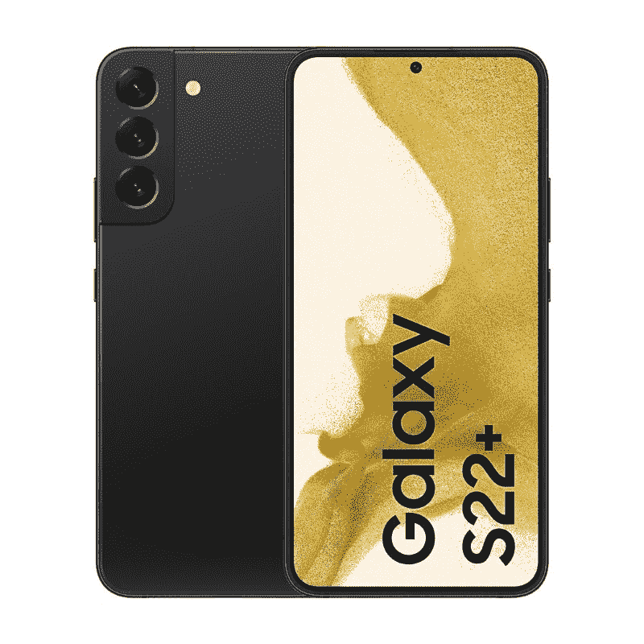
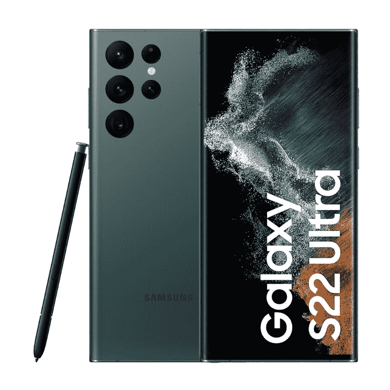

# 三星 Galaxy S22 系列有耳机孔吗？

> 原文：<https://www.xda-developers.com/samsung-galaxy-s22-headphone-jack/>

自从我们第一次看到心爱的 3.5 毫米插孔从智能手机上移除已经有几年了，不幸的是，这是一种趋势。现在很难找到一部带有 3.5 毫米耳机插孔的智能手机。然而，每当市场上有新手机上市时，我们都会怀疑 3.5 毫米耳机插孔是否是其规格表的一部分。那么问题来了——三星 Galaxy S22 系列有耳机孔吗？简而言之，答案是否定的。

三星在其 Galaxy S22 系列智能手机上提供了很多功能，但遗憾的是，耳机插孔不在其中。没错，新款三星 Galaxy S22 系列没有 3.5mm 耳机接口。新的 [Galaxy S22、Galaxy S22 Plus](https://www.xda-developers.com/samsung-galaxy-s22-hands-on/) 和 [Galaxy S22 Ultra](https://www.xda-developers.com/samsung-galaxy-s22-ultra-hands-on/) 没有 3.5 毫米耳机插孔并不令人惊讶。我们这么说是因为他们的前辈 Galaxy S21 系列——也没有。事实上，就连整个 Galaxy S20 阵容都缺少一个耳机接口。

## Galaxy S22 系列如何用耳机插孔听音频

还值得指出的是，三星已经停止将其旗舰设备与 USB Type-C 耳机捆绑在一起。正如我们在 [Galaxy S22 拆箱](https://www.xda-developers.com/samsung-galaxy-s22-unboxing/)中看到的，新手机也是如此。这意味着你要么必须单独购买一副无线耳塞，要么购买 USB Type-C 耳机。虽然缺少 3.5 毫米耳机插孔和捆绑的 USB Type-C 耳机令人失望，但不可否认的是，它们在 2022 年不是什么问题。市面上有很多 USB Type-C 耳机和无线耳塞。如果你需要帮助找到一些好的选择，你可以看看我们收集的最好的无线耳塞。或者，如果你愿意，你也可以查看 Galaxy S22 系列的[耳挂式耳机选项。](https://www.xda-developers.com/best-samsung-galaxy-s22-headphones/)

或者，如果不介意在同龄人中大声听音乐，也可以考虑购买好的蓝牙音箱。还有一个选项可以将您的音乐播放到各种无线扬声器或支持 Chromecast 的设备上。所以，是的，如果有一个内置的 3.5 毫米耳机插孔就好了，但有很多替代方法和变通办法可以让你自己听音乐或看电影。

 <picture></picture> 

Samsung Galaxy S22

三星 Galaxy S21 标志着 Galaxy S22 系列的入门产品。它配备了旗舰芯片组，以及良好的显示屏和强大的相机设置。

 <picture></picture> 

Samsung Galaxy S22 Plus

##### 三星 Galaxy S22 Plus

三星 Galaxy S22 Plus 是 Galaxy S22 系列中的老二。它有一个稍微更大更好的显示屏，但仍然缺少耳机插孔。

 <picture></picture> 

Samsung Galaxy S22 Ultra

三星 Galaxy S22 Ultra 是三款设备中最强大的设备。今年，Ultra 变种还配备了 S Pen，使其比其他两款手机更具吸引力。

你最喜欢的不带耳机插孔听音频的配件是什么？请在下面的评论中留言告诉我们。此外，如果你还没有购买这些新的 Galaxy 手机，那么一定要查看我们的 [Galaxy S22 deals](https://www.xda-developers.com/best-samsung-galaxy-s22-deals/) 页面，看看你是否能找到一些折扣。