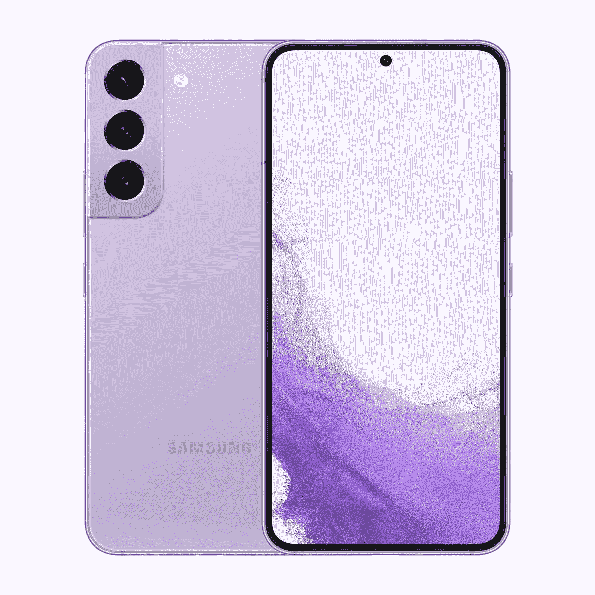

# 三星 Galaxy S22 重访:保持紧凑型手机的梦想活着！

> 原文：<https://www.xda-developers.com/samsung-galaxy-s22-long-term-review/>

我有一个坦白:我真的不喜欢紧凑型手机。我最后用的是三星 Galaxy S10e。还记得那个可爱的小手机吗？它有很多有趣的颜色，比如淡黄色和火烈鸟粉色。即使这样，也不足以打动我，让我把它放在口袋里。我不是紧凑型手机的粉丝，因为我认为它们与“常规”手机相比动力不足，或者它们往往太小，甚至无法处理基本的手机功能。

然而，如果我说我不喜欢使用 Galaxy S22 T1，那我是在撒谎。这几乎就像这部手机是欺骗我喜欢紧凑型手机。我这么说是因为我在使用了相对更大更强大的设备之后，比如说[一加 10T](https://www.xda-developers.com/oneplus-10t-review/) ，我不断回到这个话题。Galaxy S22 不是一款完美的手机，它也没有登上我们的[最佳安卓手机](https://www.xda-developers.com/best-android-phones/)榜单。但对于大多数不想花大钱的人来说只是一个不错的选择。这听起来像是一种挖苦的赞美，所以请允许我告诉你，它也是少数几个保持紧凑型手机梦想的设备之一。

在过去五个月的大部分时间里，我一直在使用 Galaxy S22，我在这里告诉你，虽然它可能不是最好的，但也没有你可能认为的那么糟糕。这也是所有紧凑型手机普遍存在的问题，所以请听我说完。

 <picture></picture> 

Samsung Galaxy S22

Galaxy S22 是目前最划算的智能手机之一，尤其是考虑到扩展的软件支持。

***关于这个更长期的评测:**这个评测是在广泛使用 Galaxy S22 五个多月后撰写的。三星印度公司为我们提供了用于测试的审查单元，但该公司对这篇文章的内容没有任何意见。*

## Galaxy S22 的表现出人意料地好

可折叠手机现在得到了所有的关注，但不可否认的是，在耐用性方面，它们无法与你典型的由玻璃和铝制成的旗舰级平板手机相媲美。需要担心的运动部件更少，因此更耐用。在过去的五个月里，我一直在没有外壳或屏幕保护装置的情况下使用 Galaxy S22，我不得不承认，它的表现出人意料地好。我确实不小心摔了手机几次，但我设法让它完好无损，没有可见的划痕或裂缝。在这里，看看这款手机目前的一些照片，所以你不必相信我的话:

在过去的五个月里，我一直在没有外壳或屏幕保护装置的情况下使用 Galaxy S22，我不得不承认，它的表现出人意料地好。

Galaxy S22 的紧凑尺寸也使其在日常使用中非常容易。尽管表面光滑，但我从未觉得自己会摔手机，这是我在其他设备上经历的事情，如 OPPO Reno 8 Pro 甚至一加 10T。我一直在使用 Galaxy S22 的幻影黑色版本，我认为它在隐藏指纹和污迹方面做得很好。正如你所看到的，这部手机看起来和我把它从盒子里拿出来的那天一样崭新。即使相对较大的手习惯于处理更大的手机，如 Galaxy S22 Ultra，我也喜欢 Galaxy S22 在没有外壳的情况下握在手中的自信。

手机右侧的按钮很容易够到，并且有令人满意的咔哒声。显示器内的指纹扫描仪速度快，反应灵敏，当我不想使用我的 TWS 耳塞时，扬声器听起来足够好。总的来说，Galaxy S22 的表现出人意料地好，这是我所期待的紧凑型手机的一切。与我桌上的许多其他手机相比，它简直是娇小玲珑，但不知何故，它拿在手中感觉很结实，设计也很低调。我会毫不犹豫地推荐这款手机，纯粹是因为它的设计和手感。

## 显示屏足够大，可以提供足够的体验

Galaxy S22 显示屏的最大优点之一当然是除了尺寸之外，它是一个平板显示器。我用过很多边缘弯曲的手机，我无法用语言来形容使用平板手机的感觉有多清爽。不需要担心意外的触摸，也不需要调整手柄以避免手指覆盖显示屏的两侧。Galaxy S22 的显示屏周围有对称且非常薄的边框，这使得它看起来更好。穿孔自拍剪影也没那么困扰我。所有这些都为观看电影或玩游戏时的沉浸式体验铺平了道路。

Galaxy S22 是一款我会立即推荐的手机，纯粹是因为它的设计和手感。

如果你想知道，Galaxy S22 有一个全高清+ AMOLED 2X 显示屏，刷新率为 120Hz。是的，这不是 QHD+，但坦率地说，这不是一个问题，特别是考虑到手机的足迹较小。AMOLED 面板对于墨黑色和鲜艳的颜色具有很好的对比度。它也变得足够亮，在阳光直射下可见。最近，我外出度假，在阳光明媚的日子里，我坐在沙滩上四处漫游，我可以舒适地使用手机拍照，浏览社交媒体，甚至在阳光直射下浏览街道。除此之外，可变的刷新率确保了电池寿命不会受到严重影响，尽管在下面的章节中电池寿命会受到更多影响。

## 正如旗舰产品所预期的那样，性能依然出色

Galaxy S22 的性能基本上与你对 2022 年旗舰智能手机的预期相当。由于骁龙 8 代 1 芯片组，手机可以非常流畅地处理一切。我在浏览 UI 或使用手机进行日常活动时，还没有经历过任何抖动或延迟。请注意，这是在连续使用五个月后的结果。我现在有数百个应用程序安装在这部手机上，我在任何给定的时间点上不断地在它们之间变戏法。我认为自己是一个重度用户，所以它能够跟上我的使用量这一事实说明了这款手机的长期可靠性。这是一款旗舰芯片，它继续像旗舰芯片一样工作。

也就是说，我不是一个超级手机游戏玩家，所以你的体验可能会根据你喜欢玩的游戏类型而有所不同。到目前为止，我在这部手机上玩过的唯一一款“资源密集型”游戏是 Apex Legends Mobile，它能够非常好地处理这款游戏。手机确实会变得很热，所以这一点值得注意。我注意到，即使我只是在拍照或以最高亮度使用手机进行导航等，手机摸起来也会变热。然而，这款手机的性能从未受到显著影响。你可以在本文前面链接的完整评论中详细了解 Galaxy S22 的性能。总的来说，总的表现非常好。中度和重度任务确实令人惊讶地温暖，但我没有因此面临任何性能限制，所以这很好。

中度和重度任务确实令人惊讶地变得温暖，但我没有因此面临任何性能限制。

我还必须指出三星如何在 2022 年提供 Android 设备制造商中最好的支持。Galaxy S22 有资格接收多达四个主要的 Android 操作系统更新。这甚至比谷歌对其 Pixel 手机的承诺还要好。值得注意的是，Galaxy S22 还将在未来五年内接收安全更新，这意味着它非常适合那些希望长时间随身携带手机的人。三星也一直坚持推动手机更新。例如，我的 Galaxy S22 目前是 2022 年 8 月安全补丁级别的最新版本。根据我迄今为止的经验，我可以打赌 Galaxy S22 将是未来首批获得下一个安全补丁级别和所有其他更新的产品之一。

我们在最初的评论中强调的许多软件问题大部分已经解决了。然而，该设备附带了相当数量的膨胀软件，因此在开始使用之前，您必须做一些清理工作。幸运的是，我们已经编写了一个简单的教程来解释如何在没有 root 权限的情况下从 Galaxy S22 中删除膨胀软件，所以请务必查看一下。

## 但是电池寿命.....

现在谈谈我使用这款手机以来最困扰我的部分——电池寿命。Galaxy S22 配有一块 3700 毫安时的小电池，电量消耗速度惊人。在一天的典型使用中，Galaxy S22 会在下午 3-4 点下降到 50%，有时甚至更低。这令人担忧，因为这甚至没有试图将手机推到极限。我花很多时间使用 WhatsApp 和 Telegram 等消息应用，大部分时间浏览 Instagram 和 Twitter 等社交媒体应用。我日常不怎么看视频，也不怎么玩手机游戏，所以这里的后劲肯定很弱。

如果你是一个经常使用手机录制视频、进行大量视频通话或大量使用 GPS 的重度用户，那么 Galaxy S22 不适合你。如果你像我一样，无法忍受看到电池电量指示器上的数字越来越低，那么你就必须携带一个便携式充电器。我发现自己在最近的假期中非常依赖便携式电源，因为我经常带着 GPS 到处走，拍了很多照片等等。在这些日子里，甚至在我看到日落之前，手机就会下降到 20%。

Galaxy S22 的电池寿命有点问题，也没有其他办法了，真的。

看到别人用明显更快的充电速度摇手机，而我却坚持用 25W 充电，这也很令人失望。最初你可能会认为这只是规格表上的一个数字，但随着你使用手机并与其他手机进行比较，这些事情开始困扰你。Galaxy S22 的电池寿命有点问题，也没有其他办法了，真的。我的建议是随时准备好充电器或便携式电源。

## 照相机在任何情况下都是可靠的

只是为了让你快速复习一下相机规格，Galaxy S22 在背面配备了三摄像头设置，它们位于一个别致的轮廓切口内。你得到了一个 50MP f/1.8 主相机，一个 12MP 超宽相机和一个 10MP 长焦镜头，具有 3 倍光学变焦。前面还有一个 100 万像素的摄像头，可以处理自拍和视频通话。你可能已经看到了很多 Galaxy S22 相机样品，但请允许我使用这个空间作为 Instagram feed 来展示一些我最近在休假期间拍摄的惊人照片。来，看一看:

在我们最初的 Galaxy S22 评测中，我们谈论的所有关于相机的事情仍然成立。这些照片看起来很好，细节清晰，足以让人偷窥。我对肖像照的效果印象特别深刻。我使用 Galaxy S22 拍摄的许多样本几乎与 Galaxy S22 Ultra 拍摄的样本相当。当然，Galaxy S22 Ultra 仍然有其多功能相机系统的优势，但你不会错过 Galaxy S22 的很多东西。在过去的几个月里，我还用 Galaxy S22 录制了许多精彩的视频。但在比较用 iPhone 13 拍摄的类似镜头后，我可以自信地说，如果你拍摄大量视频，你最好买一部新的 iPhone。

## 结束语:Galaxy S22 之后的下一步是什么？

这个 Galaxy S22 单元，如前所述，是与我们共享的用于测试的审查样本。这实质上意味着三星可以在任何需要的时候从我这里收集信息，迫使我换一部不同的——希望是更好的手机。那么 Galaxy S22 之后，我的下一步是什么？在使用这款便于携带的设备这么长时间后，我应该求助于哪部手机？

好吧，请允许我给你一些关于 Galaxy S22 的建议。第一个也可能是最明显的选择似乎是新的华硕 Zenfone 9。这是自 Galaxy S10e 以来唯一吸引我注意力的紧凑型手机。XDA 的高级编辑本对华硕的新紧凑型动力系统有一些非常好的话要说，所以在做出购买决定之前，你可能想看看他的 Zenfone 9 评论。

下一个选择是三星的新翻盖手机——T2 Galaxy Z Flip 4 T3。由于采用了可折叠显示屏，它可以展开成为一款成熟的智能手机。Galaxy Z Flip 4 使用起来很有趣，可以放在口袋里，但它不是我梦想中的紧凑型或小型手机。与[新款 Moto Razr](https://www.xda-developers.com/motorola-moto-razr-2022-launch/) 甚至三星自己的 [Galaxy Z Fold 4](https://www.xda-developers.com/samsung-galaxy-z-fold-4-software-productivity/) 不同，Galaxy Z Flip 4 没有足够大的覆盖显示屏，让你可以在上面做任何事情。这意味着 10 次中有 9 次你实际上不得不打开它，在这一点上，它只是变成了一个更大的手机来处理。更不用说，它还增加了打开手机的步骤，如果你忙得不可开交，这可能是一项艰巨的任务。当然，你可以像那些酷孩子一样轻轻一按就打开它，但事实证明，在处理一部 1000 美元的手机时，我并没有那么鲁莽。我可以想到很多其他原因来解释为什么 Galaxy Z Flip 4 不是 Galaxy S22 的可靠替代品，但我认为这完全值得单独讨论。

还有 iPhone 13 Mini(T1 ),这是一款紧凑型手机。然而，它运行在苹果的 iOS 上，这是一个完全不同的软件，所以记住这一点。

Galaxy Z Flip 4 不是完美的替代产品，华硕 Zenfone 9 也不是所有智能手机市场都能买到，这一事实让我对明年的另一款紧凑型 Galaxy S 系列旗舰产品充满希望。虽然我不会穿着写着“紧凑型手机 FTW”的 t 恤四处闲逛，但我不得不承认，在过去的几个月里，我很喜欢让我的口袋保持宽松。如果我随身携带的“紧凑型手机”可以处理我的日常工作负载，那就更是如此，尽管没有 Galaxy S22 Ultra 或 Galaxy Z Fold 4 那么优雅。

 <picture></picture> 

Samsung Galaxy S22

Galaxy S22 是目前最划算的智能手机之一，尤其是考虑到扩展的软件支持。

尽管市场上出现了潜在的替代品，Galaxy S22 仍然是一款能够处理任何任务的手机。它还拥有顶级的摄像头和可以说是 Android 领域最好的软件支持。我讨厌我不得不调整我的手机使用来补偿特别弱的电池寿命，但这是我使用我认为是多年来最好的三星旗舰之一的唯一疑虑。

长话短说，Galaxy S22 仍然是你在全球大多数市场都能买到的最好的紧凑型手机之一。它是让我保持紧凑型手机梦想的设备，我很高兴看到下一款 Galaxy S 系列旗舰产品为我们准备了什么。