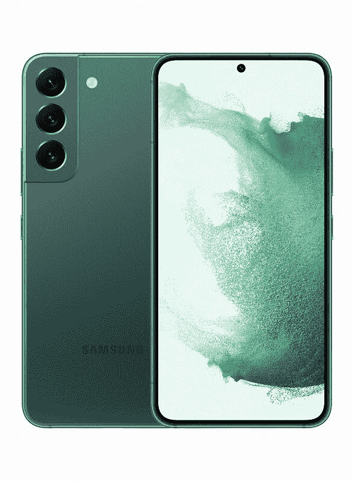
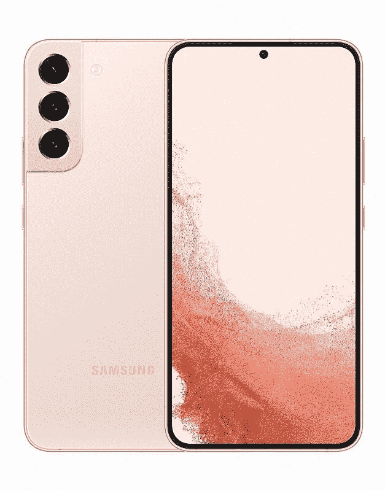
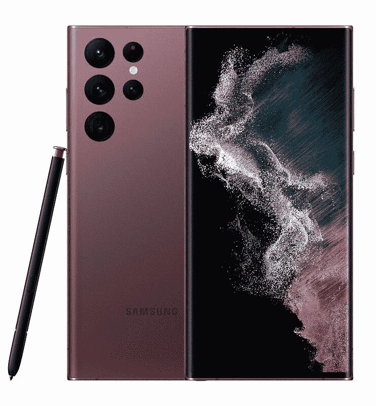

# 三星 Galaxy S22 系列有 microSD 卡槽吗？

> 原文：<https://www.xda-developers.com/samsung-galaxy-s22-microsd/>

在过去的几年里，microSD 卡已经缓慢但肯定地从高端智能手机中消失了。随着手机变得越来越薄，越来越紧凑，microSD 卡不再有空间，你必须依赖内部存储。如果你想知道三星 Galaxy S22 系列是否逆势而上，我们有答案:不会。而在这个阶段，你应该停止屏息以待东山再起。

三星 Galaxy S22、Galaxy S22 Plus 和 Galaxy S22 Ultra 都不支持 microSD 卡。有一个 SIM 卡插槽，在一些手机中经常兼作 microSD 卡插槽，但在这些型号中没有。相反，Galaxy S22 和 Galaxy S22 Plus 的存储容量高达 256GB，Galaxy S22 Ultra 的存储容量高达 1TB。如果您想查看包装盒内的所有物品，请查看我们为每种型号提供的拆箱服务:

## Galaxy S22 上为什么没有 microSD 卡槽？

许多高端手机没有配备 microSD 卡插槽的原因之一是，microSD 卡往往比智能手机的内部存储慢得多。这就是三星在 2015 年首次在 Galaxy S6 中移除 microSD 卡支持时提供的原因。虽然有高速 microSD 卡的标准，特别是 SD Express，但具有这些速度的 SD 卡非常罕见，而且非常昂贵。大多数常见的 microSD 卡提供的最大总线速度约为 100MB/s，比 UFS 3.1 的 2900MB/s 带宽低了一大步，后者是 Galaxy S22 系列使用的存储标准。

当然，这种情况的另一个原因是，公司宁愿让你支付溢价升级到更高的存储配置，这样他们就可以直接从你那里获得更多的钱。如果你想要更多的存储，你必须为更高的存储配置支付更多的费用。

最后，还有物理空间的问题。各公司在试图将尽可能多的新功能塞进手机的同时，也试图让手机尽可能纤薄，因此必须做出一些牺牲。microSD 卡使用的空间可以用于稍大的电池、更多的相机传感器和其他硬件。

## 没有 microSD 卡，如何获得更多存储空间？

第一个也是最显而易见的方法是购买一个存储空间更大的配置。128GB 不是很多，但是如果你升级到 256GB 的型号，你应该有足够的空间。至于 512GB 或 1TB 版本的 Galaxy S22 Ultra，可以说大多数用户永远不会用完那么多空间。

如果你使用大量空间来存储照片和视频，另一个好的选择是诉诸云存储。有很多云服务在 Android 上提供自动照片备份，包括谷歌照片、OneDrive 和许多其他服务。这些通常是付费服务(如果你想要超过几千兆字节，至少)，但除了节省内部存储空间外，它们还让你可以轻松地从任何设备访问文件，因此你不必担心将文件从手机复制到 PC。

最后，如果你想要一个物理存储设备，你可以买一个 USB Type-C 闪存驱动器。三星 Galaxy S22 系列和大多数现代 Android 手机都支持 USB-C 闪存驱动器，可以用来存储文档、照片等。你也可以用它将文件转移到另一部手机或电脑上。三星自己制造了其中一些，如 [Duo Plus 闪存驱动器](https://shop-links.co/1765496531774658503?u1=63f5acb0-0700-4245-9389-a350bf474e84)。

如果你对 Galaxy S22 系列感兴趣，一定要看看我们的 [Galaxy S22 动手](https://www.xda-developers.com/samsung-galaxy-s22-hands-on/)(针对普通 S22 和 S22 Plus)，以及我们的 [Galaxy S22 超动手](https://www.xda-developers.com/samsung-galaxy-s22-ultra-hands-on/)文章。你可以在下面购买你最喜欢的手机，或者查看 Galaxy S22 系列的[优惠。](https://www.xda-developers.com/best-samsung-galaxy-s22-deals/)

 <picture></picture> 

Samsung Galaxy S22

三星 Galaxy S22 没有 microSD 卡，但包含高达 256GB 的内部存储空间。

 <picture></picture> 

Samsung Galaxy S22 Plus

##### 三星 Galaxy S22 Plus

像普通的 Galaxy S22 一样，Plus 型号为您的文件提供了高达 256GB 的存储空间。

 <picture></picture> 

Samsung Galaxy S22  Ultra

作为该系列中最大的手机，Galaxy S22 Ultra 配备了高达 512GB 的存储空间。