# 三星 Galaxy S22 Plus 显示器评论:Vision Booster 是一个游戏改变者

> 原文：<https://www.xda-developers.com/samsung-galaxy-s22-plus-display-review/>

每年，三星都喜欢炫耀它的新旗舰有多亮。尽管它们无疑被尊为移动屏幕技术的先锋，但在我看来，最好的智能手机显示屏通常不会出现在三星自己的手机中。这家韩国巨头自诩拥有不断膨胀的*、【峰值亮度】、*(这些数字本身就可能具有欺骗性)，但该公司在其他一些领域一再缺乏关注，这使其有别于其他手机制造商。

今年的银河 2022 阵容改变了一切。加入我们，超越我们的 [Galaxy S22 Plus 评论](https://www.xda-developers.com/samsung-galaxy-s22-plus-review/)，深入了解这款三星旗舰产品的显示屏。如果你只想要亮点，这里有 TL；博士:

## 三星 Galaxy S22 Plus:显示屏概述

*   出色的显示亮度
*   大幅改善阴影细节
*   在大多数照明条件下，出色的色调映射
*   令人难以置信的一致白平衡
*   同类领先的 HDR10 性能

*   屏幕分辨率就其价格而言应该更高
*   软件降至 48 Hz 的有限场景
*   视觉增强器应该在较低的亮度下启动

***关于本次评测:**三星给我们发了一款 Galaxy S22 Plus 进行评测。他们没有参与这次审查的内容。*

* * *

**浏览此评论:**

## 硬件和技术

从外观上看，今年的基本款和去年的基本款在屏幕外观上只有微小的区别。Galaxy S22 和 Galaxy S22 Plus 略短，在保持相同屏幕和机身宽度的同时，长宽比从 20:9 降至 19.5:9。底部挡板还向下延伸了一点，使显示屏挡板真正对称。一个打孔器仍然位于顶部中心(正确的位置)，屏幕是平的，这对那些不喜欢弯曲显示器的人来说很好。Galaxy S22 Plus 的尺寸为 6.6 英寸，我认为这对于一部大手机来说是一个舒适的尺寸。

*我的单位比大多数其他旗舰有更多的角度蓝移，但没关系*

对于内部结构，Galaxy S22 Plus 似乎使用了与他们之前的 Galaxy S21 Ultra 手机相同的发光有机发光二极管材料。三星也在为全新的 [Galaxy S22 Ultra](https://www.xda-developers.com/samsung-galaxy-s22-ultra-review/) 重新使用这些材料，这意味着 Galaxy S22 Plus(不包括较小的型号)应该与最前沿的型号一样拥有出色的发光输出和效率。

 <picture>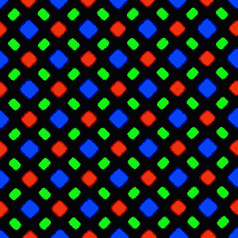</picture> 

PenTile subpixel layout of Galaxy S22 Plus. Fill factor ≈ 35%

也许 Galaxy S22 Plus 和 Galaxy S22 Ultra 之间最明显的区别是它们的屏幕分辨率。虽然 Ultra 型号可以容纳超清晰的 1440p 面板，但 Galaxy S22 Plus 只能容纳 1080p 显示屏。Galaxy S22 Plus 每英寸 393 像素，可能是目前最昂贵的 1080p PenTile 屏幕手机。好消息是，由于三星使用了更高的子像素填充因子，1080p OLEDs 从 Galaxy S21 开始略有改善，这降低了屏幕门效应，消除了彩色边缘(对我的眼睛来说)。虽然许多人在日常使用中可能不会注意到它，但这些屏幕看起来不像 1440p 屏幕甚至苹果的“超级视网膜”(~ 460 PPI)OLED 那样清晰。就成本而言，三星没有真正的理由不在千元手机中包含更高的分辨率。

另一个显著的区别是有机发光二极管背板材料。三星仍在为其最高端设备保留其 LTPO/霍普技术，该技术允许更低的刷新率和改善的面板驱动稳定性。这一消息在发布会上引发了很多争议，三星最初(误导性地)声明 Galaxy S22 和 Galaxy S22 Plus 的刷新率从 120Hz 降至 10Hz。事实证明(我稍后会谈到)，由于 LTPS 背板的原因，手机的最低显示刷新率只有 48Hz。就像屏幕分辨率一样，这似乎是三星做出的一个小气的决定，因为其他原始设备制造商(如谷歌、一加)以更低的价格提供配备 HOP 的显示器。

### 视力增强器

最后，三星为其新显示器宣传的突出特点(除了更高的峰值亮度)是一种叫做**视觉增强器**的东西。它所做的，本质上是动态调整屏幕上的色调，以改善阳光直射下的图像可视性。这一点很重要，因为增加白色的峰值亮度不足以使图片或视频在明亮的条件下可视:如果中间色调和阴影没有以足够的比例增加，那么图像将出现斑点和失真。尽管三星手机过去拥有一些最亮的屏幕，但由于在阳光下对色调映射的处理不佳，在这些手机上观看媒体不一定是最佳体验。这是我在过去的评论中不断重申的对三星手机的警告。Vision Booster 直接解决了这一点，我很高兴看到这一点。

**收集数据的方法**

为了从智能手机中获取定量的色彩数据，显示器测试模式采用

[X-Rite i1Display Pro](https://www.amazon.com/X-Rite-i1Display-Pro-Plus-EODIS3PL/dp/B07XFX74V6?tag=xda-34l8pfm-20&ascsubtag=UUxdaUeUpU40592&asc_refurl=https%3A%2F%2Fwww.xda-developers.com%2Fsamsung-galaxy-s22-plus-display-review%2F&asc_campaign=Short-Term)

由 X-Rite i1Pro 2 分光光度计以高分辨率 3.3 纳米模式测量。针对各种显示特性和可能改变期望测量的潜在软件实现，校正所使用的测试模式和设备设置。除非另有说明，否则测量是在禁用任意显示调整的情况下进行的。主要的测试模式是 c

*onstant power* *模式(有时称为

*equal energy*

模式)，与大约 30–40%的平均像素水平相关，以测量传递函数和灰度精度。测量发射型显示器时，不仅要测量恒定的平均像素水平，还要测量恒定的功率模式，这一点很重要，因为它们的输出取决于平均显示器亮度。此外，恒定的平均像素水平并不固有地意味着恒定的功率；我使用的测试模式两者都有。接近 50%的较高平均像素水平用于捕捉较低像素水平和较高像素水平之间的中点性能，因为许多应用程序和网页包含像素水平较高的白色背景。使用的色差度量是δ

*ETP* [(ITU-R BT.2124)](https://www.itu.int/dms_pubrec/itu-r/rec/bt/R-REC-BT.2124-0-201901-I!!PDF-E.pdf)

，这是一个

[overall better measure for color differences](https://www.ibc.org/publish/specifying-colour-tolerances-for-hdr-and-wcg-displays-/2449.article)

比δ

*E*

00，这是在早期的评论中使用的，目前仍在许多其他网站的展示评论中使用。那些还在用δ的

*E*

00，建议更新为δ

*EITP.*

Δ

*EITP*

通常在其计算中考虑亮度误差，因为亮度是完整描述颜色的必要组成部分。然而，由于人类视觉系统分别解释色度和亮度，我将我们的测试模式保持在恒定亮度，并且在我们的δ中不包括亮度(I/强度)误差

*EITP*

价值观。此外，在评估显示器的性能时，将这两种错误分开是有帮助的，因为就像我们的视觉系统一样，它们属于显示器的不同问题。这样，我们可以更彻底地分析和理解显示器的性能。我们的颜色目标是基于 ITP 颜色空间，它比 CIE 1976 UCS 在感知上更均匀，具有更好的色调线性。我们的目标在整个 ITP 色彩空间中以 100 cd/m2 的参考白色水平大致均匀分布，颜色的饱和度为 100%、75%、50%和 25%。颜色是在 73%的刺激下测量的，假设伽马功率为 2.20，这相当于约 50%的亮度。对比度、灰度和颜色精度在显示器的整个亮度范围内进行测试。在 PQ 空间中，亮度增量均匀分布在最大和最小显示亮度之间。图表和图形也绘制在 PQ 空间中(如果适用),用于正确表示对亮度的实际感知。δ

*ETP*

值大约是δ的 3 倍

*E*

00 值的相同色差。测得的颜色误差δ

*ETP*

1.0 表示所测量的颜色的可察觉差异的最小值，并且该度量假设对于观察者来说是最关键的适应状态，从而不会低估颜色误差。颜色误差δ

*ETP*

小于 3.0 是参考显示器的可接受精度水平(建议见 ITU-R BT.2124 附录 4.2)，δ

*ETP*

大于 8.0 的值一眼就能看出来，这是我根据经验得出的结论。HDR 测试模式是针对

[ITU-R BT.2100](https://www.itu.int/dms_pubrec/itu-r/rec/bt/R-REC-BT.2100-2-201807-I!!PDF-E.pdf)

使用感知量化器(ST 2084)。HDR sRGB 和 P3 图案与 sRGB/P3 原色均匀间隔，HDR 参考白色水平为 203 cd/m2

[(ITU-R BT.2408)](https://www.itu.int/dms_pub/itu-r/opb/rep/R-REP-BT.2408-2017-PDF-E.pdf)

和 58%的 PQ 信号电平。所有 HDR 图案都是在 1000 尼特的最大内容亮度级(C.L.L .)和 200 尼特的帧平均亮度级(F.A.L.L .)下测试的。*  *## 颜色配置文件和色域

通常有两种主要的颜色模式可供选择:鲜艳的和 T2 自然的轮廓。开箱后选择的默认情景模式将取决于您购买手机的地区。*自然*模式将为正在手机上观看的内容提供最佳的色彩准确度。如果你想提升色彩饱和度和更蓝的白色(约 6900 K)，选择*鲜艳*模式。不过，只有*自然*模式支持内容色彩管理。

对于*鲜明*模式，可以将白点的色温调节得更冷或更暖。在*高级设置*下，您可以进一步调整单独的红/绿/蓝颜色通道，以调整色调。这些调谐选项对于*自然*模式是不可用的，这是一个遗憾，因为可以说该配置文件提供这些选项更重要。

自 Galaxy S10 以来，三星 OLEDs 的最大色域没有太大变化。*鲜艳*模式扩展到有机发光二极管的天然红色和蓝色纯度，但稍微限制了绿色原色。这种自然色域仅略超过标准 DCI-P3 原色，旨在平衡色彩纯度与发光输出。在一个超越 DCI-P3 的消费内容几乎不存在的时代，过于饱和会降低能效。

## 屏幕亮度

 <picture>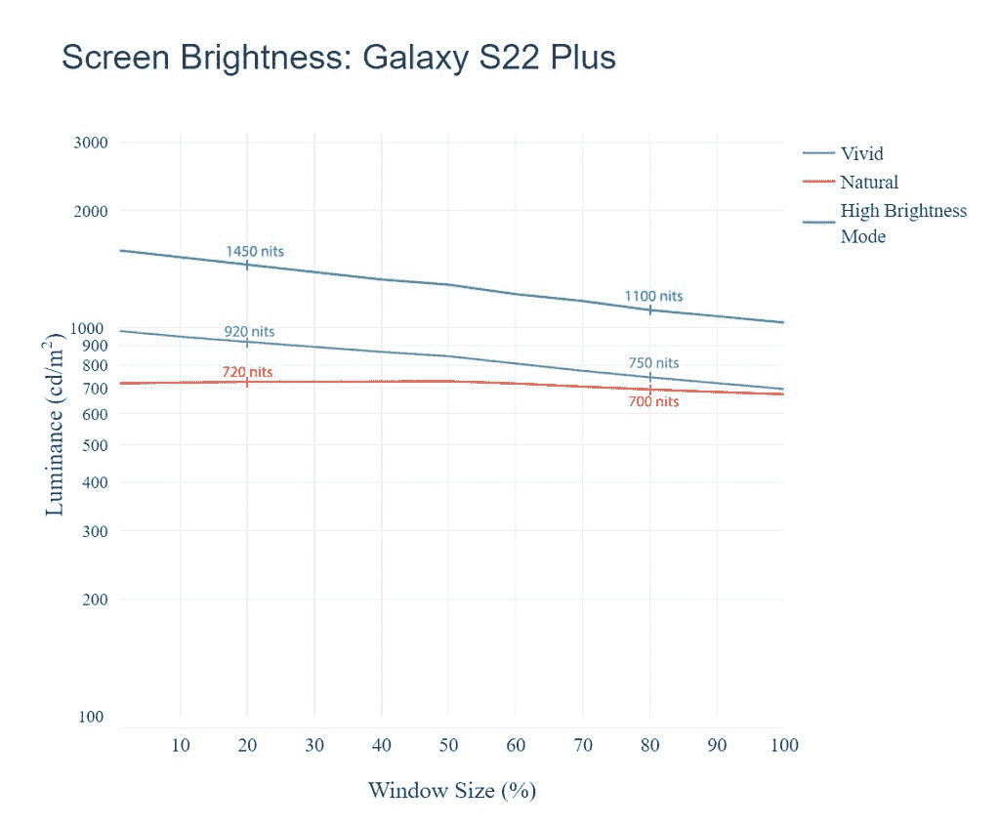</picture> 

Screen brightness for Galaxy S22 Plus

说到屏幕亮度，我们的 Galaxy S22 Plus 在最高亮度模式下的测量结果[几乎与我们的 Galaxy S21 Ultra](https://www.xda-developers.com/galaxy-s21-ultra-display-review/#brightness) 相同。这并不奇怪，因为它们共享相同的发光材料集。不同的是，Galaxy S21 Ultra 仅在播放 HDR 内容时处于峰值亮度状态，而不是自动亮度下的正常内容。有了 Galaxy S22 Plus，手机现在也可以在自动亮度下进入这种状态，所以实际上更亮。*视觉增强器*还应进一步帮助提高阳光照射下的屏幕可见度和内容亮度，这将在色调映射部分介绍。

Galaxy S22 Plus 对于灯光主题应用程序的实际峰值亮度为 1100 尼特，对于独立媒体和 HDR 高光为 1500 尼特

总结其性能，Galaxy S22 Plus 在亮主题应用程序中的实际峰值亮度约为 1100 尼特(80% APL)，在暗主题应用程序和 HDR 高光中的内容约为 1500 尼特(20% APL)。在 1%的小窗口尺寸下，我只能测量到大约 1600 尼特的亮度水平，这比三星声称的 1750 尼特略低。然而，在这种窗口尺寸下的亮度测量完全是无意义的，纯粹是为了营销而吸引人。

标记为*额外亮度*的选项已添加到显示器设置中，以增加显示器的最大手动亮度。在 Galaxy S22 之前，三星的手机在没有自动亮度的情况下只能达到约 400 尼特的全屏亮度。随着新选项的启用，手动亮度上限全屏移动到大约 700 尼特。

 <picture>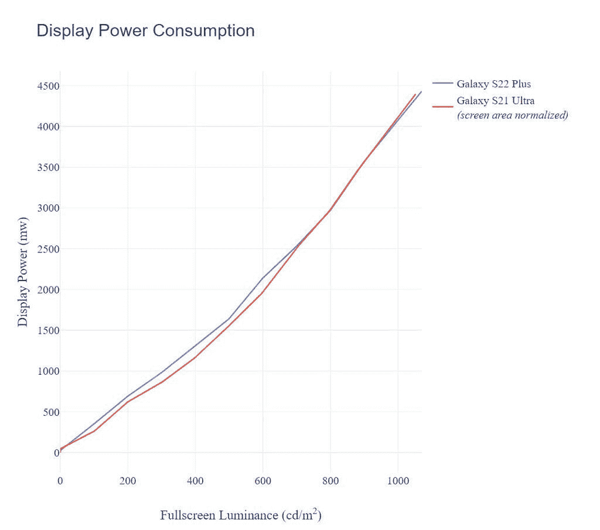</picture> 

Display Power of Galaxy S22 Plus, Galaxy S21 Ultra.

由于 Galaxy S22 Plus 取消了自动亮度限制器，我想知道三星是否设法在这一代人中提高了能效。但正如预期的那样，Galaxy S22 Plus 的发光功耗曲线与去年的 Galaxy S21 Ultra 非常相似。因此，S21 Ultra 很可能与 S22 Plus 一样强大，而 Ultra 只是被人为地限制了。这一想法也得到 iPhone 13 Pro 的支持，iPhone 13 Pro 使用了与 Galaxy S21 Ultra 相同的发光有机发光二极管材料，能够达到超过 Galaxy S21 Ultra 的全屏亮度水平，并与新的 Galaxy S22 Plus/Ultra 相匹配。

## 屏幕刷新

在过去的几年里，它已经成为旗舰手机高刷新率显示屏的标准。它允许更平滑的整体用户体验，但它是以增加电池使用量为代价的。各公司一直在试图找到最小化其影响的方法，这主要是通过在不需要更高的刷新率时，巧妙地将显示器的刷新率切换到更低的状态来实现的。

与去年类似，整个 Galaxy S22 系列的刷新率达到了 120Hz。但是如上所述，只有 Ultra phone 使用了 LTPO/HOP 背板，Galaxy S22/Plus 仍然使用 LTPS。这大大限制了基线模型在刷新率之间无缝切换的能力，因为 LTPS 在改变其像素驱动率时更容易发生颜色偏移。因此，Galaxy S22 和 S22 Plus 的额定频率仅低至 48Hz，而 Galaxy S22 Ultra 可以低至 10Hz。

Galaxy S22 Plus 仅在有限的情况下降至 48 赫兹

需要更好了解的是，Android 的刷新率指标上报的数值是 ***而不是*** 有机发光二极管的物理刷新率。该指标更能代表 SoC 可以发送到显示器的最大数据速率，较低的值可以提示 SoC 和 GPU 进入低功耗状态。此外，由于*面板自刷新*，SoC 不会向显示器发送任何重复帧；如果屏幕空闲，数据速率和 HWC 渲染速率基本上都为零(0) Hz。在这种情况下，屏幕会从存储在内存中的最后一帧开始自动刷新数据。

使用 Quarta-Rad Radex 鲁邦闪烁仪搭配 RadexLight 软件，我能够测量和检测显示器的真实刷新频率。用这个仪器，我发现 Galaxy S22 Plus 的最低刷新确实是 48Hz(而 Android 的刷新指示灯显示的是 24Hz)，但只能在有限的场景下斜降到它；即:如果显示器高于系统亮度的 33%*和*如果环境照明高于 200 勒克斯。当屏幕空闲时，必须满足这两个条件才能稳定刷新率。33%的系统亮度与 Galaxy S22 Plus 上大约 100 尼特的白色水平相关，这是一个不错的限制。但是 200 勒克斯的限制，这大约是办公大楼照明的亮度水平，很大程度上意味着 48 赫兹只会在白天触发。甚至大多数人的家也没有这么亮，通常在 50 勒克斯左右。

在自适应运动模式下，48Hz 和 120Hz 之间没有中间刷新率，只有一个或另一个。因此，如果你不经常在明亮的条件下使用手机，Galaxy S22 将主要运行在 120 Hz 模式下，不断消耗更多的额外功率。对于三星为什么要这样设置，主要原因是为了避免显示器在刷新率模式之间切换时出现颜色偏移。正如在其他手机上看到的那样，如 Pixel 6、Pixel 4 (XL)或一加 8 Pro，当与屏幕互动时，色温和伽玛会突然改变。在低亮度条件下，事情会变得棘手，因为在低信号水平下，电气非线性会加剧，而昏暗的环境照明会使它们更容易被察觉。三星决定尽可能避免处理这个问题，让屏幕大部分保持在 120Hz，只允许它在完全察觉不到变化的情况下达到 48Hz 当事情变得*明亮*时。

三星也对他们的 LTPO 面板设置了刷新率限制，但他们的限制要少得多，因为当改变像素充电时序时，背板具有更高的颜色稳定性。相反，三星只在环境亮度低于 40 勒克斯时才限制其 LTPO 可变刷新率，而不是 200 勒克斯。

 <picture>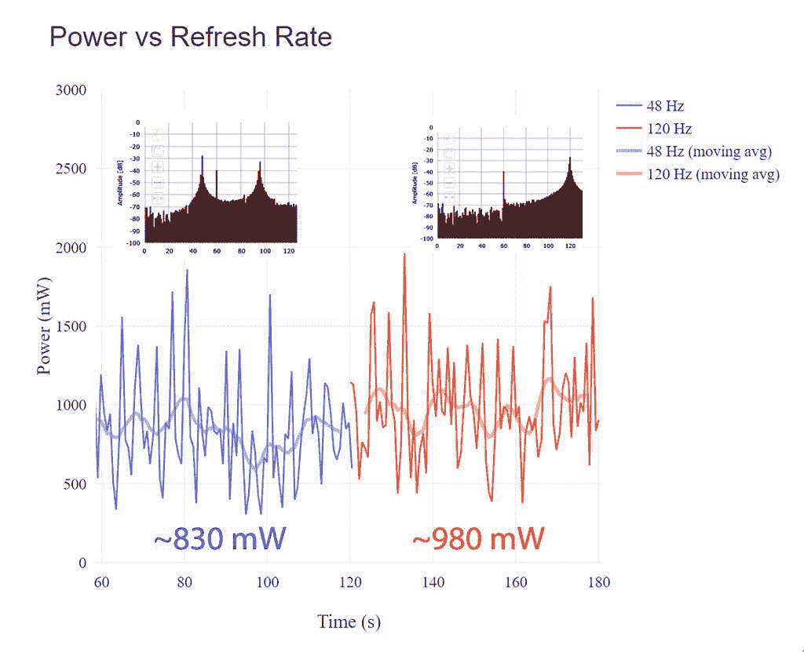</picture> 

Power vs Refresh Rate for Galaxy S22 Plus

但是屏幕下移实际上节省了多少电量呢？在测试中，我测量了以允许显示器进入 48Hz 的最小亮度显示全屏暗灰色模式的总设备功率，并在环境光传感器上使用手电筒以绕过 200 lux 的限制。关闭手电筒，重复这一过程，以测量 120Hz 的功率。我的鲁邦闪烁仪也在积极地读取显示，以确保刷新率是正确和恒定的；如果我使用黑色图案，我将无法验证刷新率，显示驱动程序可能会在幕后进行其他优化。

与 120Hz 相比，48Hz 可降低 150 mW 的功耗

结果，我测得设备功耗从 120Hz 到 48Hz 平均降低了约 150 mW，这绝对是不可忽略的。在正常到低亮度的情况下降低亮度会大大提高电池寿命，所以其他公司冒险尝试潜在的颜色偏移是有道理的。从我的测试来看，在三星为 Galaxy S22 Plus 设置的亮度限制下，我无法检测到任何颜色偏移。虽然这意味着他们的限制正在发挥作用，但我确实认为他们应该允许对某些颜色偏移有更高的容忍度，以降低功耗(尽管不同面板之间会有所不同)。

### 脉宽调制

几乎手机上的每个有机发光二极管都使用脉宽调制(PWM)来调节屏幕亮度。这种方法以我们的眼睛不会注意到的速度快速地开关像素，因此我们将它解释为屏幕表观亮度的调制。在调暗显示器时，使用 PWM 是保持显示画面质量的最佳方式，但有些用户对闪烁很敏感，可能会下意识地注意到它。由于这个原因，较高的 PWM 频率通常是优选的，以减少注意到闪烁的机会。

对于那些对 PWM 比较敏感的，三星也没有做什么缓解。Galaxy S22 Plus 仍然以 240Hz 左右的频率闪烁，这与它一直使用的频率相同。调制幅度也仍然很高，这是人们最敏感的部分。如果有必要，你可以使用 Android 12 的*超暗*功能来降低屏幕亮度，减少屏幕闪烁。更有趣的一点是，当下降到 48Hz 时，屏幕的 PWM 频率从 240Hz 变为 192Hz，这样做是为了保持刷新率作为 PWM 频率的公分母。

## 对比度和色调映射

[caption align = " align center " width = " 400 "]

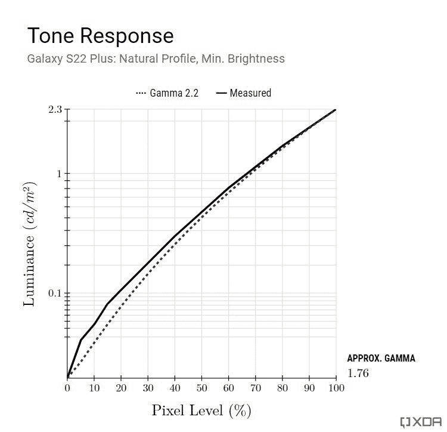

Galaxy S22 Plus 的音调响应(自然，最低。亮度)[/caption]

[caption align = " align center " width = " 400 "]

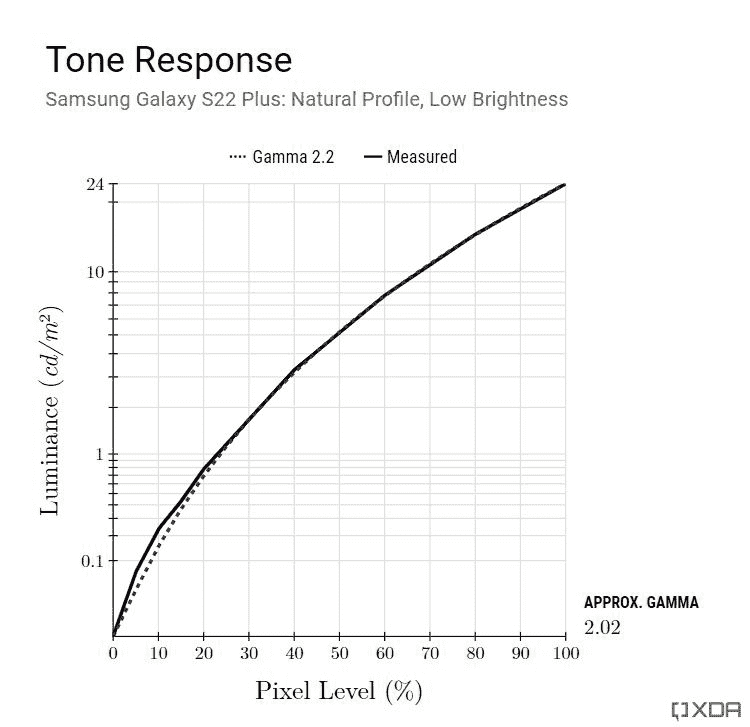

Galaxy S22 Plus 的色调响应(自然、低亮度)[/caption]

[caption align = " align center " width = " 400 "]

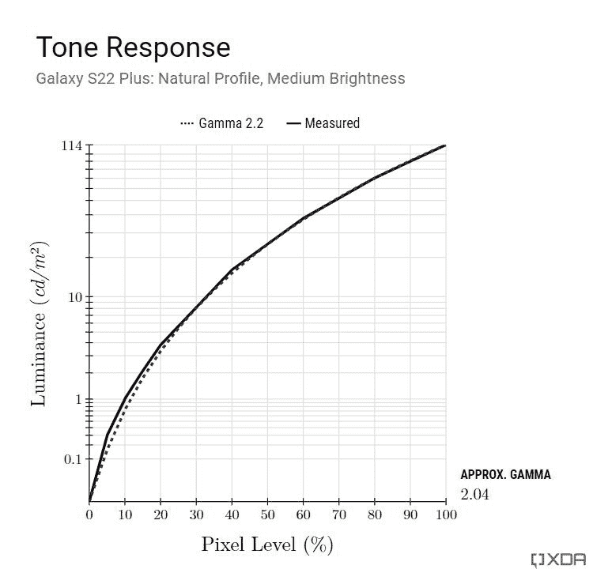

Galaxy S22 Plus 的色调响应(自然、中等亮度)[/caption]

[caption align = " align center " width = " 400 "]

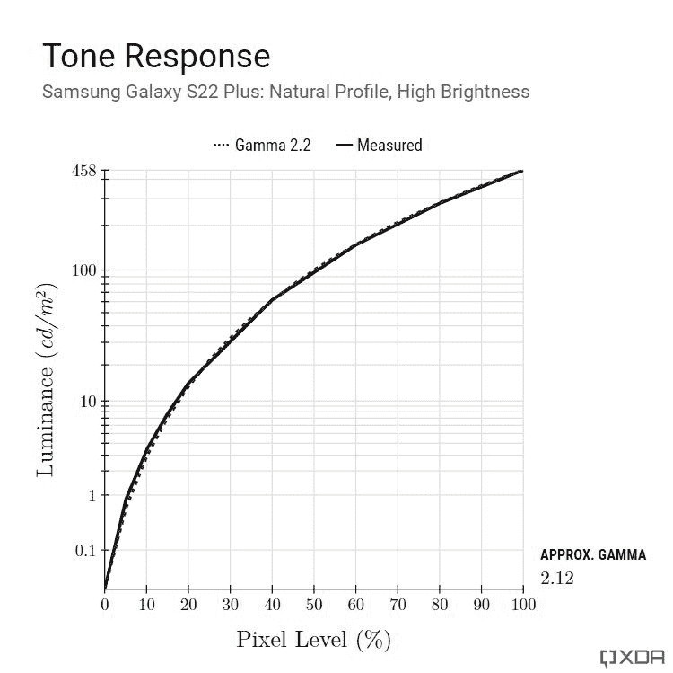

Galaxy S22 Plus 的色调响应(自然、高亮度)[/caption]

[caption align = " align center " width = " 400 "]

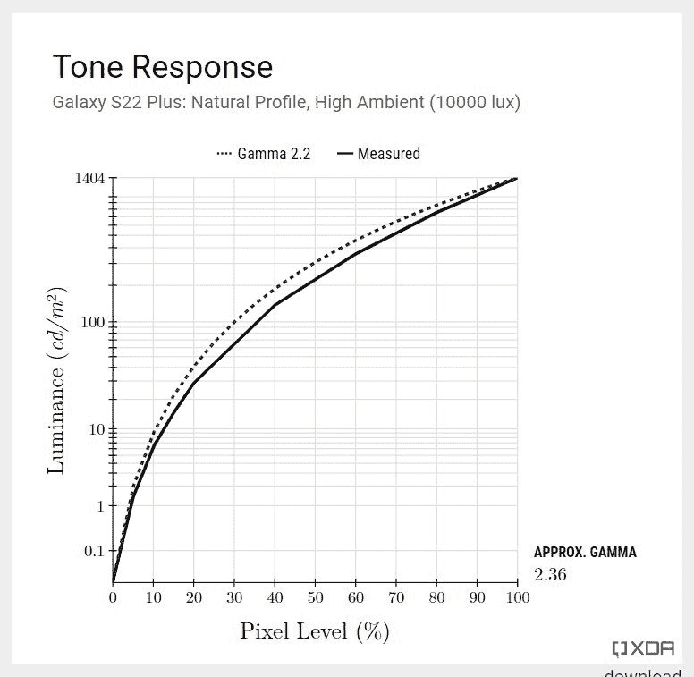

Galaxy S22 Plus 的色调响应(自然、最大亮度)[/caption]

[caption align = " align center " width = " 400 "]

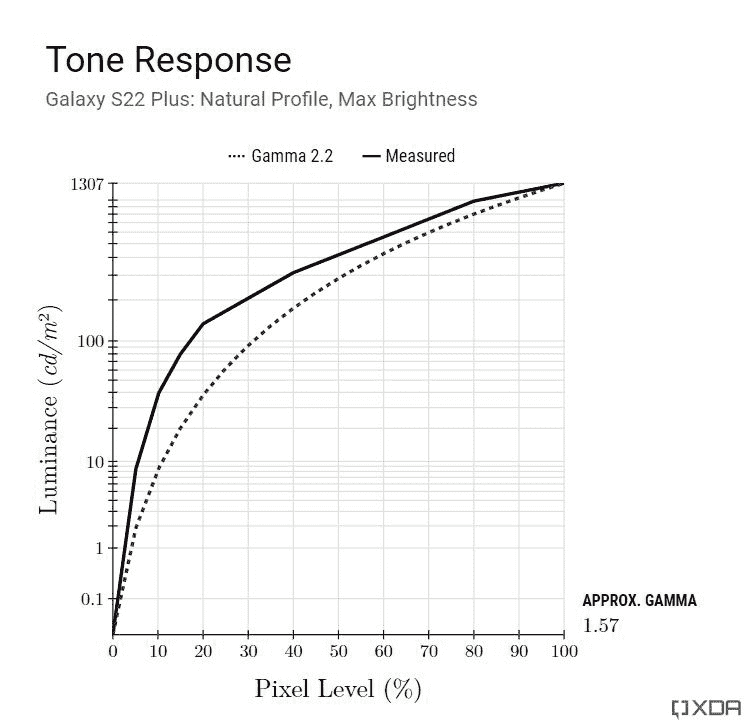

Galaxy S22 Plus 的色调响应(自然、最大亮度+视觉增强器)[/caption]

[caption align = " align center " width = " 400 "]

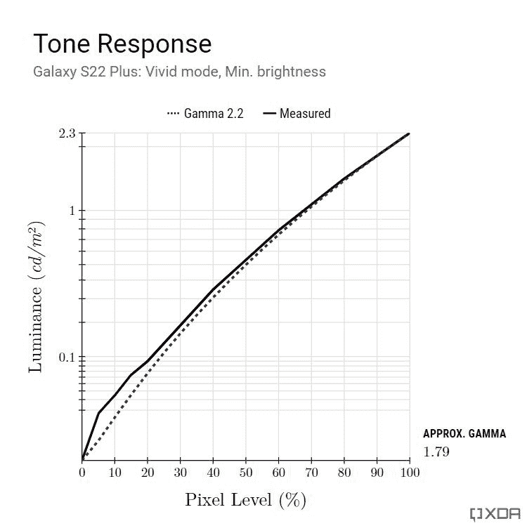

Galaxy S22 Plus 的音调响应(生动，最小。亮度)[/caption]

[caption align = " align center " width = " 400 "]

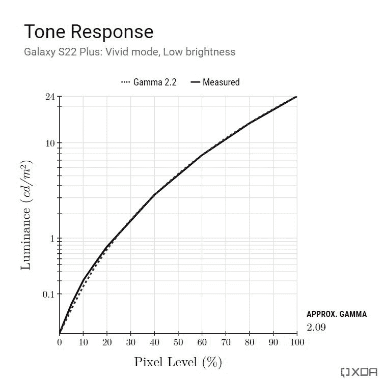

Galaxy S22 Plus 的色调响应(生动、低亮度)[/caption]

[caption align = " align center " width = " 400 "]

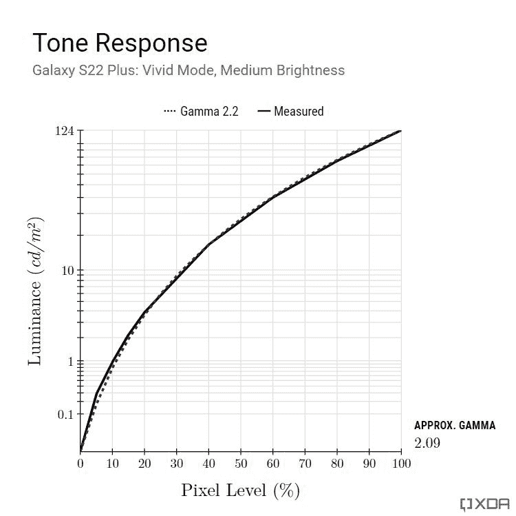

Galaxy S22 Plus 的色调响应(生动、中等亮度)[/caption]

[caption align = " align center " width = " 400 "]

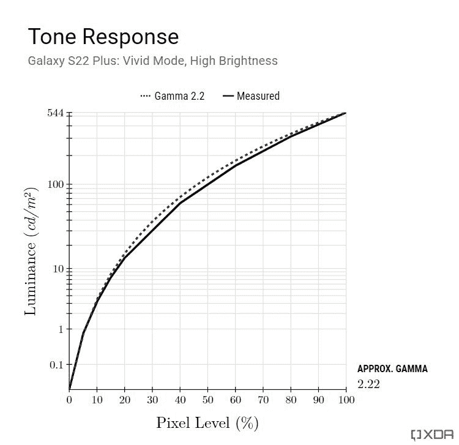

Galaxy S22 Plus 的色调响应(生动、高亮度)[/caption]

[caption align = " align center " width = " 400 "]

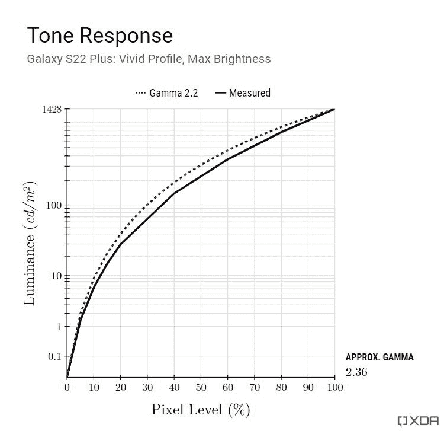

Galaxy S22 Plus 的色调响应(生动、最大亮度)[/caption]

[caption align = " align center " width = " 400 "]

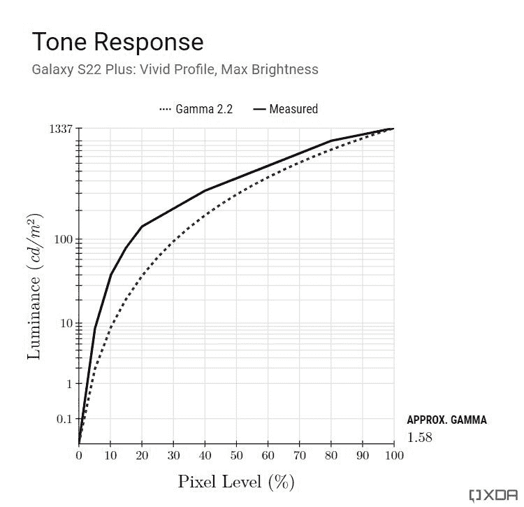

Galaxy S22 Plus 的色调响应(生动、最大亮度+视觉增强器)[/caption]

自 Galaxy S9 以来，三星首次通过 Galaxy S22 系列实现了有意义的校准变化。当时，该公司是屏幕色调响应最差的原始设备制造商之一，这导致在某些情况下内容可读性不佳。更具体地说，三星为每个亮度级别设计了 2.2 的显示器伽玛，这仅适用于约 100 尼特的轻微屏幕眩光。在低亮度下，2.2 的直线伽玛会产生过多的对比度，导致黑色削波，这是三星手机有点臭名昭著的。在较亮的条件下，2.2 伽马光线不足以克服屏幕眩光。今年的银河旗舰解决了这两个问题。

当所有阴影细节都可见时，在手机上查看内容会变得更加舒适。而且阴影细节在 Galaxy S22 系列上更容易看到。

三星新的色调映射努力是该公司所谓的视觉助推器的一部分。虽然软件服务本身仅在阳光直射下触发，但显然重点是将其原理应用于显示器校准的其他方面。最终目标是使屏幕对比度适当地适应其亮度和周围环境，以使一切(阴影、中间色调和高光)保持可见和适当的比例。

从基本目标开始，三星针对其骁龙变种的色调响应似乎仍然是 2.20 的伽马值。过去，三星针对其 Exynos 变体的目标是 [sRGB 色调响应曲线](https://i.imgur.com/Jp2dCtJ_d.webp?maxwidth=760&fidelity=grand)，而不是伽马 2.20，但我没有 Exynos 部门来验证他们是否仍在这样做。

测量 S22 Plus 显示器，它更接近 2.1，但这可能是因为在低信号水平下有太多的绿色能量，使阴影稍微呈绿色。我不确定提升的阴影是否是三星有意为之，但如果是，我表示欢迎。我坚持认为，对于手机屏幕来说，较浅阴影的好处远远超过较陡画面的冲击力。当所有阴影细节都可见时，在手机上查看内容会变得更加舒适。大多数情况下，这是色调映射(对比度)而不是屏幕亮度的问题，过去许多手机都在低亮度下与内容可见性作斗争，包括三星的手机。

在新的 Galaxy S22 Plus 上，随着手机接近最低亮度，现在对阴影和中间色调有了强烈的增强。与 Galaxy S21 Ultra 相比，Galaxy S22 系列在最低亮度下使用了 2.2 伽马射线，夜间观看已经大大改善了 T4。此外，看不到任何黑色削波，当*额外亮度*设置为半亮度时，只有第一个 8 位步长被压碎。干得好，三星。

有一个测试，我称之为“最低亮度视频馈送可见度测试”(脱口而出，不是吗？)，包括我在晚上以最小的显示亮度向下滚动我的 Reddit 或 Twitter feed 如果一个视频开始播放，需要我提高显示亮度才能舒服地观看，那么手机就不能通过测试。适当的显示色调映射不应该要求在弱光下增加显示亮度，特别是如果你的眼睛已经适应了黑暗。Galaxy S22 Plus 是我拥有的第一部没有悲惨地失败的三星手机。值得一提的是，OPPO Find X3 Pro 仍然是夜间观看的王者:它有一个在弱光下自动降低最低亮度的功能，而且它没有引入任何黑色剪辑，可能是因为它的真正 10 位面板。

 <picture>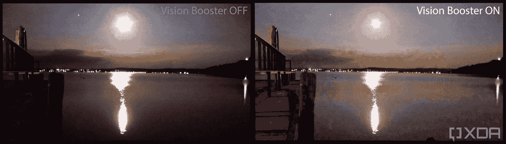</picture> 

Vision Booster sets pixel brightness into overdrive. *Left*: Vision Booster disabled; *Right*: Vision Booster enabled

不仅夜间观看得到了改善，而且白天观看也得到了改善。在阳光直射下，三星的*视觉增强器*服务激活，尽有机发光二极管所能提升色彩亮度。它基本上是高亮度模式之上的像素过驱动设置——如果你愿意，它是*高亮度模式*。

然而，它也有一些缺点。一个缺点是，它引入了大量的色调分离，因为该软件使用低分辨率直方图来计算显示器的哪些区域需要增强。当*眼罩*功能被启用或设置为“自适应”时，它似乎也不起作用，这是一个遗憾，因为这两个功能都是我喜欢的。视觉增强器也只在 50，000 勒克斯以上激活，这需要太阳和你的屏幕之间有一条直接的路径，一旦手机检测到低于 20，000 勒克斯，它就会关闭。如果三星能够调整*视觉增强器*以实现大约 2000 勒克斯，并随着环境亮度的增加而改变其强度，那就太好了。

这让我想到了三星色调映射的唯一负面影响，那就是当显示器在没有启用 *视觉增强器*的情况下达到其峰值亮度*时。这发生在 2000 到 50000 勒克斯之间。在这种状态下，手机进入其高亮度模式，但它根据内容 APL 改变白色的亮度。对于中低级别的 APL，显示器伽玛测量值约为 2.4，这是很陡的，当屏幕眩光时，它会影响阴影细节的可视性。相比之下，当*视觉增强器*启用时，显示器伽马测量值约为 1.6。这个问题是三星所有显示器的最大问题之一，Galaxy S22 就差一点就解决了。也许明年吧。*

还有一点:Galaxy 手机仍然是唯一在显示渐变时出现色带的旗舰显示器，即使是 10 位内容。上面的旋转梯度应该看起来非常平滑，但在 Galaxy 手机上从来没有。我不知道为什么三星不只是抖动他们的媒体播放，但这是一个不应该在 2022 年存在的问题——其他所有 OEM 都已经得到了备忘录。

## 白平衡和灰度精度

[caption align = " align center " width = " 400 "]

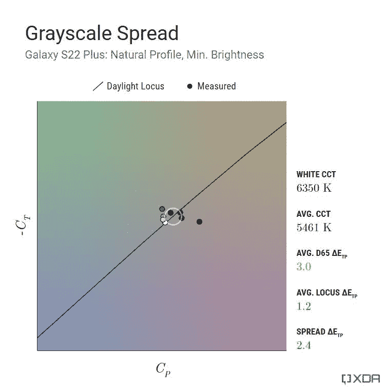

Galaxy S22 Plus 的灰度精度(自然，最低。亮度)[/caption]

[caption align = " align center " width = " 400 "]

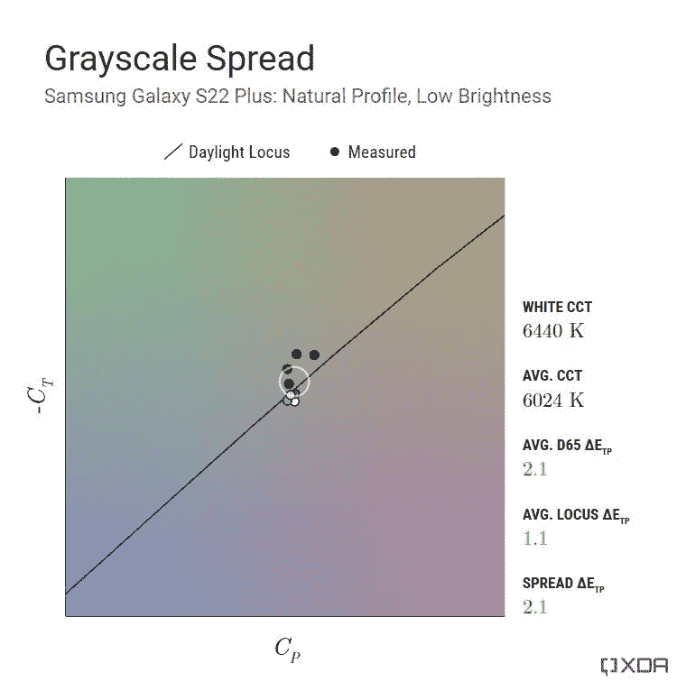

Galaxy S22 Plus 的灰度精度(自然、低亮度)[/caption]

[caption align = " align center " width = " 400 "]

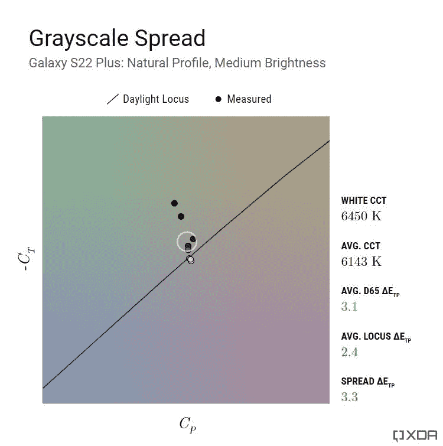

Galaxy S22 Plus 的灰度精度(自然、中等亮度)[/caption]

[caption align = " align center " width = " 400 "]

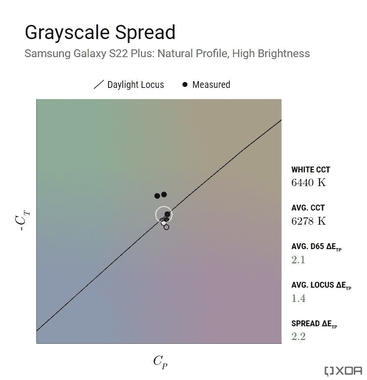

Galaxy S22 Plus 的灰度精度(自然、高亮度)[/caption]

[caption align = " align center " width = " 400 "]

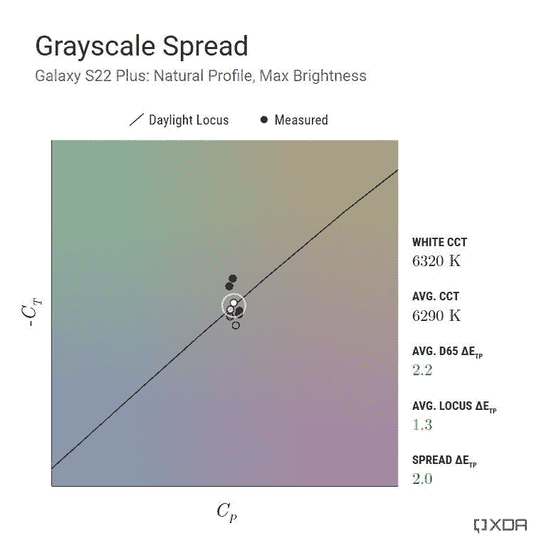

Galaxy S22 Plus 的灰度精度(自然、最大亮度)[/caption]

[caption align = " align center " width = " 400 "]

Galaxy S22 Plus 的灰度精度(自然、最大亮度+视觉增强器)[/caption]

[caption align = " align center " width = " 400 "]

Galaxy S22 Plus 的灰度精度(生动，最低。亮度)[/caption]

[caption align = " align center " width = " 400 "]

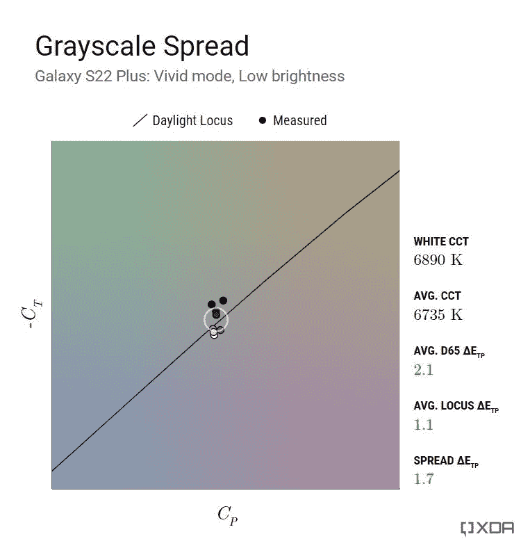

Galaxy S22 Plus 的灰度精度(生动、低亮度)[/caption]

[caption align = " align center " width = " 400 "]

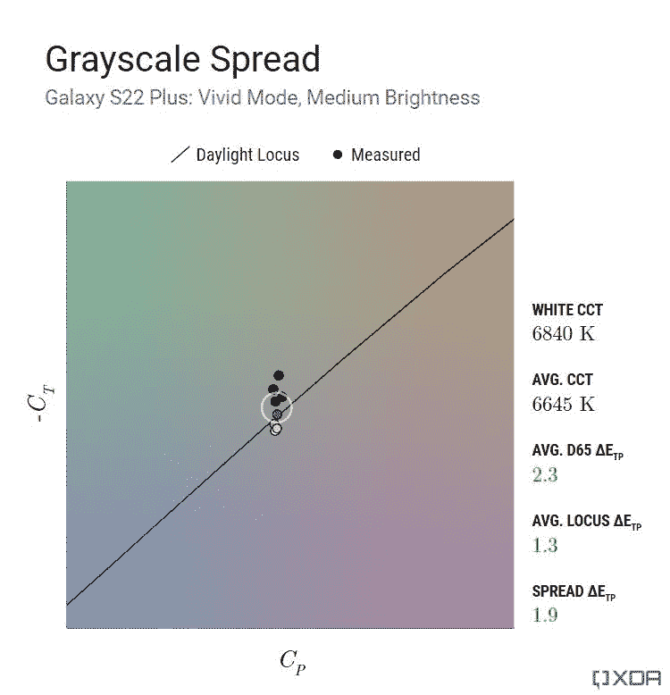

Galaxy S22 Plus 的灰度精度(生动、中等亮度)[/caption]

[caption align = " align center " width = " 400 "]

Galaxy S22 Plus 的灰度精度(生动、高亮度)[/caption]

[caption align = " align center " width = " 400 "]

Galaxy S22 Plus 的灰度精度(生动、最大亮度)[/caption]

[caption align = " align center " width = " 400 "]

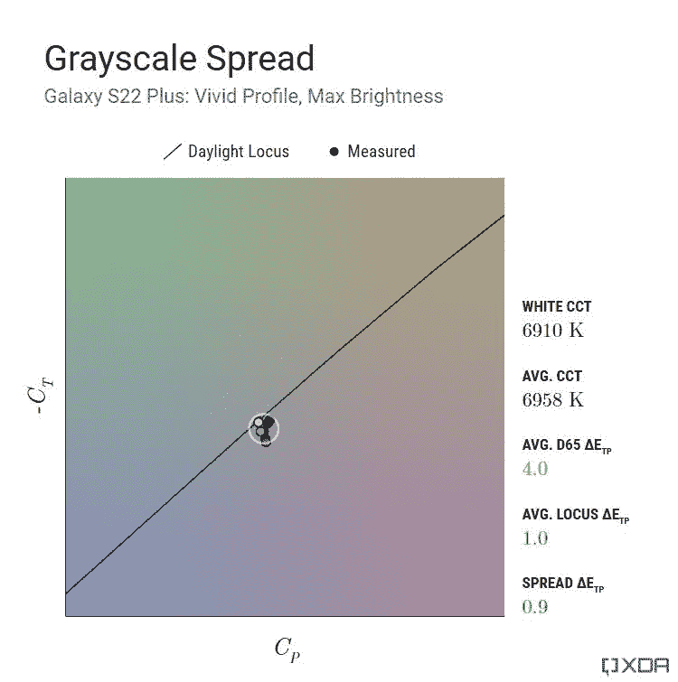

Galaxy S22 Plus 的灰度精度(生动、最大亮度+视觉增强器)[/caption]

作为 sRGB 的标准，*自然*模式的目标是 D65 的白点，其色温大约为 6500 K。我的测量验证了 Galaxy S22 Plus 测量的白点非常接近 D65。但即使我的工具报告了一个准确的值，当与 D65 的标准光谱构成相比时，Galaxy S22 Plus 有机发光二极管上的白色仍然呈现绿色。这是由于 OLED 的光谱功率分布较窄，这是一个困扰所有 OLED 的已知问题。出于这个原因，[OLED 的白点需要向品红色偏移](https://pro.sony/s3/2021/01/22153635/Monitor_Colormatching_v100_201222_E.pdf)，以在感知上匹配标准。遗憾的是，三星没有在*自然*模式中提供白点颜色调整，只有*生动*模式，尽管对于*自然*模式来说，具有这种类型的灵活性更重要。

无论屏幕亮度或色调强度如何，Galaxy S22 Plus 的白平衡都保持一致

不管目标白点是什么，理想的显示器都会保持其色温，而与屏幕亮度或色调级别无关。在这方面，Galaxy S22 Plus 表现非常好，尽管它仍然略微落后于使用 LTPO 背板的面板。低于 10%色调强度的暗灰色会有轻微的黄绿色，尽管它绝对不会那么明显。在最小亮度下，色彩着色也得到很好的控制，暗模式界面具有清晰的分离和一致的着色。无论显示器处于低亮度、中亮度还是最大亮度，白平衡都会保持一致。

当显示器在刷新率之间切换时，一些手机会经历色彩偏移，但我在 Galaxy S22 Plus 上没有注意到任何这种情况。这通常发生在不使用 LTPO 显示屏背板的手机中，但三星在 Galaxy S22 上通过严格限制手机何时允许降低刷新率来解决这一问题。正如我之前提到的，只有当系统亮度超过 33% *和环境亮度超过 200 勒克斯*时，刷新率才会下降。通过这样做，三星确保了有问题的颜色变化不会被注意到，尽管这放弃了潜在的电池增益。

## 颜色准确度

[caption align = " align center " width = " 400 "]

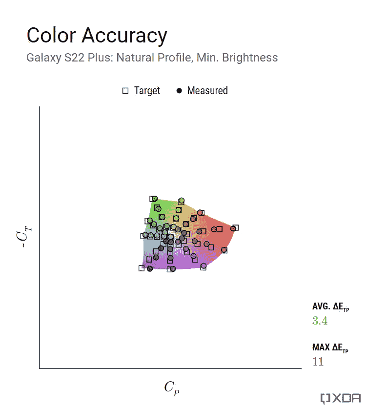

Galaxy S22 Plus 的 P3D65 色彩准确度(自然，最低。亮度)[/caption]

[caption align = " align center " width = " 400 "]

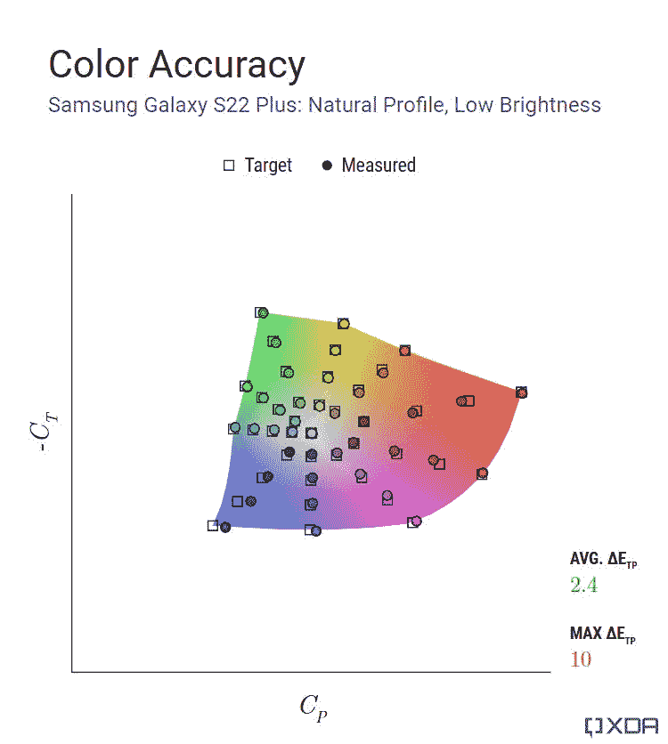

Galaxy S22 Plus 的 P3D65 色彩准确度(自然、低亮度)[/caption]

[caption align = " align center " width = " 400 "]

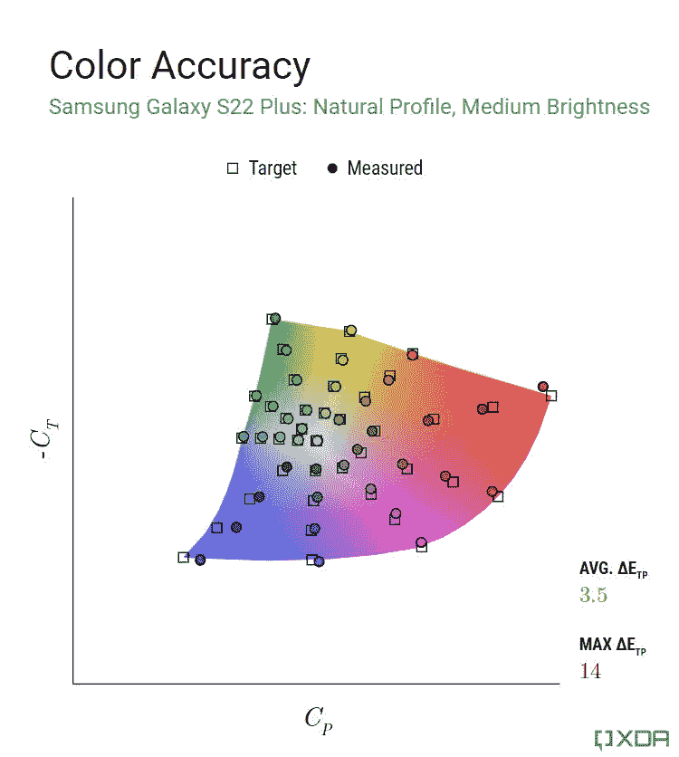

Galaxy S22 Plus 的 sRGB 色彩准确度(自然、中等亮度)[/caption]

[caption align = " align center " width = " 400 "]

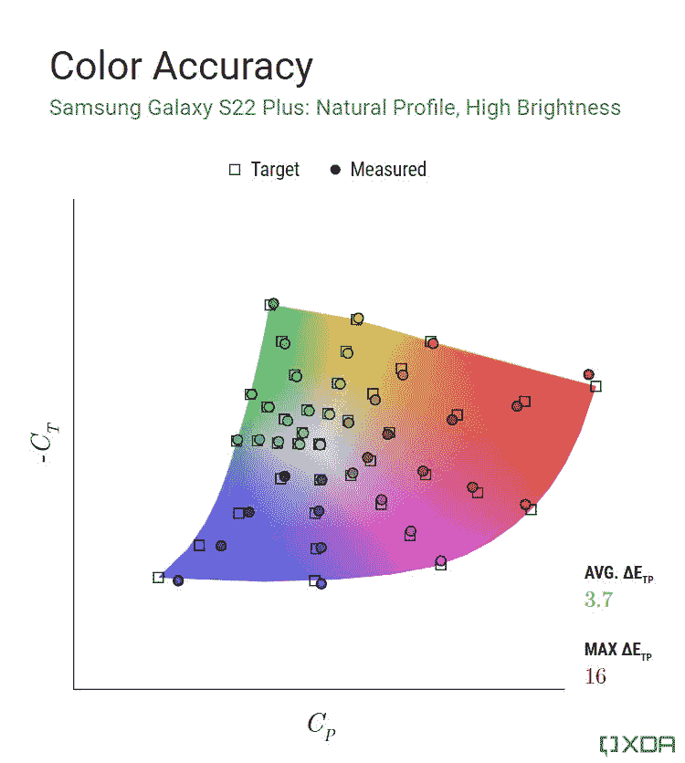

Galaxy S22 Plus 的 sRGB 色彩准确度(自然、高亮度)[/caption]

[caption align = " align center " width = " 400 "]

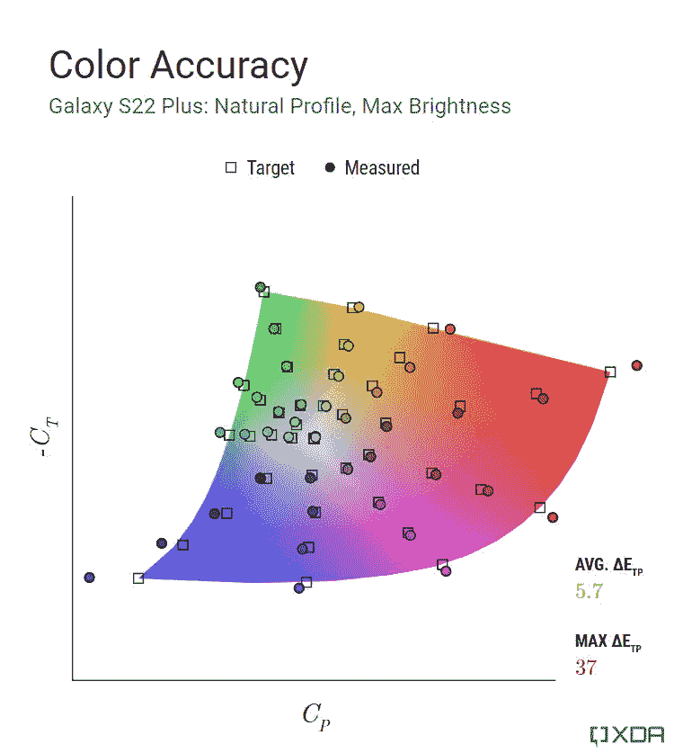

Galaxy S22 Plus 的 sRGB 色彩准确度(自然、最大亮度+视觉增强器)[/caption]

[caption align = " align center " width = " 400 "]

Galaxy S22 Plus 的 P3D65 色彩准确度(自然，最低。亮度)[/caption]

[caption align = " align center " width = " 400 "]

Galaxy S22 Plus 的 P3D65 色彩准确度(自然、低亮度)[/caption]

[caption align = " align center " width = " 400 "]

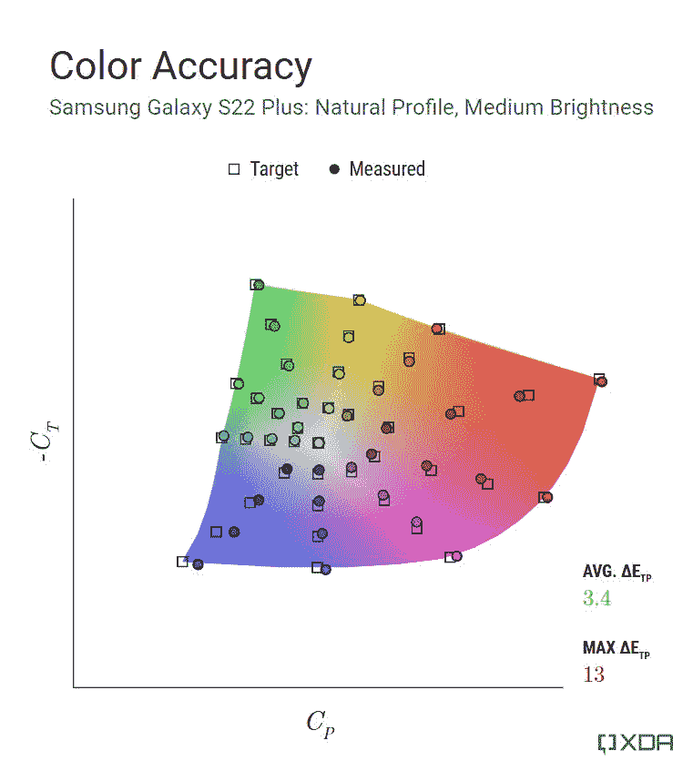

Galaxy S22 Plus 的 P3D65 色彩准确度(自然、中等亮度)[/caption]

[caption align = " align center " width = " 400 "]

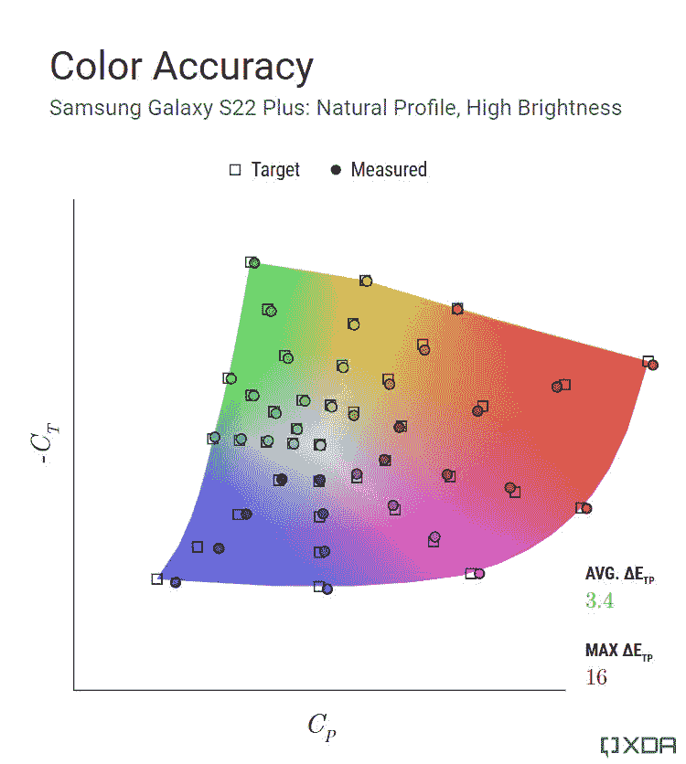

Galaxy S22 Plus 的 P3D65 色彩准确度(自然、高亮度)[/caption]

[caption align = " align center " width = " 400 "]

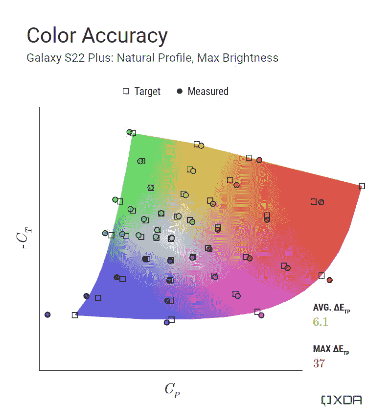

Galaxy S22 Plus 的 P3D65 色彩准确度(自然、最大亮度+视觉增强器)[/caption]

p3d 65

Galaxy S22 Plus 上的 sRGB 和 P3 色彩准确度在自然模式下都很好。任何色差都是不明显的，除非你仔细寻找；在我看来，即使是最大的蓝色误差也无法与参考值进行对比(尽管这可能是因为蓝色的色差指标最不可靠)。

如上所述，白平衡在每个亮度级别都达到 D65，这是获得准确色彩的必要条件。平均和最大颜色误差并不是最低的，但在我看来，Galaxy S22 Plus 的显示器只是达不到参考水平——如果白平衡能够纠正同色异谱的失败。

令人印象深刻的是，当*视觉增强器*开始工作时，色彩准确度仍然不错。虽然它显著提高了颜色亮度，系统灰度系数变得动态，但屏幕的相对饱和度和色调保持不变。当出现大量屏幕眩光时，会出现一些色域压缩，因此需要增加饱和度来应对。

## HDR10 回放

如今，流媒体平台上发布的几乎每一款新游戏都是为 HDR 量身定制的，因此，仔细研究 HDR 在旗舰手机上的表现非常有意义。但是，有了 Galaxy S22 Plus，我真的没有什么需要*仔细检查的了。这些 HDR10 测量是如此教科书，我需要重新做这些测量几次，以确保它不是一个侥幸。不，它们是正确的——它们是我测量过的所有开箱即用的显示器中最好的。白色的色温肯定会有一些差异，但只要看看色彩准确度图表就知道了！这是愚蠢的准确。ST.2084 色调再现几乎完全通过虚线目标，我可能无法用手更直地跟踪它。*

Galaxy S22 Plus 上的 HDR10 播放性能是任何其他 Android 手机都无法比拟的

凭借任何有机发光二极管上最亮的屏幕，Galaxy S22 Plus 拥有最好的消费显示器之一，可用作 HDR10 参考。它甚至可以作为一个可靠的工具来验证家庭影院电视上 HDR 色调映射的准确性。三星手机也是唯一一款将峰值亮度 100%用于 HDR 内容的安卓手机。这是因为三星正确地将高光色调映射到 HDR 内容的最大峰值亮度；其他 Android 手机试图将色调映射到 10，000 尼特，浪费了高达 25%的峰值亮度。此外，三星没有像其他机器人一样将 ST.2084 基准置于 100%的系统亮度。相反，三星将其置于 75%的系统亮度，留出额外的空间来播放比参考亮度更高的 HDR 标题。这一点很重要，因为参考 HDR10 家庭影院观看环境假设环境亮度/环绕亮度为 5 勒克斯/尼特，非常暗。此外，这也是许多人抱怨 HDR 内容在其他 Android 手机上看起来太暗的原因——因为他们必须将亮度提高到 100%，才能达到在黑暗的房间里观看 HDR 内容的设置。

Galaxy S22 系列显示器的改进正是我在过去几年中希望从三星看到的。听说他们又一次提高了他们的峰值亮度是一个完全的哈欠。即使这通常意味着电池板变得更有效率，但对许多人来说，在日常使用中很少意识到额外的几百尼特。

视觉增强器不仅仅是一个软件触发器

严格来说，Galaxy S22 的新*视觉增强器*功能是指在阳光直射下增强图像亮度的软件机制。但是它的现实似乎暗示了一个更广泛的目标:*内容易读性*。三星在 Galaxy S22 系列中增加了一些变化，使他们的显示器在更广泛的场景中更容易观看——从睡前浏览一直到户外观看。一个调暗 20%但具有适当色调映射的显示器在阳光直射下会比一个对比度不合适的更亮的显示器更容易观看，三星最终意识到了这一点。

 <picture></picture> 

Samsung Galaxy S22 Plus

##### 三星 Galaxy S22 Plus

三星 Galaxy S22 Plus 采用了三星迄今为止最好的显示器之一，具有改善最终用户体验的 Vision Booster 等有意义的技术。

今年，三星实际上在有机发光二极管硬件开发方面停滞不前。Galaxy S22 Ultra 使用与去年相同的发光材料就是证明。尽管三星宣布今年的亮度有所提高，但这并不比我们之前在 Galaxy S21 Ultra 上测得的亮度高。Galaxy S22 Plus 与 Galaxy S21 Ultra 具有相似的发光功率消耗，这一事实进一步支持了这一点。虽然我确信三星有它的理由，但我怀疑三星知道他们将在第二年重复使用最新的有机发光二极管发射器，并故意抑制第一批使用它的手机的亮度，以便他们可以宣布明年的改进。

不管三星怎么说，我都不生气。M11 夜光材料套装是一个非常好的套装。在这一点上，我更担心三星的下一个发射器工艺 M12 系列——不会产生像 Galaxy S10 系列之后那样好的产量。我不确定三星显示还能在多大程度上推动其当前形式的有机发光二极管技术，但即使进展会磕磕绊绊几年，我仍然对移动 OLED 的能力感到满意。

也许三星花了一年的时间来评估它可以在不抛出比以往任何时候都高的亮度指标的情况下改善什么。但如果这是必须的，那么我很乐意再花一年时间。

| **规格** | 三星 Galaxy S22 Plus |
| --- | --- |
| **技术** | 灵活的有机发光二极管 PenTile 钻石像素 M11 材料集 |
| **制造商** | 三星显示公司 AMB656AY01 |
| **尺寸** | 6.0 英寸乘 2.7 英寸 6.56 英寸对角线 16.4 平方英寸 |
| **分辨率** | 2340 ×1080 19.5:9 像素宽高比 |
| **像素密度** | 每英寸 278 个红色子像素每英寸 393 个绿色子像素每英寸 278 个蓝色子像素 |
| **亮度** | **最低:**1.9 尼特**峰值 100% APL:**1100 尼特**峰值 50% APL:**1300 尼特**峰值 HDR 20%杀伤人员地雷:**1450 尼特 |
| **白平衡** *标准是 6504 K* | 6400 Kδ*ETP*= 1.4 |
| **色调响应** *标准是 2.20* 的直线伽玛 |  |
| **色差** | 

**自然:**

*sRGB:*

平均δ*ETP*= 3.3

最大δ*ETP*= 16

*P3:*

平均δ*ETP*= 3.2

最大δ*ETP*

 |
| **黑色削波阈值** *要削波的黑色信号电平* | 

**自然:**

< 1/255 @ 100 尼特

< 1/255 @ 20 尼特

< 1/255 @最小亮度

**适应:**

< 1/255 @ 100 尼特

 |*