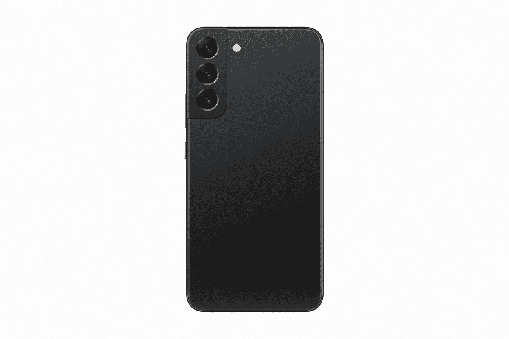

# 三星 Galaxy S22 Plus 评测:主流消费者的最佳安卓旗舰

> 原文：<https://www.xda-developers.com/samsung-galaxy-s22-plus-review/>

我认为公平地说，[三星 Galaxy S22 Ultra 是为某一类消费者准备的](https://www.xda-developers.com/samsung-galaxy-s22-ultra-ongoing-review/),他们愿意携带更大更重的手机，以换取优质的相机体验和内置的 S Pen，同时为此支付额外费用。这对那些有意识地寻求额外和过度杀戮的人来说很好。但对于其他人来说，还有三星 Galaxy S22 Plus 和 Galaxy S22。

。bestawarddiv {

浮动:对；

宽度:20%；

边距:0.75em

边距-顶部:0；

}

使用 Galaxy S22 Plus 大约一周了，我可以自信地说，这是美国现有的最好的主流 Android 旗舰手机。毕竟，在美国没有太多其他选择。一加 9 系列没有给人留下深刻印象，因为它的相机乏善可陈——这要归功于哈苏的合作最初是基于软件的——一加 10 系列还没有上市。谷歌的 Pixel 6 饱受用户界面问题的困扰，当你除去这两个主要竞争对手时，你几乎只剩下苹果了。

让我们弄清楚一些事情。三星 Galaxy S22 Plus 上的相机系统也不逊色，它装有一个 50MP f/1.8 传感器，能够拍摄美丽的图像。自然，这些图片在 120Hz 动态 AMOLED 显示屏上看起来不可思议。坦率地说，这是一款时尚、功能强大的设备，但市场竞争已经不如过去。说到高级 Android 旗舰手机，你不能击败 Galaxy S22 Plus。

 <picture></picture> 

Samsung Galaxy S22 Plus

##### 三星 Galaxy S22 Plus

如果你不是在寻找 Ultra 提供的华而不实的东西，Galaxy S22 Plus 是你能买到的最好的 Android 旗舰手机，拥有优质的相机体验，120Hz AMOLED 显示屏等等。

**浏览此评论:**

## 三星 Galaxy S22 Plus:定价和供货情况

*   定价从 999.99 美元起，大多数零售商有幻影黑、幻影白、玫瑰金和绿色。
*   三星还有四种 Samsung.com 独有的颜色:石墨色、奶油色、天蓝色和紫色。

虽然三星 Galaxy S22 Plus 的现有订单已经开始出货，但新订单被推迟到 2 月 25 日发布日期之后。不过，无论你从哪里订购，你都不必等上几个星期。

官方定价为 128GB 型号 999 美元，256GB 型号 1049 美元，但百思买等零售商甚至三星本身都提供免费存储升级，所以你可以花 999 美元购买 256GB 版本。在该设备的整个生命周期中，你可以期待看到许多类似的交易，所以请留意 [Galaxy S22 Plus 交易](https://www.xda-developers.com/best-samsung-galaxy-s22-deals/)。

至于 Galaxy S22 Plus 在中自带的[颜色，一共有八种。如果你从 Samsung.com 得到一个解锁模型，你可以得到石墨色，天蓝色，奶油色和紫色。这些颜色在其他地方是买不到的。至于如果你在其他地方购买，比如从你的运营商那里，你会得到什么，你的选择是幻影黑，幻影白，绿色和玫瑰金。为了这次评测，三星给我们发了一款玫瑰金的模型。此外，你可能会想要为你的全新 S22 Plus 买一个箱子，所以请随意](https://www.xda-developers.com/samsung-galaxy-s22-colors/)[浏览我们的最佳箱子收藏](https://www.xda-developers.com/best-samsung-galaxy-s22-plus-cases/)。

* * *

## 三星 Galaxy S22 Plus:规格

| 

显示

 | 6.6 英寸 FHD+* Dynamic AMOLED 2X display 游戏模式下超流畅 120Hz 刷新率(48~120Hz)240Hz 触摸采样率 Vision BoosterEye 舒适盾 AI 基础蓝光控制*对角线测量，Galaxy S22 Plus 的屏幕尺寸为全矩形 6.6 英寸，圆角 6.4 英寸；由于圆角和摄像头孔，实际可视区域较小。 |
| 

处理器

 | 高通骁龙 8 代 1 |
| 

安全性

 | 超声波指纹 |
| 

尺寸和重量

 | 75.8 x 157.4 x 7.6mm 毫米，196 克 |
| 

照相机

 | 12MP 超宽相机 F2.2，FOV 120 50mp 宽相机双像素自动对焦，OIS，F1.8，FOV 8510 MP 长焦相机 3 倍光学变焦，OIS，F2.4，FOV 3610 MP 前置相机 F2.2，FOV 80 |
| 

记忆

 | 8GB 内存+ 256GB8GB 内存+ 128GB |
| 

电池

 | 4500 毫安时 |
| 

充电

 | 高达 45 瓦有线 15 瓦无线电源共享 USB-IF 兼容 |
| 

操作系统（Operating System）

 | Android 12One UI 4.1 |
| 

网络和连接

 | 5G、LTE、Wi-Fi 6E(Galaxy S22+)/Wi-Fi 6(Galaxy S22)、Wi-Fi 直连蓝牙 v 5.2 |
| 

传感器

 | 加速度计、气压计、指纹传感器、陀螺仪传感器、地磁传感器、霍尔传感器、光传感器、接近传感器 |
| 

抗水性

 | IP68* IP68 基于在 1.5 米深的淡水中浸泡 30 分钟的测试条件。冲洗残留物/如果湿了就擦干。不建议用于海滩或游泳池。 |
| 

价格

 | $999.99 / $1,049.99 |

***关于本次评测:**三星美国给我们发来了 Galaxy S22 Plus(骁龙)进行评测。它没有对这次审查的内容提出任何意见。*

* * *

## 设计和显示:三星 Galaxy S22 Plus 看起来很像去年的产品

*   Galaxy S21 Plus 的设计变化很微妙。
*   新的 1，750 尼特显示屏是与常规 Galaxy S22 的主要区别。

三星 Galaxy S22 Plus 看起来与前代产品几乎相同，三镜头相机外壳合并到了设备的角落。最大的不同是，它不再是双色的，所以你没有金色相机外壳的幻影红色设备。在 Galaxy S22 Plus 上，相机外壳与机箱的其余部分相匹配。

这不是新闻，但在机箱上找不到耳机插孔。三星已经有几年没有提供这种功能了，但是如果你升级的设备有这种功能的话，还是值得一提的。你可能还想[买一副无线耳塞](https://www.xda-developers.com/best-samsung-galaxy-s22-tws-earphones/)。

如果公司真的关心电子垃圾，他们会接受现有充电器的折价

设备上唯一的实际端口是底部的 USB Type-C 端口。虽然 Galaxy S22 Plus 支持 45W 有线充电，这是这一代人的新功能，但你也必须[购买自己的充电器](https://www.xda-developers.com/best-samsung-galaxy-s22-wireless-chargers/)。

这是一个痛点。三星(Samsung)和苹果(Apple)等公司停止用盒子运送充电器，理由是电子垃圾令人担忧，而且坦率地说，每个人都已经有充电器了。然而，充电技术变得越来越好，所以你的旧充电器并没有很好地利用你刚刚花了 1000 美元购买的一个话题。如果不在盒子里运送充电器真的是关于电子垃圾，那么这些公司可能会接受你的旧充电器的折价物。

当然，该设备支持通过玻璃背面进行无线充电。

在右边，有一个电源按钮和一个音量摇杆。大概就是这样。

现在，在这个漂亮的 6.6 英寸显示屏上。虽然 Galaxy S22 和 Galaxy S22 Plus 除了尺寸之外看起来几乎相同(Galaxy S22 的显示屏更小，为 6.1 英寸)，但实际情况远不止如此。Galaxy S22 Plus 上的显示屏是 Galaxy S22 和 S22 Plus 之间的关键[之处之一。](https://www.xda-developers.com/samsung-galaxy-s22-vs-samsung-galaxy-s22-plus-vs-samsung-galaxy-s22-ultra/)

Galaxy S22 Plus 屏幕明亮美观，动画流畅。

这两款设备都提供 FHD+120 赫兹动态 AMOLED 显示屏，这太棒了。如果你在过去五年里拥有一部旗舰 Galaxy 智能手机，那么你知道你将获得一流的显示体验。动画流畅得益于刷新率，色彩明亮而充满活力得益于 AMOLED 技术。打孔的切口很小，所以相机不会有打扰的感觉。这是一次愉快的经历。

然而，Galaxy S22 和 S22 Plus 之间的巨大差异在于，虽然 Galaxy S22 与 Galaxy S21 具有相同的 1300 尼特显示屏，但 Galaxy S22 Plus 现在增加到了 1750 尼特。这是一个相当大的进步，对于室外性能来说也是一个进步。当你把这个东西拿出来放在明亮的阳光下，你看屏幕上的东西一点问题都没有。

* * *

## 相机:Galaxy S22 Plus 是主流旗舰产品中的佼佼者

*   Galaxy S22 Plus 配备了 50MP f/1.8 主传感器、12MP f/2.2 超宽、10MP f/2.4 3 倍变焦镜头和 10MP f/2.2 前置摄像头。

三星 Galaxy S22 Plus 拥有与 S21 Plus 完全不同的全新相机系统。去年，三星在主摄像头上使用了 12MP f/1.8 传感器和 64MP 变焦镜头。这家韩国公司今年在 Galaxy S22 和 S22 Plus 上采取了相反的方法，采用了更高分辨率的主传感器和更低分辨率的变焦镜头。超宽还是 12MP f/2.2。

但现在，有一个 50MP f/1.8 镜头和一个 10MP f/2.4 3 倍变焦镜头，首先，当使用长焦镜头时，它提供了更大的像素。它还使用四宁滨(也称为四宁滨)将四个像素合并为一个像素，以获得更好的弱光性能，并利用 50MP 图像来进一步改善它。

我取的样本大约有一半是在白天，一半是在弱光或者夜间。变焦提高到 30 倍，这很好，尽管三星 Galaxy S22 Ultra 上的 100 倍是这个世界上最好的。我还对低光表现印象深刻，主要是我不必做任何特殊的事情来拍出好的照片。

Galaxy S22 Plus 相机终于成为我信任的主相机。

我真正想指出的一点是，与过去相比，三星在真实照片方面做得更好。尽管坦率地说硬件很棒，但我从来不愿意随身携带三星手机，因为照片看起来太不自然，因为它们太饱和了。今年，我觉得这个问题可能会得到解决。我觉得在没有备份设备的情况下使用这款相机很好，考虑到我之前对三星智能手机的感受，这真的很重要。

* * *

## 三星支付和疫苗通行证

*   您可以将疫苗卡存储在 Samsung Pay 中。

三星有一系列新的 Samsung Pay 功能，尽管这些功能无论如何都不是 Galaxy S22 系列独有的。它们包括对钥匙(车、家、办公室)、学生证和我个人最喜欢的疫苗通行证的支持。

要设置疫苗通行证，至少在纽约州，你可以扫描该州应用程序中的二维码。现在，只要你需要，就可以在 Samsung Pay 中轻松拉起。

尽管如此，Samsung Pay 还是相当不错的，尤其是这家韩国公司还在继续为它添加新功能。不幸的是，MST 支持不再存在，因为这是将 tap-to-pay 功能与竞争对手区分开来的唯一因素。不过，添加疫苗证明、身份证和钥匙之类的东西还是很酷的。

* * *

## 性能、电池寿命和充电:速度快，可持续一整天

*   Galaxy S22 Plus 在美国配有高通骁龙 8 Gen 1
*   电池可持续一整天。
*   45W 充电功率超过 25W 不会带来任何实际好处

这两个要点是你真正需要知道的。三星 Galaxy S22 Plus 配备了骁龙 8 Gen 1 芯片组(在美洲、非洲和亚洲的一些地区)，这意味着性能尽善尽美。它拥有高通的三重 ISP，新骁龙精英游戏功能，等等。然而，由于芯片组的原因，当你玩这些游戏时，它有时会变热。我在运行基准测试时注意到了这一点。然而，欧洲和亚洲一些特定地区的用户将获得 Exynos 2200 处理器，我们已经[注意到该处理器上的一些明显的性能问题](https://www.xda-developers.com/samsung-galaxy-s22-exynos-performance-display-issues/)。这些都没有出现在骁龙 8 代 1 单位，我们很高兴与旗舰性能到此为止。

就基准测试而言，我对 Geekbench、AnTuTu 和 GFXBench 进行了常规测试。有趣的是，Geekbench 测试分数低于我们在骁龙峰会上测试的骁龙 8 代 1 设备[的分数，尤其是在多核方面。我在单核上得到 1，216，在多核上得到 3，126，而参考设计分别得到 1，235 和 3，758。](https://www.xda-developers.com/qualcomm-snapdragon-8-gen-1-benchmarks/)

对于 AnTuTu，我得出了 834，344 的总分，其中 CPU 类别为 212，908，GPU 类别为 317，993，内存类别为 157，493，UX 类别为 145，950。在 GFXBench 中，S22 Plus 在曼哈顿屏幕外测试了 112fps，而参考设备获得了 221fps。

但是关于基准测试已经足够了。我们所要比较的设备是高通自己的参考设计，它是为运行基准测试而创建的。三星的 S22 系列是目前市场上最快的安卓手机系列。这主要是因为该公司在美国的主要竞争对手谷歌和一加尚未发布采用更新芯片组的设备。现在，如果你想要性能，你可以去三星(只要你买骁龙而不是 Exynos)。

电池寿命也很长。简单地说，在一天 24 小时的工作结束时，我从来没有低于 25%。在测试中，我会一次次醒来。默认情况下，屏幕设置为 60Hz，AoD 关闭；这是我马上改变的两件事。当我说我在 24 小时内获得了全天的电池续航时间时，它具有 120Hz 的功能，并打开了永远打开的显示屏。如果你玩游戏，你可以预期这些数字会下降，但总的来说，我对电池寿命非常满意，它符合我对全天电池寿命的定义。

虽然电池寿命很好，但 Galaxy S22 Plus 的充电非常奇怪。这一代的新功能是 45W 充电支持，根据我们的测试，实际上比上一代的 25W 充电慢。为此，我使用了 25W 三星 TA-800 充电器，我使用了一加 Warp Charge 65 充电器，它也支持 45W 功率传输 PPS。目前还不清楚为什么低瓦数的充电器充电速度更快，但没有理由相信三星自己的 45W 充电器会做得更好。盒子里没有一个，但如果你有一个旧的 25W 充电器，似乎没有任何理由在这个时候购买 45W，尽管固件更新可能会改变这一点。无论如何，三星仍落后于其他 OEM 厂商，后者一直在提供高得多的充电速度。

* * *

## 从 iPhone 换到三星 Galaxy S22 Plus

*   如果你用的是 iPhone，三星是最好的选择。

自从去年四月来到 XDA，我就成了 iPhone 用户。由于我将专注于笔记本电脑和计算，我不再处于那个不断审查新手机、在 Android 生态系统中跳跃的世界。我最终选定了一款设备，那就是 iPhone。

苹果从未制造过与 Galaxy S22 Ultra 竞争的手机。

就我个人而言，我认为如果你有一部 iPhone，并且你正在寻找一些可以在 Android 上找到的新东西，我认为三星是正确的选择。此外，对于大多数 iPhone 用户来说，我特别认为 Galaxy S22 或 Galaxy S22 Plus 是正确的选择。

原因是生态系统。很少有公司花这么大力气为你的生活方式创造全栈体验。这不仅包括智能手机，还包括智能手表、笔记本电脑、耳塞，事实上，对于三星来说，甚至更多。这是因为三星制造智能电视和各种与你的三星设备兼容的智能电子产品。

作为一名 iPhone 用户，你可能会想买一台谷歌 Pixel，因为它是第一方硬件，当硬件制造商也生产软件时，伟大的事情就会发生，对吗？情况并非总是如此。不要期望每个人都像苹果那样优秀；如果这很容易，智能手机制造商制造自己的操作系统将会更加普遍。

正如我之前所说，我认为 Galaxy S22 或 S22 Plus 也是一个选择。我真的相信 Galaxy S22 Ultra 是为那些特别想花大钱买一台可以变焦 100 倍的相机或想要内置 S Pen 的人准备的。超是一个利基产品，如果这是你的东西，它是惊人的，你应该去争取它。

苹果从未真正做出过与 Galaxy S22 Ultra 竞争的产品。Cupertino 公司声称拥有 3 倍无损变焦，尽管多年来所有 iPads 都支持 Apple Pencil，但 iPhones 仍然不支持它。一部 iPhone，无论是 Mini 还是 Pro Max，对于大众来说都是一部伟大的全能手机，就像 Galaxy S22 和 S22 Plus 一样。

* * *

## 谁应该购买三星 Galaxy S22 Plus？

这篇评论的主题是，三星 Galaxy S22 Plus 是你能买到的最好的主流 Android 智能手机。当然，它并不适合所有人，就像没有产品适合所有人一样。

### 谁应该购买三星 Galaxy S22 Plus:

*   想要最好的手机但不在乎笔支架或空间变焦相机的人
*   从 iPhone 转向 Android 的用户

### 谁不应该购买三星 Galaxy S22 Plus:

*   想要用 S 笔画画或做手写笔记的客户
*   想要在移动摄影中获得绝对最佳效果以及令人难以置信的多功能性的人
*   想要快速充电的用户

当谈到谁应该和谁不应该购买这些东西时，这是很容易打破的。Galaxy S22 Plus 是一款 Android 手机，除非你买的是 Galaxy S22 Ultra。如果你已经决定放弃 iPhone，这也是一个选择。

iPhone 13 Pro 和 Galaxy S22 Ultra 都是很棒的手机，我永远不会说你应该从 iPhone 换成三星 Galaxy。但是如果你做了那个决定，这是你应该换的。