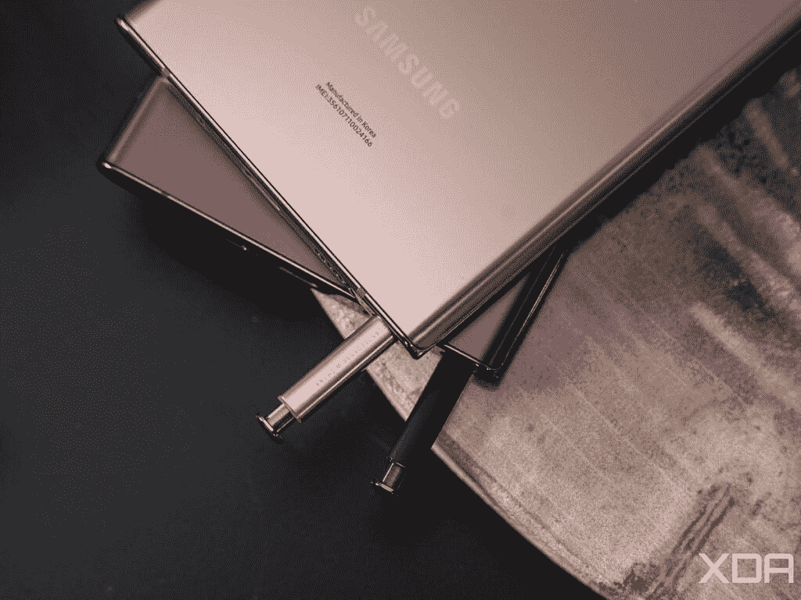
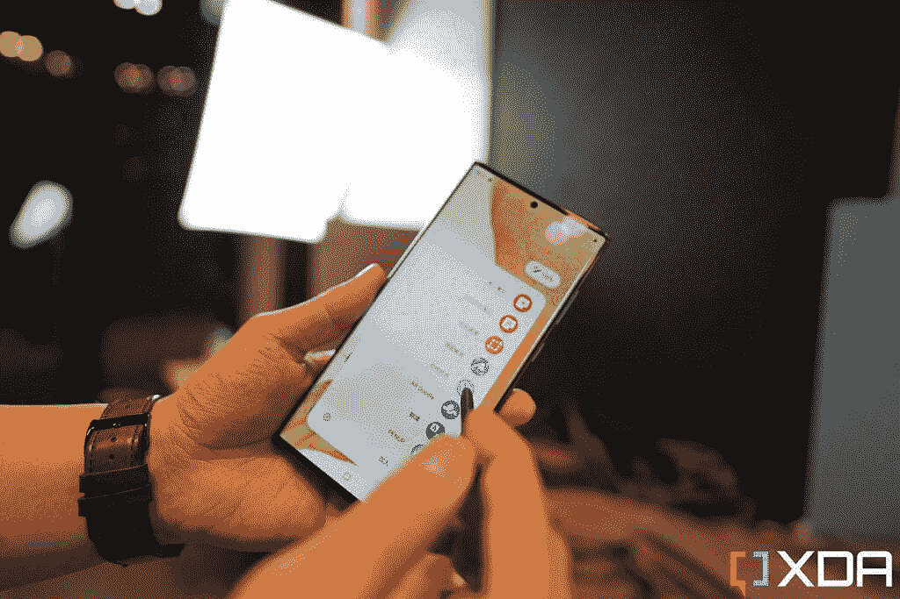

# 三星 Galaxy S22 和 Galaxy S22 Plus 支持 S Pen 吗？

> 原文：<https://www.xda-developers.com/samsung-galaxy-s22-plus-s-pen-support/>

多年来，S Pen 一直是三星 Galaxy Note 系列智能手机的关键特征，也是 Note 名称背后的全部原因。但在 2021 年，三星停产了 Galaxy Note 系列，取而代之的是，我们在 Galaxy S21 Ultra 中得到了 S Pen 支持，但却是半生不熟。通过 Galaxy S22 Ultra，三星终于将 S Pen 重新内置到手机中，但 Galaxy S22 系列也支持它吗？

不幸的是，答案是否定的。标准的三星 Galaxy S22 和 Galaxy S22 Plus 不支持 S Pen。您必须使用手指或不需要特殊数字化仪的第三方笔。那个数字化仪是 S Pen 功能的核心部分，所以不可能让它工作。

## 什么是 S 笔？

如果你以前从未拥有过三星 Galaxy Note，你可能会想知道 S Pen 到底是什么。本质上，它就是所谓的有源手写笔，虽然它可以用来触摸屏幕，但 S Pen 中有很多功能。它首次出现在 2011 年的第一代 Galaxy Note 上，此后一直是 Galaxy Note 家族的主要产品，每年都有新的升级。

 <picture></picture> 

The S Pen on the Galaxy Note 20 Ultra (bronze) and on the Galaxy S22 Ultra (purple/black)

您可以使用 S Pen 来选择和触摸屏幕上的对象，就像您使用手指一样，但由于 S Pen 的精细笔尖，它更加精确。正因为如此，它也更适合涂鸦和手写。事实上，S Pen 的两个核心功能是离屏备忘录(意味着即使在屏幕关闭的情况下，你也可以书写或涂鸦)和手写识别，后者可以自动将你的手写内容转换为正确的文本。

S Pen 功能集的另一大部分是悬停。因为它使用一个活动的数字化仪和专门的硬件，兼容的手机实际上可以检测到笔何时靠近屏幕，即使它没有接触屏幕。你可以使用它来访问某些应用程序中的附加选项，甚至在主屏幕上还有一个快速启动轮，只有 S Pen 才会出现。

 <picture></picture> 

S Pen being used on the Galaxy S22 Ultra

S Pen 的最新版本甚至有蓝牙连接，所以你可以在 S Pen 上按一个按钮来启动应用程序。这个功能的一个显著用途是让 S Pen 充当相机的快门，这样你就可以放下手机拍照，而无需触摸它。您还可以在按下按钮时在空中做出某些手势来访问特定功能。

## Galaxy S22 Ultra 是唯一支持 S Pen 的手机吗？

如果你想在 2022 年购买一部平板风格的智能手机，三星 Galaxy S22 Ultra 是唯一一款支持笔的手机，正如你在我们的 [Galaxy S22 Ultra 实践](https://www.xda-developers.com/samsung-galaxy-s22-ultra-hands-on/)中看到的那样。然而，如果你想要一个可折叠的，[三星 Galaxy Z Fold 3](https://www.xda-developers.com/samsung-galaxy-z-fold-3/) 有一个特别版的 S Pen，专门用于它。还有[的 Pen Pro](https://www.xda-developers.com/samsung-s-pen-pro/) ，它可以在三星所有支持笔的设备上运行，包括平板电脑和 Chromebooks。

 <picture></picture> 

S Pen Pro between the Galaxy S21 Ultra and Galaxy Z Fold 3

S Pen 支持依赖于设备和笔，但不支持 S Pen 的手机将不会支持任何型号，无论是过去还是现在。你不能在 Galaxy S22 或 S22 Plus 上使用 S 笔，就像你不能在 S21 或 S21 Plus 上使用 S 笔一样。您可以查看我们的 [Galaxy S22 实践](https://www.xda-developers.com/samsung-galaxy-s22-hands-on/)文章，了解更多关于它所包含的功能。

如果想买三星 Galaxy S22 Ultra，可以在下面预购。智能手机本身内置了 S Pen。否则。查看三星 Galaxy S22 系列的[最佳交易，找到购买它们的最佳地点。](https://www.xda-developers.com/best-samsung-galaxy-s22-deals/)

 <picture></picture> 

Samsung Galaxy S22

三星 Galaxy S22 不支持 S Pen，但它仍然是一款出色的手机。

 <picture></picture> 

Samsung Galaxy S22 Plus

##### 三星 Galaxy S22 Plus

Galaxy S22 Plus 也没有 S Pen 支持，但是有大屏和电池。

 <picture></picture> 

Samsung Galaxy S22  Ultra

三星 Galaxy S22 Ultra 是该系列中唯一支持 S Pen 的产品，它将 S Pen 内置在手机中，就像经典的 Galaxy Note 型号一样。