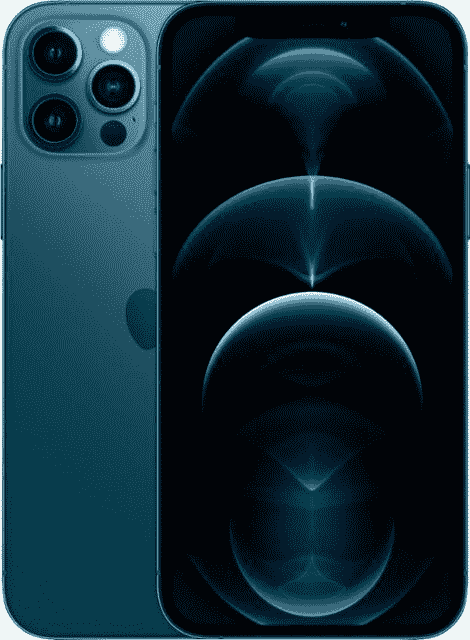

# 三星 Galaxy S22 Plus vs 苹果 iPhone 12 Pro:买哪款手机？

> 原文：<https://www.xda-developers.com/samsung-galaxy-s22-plus-vs-apple-iphone-12-pro/>

对许多人来说，选择下一部手机是一个两难的选择。有无穷无尽的品牌和型号可供选择，频繁的新品发布只会使这一过程变得艰难。三星最近发布了其 [Galaxy S22 Plus](https://www.xda-developers.com/samsung-galaxy-s22-plus-review/) ，以及其旗舰阵容的其余部分——包括 [Galaxy S22 Ultra](https://www.xda-developers.com/samsung-galaxy-s22-ultra-review/) 。你可能想[购买 Plus 型号](https://www.xda-developers.com/best-samsung-galaxy-s22-deals/)，因为这是目前市面上最好的手机之一。然而，明智的做法是事先考虑其他选择，以确保它是适合你的设备。这是我们对抗三星 Galaxy S22 Plus vs 苹果 iPhone 12 Pro——这是两个价格相同的强大旗舰之间的战斗。

## 三星 Galaxy S22 Plus vs 苹果 iPhone 12 Pro:规格

|  | 

三星 Galaxy S22 Plus

 | 

苹果 iPhone 12 Pro

 |
| --- | --- | --- |
| **CPU** | 

*   高通骁龙 8 代 1
*   Exynos 2200(欧盟和英国)

 | 苹果 A14 仿生 |
| **正文** | 

*   157.4 x 75.8 x 7.6mm 毫米
*   196 克

 | 

*   146.7 x 71.5 x 7.4mm 毫米
*   189 克

 |
| **显示** | 

*   6.6 英寸动态 AMOLED 2X
*   2340 x 1080p 像素
*   48-120 赫兹自适应刷新率
*   游戏模式下 240Hz 触摸采样率

 | 

*   6.1 英寸 Super Retina XDR 有机发光二极管显示屏
*   2532 x 1170p 像素
*   460 PPI
*   60Hz 刷新率
*   HDR10
*   杜比视觉
*   陶瓷屏蔽

 |
| **摄像机** | 

*   初级:50MP，f/1.8
*   超宽:12MP，f/2.2，120 FoV
*   长焦:10MP，f/2.4
*   前置:10MP，f/2.2

 | 

*   初级:12MP，f/1.6
*   超宽:12MP，f/2.4，120 FoV
*   长焦:12MP f/2.0
*   前置:12MP，f/2.2

 |
| **内存** | 

*   8GB 内存
*   128GB/256GB 存储空间

 | 

*   6GB 内存
*   128GB/256GB/512GB 存储

 |
| **电池** | 

*   4500 毫安时
*   45W 有线快充
*   15W Qi 无线充电
*   无线 PowerShare

 | 

*   2815 毫安时
*   20W 有线快速充电
*   15W MagSafe 充电
*   7.5W Qi 无线充电

 |
| **连通性** | 

*   5G(毫米波/sub6)
*   4G LTE
*   超宽带
*   无线网络 6
*   蓝牙 5.2

 | 

*   Sub6/mmWave 5G
*   4G LTE
*   超宽带
*   Wi-Fi 802.11 a/b/g/n/ac/6
*   蓝牙 5.0

 |
| **水**水**阻力** | IP68 | IP68 |
| **安全** | 超声波显示指纹传感器 | Face ID |
| **操作系统** | 一个基于 Android 12 的 UI 4.1 | iOS 15 |
| **颜色** | 

*   奶油
*   天蓝色
*   紫罗兰
*   石墨
*   格林（姓氏）；绿色的
*   金银铜镍装饰合金
*   幻影白
*   幻影黑

 | 

*   太平洋蓝
*   银
*   石墨
*   金色的

 |
| **材质** | 

*   康宁大猩猩玻璃 Victus+
*   装甲铝框架

 | 

*   玻璃背面
*   不锈钢框架

 |
| **价格** | 起价 999 美元 | 起价 999 美元 |

* * *

## 建造和设计

三星 Galaxy S22 和苹果 iPhone 12 Pro 分享了一些设计元素。然而，在很大程度上，它们在外观上是两种非常不同的手机。从背面开始，三星手机的三个后置摄像头垂直对齐。相反，iPhone 采用了*炉顶*摄像头设计。这两种布置哪一种看起来更干净，更吸引人，完全取决于你。设计是一件非常主观的事情，我们在这里只是做客观的观察。

说到设计上的相似之处，两款手机都有一个哑光玻璃背面。由于哑光纹理，这两款旗舰都不会吸引明显的指纹——闪亮的玻璃背通常会这样。此外，两者上的轻微划痕不太可能非常明显。用一个案例来保护他们仍然是一个明智的想法。毕竟，*玻璃就是玻璃，而玻璃可以打碎*。

Galaxy S22 Plus 和 iPhone 12 Pro 的背面都有各自制造商的标志。此外，手电筒放在相机系统的右上方。这两款设备都没有令人震惊的设计，而且都是用固体材料制成的。因此，除非你对某个元素特别挑剔，否则在权衡每部手机的利弊时，不应该考虑这些手机的背面。不过，值得指出的是，iPhone 12 Pro 有一个不锈钢框架，比 Galaxy S22 Plus 上的铝制框架更耐用，看起来也更高档。

说到前面，我们不出所料地也有相同和不同之处。首先，三星 Galaxy S22 Plus 和苹果 iPhone 12 Pro 都有边到边的显示屏，没有底部下巴。这使用户能够沉浸在身临其境的体验中，如电影、手机游戏和其他形式的全屏数字娱乐。不过，值得注意的是，苹果手机有一个凹槽，而三星手机则有一个穿孔。是的，后者很小，不那么明显，但有些人适应前者就好了。这真的是由你来决定缺口是一个交易破坏者还是*缺口*。

最后是 [Galaxy S22 Plus 进来八个(！)不同颜色](https://www.xda-developers.com/samsung-galaxy-s22-colors/)可供选择，而 iPhone 12 Pro 只有四种。不过，值得注意的是，三星手机的四种颜色是通过该公司网站订购的独家颜色。因此，如果你从不同的零售商那里购买 Galaxy S22 Plus，那么你只能有四种选择。

## 显示

我们在上面的*建造和设计*部分提到，这两个旗舰在正面展示方面有相似之处也有不同之处。虽然两者都有边缘对边缘的显示，但在 Galaxy S22 Plus 上您可以获得更多的屏幕空间。这是因为它的穿孔比缺口小，而且——更值得注意的是——它有一个 6.6 英寸的屏幕。另一方面，苹果 12 专业版有一个 6.1 英寸的缺口显示屏。*更大的*并不总是更好的*。有些人，尤其是手相对较小的人，更喜欢小巧的手机。所以哪种尺寸适合你完全由你决定。*

 *谈到解决方案，我们有一个明显的赢家——苹果 iPhone 12 Pro。它的分辨率为 2532×1170 p，击败了竞争对手的 2340×1080 p。然而，这并不是您唯一需要考虑的问题——尤其是当两个屏幕的分辨率都相对较高时。例如，三星 Galaxy S22 Plus 的自适应刷新率为 48-120 赫兹，游戏模式下支持 240 赫兹触摸采样速率。苹果手机只满足于 60Hz。当快速滚动长列表或玩密集型游戏时，您可能会注意到差异。

说到屏幕，Galaxy S22 Plus 附带一个显示指纹传感器。因此，您可以通过将注册的指尖放在屏幕上来解锁手机。另一方面，苹果 12 专业版利用原深感摄像头系统进行认证，该系统位于缺口中。不过不用担心——iOS 15.4 将允许您在 iPhone 12 Pro 上使用 Face ID，即使您戴着口罩。

## 表演

说到表现，我们必须考虑很多方面。虽然 iPhone 12 Pro 已经有一年多的历史，但你不应该低估苹果 A14 仿生芯片的力量。这可能不是最新的，但它仍然是一个有效的竞争对手，有能力打出一记重拳。银河 S22 由高通的骁龙 8 一代 1 或三星的 Exynos 2200 提供动力。后者包括在运往欧洲和英国的模型中，而前者则运往世界其他地方。正如我们在测试中发现的，Exynos 芯片有一些问题，所以我们建议您不要考虑购买。

首先，骁龙芯片是在 A14 仿生机器发布一年零三个月后发布的。然而，不要让时间线愚弄了你。*更新的*并不总是等同于*更好的*，这也是部分原因。

当谈到单核和多核 CPU 的分数时，苹果的芯片击败了骁龙 8 代 1。此外，A14 仿生芯片在电池续航时间方面效率更高。因此，您可以获得更好的性能，同时消耗更少的电池电量。另一方面，骁龙 8 Gen 1 芯片赢得了 GPU 回合——它在游戏和 OpenCL/Vulcan 中的性能更好。此外，它还有两个内核和一个更小的晶体管(骁龙 8 Gen 1 和 A14 仿生芯片分别为 4 纳米和 5 纳米)。两个 SOC 都以自己的方式发光，你可以选择任何一个。离埃克斯诺斯远点。

如果你在手机上玩大量重度游戏，三星 Galaxy S22 Plus 可能是你的更好选择。否则，iPhone 12 Pro 是一款更流畅的设备，应该会在更长时间内保持支持和更新。还有一点值得指出的是，iOS 客观上并不需要像 Android OS 那么大的处理能力来运行。因此，尽管 Galaxy S22 Plus 的内存增加了 2GB，但它的性能不一定会更好。

## 摄像机

许多用户最关心智能手机中的摄像头。这是完全可以理解和合理的——因为他们中的许多人在网上记录他们的生活，更清晰的照片可以更生动地表达时刻。并非所有人都关心高级用户倾向于关注的技术规范和细节。毕竟，如今的旗舰机在处理日常任务时表现良好。较低的像素密度不会对普通用户产生任何影响。

说到后置摄像头，两款手机都有三个镜头——主镜头、超宽镜头和长焦镜头。Galaxy S22 Plus 上的 50MP 主摄像头胜过 iPhone 12 Pro 上的 12MP 主摄像头，尽管后者的光圈更好。同样，Galaxy 手机上的超宽镜头因拥有更好的光圈而胜出——因为两款手机都有 12MP 超宽镜头。最后，iPhone 上的 12MP 长焦镜头击败了三星手机上的 10MP 长焦镜头。哪种设备拍摄的照片更好取决于您使用的模式和所处的环境。不过，在很大程度上，三星手机在这方面做得更好。

说到前置摄像头，我们有一个明显的赢家——苹果的 iPhone 12 Pro。这款手机有一个 12MP 原深感摄像头系统，而 Galaxy S22 有一个 100 万像素的摄像头。如果你打算拍大量的自拍和视频，那么苹果手机可能是你正在寻找的。如果你倾向于站在相机后面，那么三星中端旗舰机是你要去的地方。

## 电池寿命和充电

这一部分可能很棘手——更大的电池并不总是意味着更长的电池寿命。一些处理芯片比其他芯片消耗更多的能量，设备的操作系统及其优化在这个问题上起着很大的作用。三星 Galaxy S22 Plus 的电池为 4500 毫安时，而其竞争对手的电池为 2815 毫安时。前者承诺单次充电 54 小时音频播放，被后者 65 小时的承诺打败。

然而，音频播放并不是衡量电池性能的准确方式。日常使用更重要的是，应用程序消耗多少电池电量，设备一次充电能持续多长时间。iPhones 的待机时间往往很长，而 Android 的相对记录通常较差。因此，实际上，这两款手机在轻度到中度使用的情况下应该可以维持你一天的时间，尽管重度使用可能会在此之前杀死它们。最终，iPhone 12 Pro 赢得了这一轮。

至于充电，Galaxy S22 Plus 的 45W 快速有线充电击败了 iPhone 12 Pro 的 20W，尽管请注意，这一观察是基于 Galaxy S22 Plus 的 25W 有线充电与其 45W 充电相同的事实——它仍然名列前茅。此外，iPhone 只能通过 Qi 无线充电器充电 7.5W。三星手机的功率是这个数字的两倍，达到 15W。不过，为苹果辩护的是，iPhone 12 Pro 提供 15W 无线充电——通过 MagSafe。不过，值得指出的是，三星提供无线 PowerShare，即反向无线充电。这使您能够通过 Galaxy S22 Plus 为支持 Qi 协议的其他手机和配件无线充电。所有的 iPhone 型号都没有这种便捷的附加功能，包括最新的系列。

* * *

## Galaxy S22 Plus vs iPhone 12 Pro:该买哪款智能手机？

我们已经分解了三星和苹果两款旗舰手机的主要方面。哪一个适合你取决于你的视角和重点。你需要什么？什么适合你的工作流程？你是否被束缚在一个特定的生态系统中？问自己这些问题，然后权衡我们在本文中剖析的每种设备的利弊。最终，在这件事上，你是最好的法官。

这两款手机在美国的起价都是 999 美元，尽管 iPhone 12 Pro 已经上市一年多了。不过，值得记住的是，苹果可能会在更长的时间内支持它。虽然 Galaxy S22 Plus 仍然新鲜，但三星只承诺**最多**四年的主要软件更新。因此，如果你想运行最新最好的操作系统来利用最新的功能，你可以考虑苹果手机。

 <picture></picture> 

Apple iPhone 12 Pro

##### 苹果 iPhone 12 Pro

iPhone 12 Pro 搭载苹果 A14 仿生芯片，运行 iOS 15。它支持 MagSafe 配件，并具有一个顶级缺口。

 <picture></picture> 

Samsung Galaxy S22 Plus

##### 三星 Galaxy S22 Plus

三星 Galaxy S22 Plus 是该公司 2022 年产品线的中旗舰产品，带来了顶级的性能、显示和相机功能。它运行一个 UI 4.1(基于 Android 12)。

你会买这两款手机中的哪一款，为什么？请在下面的评论区告诉我们。*