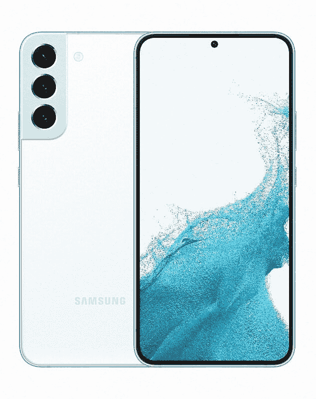
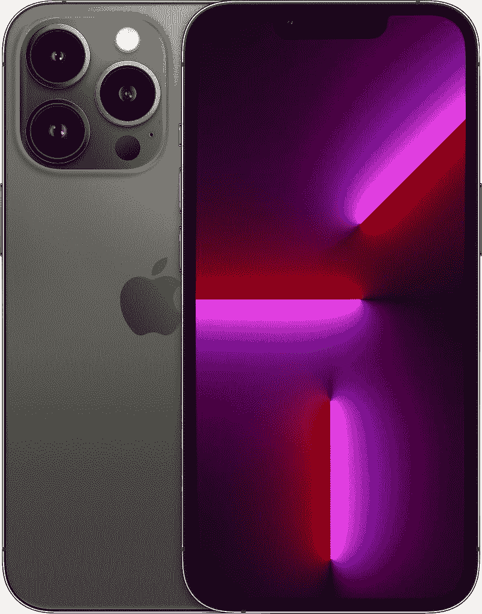

# 三星 Galaxy S22 Plus vs 苹果 iPhone 13 Pro:该买哪个？

> 原文：<https://www.xda-developers.com/samsung-galaxy-s22-plus-vs-apple-iphone-13-pro/>

[三星 Galaxy S22 Plus](https://www.xda-developers.com/samsung-galaxy-s22-plus-review/) 和[苹果 iPhone 13 Pro](https://www.xda-developers.com/apple-iphone-13-pro-review/) 有很多共同点。这两款手机位于各自家庭的中间，拥有大显示屏，在功能和相对定价方面平衡得很好。如果你在市场上寻找一款 1000 美元的旗舰产品，提供大显示屏和功能强大的相机，iPhone 13 Pro 和 Galaxy S22 Plus 是绝佳的选择。Galaxy S22 Plus 是标准 [Galaxy S22](https://www.xda-developers.com/samsung-galaxy-s22-review/) 的更强大版本，提供更大的显示屏、更大的电池和更快的充电速度。另一方面，iPhone 13 Pro 可以被描述为 iPhone 13 Pro Max 的精简版。它在紧凑的封装中提供了与顶级型号几乎相同的规格。

这两款旗舰机在各自方面都很棒，提供华丽的有机发光二极管显示器和强大的相机硬件。但是哪一个更好买呢？我们在这场 Galaxy S22 Plus vs iPhone 13 Pro 的对决中一探究竟。

## 三星 Galaxy S22 Plus vs iPhone 13 Pro:规格

| 

**规格**

 | 

**三星 Galaxy S22 Plus**

 | 

苹果 iPhone 13 Pro

 |
| --- | --- | --- |
| **构建** | 

*   装甲铝框架
*   康宁大猩猩玻璃 Victus+
*   IP68 防尘防水等级

 | 

*   不锈钢中框
*   玻璃正面和背面
*   前玻璃的“陶瓷护罩”

 |
| **尺寸&重量** | 

*   157.4 x 75.8 x 7.6mm 毫米
*   196 克

 | 

*   146.7 毫米 x 71.5mm 毫米 x 7.65mm 毫米
*   204 克

 |
| **显示** | 

*   6.6 英寸动态 AMOLED 2X
*   FHD+ (1080 x 2340)
*   120Hz 自适应刷新率
*   1750 尼特

 | 

*   超级视网膜 XDR 有机发光二极管:
    *   iPhone 13 Pro: 6.1 英寸
    *   iPhone 13 Pro 最大 6.7 英寸

*   推广 120Hz 刷新率

 |
| **SoC** | 

*   高通骁龙 8 代 1
*   Exynos 2200

 |  |
| **闸板&存放** |  | 

*   6GB 内存
*   28GB/256GB/512GB/1TB

 |
| **电池&充电** | 

*   4500 毫安时
*   45W 有线快充支持
*   15W 无线充电支持
*   4.5W 反向无线充电
*   不含充电器

 | 

*   3095 毫安时
*   最高 7.5W 的无线充电
*   MagSafe 充电功率高达 15W

 |
| **安全** | 超声波显示指纹传感器 | Face ID |
| **后置摄像头** | 

*   初级:50MP，1.0 米，85 FoV，23 毫米，f/1.8，OIS DPAF
*   超宽:12MP，1.4 米，120 FoV，13 毫米，f/2.2
*   长焦:10MP，1.0 m，36 FoV，69mm，f/2.4，OIS，3 倍光学变焦

 | 

*   **初级:** 12MP 宽，f/1.5 光圈，1.9μm
*   **次要:** 12MP 超宽，f/1.8 光圈
*   **第三:** 12MP 长焦，3 倍光学变焦，f/2.8
*   激光雷达相机

 |
| **前置摄像头** | 10MP，1.22 米，f/2.2，80 FoV | 12MP 原深感摄像头系统 |
| **端口** | 

*   USB 类型-C
*   没有耳机插孔
*   没有 microSD 卡插槽

 | 

*   闪电
*   没有耳机插孔
*   没有 microSD 卡插槽

 |
| **音频** | 立体声扬声器 | 立体声扬声器 |
| **连通性** | 

*   5G(毫米波/sub6)
*   4G LTE
*   Wi-Fi 6E
*   蓝牙 5.2
*   国家足球联盟

 | 

*   5G(低于 6 GHz 和毫米波)
*   支持 4×4 MIMO 和 LAA 的千兆级 LTE
*   支持 2×2 MIMO 的 Wi-Fi 6 (802.11ax)
*   蓝牙 5.0

 |
| **软件** | 一个基于 Android 12 的 UI 4.1 | iOS 15 |
| **其他功能** | 

*   承诺四次 Android 操作系统升级
*   承诺五年的安全补丁

 | 

*   五年或以上的软件支持

 |

* * *

## 设计与展示

说到设计，Galaxy S22 Plus 和 Galaxy S22 Plus 有着天壤之别。Galaxy S22 Plus 的设计与前代相比变化不大。iPhone 13 Pro 也是如此。Galaxy S22 Plus 采用了我们在 Galaxy S21 Plus 上看到的熟悉的轮廓切割相机岛，大猩猩玻璃 Victus Plus 保护了正面和背面。

iPhone 13 Pro 看起来与 iPhone 12 Pro 一样，只是有一些较小的变化，如更大的摄像头模块和略小的凹槽。iPhone 12 Pro 也略微更厚更重，这是手机包装更大电池的一个副作用。两款手机都通过了 IP68 防尘防水认证，因此无论您购买哪一款手机，您都可以享受这一保护。

Galaxy S22 Plus 提供了更广泛的颜色选择。它有幻影白、绿色、玫瑰金、奶油色、天蓝色、紫色、石墨色和宝来紫五种配色。iPhone 13 有塞拉蓝、石墨色、金色、银色和阿尔卑斯绿色。

iPhone 13 Pro 和 Galaxy S22 Plus 是市场上最好的智能手机显示器之一。这两个面板都是三星制造的，所以无论你选择哪种显示器，三星都是赢家。Galaxy S22 Plus 采用 6.6 英寸 AMOLED 显示屏，分辨率为 2340 x 1080 (FHD+)和 120Hz 自适应刷新率。该显示器可以达到 1750 尼特的峰值亮度，并支持 HDR10 和 HDR10+内容。这款手机还有一个名为[视觉增强器](https://www.xda-developers.com/samsung-galaxy-s22-display-vision-booster/)的简洁功能，当在阳光直射下使用显示屏时，它会自动增强亮度和对比度，以获得最佳的观看体验。

iPhone 13 Pro 拥有 6.1 英寸 2352 x 1170 Super Retina XDR 显示屏，动态刷新率为 120Hz，峰值亮度为 1200 尼特。iPhone 13 Pro 面板使用 LTPO 技术，可以在 10Hz 到 120Hz 之间动态调整刷新率。除了 HDR10+，该面板还支持杜比视界内容。

两款显示器都很出色，但我们认为 Galaxy S22 Plus 更适合观看内容，因为它更大，更具沉浸感，而且没有阻碍性的缺口。

## 摄像机

iPhone 13 Pro 和 Galaxy S22 Plus 都在背面安装了三后置摄像头系统。Galaxy S22 Plus 有一个带 OIS 的 50MP f/1.8 主拍摄镜头，一个 120 度视野的 12MP f/2.2 超宽相机，以及一个提供 3 倍无损变焦的 10MP f/2.2 长焦镜头。

iPhone 13 Pro 提供了一个带传感器移位 OIS 的 12MP f/1.5 主摄像头，一个 120 度视野的 12MP f/1.8 超宽摄像头，以及一个带 3 倍光学变焦的 12MP f/2.8 长焦摄像头。此外，它还有一个用于人像的激光雷达深度传感器。

在视频录制方面，Galaxy S22 Plus 可以以 24fps 的速度拍摄高达 8K 的视频，而 iPhone 1 Pro 的最高速度为 4K 60fps。对于自拍来说，iPhone 13 Pro 有一个 12MP 的射手，有中央舞台支持。同时，Galaxy S22 Plus 使用了 10MP f/2.2 前置射手。

这两款手机都能在各种光线条件下拍摄出高动态范围和细节的出色照片。然而，这两款手机在图像处理方面采取了不同的方法。虽然苹果更喜欢自然、逼真的照片，但三星喜欢暖色调和稍微过饱和的颜色。让我们来看看两款设备的一些图像样本。

**Galaxy S22 Plus 图像样本:**

**iPhone 13 Pro 图片样本**

虽然静态摄影很难，但视频性能是 iPhone 13 Pro 真正闪光的地方。正如我们在评论中指出的那样，iPhone 13 Pro 的视频片段没有出现我们在 Android 手机上常见的微抖动和故障。新的电影模式真正改变了游戏规则，并进一步巩固了 iPhone 13 Pro 作为视频拍摄最佳手机之一的地位。

* * *

## 表演

就原始功率而言，iPhone 一直遥遥领先于 Android 旗舰产品，这一趋势在 iPhone 13 Pro 中得以延续。

三星根据市场提供两种不同芯片组的 Galaxy S22 Plus。因此，欧洲获得了三星内部的 Exynos 2100 芯片组，而包括美国和印度在内的世界其他地区获得了高通骁龙 8 代 1 SoC。测试这两种变体，发现高通骁龙 8 Gen 1 驱动的模型几乎在每个领域都优于配备 Exynos 2200 的模型，包括基准测试、持续性能、应用程序打开速度和功耗。

iPhone 13 Pro 使用超快的 A15 仿生芯片组，在六核设置中具有两个运行频率为 3.23GHz 的 Avalanche 内核和四个主频为 1.82GHz 的 Blizzard 内核。

在基准测试中，iPhone 13 Pro 将 Galaxy S22 Plus 打得落花流水。它在 Geekbench 上发布了 1，731 个单核和 4，792 个多核，而 Galaxy S22 Plus 骁龙变种分别只管理了 1，216 和 3，126 个。苹果控制着硬件和软件，这就是为什么 iPhones 通常在基准和原始性能上优于 Android 手机。

在日常任务中，两款手机的表现都令人钦佩。在打开应用程序、进行多任务处理、浏览社交媒体或玩图形密集型游戏时，您不太可能遇到性能中断或速度变慢的情况。

至于内存和存储选项，Galaxy S22 Plus 包装了 8GB 内存和 128GB/256GB 存储。与此同时，iPhone 13 Pro 有 6GB 的内存和存储选项，从 128GB 开始，一直到 1TB。

* * *

## 电池寿命、充电和软件

Galaxy S22 Plus 为相当小的 3，095 毫安时电池配备了 4，500 毫安时电池。然而，规格和数字并没有描绘这里的全貌。尽管电池更小，但 iPhone 13 Pro 的续航能力比 Galaxy S22 Plus 更好。正如我们在评论中指出的那样，即使频繁使用，手机也经常会持续一整天，而电池中仍有大约 15%的电量。在使用量较少的日子里，它会在一天结束时还剩下大约 30%到 40%的电量。Galaxy S22 Plus 也不会落后太多，也可以轻松地让你在充满电的情况下度过一天。

Galaxy S22 Plus 在充电速度上领先，相比 iPhone 13 Pro 的 23W 充电速度，提供 45W 快速有线充电。然而，没有一款手机在盒子里配有充电器。正如你所料，两款手机都支持无线充电。Galaxy S22 Plus 提供 15W Qi 无线充电。同时，iPhone 13 Pro 可以使用 MagSafe 充电器以 15W 无线充电，使用 Qi 兼容充电器以 7.5W 无线充电。

iPhone 13 Pro 自带 iOS 15。Galaxy S22 Plus 在 Android 12 之上运行三星的定制皮肤 One UI 4.1。苹果尚未正式确认计划支持 iPhone 13 Pro 多长时间。但如果历史有任何指示，iPhone 13 Pro 用户可以指望五年或更长时间的软件更新。Galaxy S22 Plus 非常接近承诺的四年操作系统更新和五年安全更新。

在生物识别方面，iPhone 13 Pro 配备了 Face ID，而 Galaxy S22 Plus 则配备了超声波显示指纹扫描仪。两款手机都提供双立体声扬声器、NFC 和 5G 连接。

* * *

## Galaxy S22 Plus 和 iPhone 13 Pro 都提供了优质的设计、强大的硬件和长期的软件支持。定价也是一样的，都是 1000 美元起。然而，Galaxy S22 Plus 通常会看到[交易和折扣](https://www.xda-developers.com/best-samsung-galaxy-s22-deals/)，并且可以以更低的价格购买。

 <picture></picture> 

Samsung Galaxy S22 Plus

##### 三星 Galaxy S22 Plus

Galaxy S22 Plus 提供了华丽的显示屏、强大的摄像头和旗舰级的性能。

 <picture></picture> 

Apple iPhone 13 Pro

##### 苹果 iPhone 13 Pro

iPhone 13 Pro 包装了 6.1 英寸 XDR 宣传显示屏和新的 A15 仿生芯片。

如果你已经拥有一些苹果设备，比如 Mac 或 iPad，iPhone 13 Pro 可能是更好的选择，并提供更具凝聚力的体验。iPhone 13 Pro 在性能、视频性能和电池部门击败了 Galaxy S22 Plus。不过，Galaxy S22 Plus 的显示屏更大、更好，充电速度也更快。相机的性能和软件是一个很接近的电话。

在 Galaxy S22 Plus 与 iPhone 13 Pro 的对比中，没有明显的赢家。这完全取决于你的个人偏好、优先级和用例，尤其是在 Android 和 iOS 的争论中你站在哪一边。请注意，iPhone 13 Pro 已经被 iPhone 14 Pro 取代，它带来了许多值得注意的升级，包括动态岛和 48MP 主摄像头。