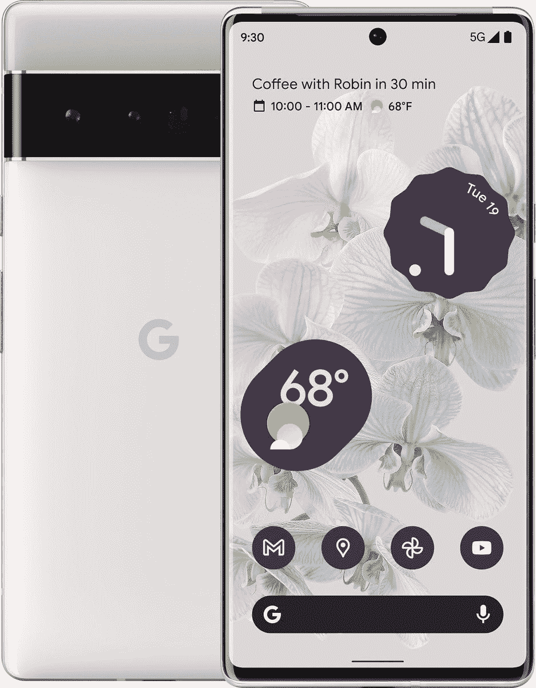

# 三星 Galaxy S22 Plus vs 谷歌 Pixel 6 Pro:买哪款旗舰手机？

> 原文：<https://www.xda-developers.com/samsung-galaxy-s22-plus-vs-google-pixel-6-pro/>

三星的 Galaxy S22 Plus 和谷歌的 Pixel 6 Pro 是你在 2022 年能买到的最好的旗舰手机。Galaxy S22 Plus 位于今年阵容中较小的 [Galaxy S22](https://www.xda-developers.com/samsung-galaxy-s22-review/) 和更高端的 [Galaxy S22 Ultra](https://www.xda-developers.com/samsung-galaxy-s22-ultra-review/) 之间。另一方面，Pixel 6 Pro 代表了谷歌在 2022 年智能手机领域的最佳表现。从强大的内部功能到出色的软件支持，这些手机都有很多令人喜欢的地方，但它们并不是生来平等的。根据你的预期，你肯定会倾向于这一个或另一个，所以让我们看看 Galaxy S22 Plus 与谷歌 Pixel 6 Pro 的对比，看看 2022 年买哪一个更好。

**浏览本文:**

## 三星 Galaxy S22 Plus vs 谷歌 Pixel 6 Pro:规格

在我们开始比较之前，让我们快速浏览一下规格，了解一下这些器件各自的特点:

| 

规格

 | 

三星 Galaxy S22 Plus

 | 

谷歌 Pixel 6 Pro

 |
| --- | --- | --- |
| **打造** | 

*   装甲铝框架
*   康宁大猩猩玻璃 Victus+
*   IP68 防尘防水等级

 | 

*   铝制中框
*   大猩猩玻璃 Victus 正面和背面
*   IP68 等级

 |
| **尺寸&重量** | 

*   157.4 x 75.8 x 7.6mm 毫米
*   196 克

 | 

*   163.9 x 75.9 x 8.9 毫米
*   210g

 |
| **显示** | 

*   6.6 英寸动态 AMOLED 2X
*   FHD+ (1080 x 2340)
*   10-120 赫兹自适应刷新率
*   1750 尼特

 | 

*   6.7 英寸有机发光二极管
*   1,440 x 3,120 像素
*   HDR10+认证
*   60Hz 到 120Hz 之间的可变刷新率

 |
| **SoC** | 

*   高通骁龙 8 代 1
*   Exynos 2200

 | 谷歌张量芯片组 |
| **闸板&存放** |  | 

*   8GB/12GB 内存
*   128GB/256GB/512GB UFS 3.1 存储

 |
| **电池&充电** | 

*   4500 毫安时
*   45W 有线快充支持
*   15W 无线充电支持
*   4.5W 反向无线充电
*   不含充电器

 | 

*   5，004 毫安时电池
*   30W 快速有线充电
*   无线充电
*   不含充电器

 |
| **安全** | 超声波显示指纹传感器 | 光学显示器内指纹传感器 |
| **后置摄像头** | 

*   初级:50MP，1.0 米，85 FoV，23 毫米，f/1.8，OIS DPAF
*   超宽:12MP，1.4 米，120 FoV，13 毫米，f/2.2
*   长焦:10MP，1.0 m，36 FoV，69mm，f/2.4，OIS，3 倍光学变焦

 | 

*   主要:50MP 主要，f/1.9，1/1.31 英寸，OIS，装箱
*   中学:12MP 超宽，f/2.2
*   第三:48MP 潜望镜，4 倍光学变焦

 |
| **前置摄像头** | 10MP，1.22 米，f/2.2，80 FoV | 11MP，f/2.2/1.22μm |
| **端口** | 

*   USB 类型-C
*   没有耳机插孔
*   没有 microSD 卡插槽

 | 

*   USB 类型-C
*   没有耳机插孔
*   没有 microSD 卡插槽

 |
| **音频** | 立体声扬声器 | 立体声扬声器 |
| **连通性** | 

*   5G(毫米波/sub6)
*   4G LTE
*   Wi-Fi 6E
*   蓝牙 5.2
*   国家足球联盟

 | 

*   5G(毫米波/sub6)
*   4G LTE
*   Wi-Fi 6E
*   蓝牙 5.2
*   国家足球联盟

 |
| **软件** | 一个基于 Android 12 的 UI 4.1 | 带 Pixel 启动器的 Android 12 |
| **其他特色** | 

*   承诺四次 Android 操作系统升级
*   承诺五年的安全补丁

 | 

*   承诺四大 Android 操作系统更新
*   五年的安全补丁

 |

正如你所见，Galaxy S22 Plus 和 Pixel 6 Pro 都提供了一套不错的内部配置。但是一部手机不仅仅是纸上的一串数字，所以让我们更深入地探究一下，看看哪一部手机值得你花钱。

* * *

## 三星 Galaxy S22 Plus vs 谷歌 Pixel 6 Pro:设计和显示

Galaxy S22 Plus 在设计部门大量借鉴了其前身，这也是它看起来与 Galaxy S21 Plus 非常相似的原因。同时，Pixel 6 Pro 代表了新的设计语言，它看起来完全不同于我们过去从谷歌看到的任何东西。设计完全是主观的，所以我们会让你来决定哪一个更好。但就细节而言，Galaxy S22 Plus 采用了平板背板和侧框，但轮廓分明的摄像头凸起今年卷土重来。Galaxy S22 Plus 有多种颜色可供购买——幻影黑、绿色、幻影白、玫瑰金、石墨、奶油色、天蓝色、紫色——我们认为它们的外观和感觉都同样出色。

与此同时，谷歌的 Pixel 6 Pro 有着非常独特的设计，其相机遮阳板是主要的吸引力。与 Galaxy S22 Plus 相比，Pixel 6 Pro 的摄像头凸起明显更大。但它水平穿过整个设备，这意味着设备在平放时不会在桌子上摇晃。它看起来也像*托马斯·班加尔特的*蠢朋克头盔，也很酷。但是正如我们在谷歌 Pixel 6 Pro 评测中提到的，这款设备用一只手握起来感觉相当笨拙。我们还发现它非常滑，我们的暴风雨黑色模型也吸引了很多指纹和污迹。Pixel 6 Pro 有三种颜色可供选择——有点阳光、多云的白色和暴风雨般的黑色——并且都有双色饰面。

与谷歌 Pixel 6 Pro 相比，Galaxy S22 Plus 更薄更轻。它的厚度为 7.6 毫米，重量为 196 克，而 Pixel 6 Pro 的厚度为 8.9 毫米，重量为 210 克。谷歌 Pixel 6 Pro 也是一款更高的设备，显示屏略大，所以请记住这一点。它们都没有耳机插孔或用于存储扩展的 microSD 卡插槽，所以你得到的只是底部的 USB Type-C 端口。三星在 Galaxy S22 Plus 的正面和背面都使用了装甲铝框架和大猩猩玻璃 Victus+，并且它具有 IP68 的防尘和防水等级。Pixel 6 Pro 还配有铝制中框，但它的前后面板使用了大猩猩玻璃 Victus。

移动到前面，Galaxy S22 Plus 和谷歌 Pixel 6 Pro 都有一个 AMOLED 面板，带有中心对齐的打孔摄像头切口。Galaxy S22 Plus 的显示屏略小，为 6.6 英寸，而 Pixel 6 Pro 的显示屏为 6.7 英寸。Pixel 6 Pro 的显示屏也相对更清晰，因为与 Galaxy S22 Plus 的 FHD+ (2，340 x 1，080)分辨率相比，它提供了 QHD (3，120 x 1，440)分辨率。Pixel 6 Pro 上的显示屏也是曲面的，而 Galaxy S22 Plus 是平板的。然而，两种显示器都支持高达 120Hz 的自适应刷新率，因此没有区别。尽管显示屏规格有所不同，但我们认为这两种面板看起来都非常适合日常使用，甚至适合媒体消费。Galaxy S22 Plus 的显示屏周围也有统一的挡板，如果你在乎这一点的话。

* * *

## 三星 Galaxy S22 Plus vs 谷歌 Pixel 6 Pro:硬件和摄像头

Galaxy S22 Plus 配备了骁龙 8 Gen 1 或 Exynos 2200 芯片组，具体取决于你从哪里购买。另一方面，Pixel 6 Pro 配备了谷歌的张量芯片。高通的 snapdragon 8 Gen 1 在整体性能方面更好，但你可能不会注意到日常使用的差异。即使是 Exynos 2200 也凭借其一般性能脱颖而出，但张量芯片也有很多值得喜欢的地方。它还应该能够轻松处理游戏等要求更高的任务。然而，三星 Galaxy 22 Plus 的最高内存为 8GB，内部存储为 256GB，没有支持存储扩展的 microSD 卡。谷歌 Pixel 6 Pro 可以购买高达 12GB 的内存和高达 512GB 的存储，因此对于那些想要更多内存和存储的人来说更好。

谷歌 Pixel 6 Pro 在电池和充电部门也取得了胜利。谷歌为 Pixel 6 Pro 配备了一块 5,004mAh 的大电池，支持高达 30W 的快速充电，充满电需要大约一个小时。正如我们在评论中提到的，Pixel 6 Pro 在充电时往往会变热，如果/当温度大约超过 35°C(95°F)时，它会降低充电速度。这款手机可以处理高达 23W 的无线充电速度，没有任何问题。Galaxy S22 Plus 内部有一个相对较小的 4500 毫安时电池，比去年 Galaxy S21 的电池还要小。但是，它支持高达 45W 的充电速度，前提是您使用支持 USB PD PPS 的充电器。不过，无线充电只能达到 15W，所以要记住这一点。如果你想知道，这两款手机都没有带充电器，这意味着你必须单独购买一款。

软件方面，Galaxy S22 Plus 开箱运行 OneUI 4.1。它基于 Android 12，提供了一系列定制选项和一些其他功能。三星的 OneUI 软件这些年来已经改进了很多，但你不会在 Galaxy S22 Plus 上获得普通的 Android 体验。如果你想要一个纯正版本的 Android 12 软件，Pixel 6 Pro 是值得购买的手机。至于光学系统，三星 Galaxy S22 Plus 在背面配备了三摄像头设置，包括一个 50MP 主传感器，一个 12MP 超宽摄像头和一个 10MP 长焦镜头，具有 3 倍光学变焦。谷歌 Pixel 6 Pro 配备了一个 50MP 主传感器和一个广角镜头，一个 12MP 超宽相机，一个 48MP 长焦镜头和 4 倍光学变焦。

这两款手机都能够在白天和晚上拍摄一些令人惊叹的照片。当你切换镜头时会有不一致的地方，但是从两部手机出来的照片都有很好的色彩和大量的细节。我们将在下面留下一些用这两款手机拍摄的相机样本，供您查看。

自拍方面，Pixel 6 Pro 使用了 94 度 FoV 的 11.1 MP 传感器，而 Galaxy S22 Plus 则配备了 80 度 FoV 的 40MP 传感器。Galaxy S22 Plus 在视频录制方面略有优势，因为它支持 24fps 的 8K 视频录制或高达 60fps 的 4K 录制。Pixel 6 Pro 在 60fps 下达到 4K 分辨率。Galaxy S22 Plus 还允许你使用前置摄像头以 60fps 的速度录制 4K 视频，而 Pixel 6 Pro 的前置摄像头只能以 30fps 的速度进行 4K。

**谷歌 Pixel 6 Pro 相机样品:**

**三星 Galaxy S22 Plus 相机样品:**

* * *

## 三星 Galaxy S22 Plus vs 谷歌 Pixel 6 Pro:买哪个？

虽然 Galaxy S22 Plus 和 Pixel 6 Pro 都在争夺同一块蛋糕，但它们是两种完全不同的手机，具有独特的功能。Galaxy S22 Plus 是“如果它没有坏，就不要修理它”方法的体现，因为它从其前身 Galaxy S21 Plus 借鉴了很多东西。我们正在考虑 Galaxy S22 Plus 的增量升级，但这里仍然有很多值得喜欢的地方。你会得到一个新的 50MP 传感器和升级的芯片来对抗市场上较新的旗舰产品。这是一款可靠的多面手，在未来许多年都会表现出色。另一方面，谷歌 Pixel 6 Pro 代表了谷歌在智能手机领域的最佳产品。它有一个全新的设计，还配备了谷歌的新张量芯片。

我们正在寻找两款手机之间 100 美元的价格差异——谷歌 Pixel 6 Pro 在美国的起价为 899 美元，而 Galaxy S22 Plus 的基本款价格为 999 美元。Pixel 6 Pro 可能不如 Galaxy S22 Plus 强大，但它提供了一个很好的整体包装，具有独特的设计，一组优秀的摄像头，以及日常使用的可靠性能。与 Galaxy S22 Plus 相比，Pixel 6 Pro 还可以提供更多的内存和存储选项，并支持 Android，所以请记住这一点。

多花 100 美元，Galaxy S22 Plus 就可以通过骁龙 8 Gen 1 或 Exynos 2200 芯片组提供更好的性能。但与谷歌 Pixel 6 Pro 相比，你只能获得 1080p 显示屏、更小的电池和有限的内存和存储空间。然而，它确实配备了久经考验的硬件，并承诺获得四年的主要平台更新。相比之下，Pixel 6 Pro 将获得三年的操作系统升级，这意味着三星今年将通过 Galaxy S 系列旗舰手机在自己的游戏中击败谷歌。

在这种比较中很难选出一个明确的赢家，但你一定会体验到 Android 为这两款手机提供的最好的东西。如果你倾向于尝试一款具有独特设计和可靠摄像头的手机，Pixel 6 Pro 是合适的选择。但如果你不介意在三星久经考验的配方上多花一点钱来获得一个伟大的全能产品，那么你会喜欢 Galaxy S22 Plus。无论哪种方式，你都不是在买一部坏手机，所以根据你的喜好挑选一部吧。

 <picture></picture> 

Google Pixel 6 Pro

谷歌 Pixel 6 Pro 是谷歌最新、最伟大的旗舰智能手机，它有很多令人喜爱的地方。

 <picture></picture> 

Samsung Galaxy S22 Plus

##### 三星 Galaxy S22 Plus

如果你不是在寻找 Ultra 提供的华而不实的东西，Galaxy S22 Plus 是你可以买到的最好的 Android 旗舰手机之一，它具有优质的相机体验，120Hz AMOLED 显示屏等等。

那么你打算买哪款安卓旗舰呢？请在下面留言告诉我们。此外，一定要查看我们的 [Galaxy S22 Plus 交易](https://www.xda-developers.com/best-samsung-galaxy-s22-deals/)和[谷歌 Pixel 6 Pro 的交易页面](https://www.xda-developers.com/best-google-pixel-6-pro-deals/)，看看你是否能在购买时节省一些钱。你总是可以用一些额外的储蓄来购买高质量的箱子。你可以在我们收集的[最佳 Galaxy S22 Plus 保护套](https://www.xda-developers.com/best-samsung-galaxy-s22-plus-cases/)或[谷歌 Pixel 6 Pro 保护套](https://www.xda-developers.com/best-google-pixel-6-pro-cases/)中找到一些可靠的选项。