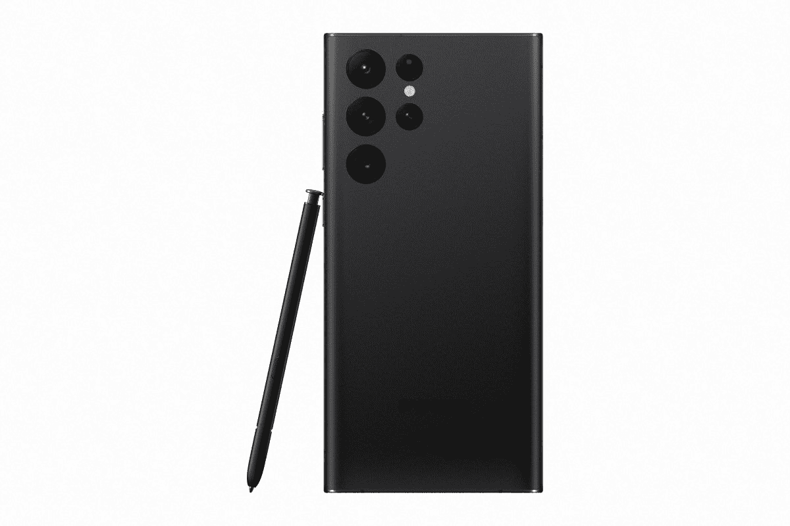

# 一个 UI 4 中的隐私设置:新增功能以及如何在三星 Galaxy S22 上使用它们

> 原文：<https://www.xda-developers.com/samsung-galaxy-s22-privacy-settings-one-ui-4/>

谷歌在 [Android 12](https://www.xda-developers.com/android-12/) 中引入了一系列隐私设置，包括新的隐私仪表盘、摄像头和麦克风访问的视觉指示器、启用/禁用摄像头和麦克风的开关，以及与应用程序共享大致位置的能力。三星在一个 UI 4 中集成了所有这些功能，这是其基于 Android 12 的最新版本的自定义皮肤。，但其实现略有不同。如果你刚刚给自己买了一部全新的 [Galaxy S22](https://www.xda-developers.com/samsung-galaxy-s22-review/) 系列设备，或者有一部装有 One UI 4.0 或更高版本的旧三星手机，这里有你需要知道的关于 One UI 4 中新隐私功能以及如何使用它们的所有信息。

## 三星 Galaxy S22 Ultra 的一个 UI 4 中的隐私设置

### 隐私仪表板

您可以在运行 One UI 4.0 或更高版本的三星 Galaxy 设备上访问所有新的隐私设置，方法是转至设置应用程序中的隐私部分。正如你在所附的截图中看到的，三星对新隐私功能的实现有点不同。 [Galaxy S22 Ultra](https://www.xda-developers.com/samsung-galaxy-s22-ultra-review/) 上的一个 UI 4 将 Android 12 的新隐私仪表盘功能集成到主隐私设置中，而不是作为一个单独的选项显示。

运行 Android 12 的谷歌 Pixel 设备上的隐私仪表盘中显示的所有权限使用信息都会出现在运行 One UI 4 或更高版本的三星 Galaxy 设备的隐私设置的顶部。该图显示了过去 24 小时内访问摄像头、麦克风和设备位置权限的应用数量。

你可以点击三个选项中的每一个来查看详细的使用历史，包括访问每个权限的应用程序的名称，访问权限的时间，以及应用程序是在后台还是在使用应用程序时访问权限。

此外，您可以点击左上角的设置按钮来启用/禁用已安装应用程序的权限访问。此外，您可以点击图表下方的“所有权限”按钮，查看所有其他权限的类似详细信息。

### 权限管理员

在隐私仪表板功能的正下方，您可以找到“权限管理器”选项。顾名思义，权限管理器允许你管理每个应用程序的权限。只需点击下一页列出的任何权限，然后启用/禁用该页列出的所有应用程序的权限。值得注意的是，位置权限设置有一个额外的开关，允许您启用/禁用与应用程序的精确位置共享。

### 控制和警报

接下来，您将找到启用或禁用摄像头和麦克风访问的开关。如果不想让任何应用程序访问手机的摄像头或麦克风，可以禁用这些功能。一旦禁用，所有应用程序将被阻止使用您手机的摄像头和麦克风。虽然这些应用程序将继续工作，但在没有摄像头接入的情况下，它们将显示黑屏，并且在没有麦克风接入的情况下，不会录制任何声音。

值得注意的是，One UI 4 还包括相机和麦克风访问的快速设置磁贴。但是，默认情况下不会启用平铺。要启用快速设置磁贴，从通知阴影向下滑动两次以打开快速设置，并点击“+”图标以添加新磁贴。

然后将摄像头和麦克风访问图标向下拖到快速设置页面，点击“完成”现在，您可以点击摄像头和麦克风访问快速设置磁贴，轻松启用/禁用应用程序的摄像头和麦克风访问。

除了摄像头和麦克风访问开关，该部分还包括一个剪贴板访问开关。默认情况下，这是禁用的，但你可以启用它，每当应用程序访问你的手机剪贴板的内容时，它就会收到警报。

 <picture></picture> 

Samsung Galaxy S22 Ultra

新的三星 Galaxy S22 系列设备运行基于 Android 12 的 One UI 4.1，其中包括一些有用的新隐私设置。

虽然这在一个 UI 4 中涵盖了所有新的隐私功能，但隐私设置包括一些从以前的软件版本中继承来的其他选项。其中包括三星的定制服务设置、Android 个性化服务、谷歌自动填充设置、位置历史设置、活动控制等。

现在，您对 Galaxy S22 上的一个 UI 4 中的新隐私功能已经有了大致的了解，根据您的使用案例，您认为这些设置中的哪一个最有帮助？请在下面的评论区告诉我们。