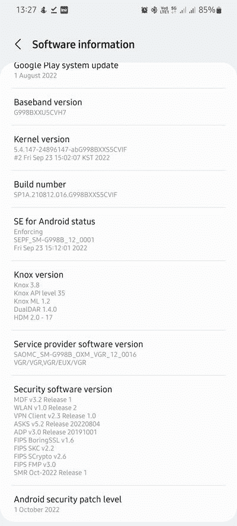

# 三星提前在 2022 年 10 月为 Galaxy S22 和 Galaxy S21 系列推出补丁

> 原文：<https://www.xda-developers.com/samsung-galaxy-s22-s21-october-2022-security-patch-update/>

三星近年来大大改进了其软件更新游戏，从最差的更新原始设备制造商之一变成了最好的之一。这家韩国科技巨头不仅提高了向其产品组合提供主要 Android 更新的速度，还成为了提供每月安全补丁最快的公司之一。为了跟上这一趋势，三星现在已经开始在 2022 年 10 月为 Galaxy S22 和 Galaxy S21 系列推出安全补丁。

## 银河 S22

Galaxy S22、Galaxy S22 Plus 和 Galaxy S22 Ultra 的美国骁龙版本已经于 2022 年 10 月更新。运营商型号的固件版本标识为 **S90xUSQS2AVI1** ，而对于未锁定的型号，标识为 **S90xU1UES2AVI5** 。

在撰写本报告时，AVI1 版本可在 Comcast 和 Xfinity 移动网络上使用。威瑞森用户预计将很快获得 OTA，因为该运营商已经在其官方软件更新追踪器上列出了相同的版本。事实上，威瑞森的变更日志最初将此版本标记为稳定版 UI 5，但现在已被更正。

**XDA 论坛:[三星 Galaxy S22](https://forum.xda-developers.com/f/samsung-galaxy-s22.12511/)| |[Galaxy S22 Plus](https://forum.xda-developers.com/f/samsung-galaxy-s22-plus.12513/)| |[Galaxy S22 Ultra](https://forum.xda-developers.com/f/samsung-galaxy-s22-ultra.12515/)**

## 银河 S21

根据我们论坛上的报道，韩国 OEM 已经开始在 2022 年 10 月为 Galaxy S21 系列推出补丁。此次更新针对全球 Exynos 车型有固件版本 **G99xBXXS5CVIF** ，而在美国则是以 **G99xUSQS5CVI8** (运营商)/ **G99xU1UES5CVI8** (未锁定)的形式出现。

 <picture></picture> 

Screenshot credit: XDA Senior Member *thanito*

对于 Exynos 变体，新软件目前在 *DBT* 地区可用，这是三星在德国的代号。美国骁龙车型的首次亮相活动规模相对更大。除了安全补丁和漏洞修复，此次更新没有任何新功能或改进。

**XDA 论坛:[银河 S21](https://forum.xda-developers.com/c/samsung-galaxy-s21.11933/) || [银河 S21 加](https://forum.xda-developers.com/f/samsung-galaxy-s21.12089/) || [银河 S21 超](https://forum.xda-developers.com/f/samsung-galaxy-s21-ultra.12091/)**

如上所述，更新已经开始打电话在少数地区。我们预计三星将在未来几周内扩大在更多国家/运营商的推广。如果你拥有 Galaxy S22 或 Galaxy S21，并且居住在上述地区，请留意 OTA 通知。您也可以通过前往**设置** > **软件更新**并点击**下载&安装**按钮来手动检查更新。

如果你对基于 PC 的闪存并不陌生，你可以跳过等待队列。为此，直接从该公司的固件更新服务器(FUS)获取最新版本，并在你的 Galaxy 设备上手动刷新。

* * *

**来源:** [XDA 论坛](https://forum.xda-developers.com/posts/87503705)、[三星更新服务器](https://doc.samsungmobile.com/SM-S908U1/ATT/doc.html)、威瑞森( [1](https://www.anrdoezrs.net/links/100122946/type/dlg/sid/UUxdaUeUpU43852/https://www.verizon.com/support/samsung-galaxy-s22-update/) 、 [2](https://www.anrdoezrs.net/links/100122946/type/dlg/sid/UUxdaUeUpU43852/https://www.verizon.com/support/samsung-galaxy-s22-plus-update/) 、 [3](https://www.anrdoezrs.net/links/100122946/type/dlg/sid/UUxdaUeUpU43852/https://www.verizon.com/support/samsung-galaxy-s22-ultra-update/) )