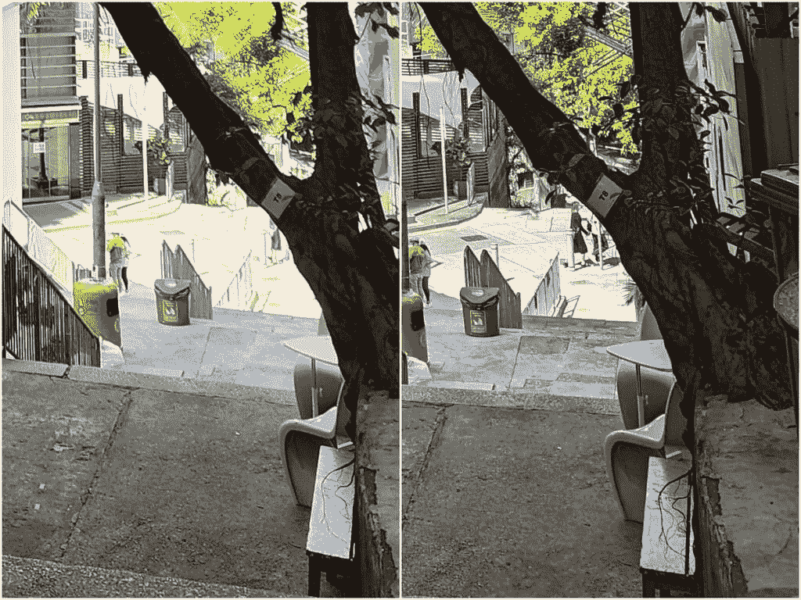
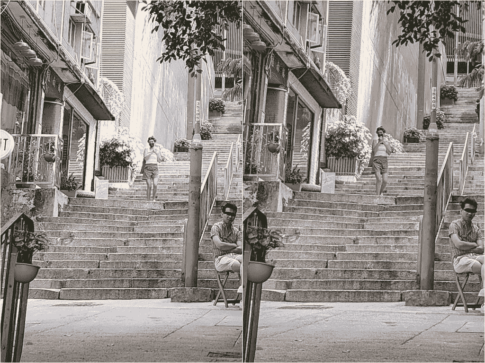
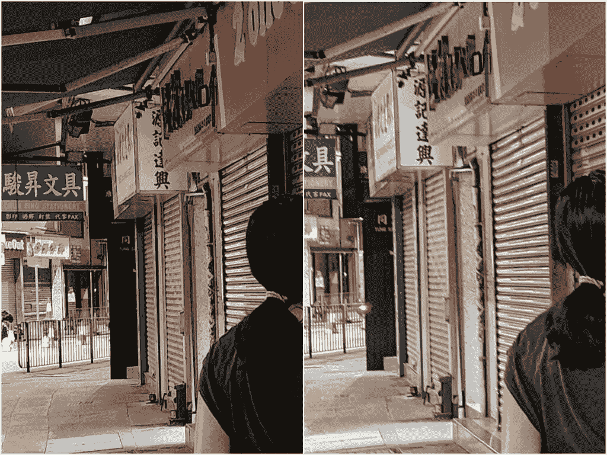
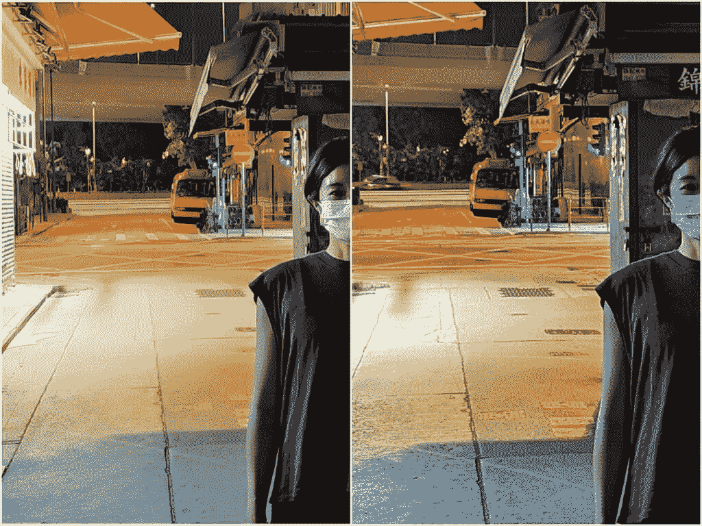

# Galaxy S22 Ultra vs Pixel 6 Pro:三星的发电站挑战谷歌的智能手机

> 原文：<https://www.xda-developers.com/samsung-galaxy-s22-ultra-vs-google-pixel-6-pro/>

三星 Galaxy S22 Ultra 在世界许多地方都不乏安卓旗舰挑战者，其中最引人注目的是亚洲。但在北美，这是三星的两大市场之一(另一个是它的祖国)，它只需要担心两款手机。上周，我们已经与 [Galaxy S22 Ultra 和一加 10 Pro](https://www.xda-developers.com/samsung-galaxy-s22-ultra-vs-oneplus-10-pro/) 进行了较量，三星取得了胜利。现在是 Galaxy S22 Ultra 迎战另一个竞争者[谷歌 Pixel 6 Pro](https://www.xda-developers.com/google-pixel-6-pro-review/) 的时候了。

 <picture></picture> 

Samsung Galaxy S22 Ultra

三星 Galaxy S22 Ultra 是目前的阿尔法狗安卓手机，提供了所有东西的大部分。

 <picture></picture> 

Google Pixel 6 Pro

谷歌 Pixel 6 Pro 带来了专门的谷歌体验，包括智能 UI 和出色的相机系统。

* * *

## 三星 Galaxy S22 Ultra vs 谷歌 Pixel 6 Pro 规格

| 

规范

 | 

三星 Galaxy S22 Ultra

 | 

谷歌 Pixel 6 Pro

 |
| --- | --- | --- |
| **构建** | 

*   铝制中框
*   大猩猩玻璃 Victus 回
*   大猩猩玻璃 Victus 正面

 | 

*   铝制中框
*   大猩猩玻璃 Victus 回
*   大猩猩玻璃 Victus 正面

 |
| **尺寸&重量** | 

*   163.3 x 77.9 x 8.9mm 毫米
*   229 克

 | 

*   163.9 x 75.9 x 8.9 毫米
*   210g

 |
| **显示** | 

*   6.8 英寸动态 AMOLED 2X 曲面显示屏
*   可变刷新率高达 1Hz 至 120Hz

 | 

*   6.7 英寸 QHD+120 赫兹 AMOLED
*   10Hz 至 120Hz 之间的可变刷新率

 |
| **SoC** | 

*   **国际:** Exynos 2200
*   **美国、中国、印度等:**高通骁龙 8 Gen 1

 |  |
| **闸板&存放** | 

*   8GB/12GB 内存
*   128GB/256GB/512GB/1TB

 | 

*   12GB 内存
*   128GB/256GB/512GB

 |
| **电池&充电** | 

*   5000 毫安时
*   45W USB 供电 3.0 快充
*   15W 无线充电
*   4.5 反向无线充电
*   大多数地区包装盒中没有充电器

 | 

*   5003 毫安时
*   30W 有线快速充电
*   23W 有线快速充电
*   盒子里没有充电器

 |
| **安全** | 超声波显示指纹扫描仪 | 光学显示指纹扫描仪 |
| **后置摄像头** | 

*   **主要:**108 兆像素宽，f/1.8，1/1.33 英寸，OIS，激光自动对焦
*   **二级:** 12MP 超宽，f/2.2
*   **第三:** 10MP 长焦，3 倍光学变焦，f/2.4
*   **四进制:** 10MP，潜望镜，10x 光学变焦，f/4.9

 | 

*   **主要:** 50MP 宽，三星 GN1，f/1.9，1/1.31 英寸
*   **二级:** 12MP 超宽，f/2.2
*   48MP 潜望镜，f/3.5

 |
| **前置摄像头** | 40MP | 11MP |
| **港口** | USB-C | USB-C |
| **音频** | 立体声扬声器 | 立体声扬声器 |
| **连通性** | 

*   5G(毫米波)
*   支持 2x2 MIMO 的 Wi-Fi 6 (802.11ax)
*   蓝牙 5.2
*   国家足球联盟

 | 

*   5G(毫米波)适用于除美国美国电话电报公司以外的几乎所有地区和运营商
*   支持 2x2 MIMO 的 Wi-Fi 6 (802.11ax)
*   蓝牙 5.2
*   国家足球联盟

 |
| **软件** | Android 12 之上的一个 UI 4.1 | 安卓 12 |
|  | 

*   韩国和美国的单一实体 SIM 卡；大多数其他地区的双物理 SIM 卡
*   包括钢笔

 |  |

***关于这个对比:**这篇文章是在对三星 HK 提供的三星 Galaxy S22 Ultra 和 XDA 购买的谷歌 Pixel 6 Pro 进行了数周的大量测试后撰写的。三星和谷歌都没有在这篇文章中提供任何信息。*

* * *

## 三星 Galaxy S22 Ultra vs 谷歌 Pixel 6 Pro:硬件和设计

首先:你在这些照片中看到的 Pixel 6 Pro 已经定制了一个明亮的橙色皮肤，位于手机的顶部。顶部原始颜色与玻璃背面的其余部分一样是暗灰色。我认为 Pixel 6 Pro 的这种配色看起来非常平淡(我没有选择颜色)，但有很多更生动的颜色选择。同样，对于 Galaxy S22 Ultra - my unit 来说，它是纯黑色的，但还有更“有趣”的颜色，如绿色和铜色，非常引人注目。

如今，旗舰 Android 手机大多看起来都很相似，所以三星和谷歌给他们的手机赋予了独特的外观，比通常的平板电脑更具个性，这让我耳目一新。谷歌 Pixel 6 Pro 的相机遮阳帽在视觉上非常引人注目，并立即从人群中脱颖而出，而 Galaxy S22 Ultra 的块状设计与比通常更坚硬的角落一起唤起了一台令人印象深刻的整体机器的感觉，而不是一个弯曲的精致小工具。两款手机的正面和背面都覆盖着 Gorilla Glass Victus，中间有一个铝制框架。

三星的这一设计选择并非没有妥协——我觉得 Galaxy S22 握起来超级不舒服，主要是因为那些尖角，但这款手机也是市场上最宽的安卓平板之一。相比之下，Pixel 6 Pro 感觉到处都是圆形的，水平方向也更轻更薄。

Galaxy S22 Ultra 的额外宽度是由于 S-Pen 触控笔的存在，在不使用时，它位于手机内部。S-Pen 带来了一整套额外的用例，这是 Pixel 6 Pro(或大多数其他手机)无法做到的，因为它允许更精确的涂鸦或涂鸦，S-Pen 还可以作为相机快门的蓝牙遥控器。但是，在这个时代，我们到底有多需要一支手写笔，这是可以讨论的。对我来说，S-Pen 是一个我很少使用的赠品。

两款手机都装有 5000 毫安时的电池，可以为每台设备供电一整天。我确实发现 Galaxy S22 Ultra 的电池续航时间更长，因为它可以比 Pixel 6 Pro 剩余更多的电量来完成漫长的一天，但你应该可以安全地将任何一部手机带出去，不必担心需要带充电器。

Pixel 6 Pro 在所有型号中都提供 12GB 的内存，而 Galaxy S22 Ultra 的基本型号从 8GB 开始，12GB 是一个更昂贵的选择，存储容量更大。两款器件均采用最新的内存标准(LPDDR5 和 UFS 3.1)。

说到显示器，Galaxy S22 Ultra 的屏幕明显胜出:它的 6.8 英寸 OLED 面板是 LTPO 2.0 面板，可以在 1 赫兹到 120 赫兹之间改变刷新率，而 Pixel 6 Pro 的 6.7 英寸面板是第一代 LTPO 屏幕，只能在 10 赫兹到 120 赫兹之间变化。最重要的是，Galaxy S22 Ultra 的屏幕明显更亮。

在下面的产品照片中，我不得不将 Galaxy S22 Ultra 的亮度调整到大约 10%，以匹配 Pixel 6 Pro 大约 45%的亮度水平。

如果你必须经常在户外强烈的阳光下使用手机，Pixel 6 Pro 的屏幕可见度可能是一个问题。否则，在室内时，两个显示器看起来都很棒，分辨率为 WQHD+分辨率。

如今，旗舰 Android 手机看起来大多都很相似，所以三星和谷歌给他们的手机赋予了独特的外观，比通常的平板电脑更具个性，这让我感到耳目一新

所有其他旗舰智能手机硬件组件都在这里:两款手机都有立体声扬声器，无线充电，官方 ip 防水评级，以及显示指纹扫描仪。然而，Pixel 的光学扫描仪明显比 Galaxy S22 Ultra 的超声波扫描仪慢，也更容易被误读。这不是一个大问题，但我估计我可以在 99%的情况下第一次成功解锁 Galaxy S22 Ultra，而 Pixel 6 Pro 的这一比例可能会下降到 90%左右。我想澄清这不是一个光学与超声波的问题，因为其他带有光学扫描仪的中国手机足够快和可靠。这里的问题是 Pixel 6 Pro 特有的。

### 三星 Galaxy S22 Ultra vs 谷歌 Pixel 6 Pro:硅

Galaxy S22 Ultra 由高通骁龙 8 Gen 1 或 Exynos 2200 驱动，具体取决于地区，而 Pixel 6 Pro 则运行谷歌自己的张量 SoC。我没有使用 Exynos 2200 的经验，但我的同事 Adam Conway 报告说芯片[遇到了重大的性能问题](https://www.xda-developers.com/samsung-galaxy-s22-exynos-performance-display-issues/)。然而，在本文中，我将比较 Galaxy S22 Ultra 的骁龙 8 Gen 1 版本与张量燃料 Pixel 6 Pro。

骁龙 8 Gen 1 是一款技术上更强大的芯片，至少从基准数据来看是这样，但张量从来都不是关于原始功率的——它旨在处理谷歌的机器学习算法，从我使用 Pixel 6 Pro 的经验来看，我确实发现它是一款比普通手机“更智能”的手机。

就总体性能而言，我对这两款手机的特定用途(大量使用相机和社交媒体，以及大量的网络浏览)都没有太大的不满。如果我必须吹毛求疵，我会说 Pixel 6 Pro 在启动应用程序和启动时感觉有点慢。

* * *

## 三星 Galaxy S22 Ultra vs 谷歌 Pixel 6 Pro:相机

两年前，三星推出了 Ultra 系列手机，配备了最先进的相机硬件，但软件图像处理还可以；与此同时，谷歌的像素历来提供可以说是同类最佳的软件图像处理，但手机使用的是普通甚至平庸的相机硬件。随着这一代设备的出现，这种情况发生了变化，三星和谷歌都借鉴了对方的经验:三星主要专注于改善软件图像处理，而谷歌最终将像素相机硬件升级到现代标准。结果是两个出色的多功能相机系统进入了我个人的前三名(Vivo X70 Pro Plus 构成了我的三位一体的[最佳相机智能手机](https://www.xda-developers.com/best-smartphone-cameras/))。

### 主摄像机

Galaxy S22 Ultra 的主摄像头使用三星最新的 108MP ISOCELL HM3 传感器，具有 1/1.33 英寸的大图像传感器尺寸和 f/1.8 光圈。与此同时，谷歌 Pixel 6 Pro 也使用了三星传感器，但它是 50MP GN1，具有略大的 1/1.31 英寸传感器和 f/1.9 光圈。

两款相机都采用了像素宁滨技术(三星用的是 9 合 1；谷歌 4 合 1)产生更大像素的镜头。再加上大型传感器，这意味着无论是白天还是晚上，图像都明亮而有力。在理想的光线下，两款手机都可以拍摄出色彩准确、细节出色、深度可感知的漂亮照片，这要归功于自然散景。

从上面的样本中我们已经可以看出，Galaxy S22 Ultra 的图像普遍更亮。这有时对三星有利——例如，如果是弱光场景——但在阳光明媚的日子里，我对着天空拍摄，Galaxy S22 Ultra 可能会以 Pixel 很少出现的方式照亮天空。如果我手动调低 EV(曝光值)，我可以解决 Galaxy S22 Ultra 的过度曝光问题，但对于相机比较，我会尝试按原样指向并拍摄(我不会进行任何设置或拍摄后编辑)。

看看照片的中心，看看 S22 Ultra 的照片曝光过度的程度。如果你更仔细地看上面 100%的照片，你会发现三星的照片过于清晰，但仍然不太清晰。

 <picture></picture> 

100% crops, Galaxy S22 Ultra (left); Pixel 6 Pro (right).

下面是另一组，三星拍摄的天空再次过度曝光。

再次，100%的作物显示在 Galaxy S22 Ultra 的图像中出现了严重的过度锐化。

 <picture></picture> 

100% crops, Galaxy S22 Ultra (left); Pixel 6 Pro (right).

转到弱光情况，分析与白天拍摄相反-像素的夜间拍摄往往比 Galaxy S22 Ultra 更亮，但细节更少。这是因为 Pixel *非常自由地使用夜间模式*——不仅 Pixel 比 Galaxy S22 Ultra 更早进入夜间模式，而且 Pixel 的夜间模式也将持续更长时间——长达三秒钟。这使得 Pixel 6 Pro 相机在晚上使用时有点慢，因为我经常发现自己站在原地等待相机应用程序告诉我拍摄已经完成。

在下面的场景中，Pixel 打开了夜间模式，而 Galaxy S22 Ultra 没有，我们可以看到 Pixel 的镜头明显更亮，以至于失去了三星镜头中看到的对比度(以及现实生活中)。

放大到 100%，我们可以在像素的镜头中看到更柔和的细节，可能是因为我的手无法保持完全静止两秒钟。

 <picture></picture> 

100% crops, Galaxy S22 Ultra (left); Pixel 6 Pro (right).

下一个场景是在街道的一个更暗的地方，在这里，三星也打开了它的夜间模式，因此这两个样本现在在灯光和细节上更接近了。这里没有太多的评论，因为两张照片都非常好，只有过去几年的旗舰才能做到不显示大量的噪音或奇怪的颜色。

 <picture></picture> 

Another 100% crops of the Galaxy S22 Ultra (left) and Pixel 6 Pro (right).

### 超宽和变焦

两款手机都提供 12MP，f/2.2 超宽相机，但三星的超宽相机拥有更宽的 120 度视野，而 Pixel 6 Pro 的视野更接近 114 度。在变焦方面，三星为 Galaxy S22 Ultra 配备了一对 10MP 传感器(一个长焦，一个潜望镜)，覆盖了 3 倍和 10 倍的光学变焦范围，而 Pixel 6 Pro 仅配备了一个 48MP 潜望镜变焦镜头，具有 4 倍的光学变焦。两款手机都很好地保持了所有镜头的色彩科学和曝光水平一致。

在色彩、曝光和细节方面，超广角镜头的图像质量非常相似。Pixel 6 Pro 的图像没有通常与超宽镜头相关的那种横扫一切、略微扭曲的外观，这种外观可能是好是坏取决于你的口味。

点像素偷窥超宽镜头不多，但这两个超宽摄像头无论如何图像锐度都很接近。在光线较暗的情况下，Pixel 6 Pro 将再次积极使用夜间模式，而三星有时足够自信，只需拍出稍微润色的照片，有点阴影。

对于变焦来说，Galaxy S22 Ultra 的变焦系统更加通用:对于人像或休闲变焦，3 倍光学比 4 倍光学更有意义，尽管 Pixel 6 Pro 的 10 倍数码变焦非常好(有时比三星的 10 倍变焦更好)，但拥有 10 倍光学变焦镜头只是让三星有更强的基础来实现更长的变焦，如 15 倍或 20 倍。Pixel 的变焦系统优于市场上 99%的手机，但仍低于 Galaxy S22 Ultra 目前最好的系统。

如果我以 100%的比例观看，Galaxy S22 Ultra 的 3 倍变焦镜头也比 Pixel 6 Pro 的 4 倍变焦镜头更清晰。

下面是一个罕见的情况，当 Pixel 6 Pro 的 10 倍变焦实际上产生了一个优于 Galaxy S22 Ultra 的 10 倍变焦镜头-我想说这种情况发生在 20-30%的时间里。

### 自拍

自拍没问题。除了 Galaxy S22 Ultra 的 40MP 自拍相机会使我的皮肤变得光滑，以及 Pixel 6 Pro 的自拍相机有更紧的剪裁之外，我没有太多评论。

### 录像

下面的视频包含来自两款手机每个摄像头的 4K/30fps 视频样本。虽然我认为 Pixel 的白天主摄像头视频产生了更好看的颜色，但这是 Pixel 6 Pro 唯一获胜的地方。除此之外，Galaxy S22 Ultra 具有更好的稳定性，更好的变焦剪辑，更好的夜间细节，以及更好的音频，可以更好地将我的声音与嘈杂的街道隔离开来。Pixel 的视频镜头在白天看起来总体上仍然很好，但在晚上，超宽镜头真的很糟糕。

总体而言，相比 Galaxy S22 Ultra 的主摄像头，我更喜欢谷歌 Pixel 6 Pro 的主摄像头，因为我觉得颜色和曝光更具美感，但对于所有其他镜头，我更喜欢 Galaxy S22 Ultra。

我想谈的另一个领域是相机应用程序 UI。我通常不怎么谈论这个，因为它们在 Android 手机中大多相似，但 Pixel 的相机应用程序有自己独特的布局和外观，我很喜欢。我喜欢 Pixel 6 Pro 的相机应用按钮是彩色的(你也可以选择你想要的颜色)。这是一件根本不会改变性能的小事，但当 99%的智能手机相机应用程序都只是黑色背景和白色按钮时，这只是一股新鲜空气。我也喜欢谷歌划分拍摄模式的想法。例如，延时视频和慢动作视频通常在大多数相机应用程序中被列为自己的独立模式。但在 Pixel 6 Pro 的相机应用程序中，这些是主视频模式的子部分。这是有意义的——因为这些模式确实可以捕捉视频。相比之下，三星的相机应用程序 UI 有点过于复杂。

* * *

## 三星 Galaxy S22 Ultra vs 谷歌 Pixel 6 Pro:软件

这里有一个坦白:与我在英国科技媒体的大多数同行不同，我从来没有那么喜欢在 Pixel 手机上运行的 Android 版本——即使，是的，这是最真实的谷歌愿景。我曾经觉得 Pixel 的 Android 版本在美学上很乏味，缺乏功能和定制选项。几乎我们今天能想到的所有快捷手势或定制选项，如单手模式、永远显示、双击唤醒屏幕、改变应用程序图标美学或配色方案，都是在第三方 Android 皮肤中首次出现的。

而且说实话，Pixel 6 Pro 中的 Android 版本即使现在仍然缺少许多几乎是其他 Android 手机中的标准功能。你仍然无法在浮动窗口中打开应用程序，无法用面部解锁手机，也无法摆脱必须位于主屏幕底部的谷歌搜索栏。

但尽管如此，我已经变得非常喜欢 Pixel 的 Android 版本，它得到了一个名为“ [Material You](https://www.xda-developers.com/material-you/) ”的重大检修。这个版本的安卓系统有着前一代安卓系统所没有的奇特之处。我喜欢永远在线的显示屏上的巨型时钟，或者 UI 的配色方案可以定制(如前所述，也适用于相机应用程序)。我认为巨大的椭圆形快捷切换按钮很醒目，让我更容易找到我想要的开关；动画也是一种额外的繁荣，当从一个应用程序移动到另一个应用程序时，手机会有额外的活力。

我也是特定像素软件 smarts 的超级粉丝，比如手机自动识别附近播放的音乐(如果你愿意，你可以关闭它)；或者最好的语音听写。我以前写过这方面的文章——但 Pixel 6 Pro 的语音听写准确性是*如此如此好*，这让我打字的频率降低了。当我使用 Pixel 6 Pro 时，我有足够的信心通过语音回复短信。我不会在其他手机上这么做，因为手动修复错误是不值得的。

Pixel 6 Pro 的语音听写准确率非常非常好，让我打字的频率降低了

在我看来，三星的 Android 版本 OneUI 并不“有趣”或智能。动画是相当基础的，没有你不仅从 Pixel 的用户界面，而且从中国 Android 皮肤获得的那种天赋；我被提示为三星的关键应用程序(如三星的互联网浏览器或照片库)安装的随机更新数量非常烦人。我会说一个月一两次，我会打开三星的浏览器，得到一个弹出消息，要求我更新。为什么这些应用程序不能在手机整夜插电的情况下自动更新？

尽管看起来不那么完美，OneUI 带来的功能比 Pixel 版本的 Android 多得多。例如，我可以在可调整大小的浮动窗口或传统的分屏模式下打开应用程序(Pixel 只提供后者)；手机解锁方式更多；永远在线的显示屏显示更多信息，并允许音乐控制，还有像三星 DeX 这样的东西。

尽管看起来不那么完美，OneUI 带来的功能比 Pixel 版本的 Android 多得多

三星的另一个优势是:OneUI 的主屏是一个真正免费的主屏。如果我愿意，我可以用应用程序填满它，或者让它完全空着。Pixel 的 Android 主屏幕有两个不可移除的小部件:谷歌搜索栏和日期/天气小部件。再读一遍最后一句——你*无法摆脱，甚至无法移动*那两个部件。他们必须坐在主屏幕上。这是 iPhone 级别的严厉控制，我不想在 Android 上看到。

说到软件更新，三星出人意料地比谷歌略胜一筹。我们承诺三星 Galaxy S22 Ultra 的四代 Android 更新加上一年的安全更新，而谷歌只承诺谷歌 Pixel 6 Pro 的三代 Android 更新加上一年的安全更新。此外，谷歌在 Pixel 上的软件更新对很多人来说都奇怪地出现了错误，而且需要一段时间才能稳定下来。但是，如果你关心第三方开发，谷歌是一条路要走，容易引导加载解锁和良好的社区。三星设备在其骁龙版本上不是引导加载器可解锁的，虽然 Exynos 版本是可解锁的，但也有一些权衡，如跳闸 Knox。

* * *

## 三星 Galaxy S22 Ultra vs 谷歌 Pixel 6 Pro:该买哪款旗舰？

在真空中，如果钱不是问题，这对我来说是一个艰难的选择，因为虽然 Galaxy S22 Ultra 提供了更多更好的硬件(明显更亮的显示屏，更快的指纹扫描仪，更好的变焦镜头，略快的 SoC，手写笔)，但谷歌 Pixel 6 Pro 的软件智能对手机来说不仅仅是各部分的总和。

这两款手机我都喜欢，我认为它们是这一领域的佼佼者。但因为这是一个现实世界的消费者比较件，价格差异有所不同。Pixel 6 Pro 的起价为 899 美元(目前在亚马逊上实际上是 829 美元)，而 Galaxy S22 Ultra 的起价为 1099 美元。这两款基本型号都有 128GB 的存储空间，但 Pixel 6 Pro 的内存为 12GB，而 Galaxy S22 Ultra 的内存为 8GB。Galaxy S22 Ultra 的[交易可能会降低其价格，但一般来说，Pixel 6 Pro 是数百本杰明更实惠的设备。](https://www.xda-developers.com/best-samsung-galaxy-s22-deals/)

考虑到这个价格差距，我会向更多人推荐 Pixel 6 Pro。现在，有人认为 Galaxy S22 Ultra 更有意义——如果你知道有一支手写笔会提高你的工作效率；如果经常录视频；或者如果你关心长变焦镜头。但对于大多数普通消费者来说，Pixel 6 Pro 更有意义。

 <picture></picture> 

Samsung Galaxy S22 Ultra

三星 Galaxy S22 Ultra 是目前的阿尔法狗安卓手机，提供了所有东西的大部分。

 <picture></picture> 

Google Pixel 6 Pro

谷歌 Pixel 6 Pro 带来了专门的谷歌体验，包括智能 UI 和出色的相机系统。

唉，答案也因地区而异，因为 Pixel 6 Pro 在比 Galaxy S22 Ultra 少得多的地区销售，在这种情况下，Galaxy S22 Ultra 仍然是事实上的选择。但在一些这样的地区，比如欧洲的一些地区，这些地区有 Exynos Galaxy S22 Ultra，但没有开放 Pixel 6 Pro，这两款设备都不太适合你。