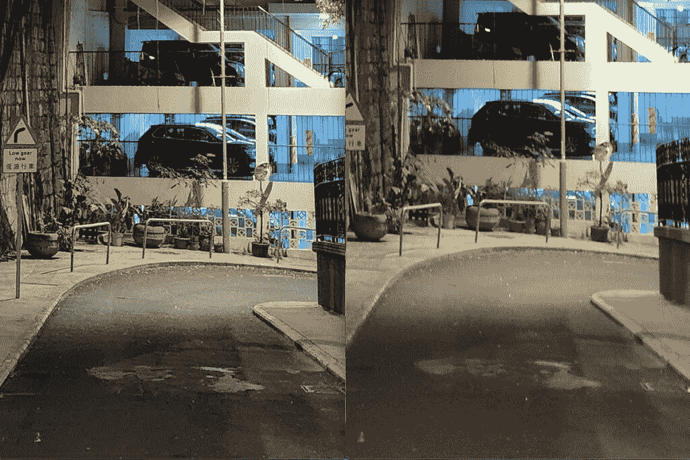
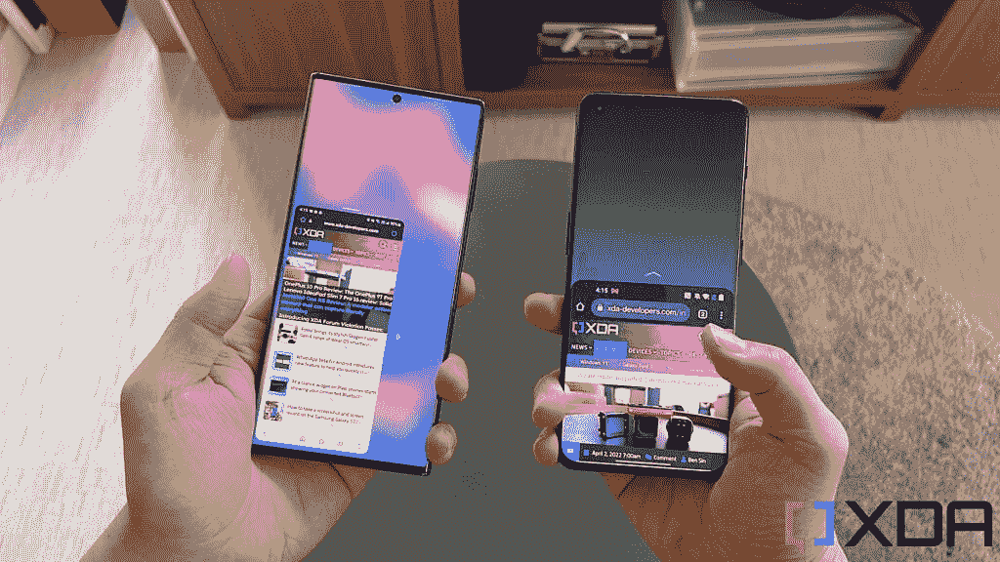
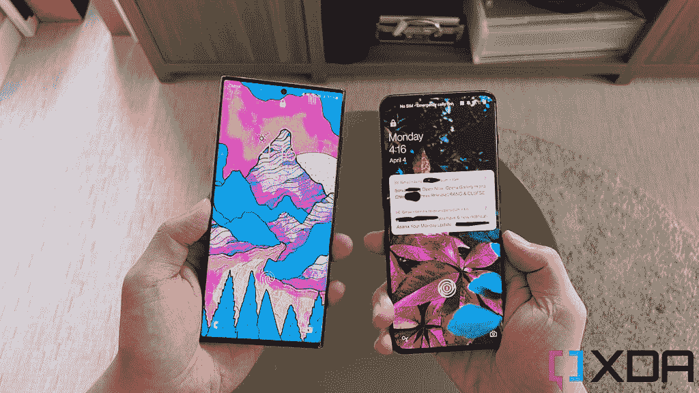

# 三星 Galaxy S22 Ultra vs 一加 10 Pro:最好的三星对最好的一加！

> 原文：<https://www.xda-developers.com/samsung-galaxy-s22-ultra-vs-oneplus-10-pro/>

在两个多月前在中国发布后，[一加 10 Pro](https://www.xda-developers.com/oneplus-10-pro-review/) 终于登上了全球舞台，它处于一个有趣的位置。虽然在亚洲甚至欧洲的大部分地区，一加 10 Pro 已经被认为是进入已经拥挤的 2022 年安卓旗舰场景的迟到者，但在北美，它只是今年第二次主要的安卓发布——这意味着在这个特定的市场，一加 10 Pro 自然会被与老大,[三星 Galaxy S22 Ultra](https://www.xda-developers.com/samsung-galaxy-s22-ultra-review/) 相比较。

 <picture></picture> 

Samsung Galaxy S22 Ultra

三星 Galaxy S22 Ultra 是目前的阿尔法狗安卓手机，提供了所有东西的大部分。

 <picture></picture> 

OnePlus 10 Pro

##### 一加 10 专业版

一加的最新旗舰产品带回了该公司灵活的软件和哈苏品牌的相机。它也比 Galaxy S22 Ultra 便宜一点，同时提供可比的显示器、SoC 和主相机性能。

## 三星 Galaxy S22 Ultra vs 一加 10 Pro:规格

| 

规范

 | 

三星 Galaxy S22 Ultra

 | 

一加 10 专业版

 |
| --- | --- | --- |
| **打造** | 

*   铝制中框
*   大猩猩玻璃 Victus 回
*   大猩猩玻璃 Victus 正面

 | 

*   铝制中框
*   大猩猩玻璃 5 背面
*   大猩猩玻璃 Victus 正面

 |
| **尺寸&重量** | 

*   163.3 x 77.9 x 8.9mm 毫米
*   229 克

 | 

*   163 x 73.9 x 8.55 毫米
*   201g

 |
| **显示** | 

*   6.8 英寸动态 AMOLED 2X 曲面显示屏
*   可变刷新率高达 1Hz 至 120Hz

 | 

*   6.7 英寸 QHD+120 赫兹流体 AMOLED
*   1Hz 至 120Hz 之间的可变刷新率

 |
| **SoC** | 

*   **国际:** Exynos 2200
*   **美国、中国、印度等:**高通骁龙 8 Gen 1

 | 

*   高通骁龙 8 代 1

 |
| **闸板&存放** | 

*   8GB/12GB 内存
*   128GB/256GB/512GB/1TB

 |  |
| **电池&充电** | 

*   5000 毫安时
*   45W USB 供电 3.0 快充
*   15W 无线充电
*   4.5 反向无线充电
*   大多数地区包装盒中没有充电器

 | 

*   5000 毫安时
*   65W 有线快速充电(北美)
*   80W 有线快速充电(北美以外的任何地方)
*   50W 无线充电
*   包装盒中包含充电器

 |
| **安全** | 超声波显示指纹扫描仪 | 光学显示指纹扫描仪 |
| **后置摄像头** | 

*   **主要:**108 兆像素宽，f/1.8，1/1.33 英寸，OIS，激光自动对焦
*   **二级:** 12MP 超宽，f/2.2
*   **第三:** 10MP 长焦，3 倍光学变焦，f/2.4
*   **四进制:** 10MP，潜望镜，10x 光学变焦，f/4.9

 | 

*   **主要:** 48MP 宽，f/1.8，1/1.33”，OIS
*   **二级:** 50MP 超宽，f/2.2
*   **第三:** 8MP 长焦，3.3 倍光学变焦

 |
| **前置摄像头** | 40MP | 32MP |
| **端口** | USB-C | USB-C |
| **音频** | 立体声扬声器 | 立体声扬声器 |
| **连通性** | 

*   5G(毫米波)
*   支持 2x2 MIMO 的 Wi-Fi 6 (802.11ax)
*   蓝牙 5.2
*   国家足球联盟

 | 

*   5G(毫米波)适用于除美国美国电话电报公司以外的几乎所有地区和运营商
*   支持 2x2 MIMO 的 Wi-Fi 6 (802.11ax)
*   蓝牙 5.2
*   国家足球联盟

 |
| **软件** | Android 12 之上的一个 UI 4.1 | 

*   中国:基于 Android 12 的 ColorOS 12.1
*   全球: [OxygenOS](https://www.xda-developers.com/tag/oxygenos/) 12.1 基于 Android 12

 |
| **其他功能** | 

*   韩国和美国的单一实体 SIM 卡；大多数其他地区的双物理 SIM 卡
*   包括钢笔

 | 

*   双物理 SIM
*   警报滑块

 |

***关于这个对比:**三星香港在 2 月份给我发了一台 Galaxy S22 Ultra 进行评测，一加美国在 3 月下旬给我发了一台一加 10 Pro 进行测试。两家公司都没有参与这篇文章。*

* * *

## 三星 Galaxy S22 Ultra vs 一加 10 Pro:硬件和设计

三星 Galaxy S22 Ultra 和一加 10 Pro 都是玻璃铝夹层板，配有漂亮的有机发光二极管显示屏。Galaxy S22 Ultra 的屏幕为 6.8 英寸，具有尖角，比一加 10 Pro 的 6.7 英寸更大，具有更传统的圆角，在我看来，这使得后者的手机握起来更舒适一些(一加 10 Pro 的重量略轻也有所帮助)。三星的屏幕变得更亮了一点，但只有当你在强烈的阳光下需要将亮度提高到最大时，你才会真正注意到这一点。在大多数情况下，我认为一加 10 Pro 屏幕看起来和 Galaxy S22 Ultra 面板一样好:它们都是 LTPO 2.0 有机发光二极管显示器，分辨率为 WQHD+分辨率，刷新率可以在 1Hz 到 120Hz 之间变化，被几乎不存在的边框包裹，只有一个小孔(Galaxy S22 Ultra 的中间顶部；左上角为一加 10 专业版)。这两个都非常好，除非你把它们放在一起，否则你可能不会注意到质量上的任何差异。

这两款手机的背板都不会吸附指纹；虽然 Galaxy S22 Ultra 通过粗糙的哑光表面实现了这一点，但一加 10 Pro 拥有这种具有柔软触感的磨砂涂层，尽管它具有粒状微观纹理外观。就我个人而言，我并不是后者涂层的超级粉丝，这一点在 Vivo X70 Pro Plus 上也看到过。但这取决于用户——我听到另一位评测者称一加 10 Pro 是他接触过的最好的背部感觉。

相机模块的设计有些讽刺。三星在去年的 Galaxy S21 系列中推出了这种独特的设计，其中摄像头模块的一侧融入了铝制机箱。三星在 Galaxy S22 手机的非 Ultra 版本中恢复了这一设计，但不是本文中介绍的 Ultra。相反，Galaxy S22 Ultra 根本没有摄像头岛，因为镜头直接从手机背面伸出来，形成一个个迷你岛。与此同时，一加 10 Pro 为自己“借用”了 Galaxy S21 相机模块——一加 10 Pro 相当大的相机模块有一侧弯曲到铝制机箱中。

两款手机都配有 5000 毫安时的电池和 8GB 或 12GB 的内存，但三星还必须在 Galaxy S22 Ultra 中安装一个 S-Pen，所以这是一款略宽的手机——同样，一加 10 Pro 对我来说握起来更舒适。

大脑是这两款手机开始偏离方向的地方:一加 10 Pro 到处都运行高通骁龙 8 Gen 1；但 Galaxy S22 Ultra 仅在北美、中国和印度使用该芯片。可能还有其他例外，但在大多数情况下，在世界其他地方，Galaxy S22 Ultra 由 Exynos 2200 驱动，这种芯片不如骁龙 8 Gen 1，正如我们在骁龙与 Exynos 测试中发现的那样。

### 额外硬件

Galaxy S22 Ultra 带来了一个非常重要的额外硬件:T2 S-Pen 手写笔 T3。手写笔不仅可以更容易地涂鸦(比如在手机屏幕上签署数字文档)，还可以更精确地编辑照片/视频，而且它还可以兼作手机的遥控器。例如，我可以用 S-Pen 远程控制相机的快门按钮。

老实说，尽管上述情况很好，但对大多数人来说，它们仍然是小众案例。基本上，当我测试 S-Pen 手机的时候，我总是把 S-Pen 看作是一个*的巨大奖励。但是当我把我的 SIM 卡换到另一部手机上时，我就再也不会错过它了。*

一加 10 Pro 的一个额外硬件功能是 Android 独有的——提醒滑块。这是一个物理开关，允许用户在静音、振动或正常模式之间快速切换。当我使用一加时，这也是一个很好的特性，但当我使用像素时，我一点也不会错过它。

不过，如果我们必须判断这些额外硬件的用处，我认为 S-Pen 是一个相当大的赠品，比 alert slider 有更多的上升空间和使用案例。警报滑块非常方便，但是您也可以在软件中获得相同的结果。

* * *

## 三星 Galaxy S22 Ultra vs 一加 10 Pro:相机

2022 年似乎是相机硬件升级的一年，因为这里的两个设备都带回了和去年基本相同的相机硬件，所以他们主要依靠软件改进。事实上，Galaxy S22 Ultra 的相机硬件与 Galaxy S21 Ultra 完全相同。因此，我们谈论的是一个 108 兆像素的主摄像机，带有 1/1.33 英寸的图像传感器；12MP 超宽；和一对覆盖 3 倍和 10 倍光学变焦范围的变焦镜头，后者是潜望镜照相机。

一加 10 亲带回同样的 48MP，1/1.43 英寸的主相机传感器和 8MP 3.3x 倍远摄变焦镜头从一加 9 亲，但一加 10 亲的超宽是一个新的超级副本宽 150 度镜头，可能在技术上不如 IMX766 传感器使用在一加 9 亲，因为它有一个较小的图像传感器的大小。

三星的软件改进主要来自内部技术，比如自适应像素，每次按下快门按钮，Galaxy S22 Ultra 就会拍摄 108 兆像素和 12 兆像素。两个镜头然后被组合成一个图像，该图像结合了两个镜头中最好的一个(108MP 具有更好的清晰度；12MP 拍摄捕捉更多光线)。

与此同时，一加 10 Pro 为其与瑞典相机制造商哈塞尔布莱德合作的第二年做广告。据一加称，在一加 10 Pro 的整个开发周期中，其 R&D 团队每月都会与哈塞尔布莱德的同行会面一次，以“自然颜色”为重点对相机的算法进行微调。

### 主摄像机

在我偷窥并开始吹毛求疵之前，我只想说这两款手机的主摄像头都非常好。智能手机摄像头在过去几年里进步了很多，我认为我们(包括我自己)已经开始把它们视为理所当然。现在，每部旗舰手机都可以在任何情况下捕捉到 HDR 的精彩镜头。如果你离一个物体足够近，甚至有一些很好的天然屏障将它和背景隔开-你只需要指向并点击快门，你就可以得到一个有用的镜头。这甚至与四年前大不相同，当时逆光拍摄的照片可以看到完全被吹掉的高光或过度暗的阴影等。看看下面的样本，我们可以看到一加图像通常更温暖、更亮一点，但更亮并不总是更好。对比和阴影可以让照片看起来很醒目，就像摩托车行驶在半被阴影覆盖的路上的照片。我们还可以看到，三星的镜头一直都很酷。

就像我说的，一加的主摄像机会吸引更多的光线。值得一提的是，这两款相机的拍摄速度都降至 12 兆像素，但三星采用了一种名为自适应像素(Adaptive Pixel)的新技术，每次拍摄 108 兆像素和 12 兆像素。这项技术的意义在于让 Galaxy S22 Ultra 获得 108MP 拍摄(更多细节)和 12MP 拍摄(更好的照明)的双重优势。

自适应像素似乎有点碰运气。如果我放大和像素窥视，我可以在 Galaxy S22 Ultra 的镜头中看到出众的清晰度和细节，但并不总是如此。例如，下面一组放大的 100%裁剪，显然是 Galaxy S22 Ultra 的优势。

 <picture></picture> 

100% crops, Galaxy S22 Ultra (left) and OnePlus 10 Pro (right).

但在下一组中，放大 100%显示了细节方面的均匀匹配。除了三星的镜头更酷之外，这两张照片的质量非常接近。

 <picture></picture> 

100% crops, Galaxy S22 Ultra (left) and OnePlus 10 Pro (right).

下面是更多的样张，我觉得说到主摄像头，两个摄像头都是不分上下，归结到个人喜好(而对我来说，我觉得 [Vivo X70 Pro Plus 和 Google Pixel 6 Pro'](https://www.xda-developers.com/google-pixel-6-pro-vs-vivo-x70-pro-plus-camera-shootout-comparison/) s 主摄像头还是最好的两个)。

### 辅助摄像机-超宽和变焦镜头

Galaxy S22 Ultra 和一加 10 Pro 在保持三个主要焦距范围(超宽、广角、长焦)的色温一致方面都做得不错，我注意到三星的相机应用程序现在可以从超宽切换到广角，反之亦然，没有像去年那样出现四分之一秒的停顿。几年来，这种无缝镜头切换一直是一加相机应用的优势。

分解超宽相机与主相机类似:一加 10 Pro 的超宽相机一贯产生更明亮的图像，但如果我们放大，一加的照片也明显比三星的更柔和。虽然对于超广角镜头来说这是可以原谅的，因为没有人拍摄超广角镜头是为了放大，但你主要是为了缩小。

一加 10 Pro 的超宽还有一个额外的技巧——它可以在 150 度的全视野范围内拍摄(默认情况下，它的上限约为 120 度)。拍摄如此宽的范围会导致严重的鱼眼失真，我基本上看不出有这个必要——但我想，在极少数情况下，你需要在一个镜头中捕捉一个大范围的场景。

对于变焦镜头，一加 10 Pro 的 3.3 倍长焦在保留细节方面与 Galaxy S22 Ultra 的 3 倍变焦保持得非常好，但 Galaxy S22 Ultra 的额外 10 倍潜望镜变焦镜头使其具有主要优势。你会注意到下面三星的样品有明显更蓝的天空——这是三星在照片中添加了一些打孔的自由——这是一个阴天，所以一加的照片对场景更准确。

这两个长焦镜头也用于人像，我认为两者都做得很好。

### 自拍

Galaxy S22 Ultra 的 40MP 自拍相机似乎比一加 10 Pro 的 32MP 前置相机曝光更好，但三星的自拍也应用了沉重的不自然皮肤平滑滤镜，无法关闭。

### 录像

视频性能是有趣的，因为两个手机交换颜色科学哲学。与 Galaxy S22 Ultra 相比，一加 10 Pro 在静态照片中保留了更多的自然色彩，而在视频中，一加 10 Pro 则增加了活力。看看下面手机拍摄的视频截图就知道了。

请注意，一加 10 Pro 的视频也比 Galaxy S22 Ultra 的视频吸收了更多的光线，以至于三星的视频中阴影看起来总是明显更暗。然而，尽管这两款手机都具有出色的视频稳定性，但 Galaxy S22 Ultra 的微抖动较少，略胜一筹。我也更喜欢 Galaxy S22 Ultra 的音响。一加 10 Pro 的视频功能非常好，甚至是几年前的一项重大改进。但 Galaxy S22 Ultra 是目前安卓系统中最好的视频手机，非常接近视频王 iPhone 13 Pro。

### 整体相机评估

虽然一加 10 Pro 的相机全面稳定——我特别喜欢一加 10 Pro 的主相机产生的颜色——但 Galaxy S22 Ultra 的相机在各方面都稍好一些。如果你像素偷窥，你通常会获得更好的清晰度和细节，你会获得出色的视频稳定性，任何超过 10 倍的变焦都将有利于三星。然而，在非常暗的场景下，一加 10 Pro 的主摄像头通常可以接受更多的光线，因为需要填充的像素较少，与三星相比，我更喜欢一加的相机应用程序。一加 10 Pro 的相机系统很棒，但三星 Galaxy S22 Ultra 的相机系统仍然是最通用和全面的。

* * *

## 三星 Galaxy S22 Ultra vs 一加 10 Pro:软件

这两款手机都运行 Android 12，顶部是两家公司各自的 Android 皮肤。我个人认为一加的 OxygenOS 皮肤在视觉上比三星的 One UI 更有吸引力，动画明显更流畅(或更华丽)，应用程序图标和字体也更好看。但是现在有一个 UI 功能更加丰富，更加完美。

OxygenOS 有很多自己的身份，现在基本上是 ColorOS 的一个分支

这与几年前我会说的完全相反，当时我绝对崇拜 OxygenOS，并且更喜欢它而不是三星的 Android。但是正如许多人所报道的，包括我的同事 Adam Conway 在他的一加 10 Pro 评论中所提到的，我们在本文开始时已经链接到，OxygenOS 已经失去了它的身份，现在本质上是 ColorOS 的一个分支。这通常不是一件坏事——因为我非常喜欢 ColorOS——但是这个 OxygenOS 版本有一些怪癖。也许 ColorOS/OxygenOS 合并计划的宣布和随后的取消让一加团队没有足够的时间来优化软件？

例如，一加货架是一个专用于小工具的屏幕，以前它是主屏幕的一部分，你只需滑动到主屏幕上，现在可以通过从屏幕右上角向下滑动来触发，类似于 iOS 的控制中心。然而，正如我的同事亚当注意到的那样，一加书架不会作为用户界面覆盖图打开，而是作为一个独立的应用程序打开。因此，即使您以与关闭通知面板相同的方式触发它，当您关闭工具架时，它也会像应用程序一样关闭，其动画会从屏幕底部弹出。你也可以在多任务视图中短暂显示工具架(在应用程序消失之前的一瞬间)。

此外，OxygenOS 不能在浮动窗口中打开应用程序——分屏多任务是同时运行多个应用程序的唯一方式。我知道在浮动窗口中打开应用程序不是 Android 的固有功能，相反，这是亚洲 Android 品牌在其用户界面中内置的功能。但我真的很喜欢这个功能，因为它让多任务处理变得更容易。令人困惑的是 OxygenOS 没有这个功能，尽管 ColorOS 有这个功能。是的，三星的 OneUI 也可以做到这一点。

OxygenOS 确实有史以来第一次获得了单手模式，但它是官方的 Google/Pixel 版本(这意味着它是 iOS“可达性”的翻版)。我更喜欢三星的单手模式，屏幕纵向和横向都缩小。

 <picture></picture> 

One-hand mode on One UI (left) and OxygenOS (right).

我对这个新的 OxygenOS 的另一个抱怨是，它不再试图让用户界面更容易单手使用。以前的 OxygenOS 会在屏幕的下三分之一处显示 PIN 码数字键盘和应用程序文件夹图标，以便于拇指触及。这不再是了，因为 OxygenOS 和许多其他手机一样，在屏幕中央显示信息，这可能使手较小的人很难够到。尤其是 PIN 码数字键盘的位置高得令人尴尬，令人恼火。这是 iPhone 13 Pro Max 难以企及的水平。在这种情况下，用户界面可以围绕指纹传感器进行优化。

这并不是说我对三星的 One UI 没有挑剔。我不喜欢三星的相机应用程序停留在上次拍摄模式，而不是在我上次使用相机几个小时后返回到默认模式。这意味着我会经常打开 Galaxy S22 Ultra 应用程序，希望快速拍照，只是为了看到相机应用程序处于视频或人像模式，因为我大约四个小时前使用过它。我还觉得三星的锁屏很烦人，因为它不会在屏幕上显示通知，除非我点击通知图标。再加上我不得不点击屏幕，这意味着我需要点击两到三次来阅读通知。

 <picture></picture> 

One UI lockscreen (left) and OxygenOS lockscreen (right).

但尽管如此，One UI 没有像书架那样的怪异之处，总体来说使用起来更可靠，并且有三星 DeX，这是一个非常有用的功能，我觉得它给了手机额外的价值，因为如果你需要，你可以把它用作台式电脑。

Galaxy S22 Ultra 比一加 10 Pro 多了一个胜利:三星承诺其 OneUI 版本的安卓系统将提供四年的更新，而一加只提供三年。这取决于你想把手机放在身边多长时间。虽然产品周期后期的更新会晚一些到来，但它们肯定会到来。因此，如果你计划使用你的手机四年，选择更好的产品是有意义的。三星每月的安全更新也表现得更好。

## Galaxy S22 Ultra vs 一加 10 Pro:整体性能

### 基准

尽管我的港版 Galaxy S22 Ultra 和一加 10 Pro 都运行高通的骁龙 8 Gen 1，但 Galaxy S22 Ultra 的能力略强，因为一加显然抑制了骁龙 8 Gen 1 的性能(或许是为了防止它变得太热，就像它在[小米 12 Pro](https://www.xda-developers.com/xiaomi-12-pro-review/) 上做的那样？).我们可以看到，在 Geekbench 和 PC Mark 中，我的 Galaxy S22 Ultra 的得分高于一加 10 Pro，这也是我的同事亚当的发现。他做了更深入的基准测试，包括应用程序启动速度和持续性能，发现一加 10 Pro 的性能虽然在真空中仍然非常好，但总体上比其他骁龙 8 代 1 设备更弱。

请记住，这些都是 Galaxy S22 Ultra 在基准测试中的小胜利。在现实世界的表演中，我几乎看不出区别。诚然，我不是一个重度手机游戏玩家，但大多数普通消费者也不是。从各方面来看，一加 10 Pro 仍然像一部旗舰手机。

### 电池寿命和充电

两款手机都有 5000 毫安时的电池，可以零问题地度过一个普通的工作日。在使用量较大的日子里，比如周日，当我倾向于在回家前出去 12-13 个小时时，如果我很努力地工作(对我来说就是不停地拍照和视频、社交媒体和 Spotify 流媒体)，这两款手机都会很难完成所说的 13 个小时。我会说电池寿命可以被认为是强大的，因为就在 2019 年或 2020 年，我会说除了华为之外，很少有手机可以正常地持续我一天整整 13 个小时。

一加 10 Pro 的充电速度是 Galaxy S22 Ultra 的两倍

充电是一加非常明显的优势:一加 10 Pro 不仅充电速度快得多(北美为 65 瓦，其他地方为 80 瓦——尽管两者之间没有实际差异)，充电砖也包含在包装中。Galaxy S22 Ultra 的最高功率为 45W，而且盒子里没有砖块。根据我的测试，我的美国型号一加 10 Pro 使用 65W 的电池在 31 分钟多一点的时间内从 0 充电到 100%。我没有专门为我的 Galaxy S22 Ultra 准备的 45W 电池，但我的同事有，并报告说需要大约一个小时才能将 Galaxy S22 Ultra 从 0 充满到 100%。使用 25W 的电池，你仍然可以在 Galaxy S22 Ultra 上获得相同的数字，这表明 25W 以上的充电也没有实际好处。基本上，无论你如何切割，一加 10 Pro 的充电速度是 Galaxy S22 Ultra 的两倍。

对于那些想知道的人来说，北美型号的一加 10 Pro 充电速度的差异是由于充电技术在美国特定的电压。这并不重要，因为用 65W 和 80W 的电池充电只有几分钟的区别。至于 Galaxy S22 Ultra 的 25W 与 45W，情况是一样的-只有几分钟的差异，你可以忽略不计-无论如何都很慢。

### 扬声器和触觉

两款手机都有立体声扬声器，但 Galaxy S22 Ultra 的扬声器听起来更饱满一些。至于触觉，两款手机都带来了手感极佳的优质触觉。我很难在这里选出一个赢家。

* * *

## 三星 Galaxy S22 Ultra vs 一加 10 Pro:买哪款旗舰？

虽然我喜欢一加 10 Pro 的显示屏、用户界面美学、外观和主摄像头，但最终三星 Galaxy S22 Ultra 是一款更强大的设备，具有更好的变焦系统、略好的视频功能，以及三星 DeX 和 S-Pen 等附加功能。然而，1100 美元的 Galaxy S22 Ultra 比 899 美元的一加 10 Pro 贵 200 美元。Galaxy S22 Ultra 有一些交易会降低价格，使手机更有利可图，但最终，一加 10 Pro 是更实惠的手机。

在欧洲，一加 10 Pro 还有另一个优势，因为它是目前该地区为数不多的骁龙 8 代 1 手机之一，因为 Galaxy S22 Ultra 采用了 Exynos 2200。如果你不在乎 S-Pen 或 10 倍变焦，一加 10 Pro 是一个伟大的选择，可以节省数百欧元，同时还能获得旗舰性能。对于欧洲，我们会推荐一加 10 Pro 而不是三星 Galaxy S22 Ultra，因为 Exynos 2200 中了彩票。

在世界其他地方，骁龙对骁龙，三星 Galaxy S22 Ultra 保持了其超过一加 10 Pro 的领先地位。

 <picture></picture> 

Samsung Galaxy S22 Ultra

三星 Galaxy S22 Ultra 是目前的阿尔法狗安卓手机，提供了所有东西的大部分。

 <picture></picture> 

OnePlus 10 Pro

##### 一加 10 专业版

一加的最新旗舰产品带回了该公司灵活的软件和哈苏品牌的相机。它也比 Galaxy S22 Ultra 便宜一点，同时提供可比的显示器、SoC 和主相机性能。