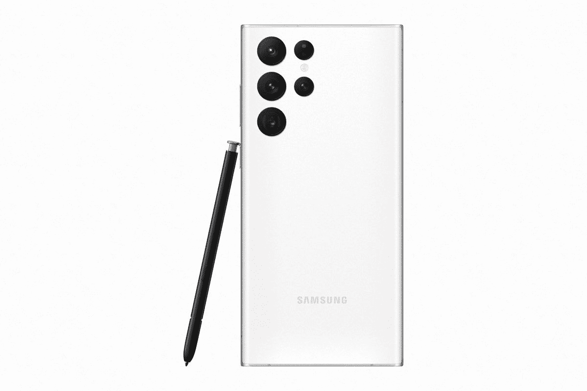
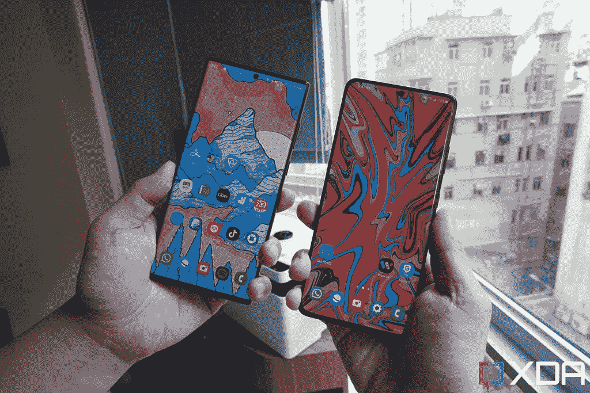

# 三星 Galaxy S22 Ultra vs Galaxy S21 Ultra:有什么区别？该不该升级？

> 原文：<https://www.xda-developers.com/samsung-galaxy-s22-ultra-vs-samsung-galaxy-s21-ultra/>

三星的 [Galaxy S22 Ultra](https://www.xda-developers.com/samsung-galaxy-s22-ultra-review/) 乍一看似乎是 Galaxy S21 Ultra 的重大升级。毕竟，它带来了一种全新的设计，采用了以前在 S 系列中从未见过的新硬件组件:内置 S Pen。但如果你忽略今年型号的 S Pen 和更硬/更尖的边角，Galaxy S22 Ultra 实际上是 Galaxy S21 Ultra 的迭代更新，提供了非常相似的用户体验。事实上，相机硬件与去年相比基本没有变化。见鬼，有人可能会说 Galaxy S 系列在前两年取得了更大的飞跃 Galaxy S20 Ultra 超过了 S10 Plus 然后银河 S21 超在 S20 超之上。

但这并不意味着 Galaxy S21 Ultra 的用户可以得出没有理由升级的结论。三星已经做出了微妙的改进，这些改进加在一起比其部件的总和还要多。另外，如果你真的关心 S Pen，这将是一个立竿见影的优势。

 <picture></picture> 

Samsung Galaxy S22 Ultra

Galaxy S22 Ultra 是目前 Android 领域中最好的，拥有最好的屏幕，最好的变焦摄像头，还有一支 S Pen！

 <picture></picture> 

Galaxy S21 Ultra

Galaxy S21 Ultra 可能已经一岁了，但它在 2022 年仍然保持得非常好，提供了许多与 Galaxy S22 Ultra 相同的东西！

## 三星 Galaxy S22 Ultra 与 Galaxy S21 Ultra:规格

| 

规范

 | 

三星 Galaxy S22 Ultra

 | 

三星 Galaxy S21 Ultra

 |
| --- | --- | --- |
| **建造** | 

*   铝制中框
*   大猩猩玻璃 Victus 回
*   大猩猩玻璃 Victus 正面

 | 

*   铝制中框
*   大猩猩玻璃 Victus 回
*   大猩猩玻璃 Victus 正面

 |
| **尺寸&重量** | 

*   163.3 x 77.9 x 8.9mm 毫米
*   229 克

 | 

*   165.1 x 75.6 x 8.9mm 毫米
*   227 克

 |
| **显示** | 

*   6.8 英寸动态 AMOLED 2X 曲面显示屏
*   可变刷新率高达 1Hz 至 120Hz

 | 

*   6.8 英寸动态 AMOLED 2X 曲面显示屏
*   10Hz 至 120Hz 之间的可变刷新率

 |
| **SoC** | 

*   **国际:** Exynos 2200
*   **美国、中国、印度等:**高通骁龙 8 Gen 1

 | 

*   **国际:** Exynos 2100
*   **美国和中国:**高通骁龙 888:

 |
| **闸板&存放** | 

*   8GB/12GB 内存
*   128GB/256GB/512GB/1TB

 | 

*   12GB/16GB 内存
*   128GB/256GB/512GB

 |
| **电池&充电** | 

*   5000 毫安时
*   45W USB 供电 3.0 快充
*   15W 无线充电
*   4.5 反向无线充电
*   大多数地区包装盒中没有充电器

 | 

*   5000 毫安时
*   25W USB 供电 3.0 快充
*   15W 无线充电
*   4.5 反向无线充电
*   大多数地区包装盒中没有充电器

 |
| **安全** | 超声波显示指纹扫描仪 | 超声波显示指纹扫描仪 |
| **后置摄像头** | 

*   **主要:**108 兆像素宽，f/1.8，1/1.33 英寸，OIS，激光自动对焦
*   **二级:** 12MP 超宽，f/2.2
*   **第三:** 10MP 长焦，3 倍光学变焦，f/2.4
*   四进制: 10MP，潜望镜，10x 光学变焦，f/4.9

 | 

*   **主:** 108MP 宽，f/1.8，1/1.33”，OIS，激光自动对焦
*   **中学:** 12MP 超宽，f/2.2
*   **第三:** 10MP 长焦，3 倍光学变焦，f/2.4
*   **四进制:** 10MP，潜望镜，10x 光学变焦，f/4.9

 |
| **前置摄像头** | 40MP | 40MP |
| **端口** | USB-C | USB-C |
| **音频** | 立体声扬声器 | 立体声扬声器 |
| **连通性** | 

*   5G(毫米波)
*   支持 2x2 MIMO 的 Wi-Fi 6 (802.11ax)
*   蓝牙 5.2
*   国家足球联盟

 | 

*   5G(毫米波)
*   Wi-Fi 6E (802.11ax)
*   蓝牙 5.1
*   国家足球联盟

 |
| **软件** | Android 12 之上的一个 UI 4.1 | Android 11 之上的一个 UI 3.1 |
| **其他特征** | 

*   韩国和美国的单一实体 SIM 卡；大多数其他地区的双物理 SIM 卡
*   包括钢笔

 | 韩国和美国的单一实体 SIM 卡；大多数其他地区的双物理 SIM 卡 |

* * *

## 三星 Galaxy S22 Ultra vs Galaxy S21 Ultra:硬件和设计

### 一部手机拿起来比另一部更舒服

我知道我不是唯一有这种感觉的人，但我一直认为最近几部 Galaxy Note 手机的四四方方的设计语言看起来很棒(在我看来，坚硬的边角唤起了权威的感觉)。但实际上拿在手里感觉并不好。Galaxy S22 Ultra 也是如此，因为它实际上只是一个更名的 Galaxy Note。我喜欢 Galaxy S22 Ultra 在产品照片中的样子，当它直立在桌子上时，以一种令人生畏的威胁高耸在一切之上，就像《2001:太空漫游》中的巨石一样。但是在握着实物的几分钟内，我开始感觉到坚硬的角落不断戳我的手掌。

Galaxy S21 Ultra 则没有这些问题。它更圆、更有曲线，以一种更柔软、更温柔的方式依偎在我的掌心。从技术上讲，这两款手机的屏幕尺寸相同，但 Galaxy S22 Ultra 的屏幕更大一些，因为它的边角是有角度的，不像 Galaxy S21 Ultra 的圆角。Galaxy S22 Ultra 显示屏周围的挡板也更薄一些。即使拿在手里感觉没有那么好，Galaxy S22 Ultra 的正面在我看来还是好看一点的。

### 漂亮，充满活力的有机发光二极管面板，但其中一个电池效率更高

Galaxy S21 Ultra 的显示屏在去年发布时是业内最好的，即使是现在，屏幕也和迄今为止任何 2022 年的旗舰屏幕一样好。不过，如果我们吹毛求疵的话，那么 Galaxy S22 Ultra 的显示屏就有点出众了。后者的屏幕变得更亮，最大亮度为 1，750 尼特，而 Galaxy S21 Ultra 的最大亮度为 1，500 尼特(尽管由于各种原因，这种差异实际上并不明显，包括我们无法线性感知亮度)。虽然这两款手机的刷新率各不相同，最高可达 120Hz，但 Galaxy S21 Ultra 屏幕可降至 1Hz，而 Galaxy S21 Ultra 屏幕只能达到 10Hz。这最后一位很重要，因为它提高了功耗效率。

 <picture></picture> 

Galaxy S22 Ultra (left) and Galaxy S21 Ultra (right).

尽管两款手机都有相同的 5000 毫安时电池容量，但我发现 Galaxy S22 Ultra 的电池续航时间明显更长。这可能是由于新设备的 OLED 面板能够实现更低的刷新率，以及更新、更节能的 SoC 的结合。我在周末是一个非常频繁的用户，我往往会在外面呆 10-12 个小时，拍摄几十张照片和视频，并在乘坐公交车和社交媒体时不断播放音乐。Galaxy S22 Ultra 可以持续使用整整 12 个小时，回家时仍有 30-35%的电池。在同样的情况下，Galaxy S21 Ultra 将徘徊在接近 10%的危险水平。

我必须再次提醒你——我正在测试骁龙变种。我的同事亚当说，Exynos 版本的 Galaxy S22 Ultra 的电池寿命低于标准，还有其他差异。

### SoC 和性能

与 Galaxy S21 Ultra 的骁龙 888 或 Exynos 2100 相比，Galaxy S22 Ultra 显然运行在更新的处理器上，运行在高通骁龙 8 Gen 1 或 Exynos 2200 上。我只测试了这款设备的骁龙版本(幸运的是，根据我的同事亚当·康威的测试， [Exynos Galaxy S22 Ultra 远不如](https://www.xda-developers.com/samsung-galaxy-s22-ultra-snapdragon-vs-exynos/))，老实说，新的 SoC 在日常使用中几乎看不到，唯一明显的区别可能是相机性能(稍后将详细介绍)。对于 99%的消费者来说，骁龙 888 的性能仍然绰绰有余。当然，基准数据有利于较新的芯片——这并不奇怪。

### 钢笔

这两款设备最大的区别在于 S Pen:Galaxy S22 Ultra 在手机中内置了一个 S Pen，而且是免费的。Galaxy S21 Ultra 可以支持一个，但它需要额外的费用，而且你必须使用一个特殊的外壳来存放它和手机。需要购买单独的 S 笔*和外壳*的额外努力和费用意味着大多数拥有 Galaxy S21 Ultra 的人只是按原样使用手机，没有 S 笔。

Galaxy S22 Ultra 上的 S Pen 体验是三星有史以来最好的手机手写笔体验

Galaxy S22 Ultra 上的 S Pen 体验是三星有史以来最好的手机手写笔体验:延迟已降至 2.8 毫秒(Galaxy S21 Ultra，如果你要为额外的 S Pen 付费，会产生 9 毫秒的延迟)，Galaxy Note 用户已经习惯的所有功能，如屏幕外备忘录，或将 S Pen 用作蓝牙遥控器，都在这里。这些特性是否会带来很多价值取决于个人。对我个人来说，过去每次我审查 Galaxy Note 手机时，我都会玩几天 S Pen，然后忘记它的存在。Galaxy S22 Ultra 并没有改变这一点。对我来说，S Pen 仍然是一个不错的奖励，但不是必需的。但那是我。有很多忠实的 Note 用户强烈反对我的观点，这没关系。如果你在那个阵营，你甚至不需要这篇文章——你可能已经购买了 Galaxy S22 Ultra。

但是，即使我很少使用 S Pen，它的存在，包括免费和不影响电池容量，都是很棒的。这基本上是一个免费的奖励-这自动增加了 Galaxy S22 Ultra 的价值主张。

### 几乎完全相同的相机硬件-但较新的 ISP 和卓越的软件智能有所不同

三星承诺对 Galaxy S22 Ultra 进行重大改进，这是一个大胆的说法，因为它带回了与 Galaxy S21 Ultra 几乎完全相同的相机硬件，只是具有明显更好的玻璃镜头。除此之外，Galaxy S22 Ultra 的主摄像头系统仍然由相同的四摄像头系统组成，覆盖宽、超宽、3 倍和 10 倍焦距范围，图像传感器尺寸和光圈也完全相同。

这意味着摄像头的改进完全来自骁龙 8 Gen 1 中的新 ISP 和三星自己的软件调整。在用两款手机并排拍了几十张照片后，我可以得出结论，Galaxy S22 Ultra 相机确实带来了明显的改进，但你必须知道从哪里看。如果你只是在有利的条件下拍照(你不是在逆光下拍摄，不是特别暗或对比强烈)，那么两部手机拍摄的照片是相同的。

Galaxy S22 Ultra 的优势在于，如果你在更恶劣的条件下拍照，比如 10 倍变焦拍摄。尽管两款手机都有相同的 10 倍变焦潜望镜相机硬件，但三星较新的软件处理和骁龙 8 Gen 1 的 ISP 能够恢复更多细节，并保持照明的一致性。在光线较暗的情况下，就像下面的第二组 10 倍样本，Galaxy S22 Ultra 的拍摄效果明显更清晰，噪点也更少。

这两款 Ultra 设备都可以以数字方式放大 100 倍，由于目前更多的是软件微调而不是硬件实力，Galaxy S22 Ultra 的高级软件也可以产生略好的图像。这张照片仍然太模糊或太嘈杂，无法上传到社交媒体，但它比 Galaxy S21 Ultra 的 100 倍变焦的印象派绘画氛围更上一层楼。“变焦锁定”功能使用人工智能锁定远处的对象，在 Galaxy S22 Ultra 上比在 Galaxy S21 Ultra 上效果更好。

Galaxy S22 Ultra 的主摄像头在弱光下的性能也更好，这是因为三星推出了一种新的软件技巧，“自适应像素”，它基本上可以让 Galaxy S22 Ultra 将 108MP 拍摄的数据和 12MP 拍摄的数据结合起来(而 Galaxy S21 Ultra 只能在 108MP 或 12MP 拍摄)。这使得 Galaxy S21 Ultra 通过软件欺骗实现了更大的微米像素尺寸。自己看下面的样张，很细微，但是 Galaxy S22 Ultra shot 噪点更少，色彩更准确。

* * *

## 三星 Galaxy S22 Ultra vs Galaxy S21 Ultra:软件

Galaxy S22 Ultra 在 Android 12 上提供了一个 UI 4.1，而我的 Galaxy S21 Ultra 仍然是在 Android 11 上的一个 UI 3.1(尽管 One UI 4 更新已经在其他地区推出)。两种设备的整体用户界面美学保持相似。应用程序图标、通知面板、设置面板看起来都差不多。“分享”菜单已经简化了一些。

所有新的 Android 12 功能都被带到了 Galaxy S22 Ultra，包括一个可定制的调色板，试图将手机的 UI 与壁纸颜色相匹配，以及每当手机的摄像头或麦克风被访问时，屏幕右上角会显示灯光指示器。

显然，使用新版本的 Android 更好，所以现在 Galaxy S22 Ultra 的软件更好，但 Galaxy S21 Ultra 在各个地区都有相同的更新，所以这两款手机应该有相同的 UI。随着 Galaxy S22 系列的推出，三星也升级了其更新承诺:现在你可以在两款设备上获得四代 Android 更新和 5 年的安全更新。然而，由于 Galaxy S22 Ultra 更新，并推出了更新的 Android 版本，它将在 Galaxy S21 Ultra 之后的另一年和一代中保持更新。

* * *

## 三星 Galaxy S22 Ultra vs Galaxy S21 Ultra:买哪个？

如果我们列出典型的智能手机评论框，Galaxy S22 Ultra 显然是更优秀的设备——更强大的 SoC，1TB 的存储选项，更长的电池寿命，略亮的屏幕，更好的弱光和变焦相机性能。但是，还有其他因素需要考虑，比如价格和手握舒适度。正如我在上面所说的，由于尖角，我不太喜欢 Galaxy S22 Ultra(或最近几部 Galaxy Note 手机)在我手中的感觉。不是每个人都会有这种感觉，如果你有一个 [Galaxy S22 Ultra case](https://www.xda-developers.com/best-samsung-galaxy-s22-ultra-cases/) ，那可能有助于解决这个问题。但对我来说，我一直更喜欢拿着 Galaxy S21 Ultra。

如果我们勾选典型的智能手机评论框，Galaxy S22 Ultra 显然是更优的设备，但还有其他因素需要考虑。

当然，Galaxy S21 Ultra 更便宜。目前，Galaxy S22 Ultra 的 128GB 存储零售价为 1200 美元，尽管你可以获得 8g 内存。虽然[有一些交易](https://www.xda-developers.com/best-samsung-galaxy-s22-deals/)可能会降低最终价格，但 Galaxy S22 Ultra 不可能不是这两款设备中价格更高的。与此同时，Galaxy S21 Ultra 目前可以在亚马逊上以同样的价格上市，但你只能获得 12GB 的内存。随着 Galaxy S22 Ultra 在更多国家推出，未来几周价格应该会下降更多。我想再过一个月，两者之间应该会有 300 美元的价格差距。

如果你不需要 S Pen，那么值得省钱，选择 Galaxy S21 Ultra 来代替。是的，我确实说过 Galaxy S22 Ultra 有更好的电池续航时间和更好的相机系统，但这些改进并没有从 a C 到 A，而是从 A+到 A++。Galaxy S21 Ultra 的电池寿命仍然足以持续一整天的重度使用，屏幕仍然会让你的眼睛绝对惊艳，照片仍然会非常好。为此，如果你已经有了 Galaxy S21 Ultra，就不需要升级到 Galaxy S22 Ultra。这里有一个地区警告:如果你生活在像印度这样的地区，印度现在正在使用骁龙版本的旗舰产品，这在两代人之间产生了明显的游戏性能差异——那么在更多的情况下，从 Galaxy S21 Ultra 升级到 Galaxy S22 Ultra 可能是有意义的。

作为一个独立的比较，而不是逐年升级:如果你知道你想要最新和绝对最好的，钱不是问题，或者如果你真的想要 S Pen，那么 Galaxy S22 Ultra 是一个很容易的决定。

 <picture></picture> 

Samsung Galaxy S22 Ultra

Galaxy S22 Ultra 是目前 Android 领域中最好的，拥有最好的屏幕，最好的变焦摄像头，还有一支 S Pen！

 <picture></picture> 

Galaxy S21 Ultra

Galaxy S21 Ultra 可能已经一岁了，但它在 2022 年仍然保持得非常好，提供了许多与 S22 Ultra 相同的东西！