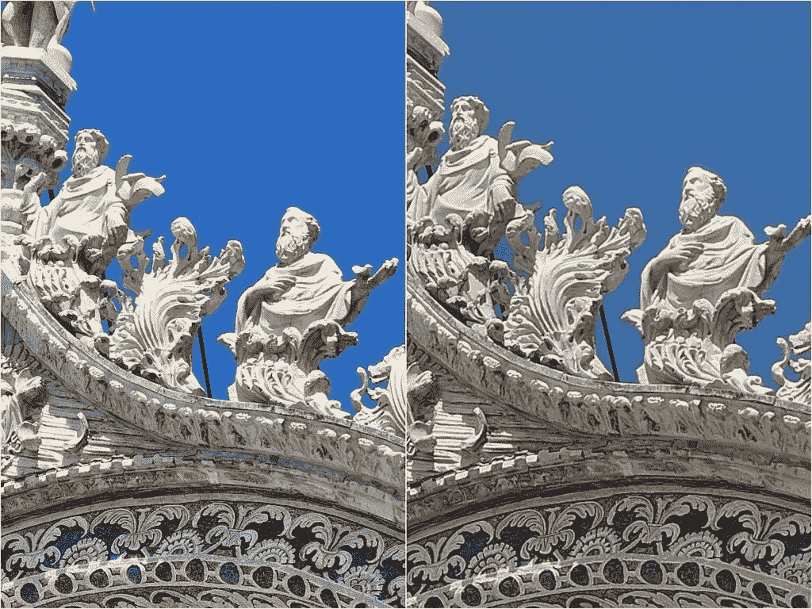
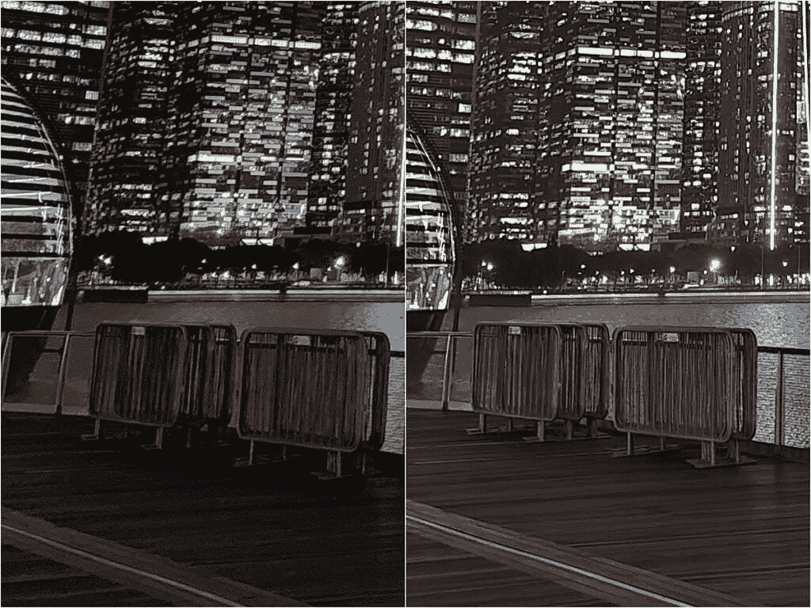
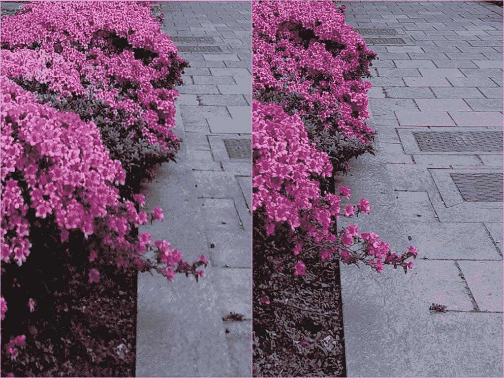

# 三星 Galaxy S22 Ultra vs Vivo X80 Pro:相机之王一决雌雄

> 原文：<https://www.xda-developers.com/samsung-galaxy-s22-ultra-vs-vivo-x80-pro/>

虽然 Vivo 在世界大部分地区仍处于雷达监控之下，但它开始因其令人难以置信的相机而引起手机粉丝的注意，该公司的最新产品 [Vivo X80 Pro](https://www.xda-developers.com/vivo-x80-pro-review/) 延续了这一强劲的相机记录。但是这款手机的其他部分表现如何，尤其是与 T4 的安卓旗舰手机 T5 和三星的 Galaxy S22 Ultra T7 相比？让我们在这篇全面审视智能手机体验的文章中找到答案。

 <picture></picture> 

Samsung Galaxy S22 Ultra

Galaxy S22 Ultra 是目前默认的 Android 手机之王，拥有最广泛的全球可用性和最完整的相机系统。

 <picture></picture> 

Vivo X80 Pro

##### Vivo X80 Pro

Vivo X80 Pro 是目前所有智能手机中我们投票选出的最佳主摄像头，其余部分也非常好。

## 三星 Galaxy S22 Ultra vs Vivo X80 Pro:规格

| 

规范

 | 

Vivo X80 Pro

 | 

三星 Galaxy S22 Ultra

 |
| --- | --- | --- |
| **打造** | 

*   铝制中框
*   大猩猩玻璃 Victus 回
*   大猩猩玻璃 Victus 正面

 | 

*   铝制中框
*   大猩猩玻璃 Victus 回
*   大猩猩玻璃 Victus 正面

 |
| **尺寸&重量** | 

*   164.6 x 75.3 x 9.1 毫米
*   219 克

 | 

*   163.3 x 77.9 x 8.9mm 毫米
*   229 克

 |
| **显示** | 

*   6.78 英寸 AMOLED
*   3200 x 1440 像素
*   可变刷新率高达 120Hz

 | 

*   6.8 英寸动态 AMOLED 2X 曲面显示屏
*   3088 x 1440 像素
*   可变刷新率高达 120Hz

 |
| **SoC** | 高通骁龙 8 代 | 

*   欧洲:Exynos 2200
*   **美国、中国、印度:**高通骁龙 8 代 1

 |
| **风筒&储存** |  | 

*   8GB/12GB 内存
*   128GB/256GB/512GB

 |
| **电池&充电** | 

*   4700 毫安时
*   80W 有线快速充电(充电器包含在包装盒中)
*   50W 无线充电

 | 

*   5000 毫安时
*   45W USB 供电 3.0 快充
*   15W 无线充电
*   4.5 反向无线充电
*   大多数地区包装盒中没有充电器

 |
| **安全** | 光学显示指纹读取器 | 超声波显示指纹扫描仪 |
| **后置摄像头** | 

*   **初级:** 50MP 宽，三星 GNV，f/1.57，1/1.31”，OIS
*   **次要:** 48MP 超宽，索尼 IMX 598，f/2.2，万向技术
*   **第三:** 12MP 长焦，索尼 IMX 663，f/1.6，2x 光学
*   **四元:** 8MP 潜望镜，f/3.4，5 倍光学变焦

 | 

*   **主要:**108 兆像素宽，f/1.8，1/1.33 英寸，OIS，激光自动对焦
*   **二级:** 12MP 超宽，f/2.2
*   **第三:** 10MP 长焦，3 倍光学变焦，f/2.4
*   **四元:** 10MP，潜望镜，10x 光学变焦，f/4.9

 |
| **前置摄像头** | 32MP | 40MP |
| **端口** | USB-C | USB-C |
| **音频** | 立体声扬声器 | 立体声扬声器 |
| **连通性** | 

*   5G(毫米波)
*   支持 2x2 MIMO 的 Wi-Fi 6 (802.11ax)
*   蓝牙 5.0
*   国家足球联盟

 | 

*   5G(毫米波)
*   Wi-Fi 6E (802.11ax)
*   蓝牙 5.1
*   国家足球联盟

 |
| **软件** | Android 12 之上的 FunTouch OS 12 | Android 12 之上的一个 UI 4.1 |
| **其他特色** | 双物理 SIM | 韩国和美国的单一实体 SIM 卡；大多数其他地区的双物理 SIM 卡 |

***关于本文:**这个对比是在测试了三星香港提供的一款三星 Galaxy S22 Ultra 和 Vivo Global 提供的 Vivo X80 Pro 之后写的。本文还包括 XDA 主编 Aamir Siddiqui 使用他的个人 Galaxy S22 Ultra 和 Vivo India 提供的 X80 Pro 提供的信息。Vivo India 还带着 Aamir 和其他印度媒体人以及 YouTubers 去迪拜参加了一个以手机为中心的沉浸式会议。Vivo 也围绕这款手机在 XDA 开展了一项活动，但这是由独立于编辑团队的赞助团队处理的。三星和 Vivo 在这篇文章中都没有任何投入。*

* * *

## 三星 Galaxy S22 Ultra vs Vivo X80 Pro:设计和硬件

Vivo X80 Pro 和 Galaxy S22 Ultra 的设计显然是该公司产品组合中以前设备的延续。对于 X80 Pro 来说，这种血统是显而易见的——除了圆形摄像头模块外，它看起来几乎与 Vivo X70 Pro Plus 相同。另一方面，Galaxy S22 Ultra 继承了三星已退役的 Galaxy Note 系列，有着四四方方的边角，S-Pen 插入了设备的底部左侧。

虽然两个屏幕在纸面上都是 6.8 英寸(这是对角测量的)，但 Galaxy S22 Ultra 的屏幕略大:它在水平方向上宽了几毫米，屏幕的边角进一步向外突出，因为它们到达了一个坚硬的点，而不是圆形的半径。就显示亮度而言，两个屏幕看起来都一样清晰有力，但 Galaxy S22 Ultra 更亮一些。我想强调的是，这不是 Vivo 显示器亮度不足的情况(比如说，谷歌 Pixel 6 Pro 的屏幕亮度平平)，而是 Galaxy S22 Ultra 在最大亮度方面超出了预期。在大多数情况下，如果你在阳光直射之外的任何地方使用手机，X80 Pro 屏幕绝对像 Galaxy S22 Ultra 一样令人印象深刻。

在屏幕下面是第一个偏差:手机使用高通的超声波指纹扫描仪，但 Vivo 使用更新更好的高通 3D Sonic Max 解决方案:它不仅解锁速度比旧版本快一拍，而且扫描面积也大得多，所以你可以更快地盲目解锁，还有其他软件技巧，如通过按下扫描仪的特定部分直接启动应用程序的选项，以及用两指锁锁定应用程序。

这款手机的背面都是由玻璃制成的，但 Vivo 在上面涂了这种柔滑的磨砂涂层——我并不喜欢这种涂层(我的手指感觉很滑)。我更喜欢 Galaxy S22 Ultra 的简单哑光 grippy 涂层。但 Vivo X80 Pro 握在手中比 Galaxy S22 Ultra 稍微舒服一点。

除此之外，其他传统智能手机组件都是类似的:我的两台机器都采用了相同的[骁龙 8 Gen 1](https://www.xda-developers.com/qualcomm-snapdragon-8-gen-1/) 芯片(不过，一些地区的 Galaxy S22 Ultra 采用了 Exynos 芯片)以及 12GB 内存。三星的手机可以选择更高的存储容量，最高可达 1TB，而 Vivo 至少在全球范围内只销售 256GB 的型号。两款手机都提供 IP68 防水和防尘性能，并支持无线充电。三星的电池更大，为 5000 毫安时，但 Vivo 的 4700 毫安时充电*快得多——*，还包括充电器。Galaxy S22 Ultra 拥有明显更好的触觉引擎和略显丰满/响亮的立体声扬声器。但是 X80 Pro 为那些觉得有用的人提供了一个红外发射器。

最大的硬件差异可能是触控笔 Galaxy S22 Ultra 有触控笔，但 X80 Pro 没有。对我个人来说，手写笔是一个不错的奖励，但我很少使用它，更重要的是，*在我评论另一部手机时从来不会错过它*。但是为了直接比较，额外的硬件特性就是额外的硬件特性。

额外的硬件功能就是额外的硬件功能，Galaxy S22 Ultra 就有 S Pen

这两款手机都装有非常棒的相机系统——我是个超级相机迷——所以我把相机放在了自己的位置。但到目前为止，如果我们判断相机以外的硬件，Galaxy S22 Ultra 是一个更加完美的完整包。

* * *

## 三星 Galaxy S22 Ultra vs Vivo X80 Pro:相机

Galaxy S22 Ultra 是最完整和最通用的相机系统，具有四个镜头，覆盖超宽、宽(主)、长焦和 10 倍变焦范围。正如我在[我之前的 Vivo vs 三星](https://www.xda-developers.com/samsung-galaxy-s22-ultra-vs-vivo-x70-pro-plus/)vs piece 中所写的，Vivo 似乎是唯一一个试图在这方面与三星匹敌的 Android 品牌，因为 X80 Pro 也提供了四个镜头，包括两个变焦镜头(目前除了这两个品牌之外，没有其他品牌在手机上安装两个变焦镜头)。虽然 Vivo 的超宽和主摄像头很棒，但它的长焦和潜望镜组合明显弱于 Galaxy S22 Ultra。

让我们从并排观看每部手机的四个镜头拍摄的照片开始。两款手机的超宽覆盖了大约相同的 120 度视野，相当于“真正”相机的 16 毫米左右，宽镜头(主相机)也有类似的视野。这两款手机的不同之处在于变焦——三星可以走得更远，达到 Vivo 的 5 倍光学变焦的 10 倍。我们还可以看到 Galaxy S22 Ultra 在保持所有四个镜头的颜色一致方面做得稍微好一些，Vivo 的变焦镜头和广角镜头之间有一点色温偏差。

因为上面的场景是在被认为是良好的光线条件下拍摄的，两台相机之间的质量差异并不太明显。例如，将主相机照片放大 100%会显示 Vivo 图像展示了更多的细节(您可以更好地看到大理石瓷砖的纹理)，但这并没有太大的差异。

 <picture></picture> 

100% crops of main camera shots, Galaxy S22 Ultra (left), X80 Pro (right)

同样，如果我手动放大 Vivo 的 5 倍变焦镜头，以匹配三星的 10 倍镜头取景(基本上是以 200%到 100%的比例显示 Vivo 的图像)，我们可以看到三星的图像更清晰，但 Vivo 的镜头仍然非常耐用。

 <picture></picture> 

100% crop of Galaxy S22 Ultra (left) and 200% crop of X80 Pro (right).

当我们转向夜间照片或弱光条件时，我们开始看到这两个相机之间的差异。

上面的照片在手机屏幕上看起来很棒，甚至在本文的图库格式中也很棒。但是如果你拨到 100%并在更大的屏幕上检查，那么我们可以看到 Vivo 使用新 GNV 传感器(讽刺的是由三星开发)的 50MP 主摄像头在细节和光线方面比三星的 108MP HM3 传感器更好。

 <picture></picture> 

100% crops of main camera shots, Galaxy S22 Ultra (left), X80 Pro (right).

总的来说，Vivo X80 Pro 的主摄像头总是会产生比 Galaxy S22 Ultra 更亮更清晰的*图像——前者马上就可以察觉，后者只有在你打卡和像素窥视的情况下才会察觉。*

 <picture></picture> 

100% crop, main camera, Galaxy S22 Ultra (left) and X80 Pro (right).

X80 Pro 的另一个主要优势是，像 X70 Pro Plus 一样，它可以在每个光源适当曝光的情况下拍摄出完美平衡的神秘 HDR 照片。看看下面的样本，你可以在每个实例中看到 Galaxy S22 Ultra 吹出一些光源，而 Vivo X80 Pro 没有。这部分是由于 Vivo 的 V1+成像芯片，部分是由于蔡司 T 涂层减少了镜头眩光。

白天也是如此——在这里，Galaxy S22 Ultra 无法承受俯瞰威尼斯运河的意大利刺目阳光。

但当谈到变焦照片时，这是毫无争议的:Galaxy S22 Ultra 的 10 倍变焦镜头仍然比 Vivo 的 5 倍变焦镜头更清晰。

对于视频录制，Galaxy S22 Ultra 的*略优于 T3，可以捕捉更好的音频，但 X80 Pro 的视频明显更亮。这无疑有利于 X80 Pro 在低光镜头中的表现，但在白天也不利于它，因为三星的白天镜头看起来更自然一些。尽管如此，夜间镜头对 Vivo 来说是一个相当大的胜利，因为 Galaxy S22 Ultra 的视频明显嘈杂。*

Vivo X80 Pro 具有更好的主和超宽性能，但三星 Galaxy S22 Ultra 具有变焦镜头，使其相对更加多功能

为了总结相机部分，我们需要强调这两款手机都很棒。但为了对比起见，Vivo X80 Pro 的通用摄影和摄像摄像头更好一些。另一方面，Galaxy S22 Ultra 有一个更好的变焦摄像头，标志着它更加多功能。

* * *

## 三星 Galaxy S22 Ultra vs Vivo X80 Pro:软件和功能

这两款手机都运行 Android 12，上面有两家公司的定制皮肤:Galaxy S22 Ultra 上有一个 UI 4.1，X80 Pro 上有 FunTouchOS 12。虽然我认为 FunTouchOS 的动画比 One UI 更流畅，但众所周知，当滚动 Twitter 或关闭应用程序时，它会出现丢帧现象。但是除了这个小的美学问题，One UI 只是一个更加完美的 UI，可以做更多的事情。

单一用户界面的一个关键优势是多任务处理。虽然这两款手机都可以很好地进行分屏多任务处理，但 Galaxy S22 Ultra 可以在浮动窗口模式下打开更多的应用程序(例如，Vivo 的 FunTouch 不会在浮动模式下打开 Slack，而 Galaxy S22 Ultra 可以)，如果需要，一个 UI 允许浮动窗口以半透明的形式显示，并将应用程序推到屏幕边缘，应用程序仍在运行，但基本上不碍事。

三星的 One UI 还具有 DeX 模式，能够将沙盒 UI 启动到另一个显示器(有线或无线)，其外观和行为类似于 Windows PC 主屏幕。添加 S-Pen 附带的附加软件功能，例如将手写笔用作遥控器。这是一个没有比赛。几乎没有 FunTouchOS 提供的有用功能是 One UI 所没有的，但有接近 12 个 One UI 功能是 FunTouchOS 所缺乏的。

最重要的是，三星保证 Galaxy S22 Ultra 的软件更新期为一年(四年),而 Vivo 为三年。因此，这是三星在软件领域的明显胜利。

几乎没有 FunTouchOS 提供的有用功能是 One UI 所没有的

这并不是说一个用户界面不是没有烦恼:三星的第一方应用程序会弹出一条消息，问我是否要每隔几周更新一次应用程序(因为这些是三星的第一方应用程序，更新显然不能通过 Google Play 在后台自动完成——你必须手动点击弹出菜单)；我不喜欢三星的应用托盘水平滚动而不是垂直滚动，正如前面提到的，One UI 的动画不太流畅。如果你浏览过最近的 OPPO/一加旗舰产品，你就会知道我在说什么——那些用户界面感觉更快更流畅。

* * *

## 三星 Galaxy S22 Ultra vs Vivo X80 Pro:性能一般

作为一款使用半打应用程序(Slack、微信、WhatsApp、Telegram、Signal、Line)进行日常工作的智能手机，两款手机的性能都非常好。因为我测试的 Vivo X80 Pro 型号是全球版本，它没有像 Vivo 中国专用手机那样受到激进的后台管理的影响，尽管我的同事阿米尔在印度使用 Funtouch OS 有不同的体验。对我来说，应用程序很少崩溃，启动也很快。重要警告:我测试的是 Galaxy S22 Ultra 的骁龙 8 Gen 1 版本，而不是 Exynos，根据我的同事 Adam Conway 的测试，exy nos 的性能远不如前者。

在 Geekbench 和 PCMark 的整体基准测试中，基准测试数字足够接近，但如果你真的用图形密集型任务推动这两款手机，那么 X80 Pro 似乎有更好的散热，因此节流更少。我们可以看到 X80 Pro 在应用程序 3DMark 的野外生活极端压力测试中表现明显更好(这是一个 20 分钟的图形密集型测试)。你可以看到 Galaxy S22 Ultra 在最初几分钟后节流严重，而 X80 Pro 保持了性能一致。不过，除非你是重度手机游戏玩家，否则你不会真正注意到这种差异。

作为媒体消费机器，我更喜欢 Galaxy S22 Ultra，因为它的屏幕尺寸更大，扬声器声音稍微更饱满。由于包含了手写笔，如果你需要做任何类型的工作，需要比人类手指更精细的输入点，例如从照片中裁剪出特定的形状或签署 PDF 文件，三星的手机显然更胜一筹。

三星的最后一个胜利——电池寿命也略好。我最近在意大利和新加坡的路上工作，这意味着我在外面工作的时间比在香港的平均时间要长。在这些外出活动中，我会经常使用 Slack、Gmail 和 Chrome，同时也经常使用相机和其他形式的社交媒体。意大利的阳光要强烈得多，所以手机屏幕必须 100%地打开，我用的是旅行 SIM 卡，两部手机都在漫游。我注意到 Galaxy S22 Ultra 在这样的重度使用场景下可以持续大约八个小时，比 Vivo X80 Pro 长大约 20-30 分钟。请记住，这些都是非常活跃的使用天-在正常的一天，两部手机都可以持续一整天 13/14 小时。

Vivo X80 Pro 的充电速度比 Galaxy S22 Ultra 快得多

但这是 Vivo 取得关键胜利的地方——因为我的手机在早上 9 点开始工作后，到下午 5 点或 6 点就快没电了，所以在我出去进行更多的夜间探索之前，我也养成了在这个时间回到酒店充电(和洗澡)的习惯。Vivo X80 Pro 可以比 Galaxy S22 Ultra 快得多。有了 X80 Pro 附带的 80W 快速充电砖，我只需要插上手机 10-15 分钟，我知道 X80 Pro 会恢复到 60+%,随时准备进入深夜，而不会担心电池问题。同样，给 Galaxy S22 Ultra 充电(使用 MacBook 96W 充电砖，因为 Galaxy S22 Ultra 不包括充电器)只会比 Galaxy S22 Ultra 多 30-35%，如果我晚上 10 点以后还在外面，这仍然会让我对电池感到焦虑。Vivo 的快速充电在旅行中产生了巨大的影响，因为我只需要 10 分钟就可以解决任何电池焦虑 Galaxy S22 Ultra 需要半个小时的充电才能达到同样的效果。

* * *

## 三星 Galaxy S22 Ultra vs Vivo X80 Pro:哪款手机更好？

Vivo X80 Pro 和 Galaxy S22 Ultra 都非常非常好，并且立即获得了我对这两款最佳手机的投票。在显示亮度或用户界面灵活性和一般性能等显而易见的方面，两款手机几乎不分上下。

Vivo X80 Pro 在使用主摄像头和超宽摄像头的一般摄影中具有明显更好的摄像头，尤其是在夜间，但 Galaxy S22 Ultra 具有同类最佳的变焦系统，可以拍摄出令人瞠目结舌的 10 倍变焦照片。我住在一个非常密集的城市，周围有很多建筑和东西，所以我每天都要使用 Galaxy S22 Ultra 的 10x，20x 拍摄几次。但对于大多数人来说，主摄像头和超宽摄像头更重要，Vivo 只是拍出了更清晰明亮的照片。

进入利基性能领域，X80 Pro 也是一款更好的游戏机，但 Galaxy S22 Ultra 是一款更好的多任务生产力机器。Galaxy S22 Ultra 提供了更好的电池寿命，但 Vivo 提供了一个更快的充电砖，以及一个漂亮的人造皮革外壳。

这两款手机在欧洲的价格也非常接近，但在香港和新加坡等亚洲地区，X80 Pro 比 Galaxy S22 Ultra 便宜约 100 美元。在印度，X80 Pro 要便宜 300 多美元，对它更有利。至于美国，当然，X80 Pro 没有在该地区销售；所以如果你不想进口，你已经决定了。

我认为 S-Pen 的加入，更完善的软件，一年的额外安全以及更广泛的全球可用性将使 Galaxy S22 Ultra 仍然是大多数读者的更好选择。但如果你真的关心拍摄精彩的夜间照片，Vivo X80 Pro 是目前最好的。不管怎样，这两款手机仍然令人惊叹。

 <picture></picture> 

Samsung Galaxy S22 Ultra

Galaxy S22 Ultra 是目前默认的 Android 手机之王，拥有最广泛的全球可用性和最完整的相机系统。

 <picture></picture> 

Vivo X80 Pro

##### Vivo X80 Pro

Vivo X80 Pro 是目前所有智能手机中我们投票选出的最佳主摄像头，其余部分也非常好。