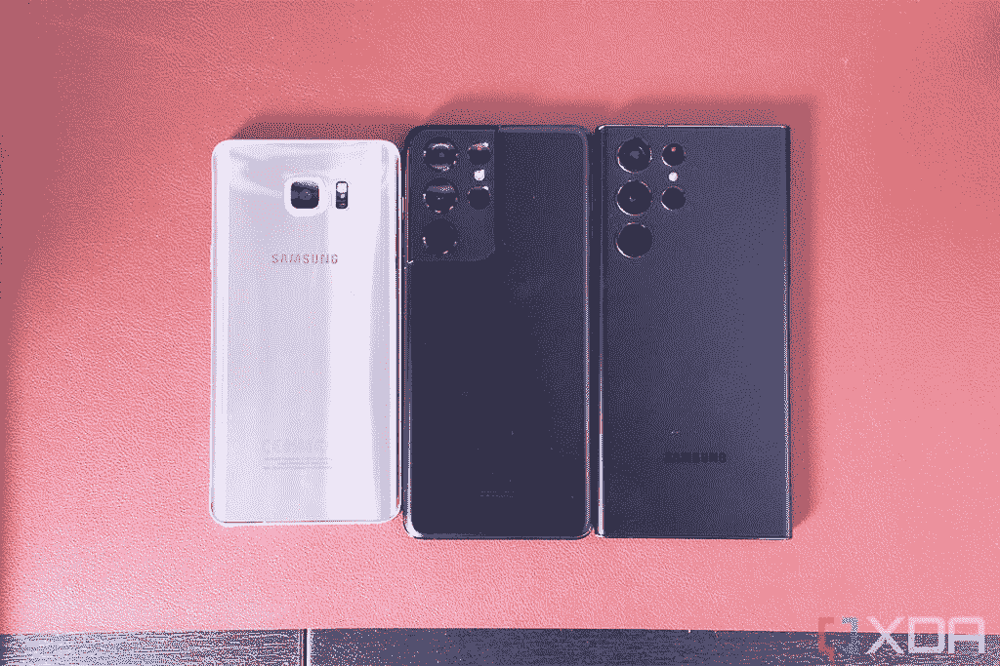
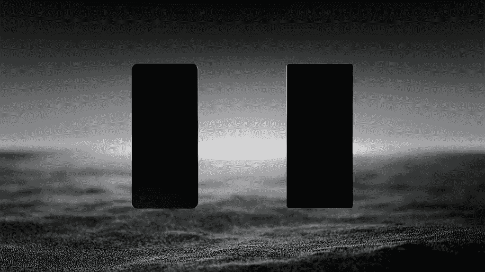

# Galaxy S22 Ultra 是 Galaxy Note 系列的当之无愧的继任者吗？

> 原文：<https://www.xda-developers.com/samsung-galaxy-s22-ultra-worthy-note-successor/>

三星 Galaxy S22 Ultra 可能是三星有史以来发布的最好的手机。这是在今年的主要 Unpacked 活动中推出的三款智能手机中最有趣的一款手机——主要是因为它是第一款集成 S Pen 的 Galaxy S 手机。去年的 Galaxy S21 Ultra 支持手写笔，但如果没有额外的外壳，它就没有地方存放它。不过，随着 Note 系列的彻底消亡，三星采纳了可对接 S Pen 的想法，并在 [Galaxy S22 Ultra](https://www.xda-developers.com/samsung-galaxy-s22-ultra-hands-on/) 中实现了这一想法。但是，让它与智能手机对接会让它成为 Note 系列的合格继任者吗？

回顾上一个推出的 Note 系列，我认为很明显，三星在规划接下来的产品时迷失了方向。三星的“Note”系列一直是一个试验场，为狂热的智能手机用户提供尖端硬件。S Pen 是一个很多人都不会使用的小众产品，最初的 Galaxy Note 也引入了曲面显示屏(尽管是在一侧)，我们现在几乎在所有旗舰智能手机上都可以看到。在这个过程中，我们也看到了其他的创新。

但问题是，如果 Note 系列应该是三星测试功能的平台，那么三星为什么要推出普通的 Note 20 呢？它不符合任何品牌哲学。Note 20 Ultra 很有意义，[但如果他们想要真正的*Note 体验，就不应该买普通的 Note 20*](https://www.xda-developers.com/dont-buy-regular-galaxy-note-20/) 。在那个时候，在关于它是 Note 系列的最后一款产品的传言中，在一些人看来，这是不祥之兆——Note 系列已经迷失了方向，很可能会被放到砧板上。

 <picture></picture> 

Galaxy Note 5, Galaxy S21 Ultra, and the Galaxy S22 Ultra

## 为什么三星“杀死”了 Note 系列

三星知道消费者知道什么。三星并不认为这是 Note 系列的死亡

很难说为什么三星一开始就开始纠结于 Note 系列，但在没有发表声明的情况下，也不可能说该公司已经完全一笔勾销了。在其二月发布的公告中，对下一款设备[“值得关注”的多个“微妙”暗示——更不用说在公告预告片中两款设备合并的漂亮展示——表明三星知道消费者知道什么。三星并不认为这是 Note 系列的死亡；它认为这是一次合并。](https://www.xda-developers.com/samsung-galaxy-s22-series-unpacked-2022/)

 <picture></picture> 

Samsung's said that these two phones were merging, suggesting that the Note series and the S series would combine.

从这个角度来看，三星的做法显而易见。甚至在没有比较这两款设备的情况下，三星每年基本上维持两款旗舰智能手机显然是没有意义的，而且随着供应链的紧张([三星显然比大多数](https://www.xda-developers.com/t-mobile-samsung-supply-issues-galaxy-note/)更挣扎)，看起来越来越有可能的是，这家韩国公司不再可能维持其在一年内发布多款玻璃板旗舰手机的高压发布周期。

现在，可折叠手机正在争夺下半年的注意力，将三星在玻璃板旗舰产品上的所有火力都集中到一款设备上，而不是对半分割，这将是有意义的。结果将是在今年年初发布更强有力的玻璃板，然后在下半年展示所有可折叠的弯曲性和创新性，而较小的升级在更长的时间内不断增加，为这两种产品的下一代创造兴奋感。在这个新的时间表中，这个音符确实显得不合适。再加上 S Pen 在可折叠和非笔记本设备(如 Galaxy S21 Ultra)上的体验逐渐民主化，许多人都想知道新的 Galaxy Note 会声称自己的强项是什么。

鉴于“Note”系列尚未正式宣布死亡，这是否意味着未来会有未来的 Note 品牌设备出现？老实说，这很难说。如果不要求*做出大量*解释，很难重振这个品牌，但最终，三星在这方面掌控着自己的命运(和营销)。该公司从未明确表示该系列已经死亡，为未来 Note 品牌的继任者敞开了大门。

## 无论如何，三星 Galaxy S22 Ultra 可以说是一款笔记本电脑

比较三星 Galaxy S22 Ultra 和三星 Galaxy Note 20 Ultra。两款手机都采用了类似的设计理念，如果拿 Galaxy S22 Ultra 并假设它*是*一款笔记本设备，这是可以原谅的。它看起来相似，行为相似，如果没有名字，很容易被认为是笔记本电脑。事实上，如果没有它的命名方案，我想一些对智能手机不太“了解”的人会认为它只是一款新的 Note 系列设备。毕竟只是个名字。

如果我们要假设设计理念得以保留，那么下一步就是辨别 Galaxy S22 Ultra 是否真正符合标准。它有一个可停靠的 S Pen，这是主要的功能，它包括了我们这些年来逐渐了解和喜欢的所有 Note 系列功能。如果你能给一部智能手机起一个名字，并且可以合理地怀疑它符合那个品牌，那么它很有可能值得成为继任者。

对于三星来说，这是一个大胆的进步，如果这还不能定义 Note 系列，那么我真的不知道什么能定义它

最后，我认为最重要的是，这是三星迈出的大胆一步。如果这还不能定义 Note 系列，那么我真的不知道什么能定义它。事实上，我个人的感觉是，之所以在 Note 系列是否被取消的问题上有这么多的来回，是因为 S22 Ultra 在设计和设计理念上都与 Note 一模一样。我认为泄露消息的人看到了这个设备，并认为它一定是一个笔记。毕竟，还能是什么呢？

## 辞旧迎新

三星 Galaxy S22 Ultra 是新的 Note，我认为很难对此提出异议。它拥有以前的笔记设备所定义的所有特征，这甚至还没有提到令人垂涎的 S Pen。如果这款手机作为一款笔记设备发布，没人会知道有什么不同。它在精神上是一款 Note 设备，但在品牌上却是一款 S 系列智能手机。

 <picture></picture> 

Samsung Galaxy S22 Ultra

三星 Galaxy S22 Ultra 是 Note 系列的优秀继任者，它包含了所有你期待的好东西。

这款智能手机是三星的巅峰之作，我们很高兴看到三星将超智能手机的未来带向何方。如果你想要的是一部能做所有事情的智能手机，三星 Galaxy S22 Ultra(T2)是一个很好的选择。