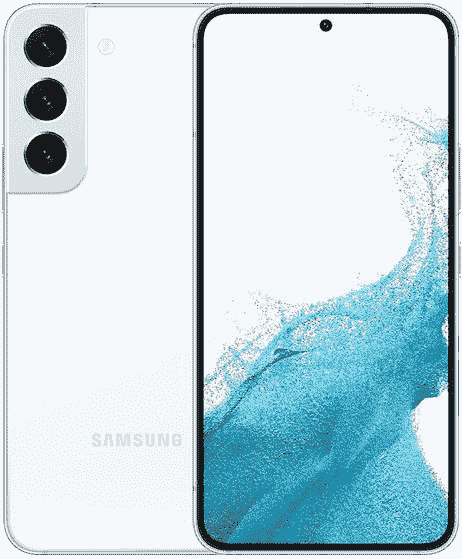

# Galaxy S22 vs iPhone 13:苹果和三星在入门级旗舰领域一决雌雄

> 原文：<https://www.xda-developers.com/samsung-galaxy-s22-vs-apple-iphone-13/>

三星的 [Galaxy S22](https://www.xda-developers.com/samsung-galaxy-s22-review/) 和苹果的 [iPhone 13](https://www.xda-developers.com/apple-iphone-13-review/) 针对的是两类消费者:想要“新旗舰”但又不想花太多钱的人，或者不想要一部巨大旗舰手机的消费者。这两款设备目前的售价为 699 美元，屏幕“只有”6.1 英寸(这是按对角线测量的，所以手机的实际高度远低于 6 英寸)，这两款设备很容易满足这两个群体的需求。

 <picture></picture> 

Samsung Galaxy S22

三星 2022 年旗舰系列中的入门级系列，S22 可能不是 ultra 甚至是 plus，但它仍然带来了辉煌的屏幕，顶级的 SoC，以及全面的强大相机性能。

 <picture></picture> 

Apple iPhone 13

##### 苹果 iPhone 13

苹果 iPhone 13 提供了极其强大的 A15 仿生硅和一个非常好的主摄像头，价格适中。

**浏览这篇文章:**

* * *

## 三星 Galaxy S22 vs 苹果 iPhone 13:规格

| 

规范

 | 

三星 Galaxy S22

 | 

苹果 iPhone 13

 |
| --- | --- | --- |
| **构建** | 

*   铝制中框
*   大猩猩玻璃 Victus 回
*   大猩猩玻璃 Victus 正面

 | 

*   铝制中框
*   玻璃正面和背面
*   前玻璃的“陶瓷护罩”

 |
| **尺寸&重量** | 

*   146 x 70.6 x 7.6 毫米
*   168 克

 | 

*   146.7 毫米 x 71.5mm 毫米 x 7.65mm 毫米
*   174

 |
| **显示** | 

*   6.1 英寸 AMOLED
*   1080 x 2340 像素
*   高达 120Hz 的可变刷新率

 | 

*   6.1 英寸有机发光二极管
*   60Hz 刷新率

 |
| **SoC** | 

*   高通骁龙 8 第 1 代(美国、中国、印度和其他地区)
*   Exynos 2200(欧洲、南美和其他地区)

 |  |
| **闸板&存放** |  | 

*   4GB 内存
*   128GB/256GB/512GB

 |
| **电池&充电** | 

*   3700 毫安时
*   25W 有线快速充电(包装盒中不含充电器)
*   15W 无线充电

 | 

*   电池尺寸未透露；来自监管文件的大致尺寸:3，227 毫安时
*   高达 20W 的有线充电
*   最高 7.5W 的无线充电
*   MagSafe 充电功率高达 15W

 |
| **安全** | 超声波显示指纹扫描仪 | Face ID |
| **后置摄像头** | 

*   **初级:** 50MP 宽，f/1.8
*   **二级:** 12MP 超宽，f.2.2
*   **第三:** 10MP 长焦，3 倍光学

 | 

*   **初级:** 12MP 宽，f/1.6 光圈，1.6μm
*   **次要:** 12MP 超宽，f/2.4 光圈

 |
| **前置摄像头** | 10MP | 12MP 原深感摄像头系统 |
| **端口** | USB-C | 闪电 |
| **音频** | 立体声扬声器 | 立体声扬声器 |
| **连通性** | 

*   5G(毫米波)
*   支持 2x2 MIMO 的 Wi-Fi 6 (802.11ax)
*   蓝牙 5.2
*   国家足球联盟

 | 

*   5G(低于 6 GHz 和毫米波)
*   支持 4×4 MIMO 和 LAA 的千兆级 LTE
*   支持 2×2 MIMO 的 Wi-Fi 6 (802.11ax)
*   蓝牙 5.0
*   国家足球联盟

 |
| **软件** | Android 12 上的 OneUI 4.3 | iOS 15 |
| **其他特征** | 双物理 SIM | 双物理 SIM 或双 eSIM |

* * *

## 三星 Galaxy S22 vs iPhone 13:硬件和设计

iPhone 13 和 Galaxy S22 都是玻璃和金属平板手机，具有优质的结构，包括覆盖前后两侧的钢化玻璃和坚固的铝制框架。两者都很轻便，易于单手握持，可以放入任何口袋。

### 显示

屏幕尺寸可能是相同的，但 Galaxy S22 的显示屏比 iPhone 13 的屏幕好一点点:Galaxy S22 的显示屏在 120Hz 的刷新率下刷新率是 iPhone 13 的两倍，变得稍微更亮，并且具有更小的切口——只有一个小孔，而不是侵蚀 iPhone 13 屏幕的大缺口。

然而，iOS 的动画比三星的 OneUI 优化得更好，因为 iPhone 13 的 60Hz 不知何故感觉比 60Hz 更流畅，而三星的 120Hz 偶尔会出现口吃。Galaxy S22 的动画最终仍然更加流畅，动画数量增加了一倍，但差距比通常的 120Hz 和 60Hz 更近。重点是，发烧友可能会对 iPhone 13 的显示屏吹毛求疵，但对大多数人来说，它仍然绝对不错。

两个屏幕都是平的，让手机有类似的手感，但 iPhone 的边缘更锋利一些，因为三星聪明地在显示屏与铝框的交界处添加了微妙的倒角边缘。

### 摄像机

iPhone 13 配备了双摄像头系统，覆盖了宽和超宽的焦距范围，而 Galaxy S22 通过使用三镜头阵列，覆盖了宽、超宽和长焦范围，超越了苹果。因为 iPhone 13 没有专用的变焦镜头，任何超过 3 倍的变焦都会开始失去重要的细节。然而，坚持使用 2 倍变焦，它仍然是可用的。

另一方面，Galaxy S22 的 3 倍远摄变焦镜头非常出色，尤其是对于这个价格范围的手机来说。其他相机也不寒酸，主摄像头 50MP，超宽 12MP。与 iPhone 13 直接的 12MP 主摄像头相比，三星的主摄像头具有更大的图像传感器，并受益于像素宁滨技术，因此低光照片往往也有利于 Galaxy S22。但是 iPhone 13 的摄像头在软件方面效率更高一些——几乎没有快门延迟(Galaxy S22 不能这么说)，iPhone 的两个镜头之间的切换感觉更无缝。

尽管如此，由于计算摄影的智能，这两款手机的主摄像头白天和晚上都非常好。对于超宽传感器来说，这是一个虚拟的纽带，因为两者都是在足够的照明下的可靠表演者。iPhone 13 在视频方面表现稍好，包括能够拍摄有点真实的散景视频。

### SoC 和内存

iPhone 13 由苹果的 A15 Bionic SoC 驱动，虽然苹果没有公开透露 RAM 信息，但拆解显示该手机使用 4GB 的 RAM，存储选项为 128GB、256GB 或 512GB。Galaxy S22 使用 8GB 内存，并有 128GB 或 256GB 存储选项，但硅的情况有点复杂。在美国、中国、印度和其他一些国家，Galaxy S22 运行的是高通的骁龙 8 Gen 1，但在世界其他许多地方，包括三星的母国南韩和几乎整个欧洲，这款手机运行的是三星自己的 Exynos 2200。大多数评测人员在测试中发现，骁龙 8 代 1 是性能更强的芯片。

如果我们单纯从处理能力来看，iPhone 13 无论如何都会赢，因为苹果的 A15 Bionic 在每个基准测试和一些真实测试中都击败了骁龙 8 Gen 1。但在现实世界的使用中，骁龙 8 Gen 1 甚至 Exynos 2200 都足以满足大多数用户的需求。

### 电池和其他零件

两款手机的电池都有点小，三星的手机使用 3，700 毫安时的电池，iPhone 使用 3，227 毫安时的电池。因为苹果的 iPhone 在硬件和软件(特别是处理器)之间有着出色的协同作用，iPhone 13 的电池寿命明显比 Galaxy S22 更长——三星的屏幕更耗电也于事无补。对于大多数人来说，iPhone 13 可以持续一整天 12 小时，但 Galaxy S22 如果要持续一整天，几乎肯定需要在晚上充值。这两款手机都没有配备充电砖，但都支持无线充电和快速有线充电，尽管“快速”的定义仍然保守。

在其他地方，两款手机都配备了响亮的立体声扬声器和 IP68 防水防尘性能，但 iPhone 13 的触觉明显优于 Galaxy S22 的触觉。

* * *

## 三星 Galaxy S22 vs 苹果 iPhone 13:软件

啊，古老的 iOS vs Android 辩论。通过这两款手机，你可以获得每个平台都提供的最新软件 Galaxy S22 的 [Android 12](https://www.xda-developers.com/android-12/) 和 iPhone 13 的 iOS 15。但三星的 Android 12 在顶部有一层额外的三星软件，可以带来好的和坏的(大部分是好的)。

例如，三星的 OneUI 带来了有用的多任务处理能力，如在可调整大小的浮动窗口中打开应用程序，这甚至在谷歌的纯版本 Android 中也不可用。OneUI 还带来了 Samsung DeX，这是一个有用的沙盒 UI，可以让 Galaxy S22 将类似 Windows 的 UI 输出到外部显示器。但 OneUI 也带来了多余的应用程序，例如三星在谷歌自己的 Chrome 浏览器上安装了互联网浏览器，或者用户需要下载许多插件才能与三星智能手表配对。

另一方面，iOS 更加完美和无缝，这是由于苹果对操作系统的严格控制。这也有好有坏。从好的方面来看，iOS 的运行效率通常更高，动画不流畅或应用崩溃的情况更少。苹果对其应用程序商店的严格控制也意味着 iPhone 应用程序通常比 Android 应用程序更精致，尤其是当涉及到小公司的应用程序时。但苹果的限制也意味着顽固的决定，比如不允许用户同时运行多个程序，或者缺乏免费的主屏幕网格。

我偏爱三星的软件，因为我经常进行多任务处理，但如果你已经熟悉 iOS 或过去使用过苹果的生态系统，iPhone 13 的软件会感觉很舒服。

## 三星 Galaxy S22 vs 苹果 iPhone 13:性能一般

如上所述，iPhone 13 运行在一个更强大的芯片上，这一点在处理 4k 视频等密集型任务时可以感觉到——iPhone 13 的速度明显快于 Galaxy S22。但除了像这样的特定利基超级用户任务，Galaxy S22 将表现得非常好。事实上，Galaxy S22 的软件可以做更多的事情——三星 DeX 确实开辟了各种可能性——从而使三星的手机成为可以说是卓越的工作机器。能够同时打开两个应用程序是一个巨大的优势，但令人沮丧的是，iPhones 仍然没有提供这个优势。但作为一款游戏或媒体消费设备，Galaxy S22 也略胜一筹，因为它的屏幕缺陷较少。

* * *

## 三星 Galaxy S22 vs 苹果 iPhone 13:哪个适合你？

我个人认为 Galaxy S22 是一款更好的独立设备——更好的屏幕，更好的主摄像头，更好的生产力——但不可否认的是，iPhone 13 Pro 被更好的硬件和软件生态系统所包围。例如，今年秋天 iPhone 13 的 iOS 16 更新将带来一些有趣的新技巧。谷歌在 I/O 上宣布三星 Galaxy S22 几个月后，很难看到它获得重要的新功能。

iPhone 与 Mac 和 iPad 之间的协同作用也比 Galaxy S22 与三星其他产品的连接要好一点——尽管这家韩国科技巨头正在努力追赶。最终，我认为这种摊牌归结为你更喜欢使用 Android 还是 iOS，如果你不能或不想支付超过 699 美元，这两款手机都将为你提供很好的服务。

 <picture></picture> 

Samsung Galaxy S22

三星 2022 年旗舰系列中的入门级系列，S22 可能不是 ultra 甚至是 plus，但它仍然带来了辉煌的屏幕，顶级的 SoC，以及全面的强大相机性能。

 <picture></picture> 

Apple iPhone 13

##### 苹果 iPhone 13

苹果 iPhone 13 提供了极其强大的 A15 仿生硅和一个非常好的主摄像头，价格适中。