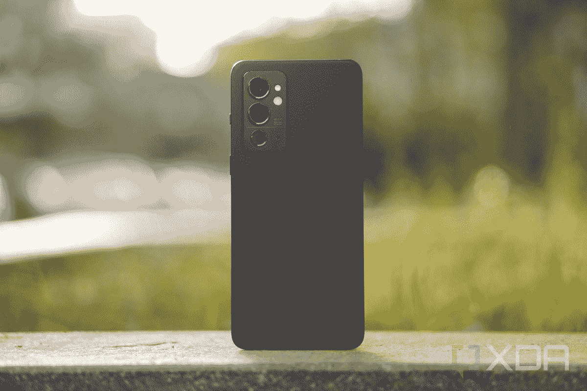

# 三星 Galaxy S22 vs 一加 9RT:三星旗舰迎战一加平价旗舰

> 原文：<https://www.xda-developers.com/samsung-galaxy-s22-vs-oneplus-9rt/>

在 2022 年买一部旗舰智能手机应该不会花你很多钱。有很多选择可以探索，在价格合理的同时提供顶级旗舰智能手机体验。以[一加 9RT](https://www.xda-developers.com/oneplus-9rt-review/) 为例，它的售价约为 699 美元，拥有现代旗舰产品的所有功能，包括华丽的显示屏、功能强大的主摄像头和旗舰处理器。但它与经验丰富的旗舰手机如 [Galaxy S22](https://www.xda-developers.com/samsung-galaxy-s22-review/) 相比如何呢？只有一个办法可以知道。

## 三星 Galaxy S22 Vs 一加 9RT:规格

| 

**规格**

 | 

谷歌 Pixel 6 Pro

 | 

一加 9RT

 |
| --- | --- | --- |
| **打造** | 

*   铝制中框
*   大猩猩玻璃 Victus 回
*   大猩猩玻璃 Victus 正面

 | 

*   玻璃背面
*   金属框架

 |
| **尺寸&重量** | 

*   146 x 70.6 x 7.6 毫米
*   168 克

 | 

*   163.2 x 73.2 x 8.7mm 毫米
*   197g

 |
| **显示** | 

*   6.1 英寸 AMOLED 2X 显示屏
*   2340 x 1080，425 ppi
*   HDR10+认证
*   120 赫兹刷新率
*   始终展示

 | 

*   6.62 英寸 FHD+三星 E4 AMOLED
*   120 赫兹刷新率
*   600Hz 触摸采样率
*   1300 尼特峰值亮度
*   1000000:1 对比度
*   100% DCI-P3 覆盖率
*   HDR10+

 |
| **SoC** | 

*   高通骁龙 8 Gen 1(美国、中国、印度和其他地区)
*   Exynos 2200(欧洲、南美和其他地区)

 | 

*   高通骁龙 888
    *   1 个 Kryo 680(基于 ARM Cortex X1)Prime core @ 2.84 GHz
    *   3 个 Kryo 680(基于 ARM Cortex A78)性能内核@ 2.4GHz
    *   4 个 Kryo 680(基于 ARM Cortex A55)高效内核@ 1.8GHz
*   Adreno 660 GPU

 |
| **闸板&存放** | 

*   8GB 内存
*   128GB/256GB UFS 3.1 存储

 | 

*   8GB/12GB LPDDR5 RAM
*   128GB/256GB UFS 3.1 存储

 |
| **电池&充电** | 

*   3700 毫安时
*   25W 有线快速充电(包装盒中不含充电器)
*   15W 无线充电

 | 

*   4500 毫安时
*   65W 快充支持

 |
| **安全** | 超声波显示指纹扫描仪 | 显示指纹扫描仪 |
| **后置摄像头** | 

*   **初级:** 50MP 宽，f/1.8
*   **二级:** 12MP 超宽，f.2.2
*   **第三:** 10MP 长焦，3 倍光学

 | 

*   主要:50MP 索尼 IMX 766，f/1.8，OIS
*   超宽:16MP，f/2.2
*   宏:2MP，f/2.4

 |
| **前置摄像头** | 10MP | 16MP，f/2.4 |
| **端口** | 

*   USB 类型-C
*   没有耳机插孔
*   没有 microSD 卡插槽

 | 

*   USB 类端口
*   没有耳机插孔
*   没有 microSD 卡插槽

 |
| **音频** |  |  |
| **连通性** | 

*   5G:非独立(NSA)，独立(SA)，Sub6 / mmWave
*   LTE:增强型 4×4 MIMO，最高 7CA，LTE Cat.20
*   wi-Fi 802.11 a/b/g/n/AC/ax(2.4/5/6 GHz)
*   蓝牙 v5.2

 | 

*   5G
*   长期演进
*   无线网络 6
*   蓝牙 5.1

 |
| **软件** | 

*   带有一个 UI 4.1 的 Android 12
*   承诺四大 Android 操作系统更新
*   五年的安全补丁

 | 

*   基于 Android 11 的 OxygenOS 11

 |
| **其他特征** | 

*   IP68 防水防尘保护
*   双 SIM 卡

 | 

*   蒸汽冷却室
*   警报滑块

 |

## 设计与展示

Galaxy S22 和一加 9RT 都是非常好看的手机。Galaxy S22 尺寸较小，尺寸为 146 x 70.6 x 7.6 毫米，重量仅为 168 克。它采用了简约的设计，圆角和扁平的铝制中框，看起来很像现在的 iPhone。背面的摄像头岛是 Galaxy S22 最引人注目的元素。正面和背面都由 Gorilla Glass Victus 保护。

一加 9RT 看起来没有 Galaxy S22 那么令人兴奋，但它也是由优质材料制成的，具有铝制侧栏和玻璃背面。背面有丝绸般的质感，摸起来很舒服。一加在重量分布方面也做得很好，所以手机握起来很舒服。一加的标志性警告滑块位于右侧，而背面的矩形摄像头岛容纳了三个摄像头。

Galaxy S22 拥有 6.1 英寸 FHD+ AMOLED 显示屏，可变刷新率高达 120Hz。另一方面，一加 9RT 拥有更大的 6.62 英寸 AMOLED 显示屏，刷新率为 120 赫兹。这两款手机在自动亮度模式下最高可达 1300 尼特，提供 100%的 DCI-P3 覆盖，并支持 HDR10+内容。

虽然两个显示器在原始数据方面不分上下，但 Galaxy S22 的面板优于一加 9RT 使用的旧三星 E4 面板。差别当然不是很大，除非你有训练有素的眼睛，并且用过很多旗舰，否则你不太可能注意到

## 照相机

理论上，这两款手机都拥有强大的相机硬件。Galaxy S22 采用了三摄像头系统，包括一个 50MP f/1.8 主拍摄器，一个 12MP f/2.2 超宽摄像头，以及一个 10MP f/2.4 长焦变焦镜头，具有 3 倍光学变焦。对于一加 9RT，我们正在考虑一个 50MP 索尼 IMX766 主传感器，一个 16MP 超宽拍摄器和一个 2MP 微距镜头。

正如你所见，Galaxy S22 拥有出色的硬件，因为它提供了 10MP 变焦镜头。你不会像 [Galaxy S22 Ultra、](https://www.xda-developers.com/samsung-galaxy-s22-ultra-review/)那样获得疯狂的好变焦，但它完成了任务。一加 9RT 没有专用的变焦相机，所以你做的任何变焦都是数码的，最终的图像可能看起来不清晰。

Galaxy S22 和一加 9RT 都有一个 50MP 主射手。在良好的照明条件下，这两款手机都能产生高动态范围和准确色彩再现的清晰图像。但在弱光和黑暗的条件下，Galaxy S22 比一加 9RT 好得多，也更可靠。

一加 9RT 的 1600 万像素超宽相机没什么值得一提的。它在光天化日之下也能拍出不错的照片，但是它的弱光性能还有很多不足之处。

**Galaxy S22 相机样品**

**一加 9RT 相机样品**

总的来说，Galaxy S22 的相机系统更加通用和可靠。它提供了明显更好的弱光性能，更好的超宽相机和专用变焦镜头。但是对于一台价格接近 Galaxy S22 一半的设备来说，一加 9RT 仍然提供了令人印象深刻的相机性能。

## 表演

Galaxy S22 由顶级的高通骁龙 8 代 1 芯片组驱动，尽管它也在一加 9RT 不销售的地区与 Exynos 2200 SoC 一起销售。同时，一加 9RT 选择了去年的骁龙 888 SoC。Galaxy S22 比一加 9RT 强，因为它使用了更新更强大的芯片组。特别是，骁龙 8 Gen 1 的 CPU 和 GPU 性能提高了 10%，同时峰值功耗降低了 20%。但不要搞错:一加 9RT 内部的骁龙 888 芯片组并不逊色，可以轻松对抗其他骁龙 8 代第 1 代手机。一加也在优化 OxygenOS 上下了很大功夫，所以一加 9RT 在现实世界的使用中应该会像任何高端旗舰一样快速流畅。

一加 9RT 还配备了一个大型蒸汽冷却散热器，可以在游戏等高强度工作负载期间控制热量。

## 电池和充电

一加 9RT 在这方面轻而易举地赢得了胜利，它配备了更大的 4500 毫安时电池，而 Galaxy S22 只有 37000 毫安时电池。如果你是一个重度用户，Galaxy S22 将很难让你坚持一天。一加 9RT 无论如何都没有非凡的电池寿命，但它至少可以让你度过一天。

一加 9RT 还在充电速度方面击败了 Galaxy S22，提供了超 67W 的有线快速充电。Galaxy S22 最高功率为 25W，但支持无线充电，这是一加 9RT 所没有的。

## 软件

Galaxy S22 开箱即可运行 Android，顶部有一个 UI 4。三星承诺长达四年的操作系统更新和五年的安全更新，甚至让谷歌 Pixel 都相形见绌。一加 9RT 搭载了基于 Android 11 的 OxygenOS 11，但可以升级到 Android 12，尽管许多用户不喜欢在一加设备上升级 Android 12。一加承诺三年操作系统更新和四年安全更新，虽然没有三星的令人印象深刻，但仍优于市场上其他一些实惠的旗舰产品。

## 结论

在一加 9RT 和 Galaxy S22 之间做出选择是你最容易做出的决定之一。两者之间的价格差距很大，而且两款手机都迎合了不同的受众。Galaxy S22 的起价是₹72,999，而 OnePlus 9RT 的价格是₹42,999.这根本不是一个公平的比较，你的答案很可能取决于你的预算。

 <picture></picture> 

Samsung Galaxy S22

vanilla Galaxy S22 提供了漂亮的 AMOLED 显示屏和功能强大的旗舰级相机。

Galaxy S22 有更好的显示屏，更快的芯片组，更多功能和更有能力的相机。除了电池寿命和充电速度，它在所有方面都轻松击败了一加 9RT。它还为你提供了市场上最好的软件支持，如果你决定在未来购买更新的 Galaxy 旗舰产品，三星通常会提供良好的汇率。您还可以[在 Galaxy S22](https://www.xda-developers.com/best-samsung-galaxy-s22-deals/) 上查看最优惠的交易，以节省资金。

 <picture></picture> 

OnePlus 9RT

##### 一加 9RT

一加 9RT 以实惠的价格提供旗舰硬件。

如果预算是制约因素，一加 9RT 是显而易见的。这是印度市场上最物有所值的旗舰之一，当你考虑到交易和返现的因素时，它看起来更加诱人。你会得到一个漂亮的 AMOLED 显示屏，旗舰骁龙 888 芯片组，强大的主射手，和超快的充电速度。