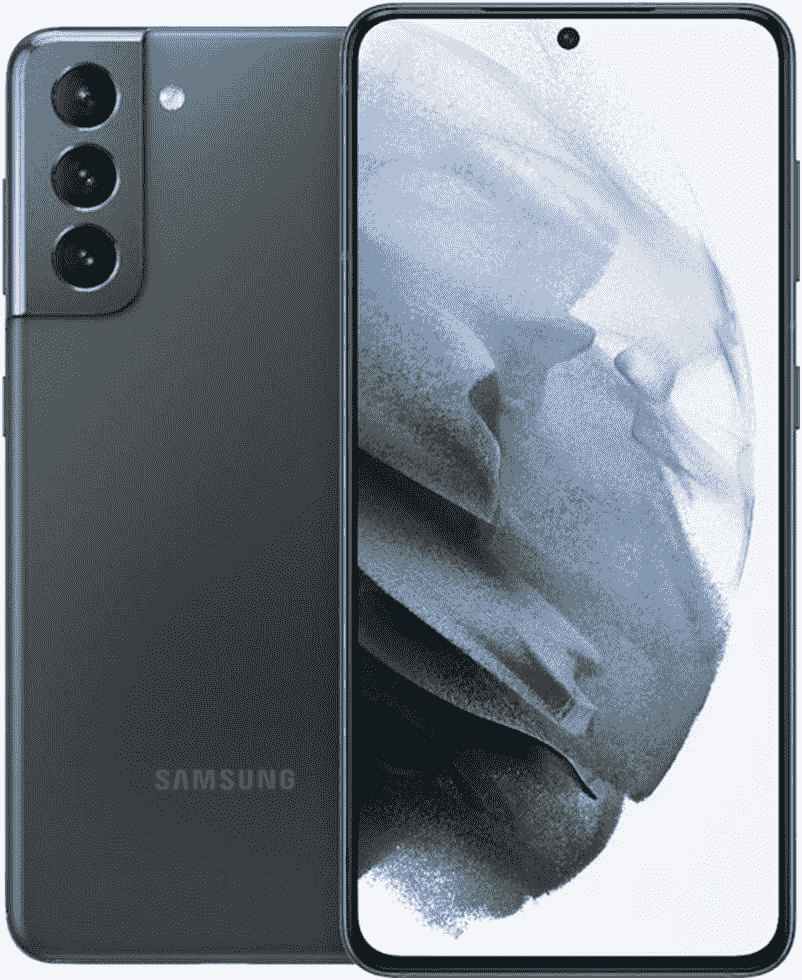

# 三星 Galaxy S22 vs 三星 Galaxy S21:该不该升级到 2022 年旗舰？

> 原文：<https://www.xda-developers.com/samsung-galaxy-s22-vs-samsung-galaxy-s21/>

Galaxy S22 是最好的 Android 智能手机之一，适合那些想要在 1000 美元以下的紧凑封装中结合出色的相机和旗舰性能的人。我们最近在一次长期评论中重新审视了 [Galaxy S22，它如何经受住时间的考验令人惊讶，尤其是考虑到自该设备问世以来已经推出了这么多伟大的旗舰产品。但是它和它的前身相比如何呢？作为继任者，Galaxy S22 显然会在大多数领域比 Galaxy S21 更好。但问题是，好了多少？如果你已经在用 S21，升级到 Galaxy S22 值得吗？你应该买旧的型号来省钱还是买最新的型号？](https://www.xda-developers.com/samsung-galaxy-s22-long-term-review/)

## 三星 Galaxy S22 与三星 Galaxy S21:规格

| 

**规格**

 | 

**三星 Galaxy S22**

 | 

三星 Galaxy S21

 |
| --- | --- | --- |
| **构建** | 

*   玻璃背面
*   铝制框架

 | 

*   塑料背面
*   铝制框架

 |
| **尺寸&重量** | 

*   146 x 70.6 x 7.6mm 毫米
*   非毫米波型号为 167 克
*   168g 用于毫米波型号

 |  |
| **显示** | 

*   6.1 英寸 AMOLED 2X 显示屏
*   2340 x 1080，425 PPI
*   HDR10+认证
*   120 赫兹刷新率
*   始终展示

 | 

*   6.2 英寸 FHD+动态 AMOLED 2X
*   2340 x 1080
*   HDR10+认证
*   120 赫兹刷新率
*   240Hz 触摸采样率

 |
| **SoC** | 

*   高通骁龙 8 代 1(美国，选择其他地区)
*   三星 Exynos 2200(大多数其他国家)

 | 

*   美国:高通骁龙 888
*   国际:Exynos 2100

 |
| **闸板&存放** | 

*   128/256GB 内部存储
*   8GB LPDDR5 RAM
*   没有 microSD 卡插槽

 | 

*   6GB + 128GB
*   8GB + 256GB
*   没有 microSD 卡插槽

 |
| **电池&充电** | 

*   3700 毫安时电池
*   25W USB PD 3.0 PPS 有线充电
*   快速无线充电 2.0(仅适用于三星超快速无线充电器和超快速无线充电器 Duo)
*   无线 PowerShare(反向无线充电)

 | 

*   4000 毫安时
*   25W 快速充电
*   15W Qi 无线充电
*   4.5W 反向无线充电

 |
| **安全** | 

*   超声波指纹传感器

 | 

*   显示指纹扫描仪
*   三星 Knox

 |
| **后置摄像头** | 

*   50MP 干线(F/1.8，1.0μm，85 FOV)，装箱
*   12MP 超宽(F/2.2/1.4 μm/120 FOV)
*   10MP 长焦(2.4/1.0 μm/36 FOV)

 | 

*   主要:1200 万像素，f/1.8，双像素自动对焦，OIS
*   超宽:12MP，f/2.2，123 FoV
*   长焦:64MP，f/2.0，1.1 倍光学变焦

 |
| **前置摄像头** | 100 万像素(2.2 微米/1.22 微米/80 FOV) | 100 万像素(2.2 微米/1.22 微米/80 FOV) |
| **端口** | 

*   USB 类型-C
*   没有耳机插孔

 | 

*   USB 类型-C
*   没有耳机插孔

 |
| **音频** | 

*   立体声扬声器
*   蓝牙双音频

 | 

*   立体声扬声器
*   杜比大气

 |
| **连通性** | 

*   5G:非独立(NSA)，独立(SA)，Sub6 / mmWave
*   LTE:增强型 4×4 MIMO，最高 7CA，LTE Cat.20
*   wi-Fi 802.11 a/b/g/n/AC/ax(2.4/5/6 GHz)
*   蓝牙 v5.2
*   国家足球联盟
*   GPS，伽利略，格洛纳斯，北斗

 | 

*   Sub6/mmWave 5G
*   4G LTE
*   Wi-Fi 802.11 a/b/g/n/ac/x(双频)
*   蓝牙 5.0
*   超宽带

 |
| **软件** | 

*   带有一个 UI 4.1 的 Android 12
*   承诺四大 Android 操作系统更新
*   五年的安全补丁

 | 基于 Android 12 的 OneUI 4.0 |
| **其他特色** | 

*   Samsung Pay(某些国家的 MST，NFC)

 | 

*   支持 NFC 的 Samsung Pay
*   IP68 等级

 |

## 设计与展示

粗略地看一眼，你很难分辨出 Galaxy S22 和 Galaxy S21。除了一些小的不同，这两款手机看起来非常相似。Galaxy S21 有一个环绕式摄像头模块，它延伸到背面并融入中间框架，而 Galaxy S22 上的摄像头模块则停在中间框架的边缘。另一个区别是，Galaxy S22 的摄像头模块与背面的颜色匹配，而 Galaxy S21 的颜色模块与背面不同。

虽然这两个模型遵循相同的总体设计，但它们在构建质量方面有所不同。Galaxy S21 采用塑料背和铝框架，而 Galaxy S22 使用更优质的材料，包括带有 Gorilla Glass Victus Plus 保护的玻璃背和装甲铝框架。Galaxy S22 还有更多的配色:幻影黑、白色、玫瑰金、绿色、石墨色、天蓝色、紫色、奶油色和宝来紫。与此同时，Galaxy S21 有灰色、白色、紫色和粉红色。

 <picture></picture> 

Galaxy S21

整体耐用性方面，Galaxy S22 更好；它在正面和背面包装了 Gorilla Glass Victus Plus。同时，Galaxy S21 的正面有大猩猩玻璃 Victus，但背面没有。两款手机的防水和防尘等级均为 IP68。我们仍然建议为这些手机拿一个外壳，所以请查看[最佳 Galaxy S22 外壳](https://www.xda-developers.com/best-samsung-galaxy-s22-cases/)和[最佳 Galaxy S21 外壳](https://www.xda-developers.com/best-galaxy-s21-cases/)。

在显示屏方面，Galaxy S21 和 Galaxy S22 非常相似。两者都使用三星最好的 AMOLED 面板，具有 FHD+分辨率、120Hz 刷新率和 HDR10+内容支持。与 Galaxy S21 的 6.2 英寸面板相比，Galaxy S22 的 6.1 英寸面板略小。否则，两个面板在颜色再现、饱和度、对比度和亮度方面是相似的。无论你选择哪一款手机，你都可以保证得到市场上最好的智能手机显示屏。

* * *

## 摄像机

摄像头硬件是这两款手机最大的区别之一。Galaxy S21 使用与其前身 Galaxy S20 相同的相机硬件，具有 12MP 主拍摄镜头，64MP 长焦镜头和 12MP 超宽相机。

另一方面，Galaxy S22 配备了一个新的三摄像头系统，包括一个新的 50MP 主传感器，一个具有 3 倍光学变焦的 10MP 长焦镜头和一个 12MP 超宽摄像头。

虽然这两款设备都提供了称职的主拍摄者，但 Galaxy S22 在弱光性能方面有优势。Galaxy S22 的新 50MP ISOCELL GN5 主传感器比 Galaxy S21 中的 12MP 传感器大 23%。增加的传感器尺寸和像素宁滨意味着 Galaxy S22 可以拍摄出比 Galaxy S21 更好的低光和夜间照片，细节更多，噪音更低。然而，你不会看到两部手机在日光下拍摄的巨大差异。

Galaxy S22 还提供了更好的变焦能力，因为它配备了一个新的 10MP 长焦镜头，具有 3 倍光学变焦。与此同时，Galaxy S21 的 64MP 长焦镜头在变焦拍摄时依赖于裁剪。

查看两款手机的图片样本，自己判断照片质量。

### Galaxy S22 图像样本

### Galaxy S21 图像示例

* * *

## 性能、电池寿命和软件

正如你所料，Galaxy S22 比 S21 拥有更多的原始动力。欧洲用户使用三星内部的 Exynos 220 芯片组，而包括美国和印度在内的世界其他地区用户使用的是骁龙 8 代 1 芯片。就 Galaxy S21 而言，美国和中国的型号配备了骁龙 888 芯片组，而其他市场则配备了 Exynos 2100。

骁龙 8 Gen 1 和 Exynos 2200 的 CPU 性能仅比骁龙 888 和 Exynos 2100 略高。这意味着两款手机之间的性能差距并不大，在日常任务中不太可能明显。然而，当涉及到图形性能时，情况就不同了。新的骁龙 8 第 1 代芯片组提供了 35%更快的图形性能，而功耗比骁龙 888 低 20%。不过，你可以期待 Galaxy S21 毫无问题地处理图形密集型游戏。只是，它可能无法在像 Genshin Impact 这样的游戏中的 max 图形设置上提供持续流畅的游戏体验。

Galaxy S22 和 S21 都配备了相同的内存和存储容量:8GB 内存和 128GB/256GB UFS 3.1 内部存储。

虽然 Galaxy S22 总体上是一款优秀的手机，但电池是它输给 Galaxy S21 的一个方面。S22 装有 3700 毫安时电池，比 Galaxy S21 的 4000 毫安时电池低了一步。有人可能认为更小的显示屏和更高效的芯片组会弥补更小的电池。在某种程度上，这是真的，但正如我们在评论中指出的那样，如果你是一个重度用户，Galaxy S22 将很难让你度过一整天。两款手机都提供类似的充电速度:有线最高 25W，无线最高 15W。

Galaxy S22 搭载 Android 12，而 Galaxy S21 开箱运行 Android 11(但可升级至 Android 12)。说到软件支持，这两款手机都承诺获得四个主要的操作系统更新和五年的安全更新。但是由于 Galaxy S21 是在 2021 年随着 Android 11 问世的，所以它只能支持到 Android 15，而 Galaxy S22 将接收 OS 更新到 Android 16。

* * *

## Galaxy S22 vs. Galaxy S21:你该买哪个？

在撰写本文时，Galaxy S22 和 Galaxy S21 在 Samsung.com 以相同的价格出售，所以如果你打算从官方网站购买，选择是显而易见的。然而，这两种型号都可以从其他来源以折扣价找到，如亚马逊。

如果你正在从一个旧的 Galaxy S 型号升级，我们建议选择 Galaxy S22(不要忘记利用[最佳 Galaxy S22 优惠](https://www.xda-developers.com/best-samsung-galaxy-s22-deals/))。虽然 Galaxy S22 从外观上看可能与 S21 没有太大区别，但它提供了几个比前代产品显著的升级，并且与 S21 相比，将获得一年多的软件更新。您将获得更耐用、更优质的设计、更强大的芯片组和升级后的相机，从而提供更好的低光拍摄效果。也就是说，如果你在 Galaxy S21 上买了很多东西，在 S22 上买也没什么不好。

 <picture></picture> 

Samsung Galaxy S22

Galaxy S22 在紧凑的封装中提供了强大性能和卓越相机的令人愉快的组合。

 <picture></picture> 

Samsung Galaxy S21

Galaxy S21 提供了漂亮的 AMOLED 显示屏、三摄像头系统和 4000 毫安时电池。

至于那些使用 Galaxy S21 的人，没有必要全价升级，因为你不会错过任何实质性的东西。最好等待 Galaxy S23 或 S24，因为它们可能会带来更有意义的升级。三星确实提供了一些疯狂的折价交易，所以如果你的 Galaxy S22 在 Galaxy S21 折价交易后大幅下降，那么花大约 200 美元购买一部更新、更未来的设备是值得的。所以，不，不要全价升级，但一定要评估一下你是否能只升级一小部分。

如果你正在寻找更便宜的旗舰体验，我们建议看看 Galaxy S21 FE，它提供了 S21 的许多高级功能，包括更大的电池，仅售 599 美元。