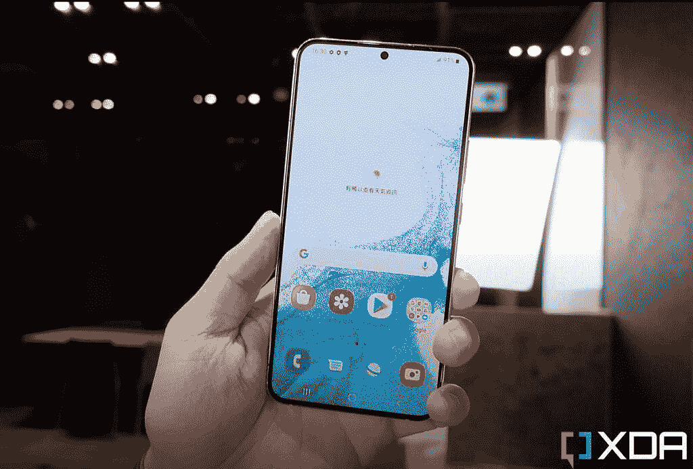
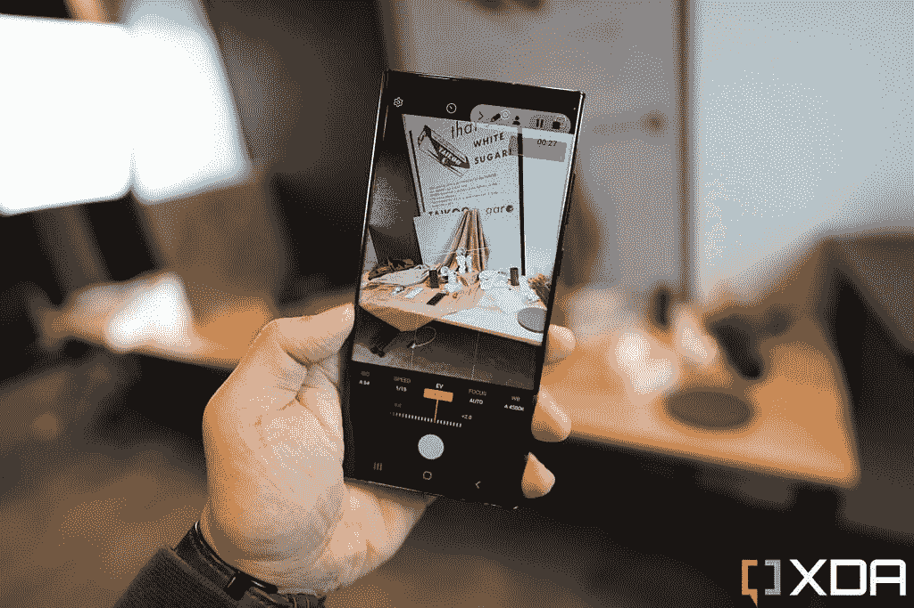
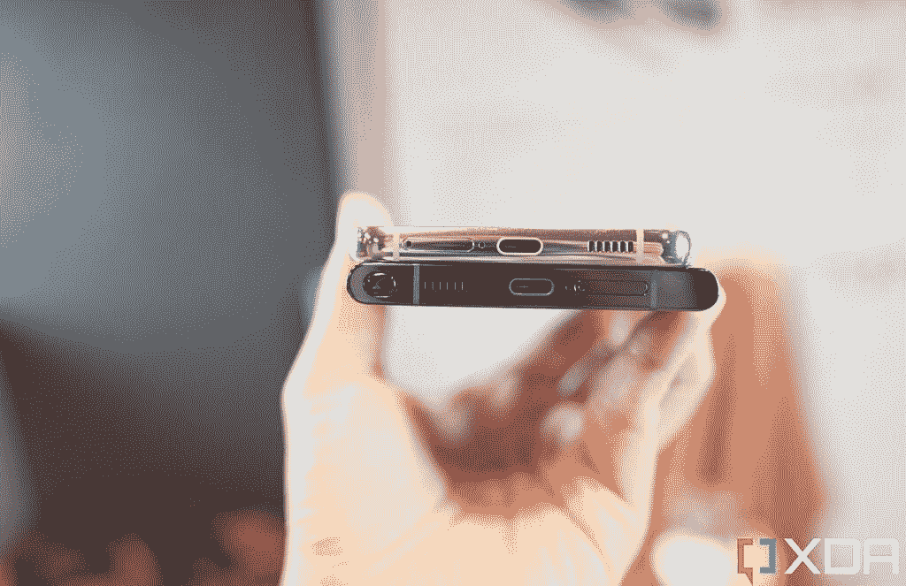
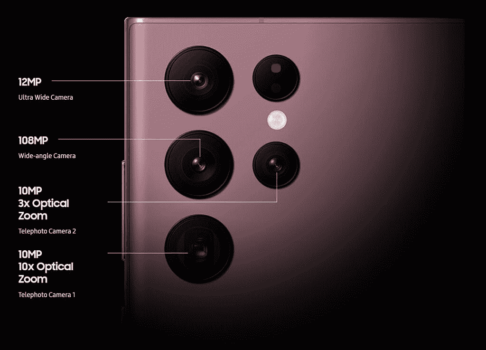
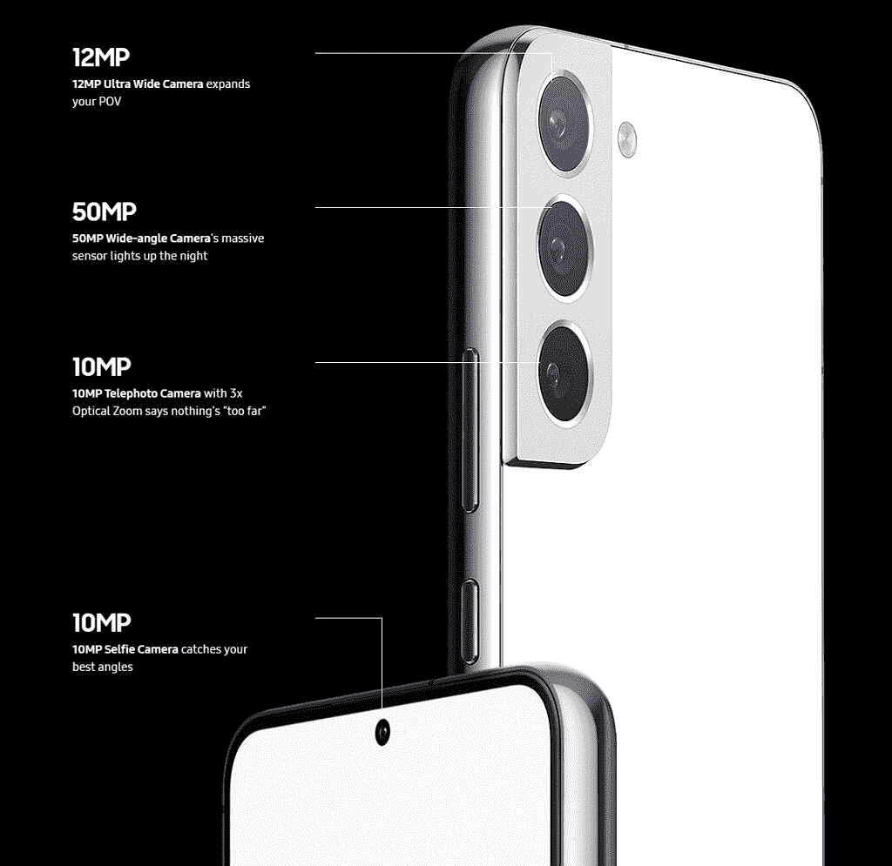

# 三星 Galaxy S22，Galaxy S22 Plus，Galaxy S22 Ultra:有什么区别？

> 原文：<https://www.xda-developers.com/samsung-galaxy-s22-vs-samsung-galaxy-s22-plus-vs-samsung-galaxy-s22-ultra/>

三星的 Galaxy S22 系列来了。就像过去三年一样，有三种模式可供选择。然而，与过去三年不同的是，最高端的 Ultra 机型与其他两款设备之间的差距比以往任何时候都大。事实上，Galaxy S22 Ultra 给人的感觉就像是与其他两款手机不同的手机。这是因为它基本上是。 [Galaxy S22 Ultra](https://www.xda-developers.com/samsung-galaxy-s22-ultra-hands-on/) 本质上是一款新的 Galaxy Note。与 Galaxy S21 Ultra 相比，它看起来像是 Galaxy Note 20 Ultra 的明显演变，从带有坚硬边角的方形外观到内置的 S-Pen。与此同时，标准的 [Galaxy S22 和 S22 Plus](https://www.xda-developers.com/samsung-galaxy-s22-hands-on/) 显然是 Galaxy S21 的续集，具有相同的相机模块设计和整体手感。

这使得这篇比较文章比以往任何时候都更容易写。如果你一直喜欢 Galaxy Note 系列胜过 Galaxy S 系列，如果你实际上认为 S-Pen 有用，那么 Galaxy S22 Ultra 是值得购买的明确手机。事实上，如果你在乎触控笔，你几乎没有其他选择，因为 Galaxy S22 Ultra 是唯一的游戏，除非你满足于这些中档摩托罗拉设备。是的，它有点贵，但是你得到了绝对最好的一切——屏幕、相机、处理器等等。这是厨房水槽电话。

如果你不在乎触控笔，或者你想节省一点钱，那么 Galaxy S22 或 S22 Plus 适合你。好消息是，三星今年没有在非 Ultra 机型上偷工减料。去年的 S21 有一个塑料背——对于一款售价 800 美元的“旗舰”手机来说很可笑——S21 和 S21 Plus 都有普通的 1200 万像素主摄像头。这一次，Galaxy S22 和 S22 Ultra 都将获得 Gorilla Glass Victus Plus 背板，而且这两款手机都将摄像头升级到了 50MP 主摄像头。换句话说，这两款手机感觉不像是事后诸葛亮。

### 获得 Galaxy S22，如果:

*   你想要一个实用尺寸的旗舰
*   您希望以合理的预算获得出色的性能、出色的相机
*   充电和电池续航时间一般也没问题

### 获得 Galaxy S22 Plus，如果:

*   你想要更大的屏幕和更快的充电速度，以及更好的相机
*   你不介意为更大的尺寸和附加福利额外花费

### 获得 Galaxy S22 Ultra，如果:

*   你想要一支一体式 S Pen，也就是说，你想要一部 Galaxy Note
*   你想要一款性能卓越、相机惊艳的旗舰产品
*   你不介意花钱买一个大型的身体设备

 <picture></picture> 

Samsung Galaxy S22

Galaxy S22 继承了 Galaxy S21 的优势，以更实惠的价格提供了同样出色的 Galaxy 体验，尽管有一些取舍。

 <picture></picture> 

Samsung Galaxy S22 Plus

##### 三星 Galaxy S22 Plus

Galaxy S22 Plus 比 Galaxy S21 Plus 更好地弥合了入门级 Galaxy S22 和库存充足的 Galaxy S22 Ultra 之间的差距。今年的老二提供了更大更好的 Galaxy S22 体验版本，尽管它与 Galaxy S22 Ultra 相比仍有一些权衡。

 <picture></picture> 

Samsung Galaxy S22 Ultra

Galaxy S22 Ultra 采用了去年的一款非常好的手机，并进行了一些调整。同样出色的相机体验仍然存在，但现在 Galaxy S22 Ultra 也可以声称是最佳的生产力，这要归功于 S-Pen。最终，它带来了三星的最佳表现，并恰当地延续了 Galaxy Note 系列的遗产。

* * *

## 三星 Galaxy S22 系列:定价和供货情况

Galaxy S22、Galaxy S22 Plus 和 Galaxy S22 Ultra 现在几乎可以在世界各地预订。在美国，这些设备将于 2 月 25 日正式上市销售。美国的官方起始零售价格如下:

*   galaxy S22:799 美元
*   galaxy S22 Plus:999 美元
*   galaxy S22 Ultra:1199 美元

然而，有很多[预购交易](https://www.xda-developers.com/best-samsung-galaxy-s22-deals/)取决于你从哪家商店或运营商购物。例如，通过三星商店预购可以获得 200 美元的礼品卡；与此同时，像威瑞森这样的运营商提供的月套餐起价低至每月 22.22 美元。请务必查看我们的交易摘要，获取最新信息。

* * *

## 三星 Galaxy S22 系列:规格

| 

规格

 | 

三星 Galaxy S22

 | 

三星 Galaxy S22 Plus

 | 

三星 Galaxy S22 Ultra

 |
| --- | --- | --- | --- |
| **建造** | 

*   装甲铝框架
*   康宁大猩猩玻璃 Victus+

 | 

*   装甲铝框架
*   康宁大猩猩玻璃 Victus+

 | 

*   装甲铝框架
*   康宁大猩猩玻璃 Victus+

 |
| **尺寸&重量** |  | 

*   157.4 x 75.8 x 7.6mm 毫米
*   196 克

 | 

*   163.3 x 77.9 x 8.9mm 毫米
*   229 克

 |
| **显示** | 

*   6.1 英寸动态 AMOLED 2X
*   FHD+ (1080 x 2340)
*   10-120 赫兹自适应刷新率
*   游戏模式下 240Hz 触摸采样率

 | 

*   6.6 英寸动态 AMOLED 2X
*   FHD+ (1080 x 2340)
*   10-120 赫兹自适应刷新率
*   游戏模式下 240Hz 触摸采样率

 | 

*   6.8 英寸动态 AMOLED 2X
*   QHD+ (1440 x 3088)
*   1-120 赫兹自适应刷新率
*   游戏模式下 240Hz 触摸采样率

 |
| **SoC(因地区而异)** | 

*   高通骁龙 8 代 1
*   Exynos 2200

 | 

*   高通骁龙 8 代 1
*   Exynos 2200

 | 

*   高通骁龙 8 代 1
*   Exynos 2200

 |
| **内存&存储** | 

*   8GB LPDDR5 + 128GB UFS 3.1
*   8GB + 256GB

 | 

*   8GB LPDDR5 + 128GB UFS 3.1
*   8GB + 256GB

 | 

*   8GB LPDDR5 + 128GB UFS 3.1
*   12GB + 256GB
*   12GB + 512GB
*   12GB + 1TB

 |
| **电池&充电** | 

*   3700 毫安时
*   25W 有线快充支持
*   15W 无线充电支持
*   无线 PowerShare
*   USB-IF 兼容

 | 

*   4500 毫安时
*   45W 有线快充支持
*   15W 无线充电支持
*   无线 PowerShare
*   USB-IF 兼容

 | 

*   5000 毫安时
*   45W 有线快充支持
*   15W 无线充电支持
*   无线 PowerShare
*   USB-IF 兼容

 |
| **安全** | 超声波显示指纹传感器(4x9mm) | 超声波显示指纹传感器(4x9mm) | 超声波显示指纹传感器(4x9mm) |
| **后置摄像头** | 

*   初级:50MP，1.0 米，85 FoV，23 毫米，f/1.8，OIS DPAF
*   超宽:12MP，1.4 米，120 FoV，13 毫米，f/2.2
*   长焦:10MP，1.0 m，36 FoV，69mm，f/2.4，OIS，3 倍光学变焦
*   视频:

 | 

*   初级:50MP，1.0 米，85 FoV，23 毫米，f/1.8，OIS DPAF
*   超宽:12MP，1.4 米，120 FoV，13 毫米，f/2.2
*   长焦:10MP，1.0 m，36 FoV，69mm，f/2.4，OIS，3 倍光学变焦
*   视频:

 | 

*   主要:108 百万像素，0.8 米，23 毫米，f/1.8，自适应像素(高分辨率照片和非宁滨)，DPAF，85 FoV
*   超宽:12MP，1.4 米，120 FoV，13 毫米，f/2.2
*   长焦:10MP，1.12 m，230mm，f/4.9，10x 光学变焦，11 FoV
*   长焦:10MP，1.12 m，36，69mm，f/2.4，3 倍光学变焦，36 FoV
*   激光自动对焦
*   视频:
    *   8K @24fps
    *   4K @60fps
    *   自动取景、自动 FPS 和人像夜间拍摄

 |
| **前置摄像头** | 

*   10MP，1.22 米，f/2.2，80 FoV
*   视频:

 | 

*   10MP，1.22 米，f/2.2，80 FoV
*   视频:

 | 

*   40MP，1.4 米，f/2.2，80 FoV
*   视频:

 |
| **港口** | USB 类型-C | USB 类型-C | USB 类型-C |
| **音频** | 

*   立体声扬声器
*   杜比全景声认证

 | 

*   立体声扬声器
*   杜比全景声认证

 | 

*   立体声扬声器
*   杜比全景声认证

 |
| **连通性** | 

*   5G(毫米波/sub6)
*   4G LTE
*   无线网络 6
*   蓝牙 5.2
*   国家足球联盟

 | 

*   5G(毫米波/sub6)
*   4G LTE
*   Wi-Fi 6E
*   蓝牙 5.2
*   国家足球联盟
*   超宽带

 | 

*   5G(毫米波/sub6)
*   4G LTE
*   Wi-Fi 6E
*   蓝牙 5.2
*   国家足球联盟
*   超宽带

 |
| **软件** | 

*   一个基于 Android 12 的 UI 4.1
*   承诺四次 Android 操作系统升级
*   承诺五年的安全补丁

 | 

*   一个基于 Android 12 的 UI 4.1
*   承诺四次 Android 操作系统升级
*   承诺五年的安全补丁

 | 

*   一个基于 Android 12 的 UI 4.1
*   承诺四次 Android 操作系统升级
*   承诺五年的安全补丁

 |
| **其他特性** | 

*   IP68 防尘防水等级

 | 

*   IP68 防尘防水等级

 | 

*   IP68 防尘防水等级
*   内置 S 笔

 |

* * *

## 三星 Galaxy S22 系列:硬件和设计

正如我们所说，Galaxy S22 系列感觉像两条独立的电话线:Galaxy S22 和 Galaxy S22 Plus，然后是 Galaxy S22 Ultra，这几乎就像是它自己的东西。我们先来看看非 Ultra 设备。Galaxy S22 和 Galaxy S22 Plus 看起来与去年的 Galaxy S21 系列非常相似，相同的轮廓切割相机模块溢出手机侧面，融入铝制机箱。这是我们去年非常喜欢的造型，今年这种感觉又回来了。

Galaxy S22 和 Galaxy S22 Plus 几乎完全相同，除了以下不同之处:

*   屏幕尺寸:
    *   Galaxy S22: 6.1 英寸，1080 x 2340 有机发光二极管屏幕
    *   Galaxy S22 Plus: 6.6 英寸，1080 x 2340 有机发光二极管屏幕
*   总尺寸和重量:
    *   Galaxy S22:
    *   Galaxy S22 Plus:
        *   157.4 x 75.8 x 7.6mm 毫米
        *   196 克
*   电池容量和充电速度:
    *   Galaxy S22 有一个 3700 毫安时的电池，充电功率为 25 瓦
    *   Galaxy S22 Plus 的 4，500 毫安时电池可以 45 瓦的速度充满。
*   连通性:
    *   Galaxy S22 使用“仅仅”WiFi 6 标准，跳过了对精确室内定位的超宽带支持
    *   Galaxy S22 Plus 支持 WiFi 6E 和 UWB

Galaxy S22 和 Galaxy S22 Plus 屏幕看起来都很棒，色彩鲜艳，动画生动。较小的型号拿在手中感觉非常小，应该会受到喜欢小手机的人的欢迎。不过说了这么多，Galaxy S22 Plus 感觉也不是特别大。与 iPhones 不同，iPhones 使用更宽的宽高比和块状结构，Galaxy S22 Plus 的 6.6 英寸屏幕对大多数成年人来说仍然可以用一只手轻松使用。

 <picture></picture> 

The Galaxy S22 Plus in the hand.

与此同时，Galaxy S22 Ultra 无疑是大的，6.8 英寸的显示屏将手机的尺寸和重量增加到 163.3 x 77.9 x 8.9mm 毫米和 229 克。然而，屏幕在左右两侧是弯曲的，这有助于抵消更宽的构建，并给手机带来更平滑、更无缝的一体式感觉。尽管如此，一些人会觉得这款手机有点难拿，尤其是在较硬的角落。

 <picture></picture> 

The Galaxy S22 Ultra in the hand.

Galaxy S22 Ultra 还采用了三星设备中未见的新背面设计:没有摄像头岛或凸起来容纳摄像头，它们只是从手机背面伸出来。这是一种极简主义的氛围，有些人会喜欢，有些人不会。这当然是独一无二的。

Galaxy S22 Ultra 的屏幕比两款非 Ultra 手机要好一点:它的刷新率可以低至 1Hz(其他两款只能低至 10Hz)，这有助于它节省更多电力，眨眼之间可以高达 120Hz。该面板也是更高的分辨率，为 1440 x 3088，这使其处于“四高清”领域，但老实说，大多数人将无法发现 Galaxy S22 Ultra 或 Galaxy S22 Plus 之间的“卓越清晰度”——它们都是很棒的面板。

Galaxy S22 Ultra 显示器还可以支持附带的 S-Pen 的手写笔输入。就像 Galaxy Note 20 Ultra 一样，S-Pen 位于右下角的一个竖井中。老实说，Galaxy S22 Ultra 的手感几乎和 Galaxy Note 20 Ultra 一样。

 <picture></picture> 

The Galaxy S22 Plus (top) has flatter sides than the S22 Ultra and most other Android phones.

所有三款 Galaxy S22 手机的显示指纹识别器都是一样的——它们使用了高通的超声波解决方案，谢天谢地，它们比以前更快更灵敏了。

### 摄像机

Galaxy S21 Ultra 拥有 2021 年最全面、最多功能的相机系统:Galaxy S22 Ultra 带回了相同的设置，但三星承诺进行重大改进。虽然有一些细微的硬件改进，例如镜头质量更高，但大多数改进将通过软件实现，因为三星已经建立了一个新的计算摄影系统。

到目前为止，我只花了有限的时间测试 Galaxy S22 Ultra 的相机系统，但早期测试显示，与 Galaxy S21 Ultra 相比，它在弱光下表现更好，产生更清晰的 10 倍变焦，更出色的视频稳定性，以及更好的散景视频。至少在今年上半年，它几乎肯定会成为 2022 年智能手机相机的新标准。

 <picture></picture> 

Samsung Galaxy S22 Ultra rear camera specifications

与此同时，Galaxy S22 和 Galaxy S22 Plus 的相机系统与其更大的兄弟相比功能较差——它没有 10 倍变焦的潜望镜，并且它的主相机“只是”50MP 而不是 108MP。然而，超宽传感器是相同的，3 倍长焦变焦镜头也是如此。另外，与去年的香草 Galaxy S21 和 Galaxy S21 Plus 相比，这些相机是一个很大的升级。

 <picture></picture> 

Samsung Galaxy S22 and Galaxy S22 Plus camera specifications

大多数相机升级都是通过软件改进实现的

大多数相机升级将通过软件改进来实现，三星承诺了很多。我们已经发布了 [Galaxy S22 系列新相机功能的完整概述，](https://www.xda-developers.com/samsung-galaxy-s22-camera-features/)所以如果你想了解所有细节，请务必查看。但在这里总结一下，Galaxy S22 Ultra 和非 Ultra 型号都将使用某种形式的像素宁滨来产生比平时拥有更多的图像信息。对于 Galaxy S22 Ultra 中的 108MP 传感器，三星使用了 nona-宁滨，它将 9 个像素的数据合并成一个超大像素——换句话说，Galaxy S22 Ultra 产生的最终图像是 12MP 的照片，但具有 1.08 亿像素的信息。Galaxy S22 和 S22 Plus 的 5000 万像素摄像头使用 tetra-宁滨，将四个像素合二为一，拍摄 1250 万像素的照片。像素宁滨并不是新技术，三星的 Ultra 手机已经这样做了多年，但三星承诺，它已经重新设计了计算摄影，这与高通在骁龙 8 Gen 1 中的新 ISP 一起带来了重大改进。

还有“高级自动取景”，手机的摄像头将检测场景，识别多达 10 个物体，并调整取景，包括焦距，以捕捉更好的图像。

* * *

## 三星 Galaxy S22 系列:软件

所有三款 Galaxy S22 手机都运行三星的 [One UI 4.1](https://www.xda-developers.com/one-ui-4-beta-features-overview/) over Android 12。在我看来，One UI 是市场上最好的 Android 皮肤之一，提供了谷歌现有 Android 所没有的大量额外功能，例如在浮动窗口中启动应用程序的能力，同时又不妨碍谷歌必须提供的功能。

Galaxy S22 系列的新功能是三星与谷歌合作的一些独家功能:对包括 Google Duo 在内的各种应用程序的实时共享支持，Google Messages 中的 YouTube 预览，以及内置的语音访问支持。这些都是连谷歌自己的 Pixel 手机都还没有的功能。

由于 Galaxy S22 Ultra 配备了 S-Pen，因此与 Galaxy S22 和 Galaxy S22 Plus 相比，它当然拥有更多软件功能。Galaxy S22 Ultra 的 S-Pen 软件体验对近年来使用 Galaxy Note 手机的任何人来说都很熟悉。将手写笔从插槽中拔出，Galaxy S22 Ultra 会做出反应:如果屏幕关闭，你会直接跳到屏幕关闭备忘录，这允许你在睡眠屏幕上记笔记，而无需点亮屏幕。如果手写笔弹出时手机已经解锁且屏幕开启，那么屏幕右侧会弹出浮动命令菜单。

另一个不算新但非常有用的软件功能是 Samsung DeX。只需将三部 Galaxy S22 手机中的任何一部连接到显示器或智能电视(通过无线连接或 USB-C 电缆)，就可以将三星手机用作电脑，具有类似 Windows 的布局。我曾在旅途中使用三星 DeX 在酒店完成工作，这只是另一个可以让人们生活更轻松的功能。

* * *

## 三星 Galaxy S22 系列:哪款适合你？

所有三款 Galaxy S22 手机都提供了尖端的技术和组件，我认为与苹果的要价相比，它们都是相对物有所值的。特别是 Galaxy S22 Ultra，它比目前市场上的任何其他智能手机都可以做更多的事情。想拍极端特写的微距镜头？100 倍变焦镜头？8k 视频？Galaxy S22 Ultra 相机可以做到这一点。想在屏幕上同时运行三个应用？还是用手写笔在数字文档上签名？还是使用 PC 桌面设置？你也可以这样做。如果你有钱挥霍，你想要最有能力和最强大的平板手机，Galaxy S22 Ultra 就是它。

与苹果的要价相比，这三款 Galaxy S22 手机都相对物有所值

如果你想节省一点钱，或者如果你根本不在乎 S-Pen 或 10 倍变焦镜头，那么 Galaxy S22 和 S22 Plus 是值得的候选人。从现在开始，你只需要决定你是想要一个可以单手轻松使用的小手机，还是一个稍微大一点的手机，以便更好地使用媒体。

无论如何，如果你在市场上寻找一部新的智能手机，你应该看看 Galaxy S22 系列，至少让它成为你潜在购买清单上的一个竞争者。

 <picture></picture> 

Samsung Galaxy S22

Galaxy S22 继承了 Galaxy S21 的优势，以更实惠的价格提供了同样出色的 Galaxy 体验，尽管有一些取舍。

 <picture></picture> 

Samsung Galaxy S22 Plus

##### 三星 Galaxy S22 Plus

Galaxy S22 Plus 比 Galaxy S21 Plus 更好地弥合了入门级 Galaxy S22 和库存充足的 Galaxy S22 Ultra 之间的差距。今年的老二提供了更大更好的 Galaxy S22 体验版本，尽管它与 Galaxy S22 Ultra 相比仍有一些权衡。

 <picture></picture> 

Samsung Galaxy S22 Ultra

Galaxy S22 Ultra 采用了去年的一款非常好的手机，并进行了一些调整。同样出色的相机体验仍然存在，但现在 Galaxy S22 Ultra 也可以声称是最佳的生产力，这要归功于 S-Pen。最终，它带来了三星的最佳表现，并恰当地延续了 Galaxy Note 系列的遗产。