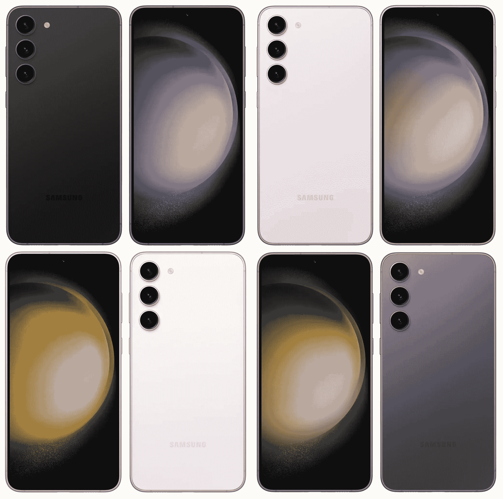
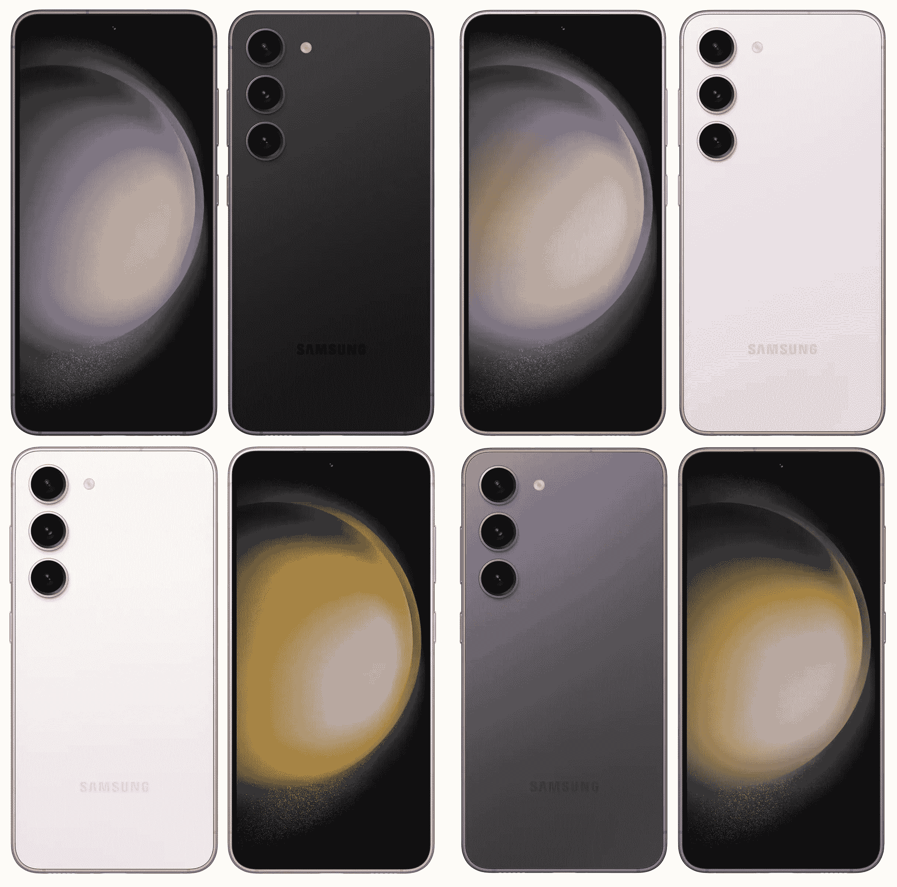
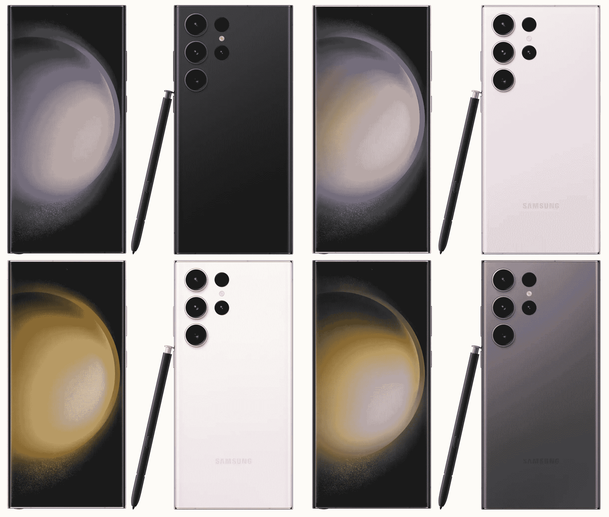

# 新的 Galaxy S23 系列泄漏揭示了拆封前的所有细节

> 原文：<https://www.xda-developers.com/samsung-galaxy-s23-series-leak-specs-price/>

随着我们越来越接近三星的 Galaxy Unpacked 活动，关于 Galaxy S23 系列的泄漏已经开始增加。本周早些时候，我们看到了阵容中所有三款设备的[泄露渲染图，确认了即将到来的型号的微妙设计变化和颜色。然后我们让](https://www.xda-developers.com/samsung-galaxy-s23-lineup-leaked-renders/)[先来看看](https://www.xda-developers.com/samsung-galaxy-s23-cases-massive-leak/)三星将为这些设备提供的保护套。知名泄密者 Roland Quandt 最近[分享了 Galaxy S23](https://www.xda-developers.com/galaxy-s23-marketing-images-colors/) 的官方营销图片，现在已经发掘出了你想知道的关于 Galaxy S23 阵容的一切。

## 三星 Galaxy S23 和 Galaxy S23 Plus 泄露的规格

根据 Quandt (via *WinFuture* )的说法，基本型号 Galaxy S23 将配备 6.1 英寸 Super AMOLED FHD+显示屏，具有 120Hz 刷新率和 48-120Hz 可变刷新率支持。据报道，Plus 型号将配备更大的 6.6 英寸 Super AMOLED 面板，具有相同的刷新率规格和分辨率。这两款设备都将采用康宁最新的 Gorilla Glass Victus 2，以提供刮擦和跌落保护。

 <picture></picture> 

Leaked renders of the Galaxy S23 (Image credit: Evan Blass)

在内部，Galaxy S23 和 Galaxy S23 Plus 将封装高通的骁龙 8 Gen 2 芯片，采用 8GB LPDDR5 RAM(而不是更快的 LPDDR5X RAM)。三星将提供 128GB 和 256GB 板载存储的基本型号，而 Plus 型号将提供 256GB 和 512GB 的内存。正如你所料，这些设备不会配备 microSD 卡插槽。

Galaxy S23 和 Galaxy S23 Plus 将采用相同的相机硬件，包括具有双像素自动对焦和 85 度 FoV 的 50MP f/1.8 主相机，具有 120 度 FoV 的 12MP f/2.2 广角相机，具有 3 倍光学变焦的 10MP f/2.4 长焦相机，以及具有自动对焦和 80 度 FoV 的 12MP f/2.2 自拍相机。

 <picture></picture> 

Leaked renders of the Galaxy S23 Plus (Image credit: Evan Blass)

正如之前泄露的消息所述，这两款机型还将获得 200mAh 更大的电池。Galaxy S23 将配备 3900 毫安时电池，支持 25W 有线快速充电，而 Plus 型号将配备 4700 毫安时电池，支持 45W 有线快速充电。据报道，这些设备将提供 Wi-Fi 6E、NFC、蓝牙 5.3 和 UWB(仅限 Plus 变体)连接。三星已经表示，这些设备将运行基于 Android 13 的 UI 5.1。

## 三星 Galaxy S23 超泄露规格

据报道，顶级的 Galaxy S23 Ultra 将配备大型 6.8 英寸动态 AMOLED 2X 面板，分辨率为 3088x1440p，刷新率为 120Hz，支持 1-120Hz 可变刷新率。它也将获得大猩猩玻璃 Victus 2 保护。与更便宜的版本一样，该设备将采用骁龙 8 Gen 2 SoC，配有 8GB 或 12GB 的 LPDDR5 RAM 和 256GB 或 512GB 的板载存储。目前，尚不清楚三星是否计划提供 1TB 存储版本的设备。

三星将在 Galaxy S23 Ultra 上提供大规模的摄像头升级，这将是该公司第一款配备 200MP 主摄像头的设备。Quandt 表示，其余的相机将与 Galaxy S22 Ultra 上的相机相同，包括一个 12MP 超宽相机和两个 10MP 长焦相机。然而，该设备将像廉价机型一样，配备一个新的 12MP f/2.2 自拍相机。

 <picture></picture> 

Leaked renders of the Galaxy S23 Ultra (Image credit: Evan Blass)

其他值得注意的功能包括 Wi-Fi 6E、蓝牙 5.3、NFC 和 UWB 支持，以及 5,000mAh 电池和 45W 有线快速充电支持。与其他两个版本一样，该设备将运行基于 Android 13 的 UI 5.1。我们已经知道这款手机将支持 S Pen，并且在机箱中有一个专用的 S Pen 插槽，但我们没有关于三星可能提供的新 S Pen 功能的任何信息。

尽管 Quandt 没有透露任何定价细节，但来自谷歌的另一份报告显示，三星可能会将这三款手机的价格提高 100 美元。因此，基本版 Galaxy S23 的售价约为 940 美元，Galaxy S23 Plus 的售价约为 1149 美元，Galaxy S23 Ultra 的售价约为 1358 美元。然而，价格上涨可能是合理的，因为据报道，三星正在将 Plus 和 Ultra 变种的基本存储增加一倍。

基于这些规格你怎么看 Galaxy S23 系列？你期待这些设备吗？在下面的评论区分享你的想法。您还可以在三星的网站上注册您对即将推出的设备的兴趣，并在购买时获得高达 100 美元的信用。

* * *

**来源:** WinFuture ( [1](https://winfuture.de/news,134094.html) 、 [2](https://winfuture.de/news,134100.html) )、 [9to5Google](https://9to5google.com/2023/01/17/galaxy-s23-price-rumor/)