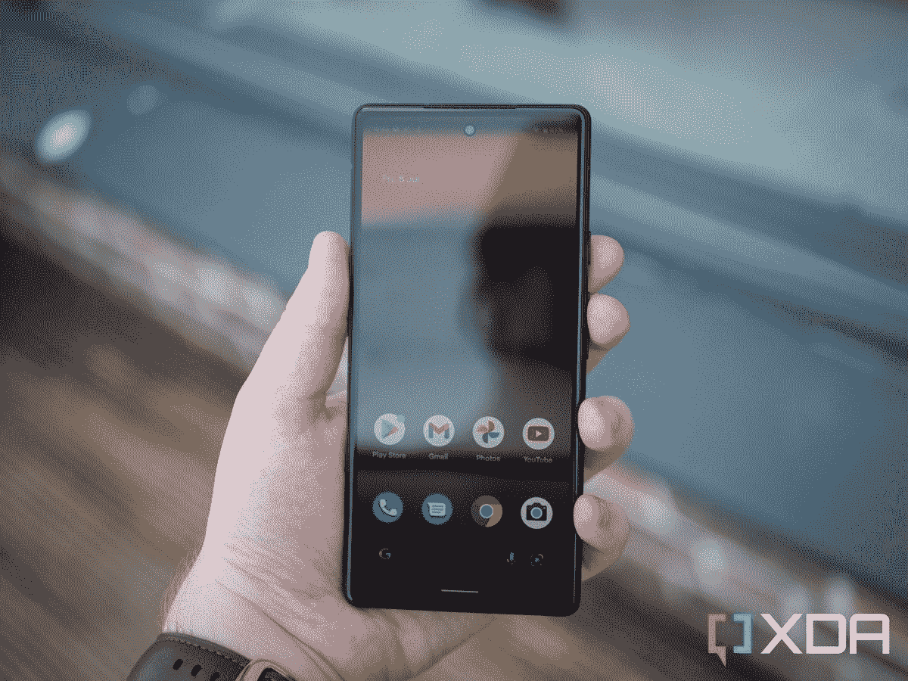

# 三星 Galaxy S23 vs 谷歌 Pixel 6a:你该买哪个？

> 原文：<https://www.xda-developers.com/samsung-galaxy-s23-vs-google-pixel-6a/>

三星的 [Galaxy S23 系列](https://www.xda-developers.com/samsung-galaxy-s23/)对去年的 Galaxy S22 系列进行了微小但重要的更新。虽然如果你已经拥有一部 Galaxy S22 设备，这些新设备并不完全值得你花钱，但如果从二代或三代旧手机升级，三星的最新旗舰手机是 T2 最好的手机之一。base Galaxy S23 是那些想要经济实惠的旗舰产品的人的完美选择，因为它在小尺寸中提供了高通最新的 SoC、华丽的显示屏、出色的摄像头和令人印象深刻的电池续航时间。但是，是否值得忘掉[谷歌 Pixel 6a](https://www.xda-developers.com/google-pixel-6a-review/) ？这正是我们要找的。

Galaxy S23 比 Pixel 6a 贵得多，尤其是后者现在经常以 300 美元的折扣价出售。它也比 2022 年年中问世的 Pixel 6a 更新很多。然而，三星的旗舰确实带来了大量的额外功能，这可能证明一些人的高价是合理的。

## 三星 Galaxy S23 与谷歌 Pixel 6a:定价和可用性

全新的三星 Galaxy S23 基本 8GB 内存和 128GB 存储型号的起价为 800 美元，256GB 型号的起价为 860 美元。它可以在三星的网站上和通过各种零售商预订，并将于 2 月 17 日正式发布。你可以买到几种很酷的配色，包括幻影黑、奶油色、绿色和淡紫色。还有一些 Samsung.com 独有的颜色:石灰和石墨。你也不用付全价。查看我们的 [best Galaxy S23 预购交易综述](https://www.xda-developers.com/best-samsung-galaxy-s23-deals/)，获得免费存储升级和其他优惠。

相比之下，谷歌 Pixel 6a 更实惠。它去年在美国的售价为 450 美元，但你可以在包括谷歌在内的多家零售商那里找到售价低至 300 美元的产品。该设备有三种颜色可供选择:木炭色、粉笔色和鼠尾草色。如果价格是你唯一关心的指标，Pixel 6a 显然是两款手机中更好的选择。但 Galaxy S23 在原始规格方面确实让谷歌的 mid-ranger 黯然失色。

## 三星 Galaxy S23 与谷歌 Pixel 6a:规格

考虑到巨大的价格差异以及它们对不同受众的影响，当你并排看它们的规格时，Pixel 6a 永远无法与 Galaxy S23 相匹配。后者几乎在所有类别中都有更好的装备，但电池更小。以下是每款手机的主要规格:

| 

规范

 | 

三星 Galaxy S23

 | 

谷歌像素 6a

 |
| --- | --- | --- |
| 建设 | 

*   装甲铝框架
*   大猩猩玻璃 Victus 2 正面和背面
*   IP68 防尘防水等级

 | 

*   铝制中框
*   塑料背面
*   大猩猩玻璃 3 正面
*   IP67 防尘防水等级

 |
| 尺寸和重量 | 

*   5.76 x 2.79 x 0.3 英寸(146.3 x 70.8 x 7.62mm 毫米)
*   5.93 盎司(168.1 克)

 | 

*   6 x 2.8 x 0.35 英寸(152.2 x 71.8 x 8.9mm 毫米)
*   6.3 盎司(178 克)

 |
| 显示 | 

*   6.1 英寸动态 AMOLED 2X Infinity-O
*   FHD+425 dpi 平板电视
*   120Hz 自适应刷新率
*   1，750 尼特峰值亮度

 | 

*   6.1 英寸有机发光二极管
*   FHD+429 PPI 平板显示器
*   60Hz 刷新率
*   1，100 尼特峰值亮度

 |
| 处理器 | 银河版高通骁龙 8 第二代 | 谷歌张量(第 1 代) |
| RAM 和存储 | 

*   8GB LPDDR5 内存/8GB LPDDR5X 内存
*   128GB UFS 3.1 存储/ 256GB UFS 4.0 存储

 | 

*   6GB LPDDR5 RAM
*   128GB UFS 3.1 存储

 |
| 电池和充电 | 

*   3900 毫安时
*   25W 有线快充支持
*   15W 无线快充支持
*   无线 PowerShare

 | 

*   4410 毫安时
*   18W 有线快速充电支持
*   没有无线充电

 |
| 安全性 | 

*   超声波显示指纹扫描仪
*   三星 Knox
*   三星 Knox 保险库

 | 

*   显示指纹扫描仪
*   泰坦 M2 芯片

 |
| 后置摄像头 | 

*   小学:50MP f/1.8，OIS
*   超宽:12MP f/2.2，120 度 FoV
*   长焦:10MP f/2.4，3 倍光学变焦，OIS

 | 

*   小学:1220 万女生/1.73，OIS
*   超宽:12MP f/2.2，114 度 FoV

 |
| 前置摄像头 | 120 万像素 f/2.2，双 PDAF，80 度视野 | 800 万像素 f/2.0，84 度视场角 |
| 港口 | USB-C | USB-C |
| 声音的 | 立体声扬声器 | 立体声扬声器 |
| 连通性 | 

*   5G sub 6/毫米波
*   Wi-Fi 6E
*   蓝牙 5.3
*   国家足球联盟
*   超宽带

 | 

*   5G 毫米波(仅限威瑞森)
*   5G 6 GHz 以下
*   Wi-Fi 6E
*   蓝牙 5.2
*   国家足球联盟

 |
| 软件 | 一个基于 Android 13 的 UI 5.1 | 安卓 13 |

## 构建质量和显示:Galaxy S23 独占鳌头

Galaxy S23 和 Pixel 6a 的构造非常不同，但这是意料之中的，因为三星的旗舰产品价格要高出数百美元。虽然这两款手机都采用了铝制框架，但 Galaxy S23 在正面和背面都配有康宁最新的大猩猩玻璃 Victus 2。Pixel 6a 仅在显示屏和塑料背板上提供大猩猩玻璃 3 保护。

虽然两种型号都具有防尘防水的 IP 等级，但 Galaxy S23 提供了更好的防水性能。它通过了 IP68 认证，这意味着它可以在 1.5 米的水下生存长达 30 分钟。Pixel 6a 的防护等级为 IP67，因此您最多只能将其浸入一米深的水中 30 分钟。不过，这两款手机的防尘能力是一样的。

在显示屏方面，Galaxy S23 配备了更加优质的 6.1 英寸动态 AMOLED 2X 面板，刷新频率为 120Hz，提供自适应刷新率支持，峰值亮度为 1，750 尼特。Pixel 6a 还装有 6.1 英寸的 OLED 面板，但它的最高频率为 60 赫兹，峰值亮度仅为 1100 尼特。因此，Galaxy S23 将为您带来更明亮、更流畅的观看体验。

尽管两款手机都采用 6.1 英寸显示屏，但 Galaxy S23 比 Pixel 6a 略小，重量也略轻。这一点，加上制造质量的差异，意味着 Galaxy S23 提供了更优质的手感，更适合单手使用。

## 性能:骁龙 8 Gen 2 >张量

Galaxy S23 装有高通最新旗舰芯片组的定制版本，称为 Galaxy 的[骁龙 8 Gen 2，承诺比骁龙 8 Gen 1 的图形性能快 40%，电池寿命长 20%。高通还声称，该芯片组针对人工智能相关任务的优化能力提高了 40%，比其前代产品更加强大和高效。](https://www.xda-developers.com/qualcomm-snapdragon-8-gen-2-for-galaxy/)

鉴于[谷歌的第二代张量 SoC 不如骁龙 8 代 1](https://www.xda-developers.com/google-tensor-g2/#is-google-tensor-g2-just-as-good-as-the-snapdragon-8-gen-1-or-the-exynos-2200) 强大，Pixel 6a 中的第一代张量 SoC 不可能与骁龙 8 代 2 for Galaxy 相匹配。虽然您在 Pixel 6a 的日常使用中不会遇到任何问题，但其较弱的 SoC 在游戏等密集型任务中的表现不会很好，您甚至可能会遇到散热问题。

Pixel 6a 上的多任务处理体验也会受到影响，因为它只有 6GB 的 LPDDR5 RAM。虽然三星也在基本 Galaxy S23 上提供了较旧的 LPDDR5 内存，但 8GB 内存的体验应该会稍好一些。也可以升级到 8GB 更快的 LPDDR5X RAM。基本的 Galaxy S23 和 Pixel 6a 封装了 128GB 的 UFS 3.1 存储，所以读写速度应该差不多。然而，更高端的 Galaxy S23 拥有 256GB 更快的 UFS 4.0 存储，提供更快的读写速度。

 <picture></picture> 

The Pixel 6a's display is clearly inferior to the Pixel 6 or Pixel 7's screens. 

Pixel 6a 唯一胜过 Galaxy S23 的地方是电池寿命。与 Galaxy S23 较小的 3900 毫安时电池相比，Pixel 6a 上较大的 4410 毫安时电池结合 60Hz 显示屏将确保该设备在一次充电后持续更长时间。然而，Galaxy S23 提供了更快的 25W 有线充电和无线充电支持，而 Pixel 6a 没有，这使得竞争更加公平。

## 软件:安卓 13 但不一样

虽然两款手机都运行 Android 13，但软件体验却截然不同。Galaxy S23 运行三星高度定制的 One UI 5.1 皮肤，在常见的谷歌应用程序基础上，有不同的默认应用程序和大量来自三星生态系统的附加应用程序(或者你可以称之为膨胀软件)。它还提供了几个额外的功能，如 Windows 链接、三星智能开关等，这些都是 Pixel 6a 所没有的。

另一方面，Pixel 6a 运行的是谷歌版本的 Android 13，比 One UI 5.1 更接近于普通 Android。虽然它缺少你在 One UI 5.1 中会发现的一些功能，但它用一些像素专属的功能和应用程序来弥补，如 Call Screen、Hold For Me、Google Recorder 应用程序等。

哪种用户界面在这里胜出取决于个人偏好。但是当你考虑到软件更新的因素时，Galaxy S23 具有明显的优势。三星承诺为 Galaxy S23 提供四次操作系统升级和五年的安全更新，这意味着该设备将在 Android 17 之前获得平台更新，在 2028 年之前获得安全更新。然而，谷歌只会为 Pixel 6a 提供三个平台更新和五年的安全更新。由于 Pixel 6a 是去年随 Android 12 推出的，所以只会更新到 Android 15，直到 2027 年才会收到安全更新。

## 相机:更好的硬件对更好的软件

三星为 Galaxy S23 配备了与去年 Galaxy S22 相同的后置摄像头。它有一个带 OIS 的 50MP 主摄像头，一个 120 度视野的 12MP 超宽摄像头，和一个带 OIS 的 10MP 3x 长焦摄像头。在正面，它有一个新的 1200 万像素自拍相机，配有双 PDAF 和 80 度视野。

由于后置摄像头设置与 Galaxy S22 相同，我们希望这款手机能够提供出色的照片和视频，但你不应该指望它能提供与 Galaxy S22 Ultra 相同的变焦水平。您可以[查看 Galaxy S22 照片样本的图库](https://imgur.com/a/6Z0KbPL)以供参考。自拍相机应该会有一些改进，但你必须等到我们测试 Galaxy S23 的相机才能看到一些样本。我们将在我们的深入评论上线后不久用相关图片更新这篇文章。

谷歌 Pixel 6a 在相机硬件方面无疑是逊色的。它配备了一个带 OIS 的 12.2MP 主摄像头和一个背面带 114 度视野的 12MP 超宽摄像头，以及一个正面带 84 度视野的 8MP 自拍摄像头。但是 Pixel 6a 可以拍摄一些令人惊叹的照片，这要感谢谷歌的计算摄影印章，它会在你拍摄图像后处理和清理图像。它甚至拥有谷歌令人印象深刻的天文摄影模式，可以拍摄出色的夜间照片。你可以在[的 Flickr 图库](https://www.flickr.com/photos/145036207@N04/albums/72177720300678106)中查看 XDA 的亚当·康威点击的一些样本照片。

就视频拍摄而言，Galaxy S23 支持 30 FPS 的 8K 视频拍摄、60 FPS 的 4K 视频、120 FPS 的 FHD 视频和 960 FPS 的 Super Slow-Mo 视频。然而，谷歌 Pixel 6a 仅限于从主摄像头以 60 FPS 的速度捕捉 4K 视频，从超宽摄像头以 30 FPS 的速度捕捉 4K 视频。

## 三星 Galaxy S23 和谷歌 Pixel 6a:你该买哪个？

Galaxy S23 几乎在所有方面都是明显的赢家，如果钱不是问题，你应该选择它而不是 Pixel 6a。但如果你预算紧张，Pixel 6a 在大多数情况下都不会让你失望。当然，这款设备感觉不那么高端，没有那么好的显示屏，在游戏或多任务处理时也不会表现得那么好，但如果你愿意做出这些妥协，你会节省数百美元。

Galaxy S23 的前期成本会更高，但由于三星令人印象深刻的软件更新承诺，它将提供更好的体验和更长的使用时间。如果你不打算在未来五年内更换手机，额外购买 Galaxy S23 是更明智的选择。只要确保它一到你就在它上面盖上一个外壳和屏幕保护器，以避免意外损坏。你可以查看我们关于[最佳 Galaxy S23 保护套](https://www.xda-developers.com/best-cases-samsung-galaxy-s23/)和 [Galaxy S23 屏幕保护套](https://www.xda-developers.com/best-samsung-galaxy-s23-screen-protectors/)的综述，挑选一款适合你的需求。

*   高端精选

    三星 Galaxy S23 是一款高端旗舰产品，拥有定制的骁龙 8 代 2 SoC、明亮的高刷新率显示屏和令人印象深刻的摄像头。如果你想以高价购买最新的规格，这是一个更好的选择。

    T13
*   超值

    谷歌 Pixel 6a 是一款中端设备，采用谷歌内部张量 SoC，并提供令人印象深刻的计算摄影印章。它通常以很高的折扣出售，这使得它成为精打细算的人的绝佳选择。