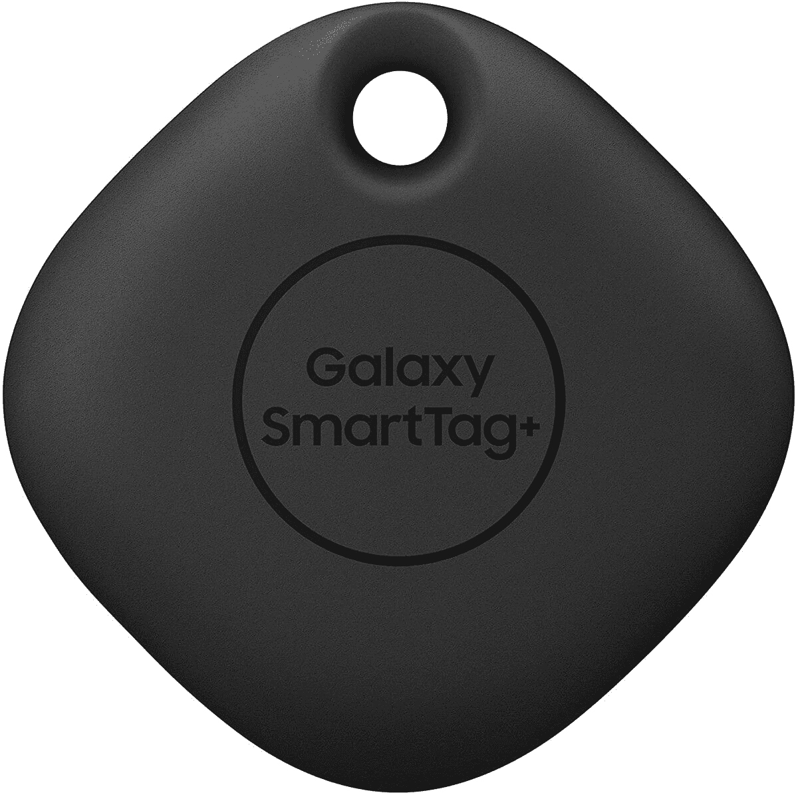

# 三星 Galaxy SmartTag+现已上市

> 原文：<https://www.xda-developers.com/samsung-galaxy-smarttag-plus-now-available/>

为了走在苹果 AirTags 新闻周期的前面，三星[宣布了 SmartTag+](https://www.xda-developers.com/galaxy-smarttag-plus-pre-order/) ，这是今年早些时候推出的 SmartTag 的更强大的继任者。在短暂的预购期之后，SmartTag+现在可以从[三星](https://shop-links.co/1739273121977828476?u1=d59dad63-b683-44b6-b6e7-9b5a8a225e16)和[亚马逊](https://www.amazon.com/Samsung-SmartTag-Bluetooth-Tracker-Locator/dp/B08NRNSVRK?tag=xda-1jn04g0-20&ascsubtag=UUxdaUeUpU2462&asc_refurl=https%3A%2F%2Fwww.xda-developers.com%2Fsamsung-galaxy-smarttag-plus-now-available%2F&asc_campaign=Short-Term)买到，售价 39 美元。

SmartTag+与[原始型号](https://www.xda-developers.com/samsung-galaxy-smarttag-launch-find-lost-items/)的区别在于，除了支持蓝牙 LE 之外，更新的位置跟踪器还具有超宽带技术。SmartTag+还支持 AR 功能，当追踪器在附近时，可以轻松找到它。使用 SmartThings 应用程序时，SmartTag+可以追踪到近 400 英尺的距离。作为一个额外的奖励，标签的按钮可以用于有限的家庭自动化。

SmartTag+还可以通过 Galaxy Find 网络进行跟踪，该网络由注册了该服务的 Galaxy 智能手机支持。该功能类似于苹果的 Find My network，允许 AirTags 用户在地图上定位追踪器。如果 AirTags 不在服务范围内，当追踪器被标记为丢失时,“查找我的网络”可以帮助用户定位追踪器。

值得注意的是，三星唯一支持超宽带的设备是 Galaxy S21+、S21 Ultra 和 Note 20 Ultra，所以如果你没有这些设备，你最好购买原始的 SmartTag，售价为 29 美元(与 AirTags 相同)。

位置追踪器可能看起来不像是必备的配件，但拥有一个可能意味着找到丢失的背包和找不到丢失的背包之间的差异。随着世界上某些地区的封锁限制的放松，在您的行李中放置一个 SmartTag+可能会有所帮助。如果有的话，它是为了内心的平静。

位置追踪器已经存在多年了——由一家名为 Tile 的公司而闻名——但是随着[苹果的 AirTags 现在可用](https://www.xda-developers.com/apple-airtags-review/)，人们对这些配件能做什么重新产生了兴趣。如果你在三星生态系统中，SmartTag+当然值得一试。

 <picture></picture> 

Samsung Galaxy SmartTag+

##### 三星 Galaxy SmartTag+

通过从亚马逊购买 SmartTag+,找到丢失的钱包、钥匙或背包。

 <picture></picture> 

Samsung Galaxy SmartTag+

##### 三星 Galaxy SmartTag+

无论您是在旅行还是只是在城里逛逛，添加 SmartTag+将有助于您跟踪丢失的物品。