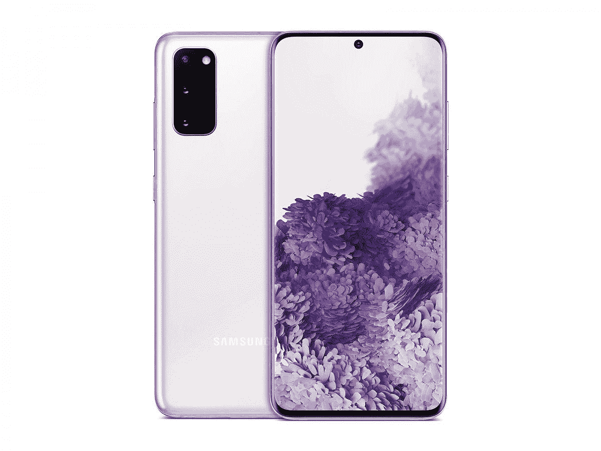

# 三星 Galaxy 商店进行了大规模的重新设计，重点放在了游戏上

> 原文：<https://www.xda-developers.com/samsung-galaxy-store-gets-a-big-redesign-with-an-emphasis-on-games/>

三星对其 Galaxy 商店进行了重新设计，现在只有两个标签:一个用于应用程序，一个用于游戏。不出所料，游戏版块中突出的标题是*堡垒之夜*，这是[之前从 Play Store](https://www.xda-developers.com/fortnite-circumvents-google-play-fees-direct-payment-option/) 和苹果应用商店中撤下的。

“现在，Galaxy Store 是美国唯一的移动应用商店，你可以从 Epic Games、*堡垒之夜*下载热门游戏，并与朋友一起组队，”三星在[博客文章](https://news.samsung.com/us/galaxy-store-goes-all-gaming-fortnite-xbox/)中说。

作为重新设计的一部分，底部栏被减少为应用程序和游戏两个部分，游戏部分放在应用程序之前。其他部分，如用于查看 Galaxy Watch 应用程序的部分，被移到了顶部的滚动条上；同一个酒吧还提供快速访问独家和个性化。

三星还鼓励用户利用 Galaxy 专属的奖励和福利。例如，如果您从 Galaxy 商店购买游戏，您将获得奖励积分，您可以将这些积分用于将来的另一次购买。

在其博客文章中，三星提醒用户，他们也可以通过其 Galaxy 商店访问 Xbox Game Pass Ultimate。虽然用户可以通过谷歌的 Play Store 访问微软的服务，但只有 Galaxy Store 的用户才能享受到应用内购买功能的便利。

三星的 Galaxy Store 一直是谷歌 Play Store 的一个不错的替代品，为 Galaxy 用户提供一些独家应用。将它的商店吹捧为美国唯一一家可以找到堡垒之夜的移动应用商店是一件大事，尤其是考虑到这款游戏可能至少会在明年年初之前离开 Play Store，届时 Epic Games 和谷歌预计将进行审判。

如果你拥有一台 Galaxy 设备，你应该可以从今天开始看到重新设计的 Galaxy 商店。

 <picture></picture> 

Samsung Galaxy S20 5G

##### 三星 Galaxy S20

有什么比使用三星 Galaxy S20 5G 更好的方式来访问 Galaxy Store 并玩堡垒之夜游戏呢？这是三星最全面的设备之一，也是享受移动游戏的绝佳方式。