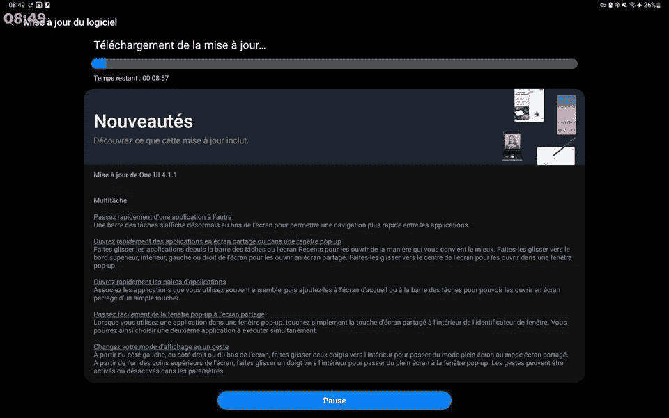

# Galaxy Tab S7 系列获得了一个具有新的多任务处理功能的 UI 4.1.1

> 原文：<https://www.xda-developers.com/samsung-galaxy-tab-s7-one-ui-4-1-1-update/>

在为其 [Galaxy Tab S8 系列](https://www.xda-developers.com/one-ui-android-12l-galaxy-tab-s8-series/)和一系列[老款可折叠产品](https://www.xda-developers.com/samsung-one-ui-4-1-1-android-12l-older-foldables/)推出基于 Android 12L 的 UI 4.1.1 之后，三星现在发布了老款 Galaxy Tab S7 系列的更新。它为三星上个月推出的 [Galaxy Z Fold 4](https://www.xda-developers.com/samsung-galaxy-z-fold-4-review/) 大屏幕设备带来了所有新的多任务功能和改进，包括新的任务栏。

三星已经正式分享了 Galaxy Tab S7 和 Galaxy Tab S7 Plus 的 One UI 4.1.1 changelog。根据 Reddit 上的用户报告，更新已经在一些地区开始推出。如果您还没有收到，您应该会在接下来的几天内收到更新。

 <picture></picture> 

Credit: u/3bdellatif

Galaxy Tab S7 和 Galaxy Tab S7 Plus 的一个 UI 4.1.1 带来了许多新的多任务功能。它包括一个新的任务栏，可以更快地在应用程序之间导航，在分屏视图或弹出窗口中打开应用程序，并在分屏模式下启动常用的应用程序对。此外，此次更新还带来了新的多任务手势、从图像中提取文本的 OCR 功能，以及为联系人添加自定义呼叫背景的能力。

此外，One UI 4.1.1 为我的文件应用程序、三星键盘和三星互联网浏览器带来了优化。最后，更新还包括 2022 年 8 月的 Android 安全补丁。通过下面提供的源代码链接查看完整的 changelog。

Galaxy Tab S7 和 Galaxy Tab S7 Plus 的 One UI 4.1.1 更新将适用于这两款平板电脑的 Wi-Fi 和蜂窝版本。您可以通过转至设备设置中的*软件更新*部分来手动检查。

*你的 Galaxy Tab S7 或 Galaxy Tab S7 Plus 上有没有收到一个 UI 4.1.1？你喜欢新的多任务功能吗？请在下面的评论区告诉我们。*

* * *

**来源:** [三星](https://doc.samsungmobile.com/SM-T976B/XEF/doc.html)， [Reddit](https://www.reddit.com/r/GalaxyTab/comments/x6afnw/just_got_one_ui_411_on_my_tab_s7_plus/)