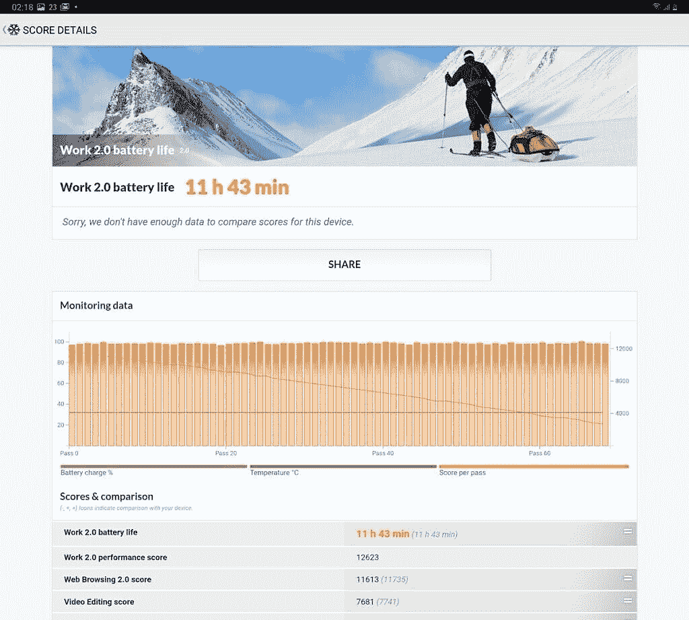

# 三星 Galaxy Tab S7 评论:值得升级

> 原文：<https://www.xda-developers.com/samsung-galaxy-tab-s7-review/>

谈到 Android 平板电脑，三星是少数几家仍在生产产品、试图跟上苹果产品的原始设备制造商之一。去年的 Galaxy Tab S6 无疑是 Android 团队提供的最好的平板电脑体验之一。但是，由于 Android 在平板电脑上的工作方式，它也有不少缺点。虽然[三星](https://www.xda-developers.com/tag/samsung/)试图通过其 [DeX 模式](https://www.xda-developers.com/tag/samsung-dex/)解决其中一些问题，但当我评测 Galaxy Tab S6 时，我的体验相当平淡。这就是新款[三星 Galaxy Tab S7 和 Galaxy Tab S7 Plus](https://www.xda-developers.com/samsung-galaxy-tab-s7/) 的用武之地。

今年 8 月，三星推出了 Galaxy Tab S7 duo [和 Galaxy Note 20 系列](https://www.xda-developers.com/samsung-galaxy-note-20/)。通过最新的平板电脑，三星试图解决用户在 Galaxy Tab S6 上面临的大部分问题。我使用 Galaxy Tab S7 已经有一个月左右了，下面是我使用三星最新旗舰平板电脑的体验。

## 三星 Galaxy Tab S7:规格

| 

规格

 | 

三星 Galaxy Tab S7

 |
| --- | --- |
| **尺寸&重量** | 

*   165.3 x 253.8 x 6.3mm 毫米
*   无线网络:498g
*   LTE:500g

 |
| **显示** | 

*   11 英寸 WQXGA TFT 液晶显示器
*   2560 x 1600
*   16:10
*   120 赫兹刷新率
*   HDR10+

 |
| **SoC** | 

*   高通骁龙 865 Plus
*   肾上腺素 650

 |
| **闸板&存放** | 

*   6GB 内存
*   128GB UFS 3.0 存储
*   用于扩展的 microSD 卡插槽(最高 1TB)

 |
| **电池&充电** | 

*   8000 毫安时
*   45W 快充支持

 |
| **安全** | 

*   电容式指纹传感器

 |
| **后置摄像头** | 

*   1300 万像素 f/2.0 主摄像头
*   500 万像素，f/2.2 超宽摄像头

 |
| **前置摄像头** |  |
| **端口** |  |
| **音频** | 

*   四声道扬声器
*   由 AKG 调音

 |
| **连通性** | 

*   蓝牙 v5.0
*   802.11 a/b/g/n/ac/ax 双频 Wi-Fi
*   GPS，Glonass，北斗，伽利略

 |
| **软件** | 一个基于 Android 10 的 UI 2.5 |

***注:**三星给我们发来了本次评测的 Galaxy Tab S7 (Wi-Fi + LTE)和键盘盖。该公司对此次审查的内容没有任何意见。*

* * *

## 深思熟虑的设计变化

乍一看，Galaxy Tab S7 看起来与它的前代产品没有什么不同。但仔细观察，你会发现三星这次在改进设计上花了一些心思。通过 Galaxy Tab S7，三星似乎已经意识到大多数人将在风景模式下使用平板电脑，无论是用于媒体消费还是生产力。

因此，该公司将前置摄像头移到了一个更合适的位置，现在当你在横向模式下使用平板电脑时，它位于显示屏的顶部。这种新方法的一个例子也可以在背板上看到，因为三星和 AKG 的标志也以类似的方式进行了调整。

背板现在也有一个细长的玻璃部分来容纳与相机模块对齐的 S Pen。由于这一部分更容易通过触摸与背板的其余部分区分开来，因此将 S Pen 放回充电位置比放在 Tab S6 上更简单。

LED 闪光灯是另一个方便的附加功能，当在不太理想的照明条件下用平板电脑扫描文件时，它可以派上用场。最后，Galaxy Tab S7 的边缘比 Tab S6 更直，看起来更酷，但长时间握持会有点不舒服。

三星 Galaxy Tab S7 采用 11 英寸 WQXGA (2560x1600) TFT 面板，长宽比为 16:10，刷新率为 120Hz。虽然 Galaxy Tab S7 的显示屏似乎比 Tab S6 的 AMOLED 面板低了一级，但事实并非如此。

并排看两个显示器，你可以很容易地看出 Galaxy Tab S7 上的显示器更亮，色彩还原更好。当然，黑色看起来不深，电池寿命可能会受到轻微影响，但我宁愿选择更快的刷新率，而不是更深的黑色。显示器仍然提供 HDR10+支持，在平板电脑上观看 HDR 的内容绝对是一种享受。

凭借其出色的显示和出色的音频性能，三星 Galaxy Tab S7 非常适合媒体消费。

与 Tab S6 非常相似，Galaxy Tab S7 采用了由 AKG 调谐的四扬声器设置。这款平板电脑两侧各有一个扬声器，可以提供出色的立体声分离效果。音频质量一流，扬声器在最大音量下可以发出相当大的声音，这使得 Galaxy Tab S7 成为任何希望购买平板电脑用于媒体消费的人的完美选择。

## 性能和生产力

三星 Galaxy Tab S7 采用高通旗舰产品骁龙 865 Plus 芯片和 6GB 内存，在性能方面毫不逊色。在日常使用中，这款平板电脑感觉比我的 Galaxy Note 20 Ultra (Exynos 变种)更快，无论我如何使用它，我都没有遇到任何性能问题。正如所料，该平板电脑在综合基准测试中表现也很好，你可以查看下面的一些结果截图。

在平板电脑上进行多任务处理也是轻而易举的事情，我用它工作了几天，没有遇到什么大问题。虽然 Android 仍然不能提供像 iPadOS 一样完美的平板电脑体验，但三星的 One UI 有一些很酷的功能，这些功能大大改善了用户体验，优于传统的 Android。在过去的一年里，三星对其软件进行了一些重大改进，我在 Tab S6 上遇到的大多数问题都没有遇到。

三星的 DeX 模式也比我上次用的时候有了明显的提升。虽然 Chrome 在默认情况下仍然不能打开网站的桌面版本，并提示我下载一些谷歌服务的 Android 应用程序，但三星的内置浏览器可以打开谷歌文档、幻灯片和表格的桌面版本，没有任何问题。在使用 DeX 模式时，我仍然错过的一件事是分割浏览器标签并在单独的窗口中打开它们的能力，这需要启动另一个应用程序实例。

在过去的一年中，DeX 模式有了很大的改进，但三星仍有一些抛光工作要做。

尽管三星在 DeX 模式上朝着正确的方向迈出了一步，但 Galaxy Tab S7 仍然无法提供与同等价格的 Chromebook 相同的工作体验。最重要的是，没有键盘，DeX 模式几乎没有用，而且布局不够直观，只使用触摸屏也不够直观。因此，如果你打算将平板电脑用作笔记本电脑的替代品，你必须投资购买可选的键盘盖。

## 更舒适的打字体验

说到这里，三星还更新了 Galaxy Tab S7 的键盘盖，它比 Tab S6 的键盘盖好得多。首先，三星改变了键盘盖与平板电脑的连接方式。该公司似乎已经考虑到了用户的反馈，现在键盘盖使用磁铁附着在平板电脑上。

键盘本身也有一些改进——它稍微大了一些(部分是因为平板电脑的显示屏更大)，按键间隔更好，按键行程明显更好，整个包装感觉更刚性。在不稳定的表面上使用带键盘盖的平板电脑仍然不会产生信心，但它比 Tab S6 稳定得多，而且在必要时可以完成工作。

三星还对键盘进行了深思熟虑的添加，它现在有一个专用按钮来打开/关闭 DeX 模式和截图(这可能会证明与通常的电源按钮+音量降低快捷键相比有点麻烦)。遗憾的是，Galaxy Tab S7 的键盘仍然没有专门的功能行，但三星已经在 Galaxy Tab S7 Plus 的键盘盖上添加了这一功能。

虽然这次我对键盘有了更好的体验，但键盘盖上的触控板仍需要一些微调。虽然它更大并支持多手指手势，但触控板缺乏任何形式的意外触摸保护。这被证明是一个主要问题，特别是由于大小的限制，我在按空格键和 Alt 键的同时不断地移动光标。

## 新的和改进的 S 笔

与苹果不同，三星的两款旗舰平板电脑都捆绑了 S Pen。Galaxy Tab S7 附带的 S Pen 只是 Galaxy Note 20 系列附带的 S Pen 的更大版本。它提供了相同的 9 毫秒超低延迟，并让您可以访问 Galaxy Note 20 Ultra 上的相同功能套件。

由于我不是一个很好的艺术家，我不能告诉你它对专业用途有多大用处。不过，我在 PENUP 上涂了颜色，这绝对很有趣，它是平板电脑上预装的。虽然我确实花了一些时间来习惯使用 S Pen 书写，但我在产品发布会上用平板电脑做笔记的体验非常棒。与 Galaxy Tab S6 一样，S Pen 放在背板的指定位置时可以无线充电。

## 体面的电池寿命

三星 Galaxy Tab S7 配备了一个 8，000 毫安时的大电池，足以让它度过一个典型的工作日。在我专门使用平板电脑工作的日子里，它能够在刷新率设置为 60Hz、亮度设置为 75%的情况下提供大约 9.5 小时的 SoT。切换到 120Hz，同样的使用情况下，SoT 下降到大约 7.5 小时。对我来说，一个典型的工作日通常包括写文章，一些轻微的照片编辑，以及检查 Slack，Asana 和 Gmail 的更新。如果你做一些更高性能的事情，你的里程可能会有所不同。

 <picture></picture> 

PCMark Work 2.0 Battery Life

为了给你更客观的测量 Galaxy Tab S7 的续航时间，我还跑了 PCMark 的 Work 2.o 续航时间基准测试。基准测试运行时，刷新率设置为自适应，亮度设置为 75%。这款平板电脑在多次运行中一直保持在 12 小时左右。但是由于基准测试[计算这些结果](https://s3.amazonaws.com/download-aws.futuremark.com/pcmark-android-technical-guide.pdf)的方式，平板电脑可能无法在现实世界中持续这么长时间。例如，三星 Galaxy Note 20 Ultra 在相同的测试中获得了 10 小时 35 分钟的成绩，但我的设备很少能提供超过 6 小时的 SoT。

就充电而言，Galaxy Tab S7 提供了对 45W 快充的支持。但遗憾的是，三星没有在包装盒中安装 45W 充电器。相反，这款平板电脑配有一个 15W 的充电器，从 10-100%给平板电脑充电需要大约 2.5 小时。

## 该不该买三星 Galaxy Tab S7？

三星 Galaxy Tab S7 是 Galaxy Tab S6 的一个显著改进，对于艺术家和便携式媒体设备的人们来说，它仍然是一个很好的选择。但 Wi-Fi 版本的起价为 649.99 美元/ 605 英镑/₹55,999€681 英镑，对于这个目的来说似乎有点太贵了。然而，如果你想要一个惊人的 120 赫兹显示，旗舰性能和惊人的音频，这是你必须支付的溢价。相比之下，128GB 存储空间的 11 英寸 iPad Pro 在₹71,900 的零售价为 799 / 769 美元/ €856.80 美元，这还不包括 Apple Pencil。

 <picture></picture> 

Samsung Galaxy Tab S7

##### 三星 Galaxy Tab S7

三星 Galaxy Tab S7 是 Android 团队提供的最好的平板电脑之一。对于任何寻找便携式媒体消费设备的人来说，这都是完美的选择。然而，三星仍需要在软件方面下功夫，使其成为笔记本电脑的绝佳替代品。

如果你打算购买 Galaxy Tab S7 作为笔记本电脑的替代品，那么你必须为键盘盖支付额外的 199.99 美元/₹13,299 189 英镑/ €199.90 英镑/199.90 英镑。即便如此，由于软件的限制，你可能会发现在平板电脑上工作有点令人沮丧。相反，你可以选择价格类似的 Chromebook，如惠普 Chrome book x360 14c(499 美元/ ₹55,999)，由于采用了 chrome 操作系统，它将提供更好的工作体验。但如果你能忽略这些软件缺陷，三星 Galaxy Tab 系列中的最新产品仍然是 Android 团队提供的最好的平板电脑。

你可以从 Samsung.com 的亚马逊或者美国的亚马逊购买三星 Galaxy Tab S7。您可以购买 S7 标签旁边的键盘盖，也可以单独购买。

### 三星 Galaxy Tab S7 书皮键盘

书皮键盘将 Galaxy Tab S7 变成了一台更高效的便携式电脑。

**Affiliate Links**

Amazon

[View at Amazon](https://www.amazon.com/Samsung-Galaxy-Keyboard-Black-EF-DT870UBEGUJ/dp/B08FSRVCW7?tag=xda-2eaedqm-20&ascsubtag=UUxdaUeUpU30209&asc_refurl=https%3A%2F%2Fwww.xda-developers.com%2Fsamsung-galaxy-tab-s7-review%2F&asc_campaign=Short-Term)