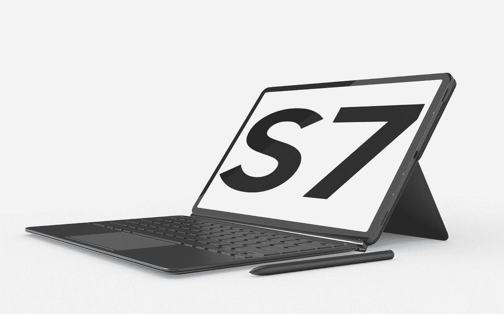

# Galaxy Tab S7 亮相——三星对苹果 iPad Pro 的回应

> 原文：<https://www.xda-developers.com/samsung-galaxy-tab-s7/>

**更新 1 (09/01/2020 @ 06:04 PM ET):** 三星、AT & T 和威瑞森宣布了 Galaxy Tab S7 和 Tab S7+在美国的定价和供货情况。滚动到底部了解更多信息。下面保留了 2020 年 8 月 5 日发表的文章。

在今年的第二次 Galaxy Unpacked 活动上，三星正式推出了其最新的旗舰 Android 平板电脑，三星 Galaxy Tab S7 和三星 Galaxy Tab S7+。这两款平板电脑代表了三星提供的最佳产品，这使它们成为市场上事实上最好的安卓平板电脑，因为除了华为，没有其他安卓设备制造商甚至*试图*制造一款像样的平板电脑。在前几代产品中，三星的最大努力与苹果相比仍然相形见绌，但随着新的 Galaxy Tab S7 的推出，三星终于推出了一款可以与苹果 iPad Pro 相媲美的平板电脑。

 <picture></picture> 

Samsung Galaxy Tab S7

## 三星 Galaxy Tab S7 规格

| 

规格

 | 

三星 Galaxy Tab S7

 | 

三星 Galaxy Tab S7+

 |
| --- | --- | --- |
| **尺寸&重量** | 253.8 英寸(宽)x 165.3 英寸(高)x 6.3 毫米(深)498 克(Wi-Fi)、500 克(LTE)、502 克(5G) | 285.0(宽)x 185.0(高)x 5.7mm 毫米(深)575 克(Wi-Fi、LTE、5g) |
| **显示** | 

*   11 英寸
*   2560x1600 (WQXGA)
*   LPTS TFT
*   120 赫兹

 | 

*   12.4 英寸
*   2800x1752 (WQXGA+)
*   超级 AMOLED
*   120 赫兹

 |
| **CPU & GPU** | 高通骁龙 865 Plus:1 个 Kryo 585(基于 ARM Cortex-A77)主内核@ 3.1GHz3 个 Kryo 585(基于 ARM Cortex-A77)性能内核@ 2.4GHz4 个 Kryo 385(基于 ARM Cortex A55)效率内核@ 1.8 GHz adre no 650 GPU 采用 TSMC 7 纳米(N7P)工艺制造 |
| **内存&存储** | 6GB LPDDR5 内存+ 128GB UFS 3.0 存储 8GB LPDDR5 内存+ 256GB UFS 3.0 存储可扩展存储(最高 1TB microSD) |
| **声音** | 四扬声器由 AKG 调音，杜比全景声 |
| **电池&充电** | 8,000 mAh45W 超级快充 | 10,090 mAh45W 超级快充 |
| **安全** | Goodix 的电容式侧装指纹 | Goodix 的光学欠显示指纹扫描仪 |
| **后置摄像头** | 1300 万像素 f/2.0 主+500 万像素 f/2.2 超宽LED 闪光灯 |
| **前置摄像头** | 800 万像素 f/2.0 |
| **端口** | USB 类型-C，3.2 第 1 代，DP 输出 |
| **连通性** | 5G、LTE、Wi-Fi 6 (802.11 a/b/g/n/ac/ax)、Wi-Fi Direct、蓝牙 5.0 |
| **传感器** | 加速度计、指南针、陀螺仪、光传感器、霍尔传感器 |
| **软件** | 带有一个 UI 2.5 的 Android 10 |

**[三星 Galaxy Tab S7 / Tab S7+论坛](https://forum.xda-developers.com/galaxy-tab-s7)**

## 三星 Galaxy Tab S7 功能

### 设计

三星的新旗舰平板电脑有 3 种不同的颜色:神秘黑色、神秘银色和神秘青铜色。这两款平板电脑在设计上看起来很相似，只是 S7+的显示屏比 S7 大。它们都有相同的水平放置在后面的后置摄像头，相同的 S Pen 磁性对接带，相同的端口和按钮位置，以及相同的扬声器。两款平板电脑的右侧都有一个 USB 3.2 Gen 1 Type-C 端口(支持 DisplayPort 交替模式)，以及由 AKG 调谐的四扬声器(支持杜比全景声)。

令人惊讶的是，三星 Galaxy Tab S7+比 Galaxy Tab S7 薄了一点(约 0.6 毫米)，尽管其显示屏的对角线尺寸大了 1.4 英寸。尽管显示屏尺寸更大，但两款平板电脑的长宽比大致相同(16:10)。当然，根据型号不同，S7+比 S7 重约 73-77 克。

三星 Galaxy Tab S7 和 Tab S7+之间的一个关键设计差异是指纹扫描仪的位置。在常规标签 S7 上，电容传感器安装在侧面。在较大的 S7+选项卡上，光学传感器安装在显示器下方。这两个模块都是由中国科技公司 Goodix Technology 提供的。

### 显示

较小的 Galaxy Tab S7 有一个分辨率为 2560x1600 (WQXGA)的 11 英寸 LPTS TFT LCD，而较大的 Galaxy Tab S7+有一个分辨率为 2800x1752 (WQXGA+)的 12.4 英寸 Super AMOLED 显示屏。虽然这两款平板电脑在屏幕技术上有所不同，但它们都提供了相同的流畅的 120Hz 刷新率。三星终于有了一款可以媲美苹果 iPad 流动性的平板电脑，苹果 iPad 在 2017 年推出了 120Hz 刷新率选项[。](https://www.apple.com/newsroom/2017/06/ipad-pro-10-5-and-12-9-inch-models-introduces-worlds-most-advanced-display-breakthrough-performance/)

尽管三星在 Galaxy Tab S7+上推出了 120Hz Super AMOLED 显示屏，但该公司并没有像 Galaxy Note 20 Ultra 和 Galaxy Z Fold 2 那样使用其新的 LTPO 背板技术。这意味着该设备不支持可变刷新率切换，这意味着它将在各种预设分辨率和刷新率显示模式之间切换。也许三星会将这项技术带到下一代 Galaxy Tab 设备中。

### 照相机

相机质量不是平板电脑用户通常关心的问题，但当你需要扫描偶尔的文档、进行视频通话或拍照时，如果这是手边唯一的设备，拥有一台配有像样相机的平板电脑是很好的。由于相机质量不是平板电脑的主要卖点，三星没有在相机硬件上区分这两款平板电脑。三星 Galaxy Tab S7 和 Tab S7+的前后摄像头都是一样的。有两个后置摄像头，包括一个带有 f/2.0 光圈镜头的 1300 万像素主图像传感器和一个带有 f/2.2 光圈广角镜头的 800 万像素辅助图像传感器。这两款设备都支持从后置摄像头以高达 30fps 的速度录制 4K 分辨率的视频。最后，还有一个前置摄像头，是一个 800 万像素的图像传感器，配有 f/2.0 光圈镜头。

### 表演

在短暂地被华为取代之后，三星再次推出了市场上最强大的 Android 平板电脑，新的 Galaxy Tab S7。Tab S7 和 Tab S7+都由[高通骁龙 865 Plus](https://www.xda-developers.com/qualcomm-snapdragon-865-plus-launch/) 驱动，这是去年 12 月宣布的[骁龙 865](https://www.xda-developers.com/qualcomm-snapdragon-865-processor-specifications-features/) 移动平台的性能装箱版本。骁龙 865 Plus 是非苹果公司制造的最强大的移动设备 SoC，也是新的 Galaxy Note 20 系列、Galaxy Z Fold 2 和 Galaxy Z Flip 5G 的动力。

高通骁龙 865 Plus 有一个 1+3+4 配置的八核 CPU1 个主频高达 3.1GHz 的 ARM Cortex-A77“Prime”内核与另外 3 个主频高达 2.4GHz 的 ARM Cortex-A77“Performance”内核以及 4 个主频高达 1.8GHz 的 ARM Cortex-A55“Efficiency”内核相结合。GPU 是高通的 Adreno 650，是标准骁龙 865 中同一 Adreno 650 的超频版本。该 SoC 采用 TSMC 的 7 纳米(N7P)工艺制造。

三星正在为骁龙 865 Plus 配备 6GB 的 LPDDR5 内存和 128GB 的 UFS 3.0 存储，或者 8GB 的 LPDDR5 内存和 256GB 的 UFS 3.0 存储，至少在美国的版本中是这样。通过 microSD 卡，存储空间可扩展至 1TB，但 RAM 容量略低于顶级旗舰智能手机提供的容量。三星自己的 Galaxy S20 Ultra [配备了高达 16GB 的 LPDDR5 RAM](https://www.xda-developers.com/samsung-galaxy-s20-ultra-16gb-ram/) ，这对于一般人来说无疑是大材小用，但对于依赖三星 DeX 的重度多任务处理者来说可能是有用的。

骁龙 865 Plus 移动平台支持 5G 连接，这得益于[骁龙 X55 调制解调器](https://www.xda-developers.com/qualcomm-snapdragon-x55-5g-modem-2019-android-smartphones/)。我们以前见过很多 5G 智能手机——三星[自己的 Galaxy S20 可以归功于](https://www.xda-developers.com/samsung-galaxy-s20-s20-plus-ultra-5g-us/)使 5G 更加主流——但三星 Galaxy Tab S7 和 Tab S7+实际上是美国第一批提供 5G 连接的平板电脑。因此，您的平板电脑可以成为其他设备的互联网来源，通过三星的自动热点功能，您可以自动将其他三星 Galaxy 设备连接到 5G 网络。

### 力量

三星 Galaxy Tab S7 和 Tab S7+的尺寸差异很大，因此三星当然在每款设备中包装了不同的电池。较小的 11 英寸 Galaxy Tab S7 有 8000 毫安时的电池，而较大的 12.4 英寸 Galaxy Tab S7+有 10090 毫安时的电池。两款平板都支持三星的 45W 超级快充技术，该技术基于 [USB Power Delivery 3.0 规范，具有可编程电源](https://www.xda-developers.com/samsung-galaxy-s20-series-first-smartphones-usb-fast-charger-certification/) (USB-PD PPS)。两款平板电脑都不支持无线充电，华为在其 [MatePad Pro](https://www.xda-developers.com/huawei-matepad-pro-tablet-launched-in-china/) 上提供无线充电。

### 钢笔

三星打算将 Galaxy Tab S7 和 Tab S7+用于生产目的，这就是为什么对可选 S Pen 配件的支持已经恢复。S Pen 通过蓝牙低能量连接到平板电脑，并可以通过磁性附着在摄像头附近的背面。当连接到平板电脑的背面时，S Pen 可以无线充电。(S Pen 不需要充电就可以充当手写笔。)如果你有书皮，S Pen 甚至可以放在书皮下面。同样，书皮键盘也有一个 S 笔筒。

S Pen 的长度为 147 毫米，直径为 8.2 毫米，重量仅为 8 克，防尘防水等级为 IP68。它保留了上一代产品的相同功能，这意味着你可以使用 S Pen Air action 手势来自拍或视频或控制多媒体内容。您还可以在 Samsung Notes 中记下笔记，这些笔记可以转换为数字文本，然后导出为 Microsoft Word 支持的格式或 PDF。三星笔记的浮动窗口也回来了，让你在另一个应用程序中做笔记或画草图。

三星 Galaxy Note 20 和三星 Galaxy Tab S7 系列新增了五个新的“随处”笔操作，用于简单的无触摸导航。例如，您可以返回主屏幕或使用 S Pen 操作进行截图。三星表示，升级后的 S Pen 也可以用作指针，并且有 9 毫秒的延迟。

### 软件

三星最新版本的 Android 软件 One UI 2.5 预装在三星 Galaxy Tab S7 和 Tab S7+上。一个 UI 2.5 基于谷歌的 Android 10 版本，但两者有着极大的区别。三星做了大量的用户界面调整，同样也在安卓系统的基础上增加了大量的功能。三星的设计理念包括将用户界面分成两个区域:上半部分的“信息区域”和下半部分的“交互区域”这种设计语言扩展到 One UI 2.5 和三星股票应用程序的许多更新版本。

三星在 One UI 2.5 中增加了很多新功能，但大多数变化都与三星 Galaxy Note 20 更相关。与三星 Galaxy Tab S7 相关的变化之一包括升级的三星 Notes 应用程序，该应用程序具有新的文件夹管理系统，使查找文件更容易，并且能够注释和突出显示 pdf。三星笔记还可以用来将杂乱的手写内容转换成清晰的数字文本，还可以记录音频笔记。笔记会自动保存并同步到三星云，因此您永远不会丢失您的工作。

微软和三星合作，更好地将 Galaxy Tab S7 与 Windows 集成。升级后的[链接到 Windows](https://www.xda-developers.com/link-to-windows-1-5-allows-drag-drop-between-samsung-galaxy-phones-pc/) 应用程序可以让你直接从 Windows 10 PC 访问平板电脑的应用程序，还可以让你发送消息、管理通知、同步照片和镜像显示。今年晚些时候，三星甚至会让你在 Windows 10 电脑上同时运行多个应用。Samsung Notes 将与 Microsoft OneNote 和 Microsoft Outlook 同步，而 Samsung Reminders 将与 Microsoft To Do 和 Microsoft Teams 同步，因此如果您非常喜欢 Microsoft 的应用程序生态系统，那么 Samsung Galaxy Tab S7 将是一个完美的生产力伴侣。

最后，三星 Galaxy Tab S7 和 Tab S7+配备了三星 DeX，因此您无需连接外部显示器，就可以获得类似 PC 的体验。说到这里，三星 DeX 现在支持无线连接电视，所以你不必插上电缆就可以在更大的屏幕上运行 DeX。如果您拥有 Galaxy Book Flex、Galaxy Book Flex alpha、Galaxy Book Ion、Galaxy Book S 或 Samsung Notebook Plus，您可以使用 Samsung 的第二屏幕功能复制或扩展 Galaxy Tab S7 的显示屏。

最后，Galaxy Tab S7 支持三星的[快速共享](https://www.xda-developers.com/quick-share-samsung-alternative-airdrop-galaxy-phones/)功能，可以将文件快速传输给附近的联系人。当然，它也将支持谷歌新的[附近分享](https://www.xda-developers.com/google-nearby-share-file-sharing-airdrop-clone-android-rolling-out/)功能。

## 三星 Galaxy Tab S7 定价和供货情况

三星制造了两款高端安卓平板电脑，配有顶级硬件和大量令人印象深刻的软件功能，因此价格不菲。当然，这两款平板电脑也将在美国、欧洲和亚洲等全球市场上市，尽管地区定价会有所不同。S Pen、Book Cover 和 Book Cover 键盘配件均单独出售，供货情况因市场而异。

**[三星 Galaxy Tab S7 / Tab S7+论坛](https://forum.xda-developers.com/galaxy-tab-s7)**

### 美利坚合众国

三星 Galaxy Tab S7 的起价为 649.99 美元，而 Galaxy Tab S7+的起价为 849.99 美元。这两款设备将于 9 月 18 日周二在美国上市，颜色分别为神秘黑色、神秘银色和神秘青铜色。9 月 2 日，明天开始接受预订。S Pen 包含在内，但键盘不包含在内，尽管三星提供键盘 50%的折扣(通常 Tab S7 的价格为 199.99 美元，Tab S7+的价格为 229.99 美元)，如果你随任何一款平板电脑一起预订的话。

威瑞森正在接受 Tab S7 和 Tab S7+的 5G(低于 6GHz 和毫米波)版本的预购，这显然比 4G 版本的价格更高。威瑞森的 Tab S7 和 Tab S7+售价分别为 849.99 美元和 1049.99 美元，如果你在平板电脑旁边预订键盘附件，威瑞森也提供同样的 50%折扣。威瑞森还允许你通过设备支付计划按月付费；Tab S7 的价格为 24 个月每月 35.41 美元，而 Tab S7+的价格为 24 个月每月 43.74 美元。最后，如果你以符合条件的平板电脑折价购买，威瑞森提供高达 100 美元的折扣，如果你在购买平板电脑的同时还购买了安卓设备，则提供高达 250 美元的折扣。

美国电话电报公司也接受 Tab S7 系列的预购，键盘的预购折扣和前面提到的一样，都是 50%。如果你直接从运营商那里购买，5G Tab S7 的价格为 849 美元，或者按照付款计划 30 个月每月 28.34 美元。

### 印度

三星 Galaxy Tab S7 系列将在印度推出 128GB 存储版本，有神秘黑色、神秘银色和神秘青铜色。，也将取代 5G 功能。Galaxy Tab S7 (Wi-Fi)将在₹55,999 上市，而 4G 版将在₹63,999.上市 Galaxy Tab S7+ (4G)将花费你₹79,999.交付从 2020 年 9 月 7 日开始。预订新平板电脑的消费者可以在键盘盖上获得₹10,000 折扣，否则₹13,299 将独自承担这一费用。