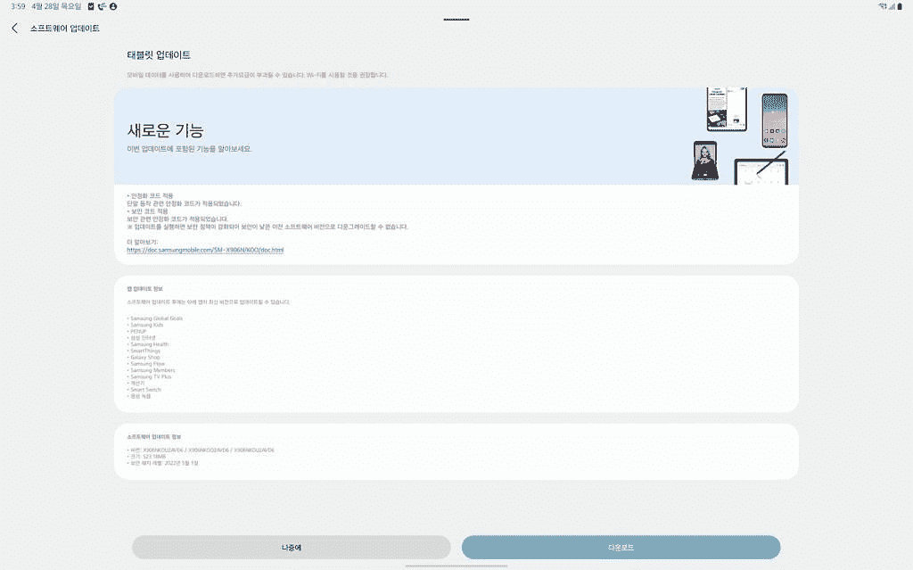

# 三星 Galaxy Tab S8 将于 2022 年 5 月收到最新更新补丁

> 原文：<https://www.xda-developers.com/samsung-galaxy-tab-s8-may-2022-security-patch/>

在推动每月安全更新方面，三星为其他 Android OEMs 厂商设定了较高的基准。该公司的更新时间表已经有所改善，甚至在谷歌正式发布相应的 Android 安全公告之前，它就已经向一些设备推出了最新的 Android 安全补丁。别再看了:Galaxy S22 系列已经[获得了 2022 年 5 月的补丁](https://www.xda-developers.com/samsung-galaxy-s22-may-2022-security-patch/)。嗯，三星似乎不会很快停止，因为韩国 OEM 现在已经开始为 Galaxy Tab S8 系列推出 2022 年 5 月的补丁。

 <picture></picture> 

Screenshot credit: Samsung Korea Community Member 솜브라

Galaxy Tab S8、Tab S8 Plus 和 Tab S8 Ultra 的 Wi-Fi 版本现在收到了版本号为**xx 00 Xu 2 avd 6**的新版本。增量更新包的大小是 500MB 多一点。除了提升安全补丁级别，新固件还带来了整体性能的提升。

同样，Galaxy Tab S8 的 5G 版本将于 2022 年 5 月获得软件版本**xx 06 bx U2 av 6**(韩国型号为 **Xx06NKOU2AVD6** )的补丁。该更新目前在韩国、欧洲和一些亚洲国家可用。

虽然在变更日志中没有提到，但新版本将底层引导程序版本从 *1* 增加到 *2* 。因此，最终用户在 Galaxy Tab S8 设备上安装此更新后，无法执行降级并恢复到旧版本。

 <picture></picture> 

Samsung Galaxy Tab S8 Ultra

三星 Galaxy Tab S8 Ultra 是 2022 年的顶级旗舰平板电脑，为内容创作和消费带来了顶级的显示屏和性能，以及 S Pen 支持和几项生产力功能。

和往常一样，更新是成批推出的。您可能需要等待几天，更新通知才会在您的设备上弹出。然而，你可以跳过等待队列，通过在你的 Galaxy 设备上手动刷新[来安装新版本。](https://www.xda-developers.com/how-to-update-samsung-galaxy-smartphone/)

在撰写本文时，三星的[移动安全门户](https://security.samsungmobile.com/securityUpdate.smsb)尚未更新 2022 年 5 月安全公告的细节。

* * *

**来源:**三星更新服务器( [1](https://doc.samsungmobile.com/SM-X706N/KOO/doc.html) 、 [2](https://doc.samsungmobile.com/SM-X800/EUX/doc.html) 、 [3](https://doc.samsungmobile.com/SM-X906N/KOO/doc.html) )