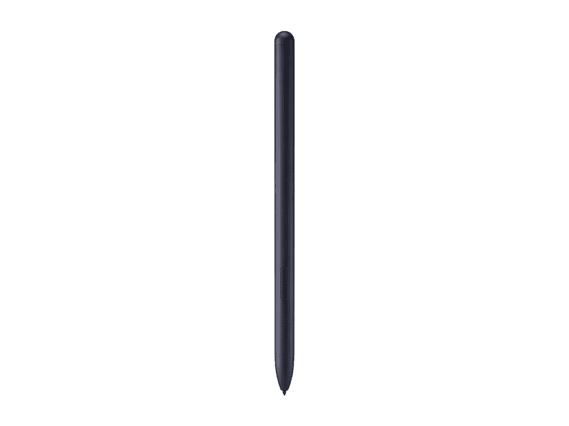
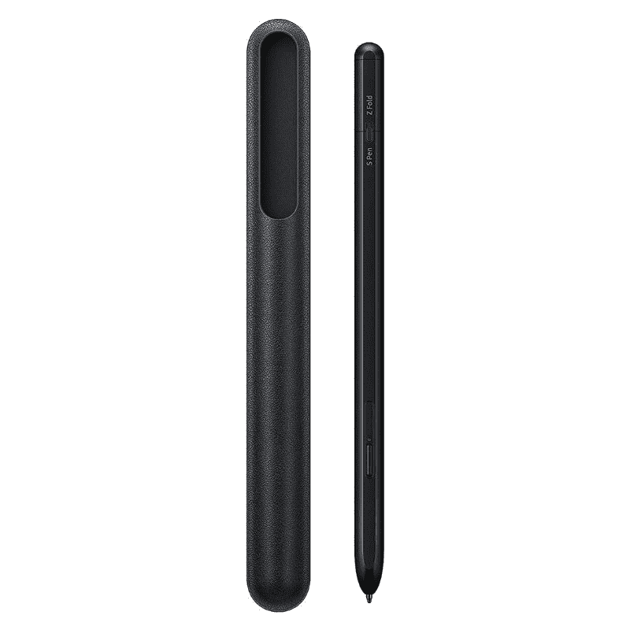

# 哪里可以买到三星 Galaxy Tab S8 系列的替换 S Pen？

> 原文：<https://www.xda-developers.com/samsung-galaxy-tab-s8-s-pen-replacement/>

三星于 2022 年 2 月发布了 [Galaxy Tab S8](https://www.xda-developers.com/samsung-galaxy-tab-s8-ultra-review/) 系列，对 Galaxy Tab S7 系列进行了几项重大升级，同时推出了一款名为 Galaxy Tab S8 Ultra 的新顶级机型。如果你想购买一款硬件强大的高端安卓平板电脑，Galaxy Tab S8 系列无疑是目前最好的选择。这三款平板电脑都有大而漂亮的显示屏，非常适合观看内容和提高工作效率。Galaxy Tab S8 配备了 11 英寸 120Hz 液晶显示屏，而 Plus 和 Ultra 型号则配备了更先进的 AMOLED 面板。正如你对任何现代 Android 平板电脑的期望，所有三款 Galaxy Tab S8 系列平板电脑都支持手写笔输入，这增加了多功能性，并开启了新的创意和生产用例。如果你不知何故丢失或损坏了你的钢笔，并正在寻找替代品，这里有你需要知道的一切。

## 哪里可以买到 Galaxy Tab S8 系列的替换 S Pen？

三星在 Galaxy Tab S8 系列的包装盒内包括一支 S Pen，这非常棒，因为你不需要支付额外的费用来充分利用平板电脑。但与 [Galaxy S22 Ultra](https://www.xda-developers.com/samsung-galaxy-s22-ultra-review/) 不同，Galaxy Tab S8 系列没有专门用于存放 S Pen 的插槽或空腔。相反，S Pen 通过磁力附着在 Galaxy Tab S8 的背面。因为 S Pen 一直暴露在外，所以更容易被放错位置、丢失或损坏。

如果你最终丢失了你的 S 笔或者它突然开始出问题，不要担心。您可以很容易地购买替换单元。您可以从三星的官方网站、当地商店或其他在线零售商处购买。这就把我们带到了下一个问题。

## 应该买 S Pen 还是 S Pen Pro？

三星提供两种类型的 S 笔:标准的 Galaxy Tab S8 S 笔和 S Pen Pro。S Pen 功能更强大，你可能已经猜到了，也更贵。它具有蓝牙功能，可以同时连接到多个设备。它有一个 0.7 毫米的尖端，4，096 个压力点用于精确控制，USB-C 充电，电池寿命长达 16 天。此外，S Pen Pro 与三星 SmartThings 集成在一起，如果它被放错地方，更容易找到。查看我们的 [S Pen 与 S Pen Pro](https://www.xda-developers.com/s-pen-pro-vs-s-pen/) 对比，找出哪一款更适合您的需求。

 <picture></picture> 

Galaxy Tab S8 / S8 Plus / S8 Ultra S Pen

##### Galaxy Tab S8 / S8 Plus / S8 Ultra S 笔

这是 Galaxy Tab S8、Galaxy Tab S8 Plus 和 Galaxy Tab S8 Ultra 的标准替代 S Pen。它通过磁力附着在平板电脑上。

 <picture></picture> 

S Pen Pro

##### 三星 S Pen Pro

S Pen Pro 有一个 0.7 毫米的笔尖，有 4，090 个压力点，可以同时连接多个设备。

如果你有一部兼容 S Pen 的 Galaxy 智能手机，S Pen Pro 将是一个更好的选择，因为它可以用于智能手机和平板电脑。不然普通的 S 笔也没问题。