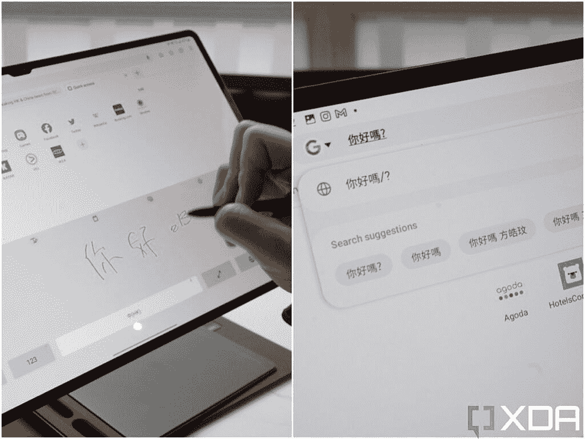
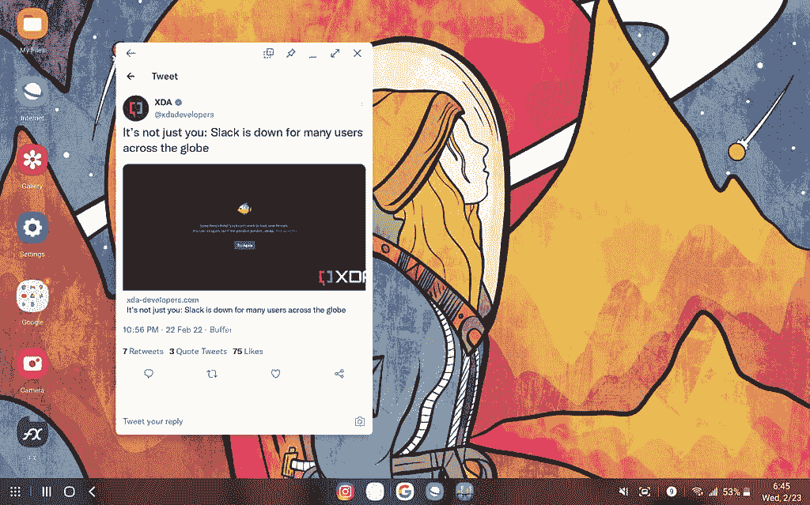
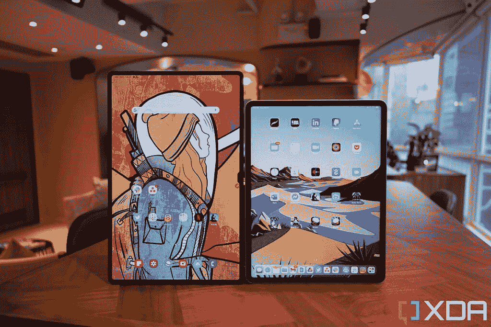
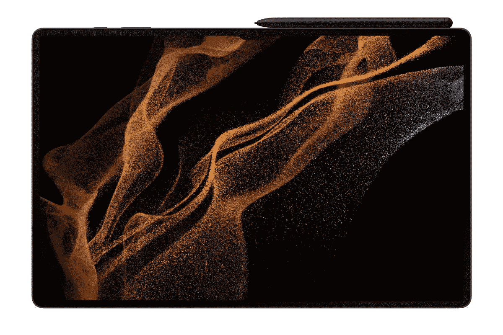

# 三星 Galaxy Tab S8 Ultra 评测:工作和娱乐的最佳设备

> 原文：<https://www.xda-developers.com/samsung-galaxy-tab-s8-ultra-review/>

大约十年前，三星发布了一款屏幕在当时被认为大得可笑的智能手机。一些人嘲笑它，但在几年内，这成为行业规范，手机屏幕尺寸一直在升级。大屏幕趋势始于三星 Galaxy Mega，但很快转移到三星 Galaxy Note 系列，并从此蔓延到整个智能手机行业。现在是 2022 年，三星正试图在平板电脑领域做同样的事情。新的三星 Galaxy Tab S8 Ultra 屏幕为 14.6 英寸，总尺寸为 8.2 英寸高，近 13 英寸宽，是我见过的最大的平板电脑。

。bestawarddiv {

浮动:对；

宽度:20%；

边距:0.75em

边距-顶部:0；

}

世界上没有一款主流平板电脑的屏幕有这么大。和许多人一样，我的第一反应是“*这似乎有点太大了*”在某种程度上，它是 Galaxy Tab S8 Ultra 不是一款你想长时间完全手持使用的平板电脑——但一旦你考虑到它被设计成至少在大部分时间里支撑在桌子上使用，那么整个包装就很有意义了。经过一周的使用，我被说服了——我认为 Galaxy Tab S8 Ultra 是功能最丰富的移动设备，这意味着它是工作和娱乐的最佳设备*。*

 <picture></picture> 

Samsung Galaxy Tab S8 Ultra

Galaxy Tab S8 Ultra 是一款可以完成所有功能的巨型平板电脑。它是一台工作电脑，游戏平板电脑，电影观看机。

* * *

## 三星 Galaxy Tab S8 Ultra:价格和供货情况

三星 Galaxy Tab S8 Ultra 及其两个较小的兄弟姐妹 Tab S8 和 Tab S8 Plus 现在可以预订，并将于 2 月 25 日开始发货。Galaxy Tab S8 Ultra 的基本款起价为 1099 美元，只有 Wi-Fi 连接和 8GB RAM/128GB 存储。有更贵的型号，具有 5G 连接、16GB 内存和高达 512GB 的存储，尽管可用性可能因地区而异。例如，在美国，你不能购买蜂窝(既不是仅 LTE，也不是 5G)版本的 Galaxy Tab S8 Ultra。

有几笔交易可以降低这些平板电脑的成本。例如，XDA 读者如果预订 Galaxy S22 手机，可以在三星商店获得额外的 50 美元信用。查看我们的交易列表，了解 Galaxy Tab S8 系列的[最新价格和优惠。](https://www.xda-developers.com/best-samsung-galaxy-tab-s8-deals/)

## 三星 Galaxy Tab S8 系列:规格

| 

规格

 | 

三星 Galaxy Tab S8

 | 

三星 Galaxy Tab S8 Plus

 | 

三星 Galaxy Tab S8 Ultra

 |
| --- | --- | --- | --- |
| **构建** |  |  |  |
| **尺寸&重量** | 

*   253.8 x 165.3 x 6.3mm 毫米
*   503 克(Wi-Fi)/507 克(5G)

 | 

*   285 x 185 x 5.7mm 毫米
*   567 克(Wi-Fi)/572 克(5G)

 | 

*   326.4 x 208.6 x 5.5mm 毫米
*   726g (Wi-Fi)/728g (5G)

 |
| **显示** | 

*   11 英寸 LTPS TFT 液晶屏
*   WQXGA(2560 x 600 像素)
*   276ppi
*   120 赫兹刷新率

 | 

*   12.4 英寸 Super AMOLED
*   WQXGA+(2800 x 1752 像素)
*   266ppi
*   120 赫兹刷新率

 | 

*   14.6 英寸 Super AMOLED
*   WQXGA+ (2960 x 1848p)
*   240ppi
*   120 赫兹刷新率

 |
| **SoC** | 高通骁龙 8 代 1 | 高通骁龙 8 代 1 | 高通骁龙 8 代 1 |
| **风筒&储存** | 

*   8/12GB 内存
*   128/256GB 存储空间
*   支持 microSD 卡(最高 1TB)

 | 

*   8/12GB 内存
*   128/256GB 存储空间
*   支持 microSD 卡(最高 1TB)

 | 

*   8/12/16GB 内存
*   128/256/512GB 存储空间
*   支持 microSD 卡(最高 1TB)

 |
| **电池&充电** | 

*   8000 毫安时
*   45W 有线快充支持

 | 

*   10090 毫安时
*   45W 有线快充支持

 | 

*   11200 毫安时
*   45W 有线快充支持

 |
| **安全** | 侧装式指纹扫描仪 | 显示指纹扫描仪 | 显示指纹扫描仪 |
| **后置摄像头** | 

*   初级:1300 万像素，自动对焦
*   超宽:6MP

 | 

*   初级:1300 万像素，自动对焦
*   超宽:6MP

 | 

*   初级:1300 万像素，自动对焦
*   超宽:6MP

 |
| **前置摄像头** | 12MP | 12MP | 

*   初级:12MP，FF
*   超宽:12MP

 |
| **端口** | USB 3.2 类型 C | USB 3.2 类型 C | USB 3.2 类型 C |
| **音频** | 

*   由 AKG 调音的四扬声器系统
*   杜比全景声认证
*   3 个麦克风

 | 

*   由 AKG 调音的四扬声器系统
*   杜比全景声认证
*   3 个麦克风

 | 

*   由 AKG 调音的四扬声器系统
*   杜比全景声认证
*   3 个麦克风

 |
| **连通性** | 

*   Wi-Fi 6E
*   蓝牙 5.2
*   5G(某些地区可选)

 | 

*   Wi-Fi 6E
*   蓝牙 5.2
*   5G(某些地区可选)

 | 

*   Wi-Fi 6E
*   蓝牙 5.2
*   5G(某些地区可选)

 |
| **软件** | 

*   一个基于 Android 12 的 UI 4.1
*   承诺四次 Android 操作系统升级
*   承诺五年的安全补丁

 | 

*   一个基于 Android 12 的 UI 4.1
*   承诺四次 Android 操作系统升级
*   承诺五年的安全补丁

 | 

*   一个基于 Android 12 的 UI 4.1
*   承诺四次 Android 操作系统升级
*   承诺五年的安全补丁

 |
| **其他特征** | 

*   盒子里有一支钢笔
*   Microsoft Office 365 订阅

 | 

*   盒子里有一支钢笔
*   Microsoft Office 365 订阅

 | 

*   盒子里有一支钢笔
*   Microsoft Office 365 订阅

 |

***关于本次评测:**三星香港提供给我一台 Galaxy Tab S8 Ultra 5G 和书皮键盘进行评测。三星在这篇文章中没有任何投入。*

* * *

## 三星 Galaxy Tab S8 Ultra:硬件和设计

*   惊人美丽的屏幕
*   有点太大太重，不能用手拿着:坐着的时候，你会想把它靠在墙上或者搁在大腿上
*   最佳 S-Pen 体验

除了更大之外，Galaxy Tab S8 Ultra 的构造与我们熟悉的大多数其他平板电脑一样——前面是平板玻璃面板、铝制框架和矩形形状。显示屏顶部有一个凹口，但它很小，不会深入屏幕。notch 包含一个出色的网络摄像头系统(至少按照笔记本电脑/平板电脑的标准)，由 12MP，f/2.2 镜头和 12MP 超宽 120 度视野组成。背面有一个遮阳板条，S-Pen(包含在包装中)通过磁性附着在上面。遮阳板导致后置摄像头系统，具有 1300 万像素的主摄像头和 600 万像素的超宽摄像头。左右两侧有两个扬声器格栅，平板电脑底部有弹簧针，用于连接三星的键盘外壳，官方名称为“书皮键盘”。

Galaxy Tab S8 Ultra 的厚度为 5.5 毫米，非常薄，尤其是因为它装有 11，200 毫安时的电池。里面是骁龙 8 代 1，根据配置不同，有 8GB，12GB 或 16GB 的内存。我的型号是 16GB RAM，5G 连接。

### 显示

14.6 英寸的显示屏令人惊艳

这里的 14.6 英寸显示屏，一句话，惊艳。它是三星“Super AMOLED”面板，刷新率为 120Hz，分辨率为 2960 x 1848。正是由于如此之大，一切——从 Instagram 故事到 YouTube 视频到漫画页面——看起来更加身临其境，更加美丽。事实上，这是阅读美国漫画书的最佳设备，因为它的屏幕实际上比原始印刷页面更大，这意味着图像不必缩小。即使在 12.9 英寸的 iPad Pro 上，页面也必须缩小才能完全适合屏幕。当我读完 Galaxy Tab S8 Ultra 时，我不必眯着眼睛。

### s 笔

由于在 Galaxy S22 Ultra 中重新出现，S-Pen 最近一直受到媒体的好评。但老实说，我一直认为 Galaxy Note 手机中的 S-Pen 是一个不错的奖励，但不是体验的完全必要因素。最终，储存在 Galaxy 手机中的 S-Pen 太小太薄，无法长时间舒适地握持，尽管 6.7 英寸对于手机屏幕来说很大，但对于画板或笔记本来说仍然有点局促。我不介意 S-Pen 在 Galaxy S22 Ultra 里，但如果也不是，我也不会难过。

S Pen 对于这么大的屏幕来说意义非凡

但是三星平板的 S-Pen 呢？那是另一个故事。由于手写笔是“正常大小”的，屏幕明显大于手机屏幕，S-Pen 的存在突然让我想重新找到我小时候想画漫画的梦想。三星今年甚至将延迟降至 2.8 毫秒，甚至低于 Apple Pencil 的 9 毫秒。老实说，我真的看不出有什么不同，因为 S-Pen 和 Apple Pencil 对我的眼睛都有同样的反应。我更喜欢的是 S-Pen 的软橡胶笔尖，而不是 Apple Pencil 的硬塑料笔尖。当我在 Tab S8 Ultra 的屏幕上拖动 S-Pen 时，摩擦力比在 iPad Pro 显示屏上拖动 Apple Pencil 时要大。

三星还在 S-Pen 中内置了一些非常有用的软件技巧，包括通过高亮显示来翻译文本的能力，抓取特定形状的截图，以及我个人最喜欢的:将书面文本转换为数字文本的能力。这实际上极大地帮助了我，因为我可以读写汉字，但不知道如何用拼音输入汉字。因此，S-Pen 允许我用其他平板电脑无法使用的方式输入汉字。

 <picture></picture> 

Converting Chinese written text to on-screen digital text.

### 书皮键盘

虽然 S-Pen 包含在 Galaxy Tab S8 Ultra 包装中，但键盘外壳(三星称之为“书皮键盘”)在技术上需要单独购买。但现在，三星在全球大多数地区都有[预购交易](https://www.xda-developers.com/best-samsung-galaxy-tab-s8-deals/)，其中包括购买 Galaxy Tab S8 系列设备可免费获得键盘保护套。我强烈建议任何想买的人现在就接受这个提议，因为:

*   如果不搭配键盘使用，你就无法发挥 Galaxy Tab S8 Ultra 的全部潜力
*   键盘壳*真好*
*   但是键盘套也是*真的很贵*

“书皮键盘”是一个由两部分组成的外壳:带有支架的后盖扣在平板电脑的背面，单独的键盘和触控板盖部分连接到平板电脑的底部弹簧针。支架可以打开各种各样的角度，背面的翻盖也覆盖了 S-Pen，不小心摔下来的难度要大得多。

但这场秀的明星是键盘和触控板。键盘间距很大，有背光，有一排 F 键，可以控制 Galaxy Tab S8 Ultra 的屏幕亮度、音量，以及启动应用程序或抓取截图等软件操作。以平板电脑的标准来看，这款触控板也非常大，但不如苹果为 iPad Pro 设计的 Magic Keyboard 中最好的触控板精确。当我只是拖动手指移动鼠标光标时，Galaxy Tab S8 Ultra 偶尔仍会认为我在尝试点击什么。尽管如此，触控板的体验总体来说还是不错的。有一些有用的多手指手势，可以快速切换应用程序或跳回到主屏幕。

Galaxy Tab S8 Ultra 配备了“书籍封面键盘”,其硬件非常类似于笔记本电脑。现在唯一需要做的就是软件——三星在这方面也做得非常出色。

* * *

## 三星 Galaxy Tab S8 系列:软件

*   Android 在平板电脑优化方面还有很多工作要做，但一个用户界面弥合了一些差距
*   DeX 模式可以解锁任何其他平板电脑都没有的多任务处理，甚至 iPads 也没有。

Galaxy Tab S8 Ultra 运行在 Android 12 上，顶部是三星的 One UI。考虑到组件和软件，它实际上只是一部超大型的巨型三星智能手机。事实上，由于我的型号有一个支持 5G 的 SIM 卡托盘，三星甚至在设备的 dock 中包括了电话拨号应用程序，这意味着我可以在技术上将其用作一部滑稽的大手机。我会建议你这样做吗？绝对不行，请用你的手机代替(或者用 TWS)。

事实上，默认情况下，这只是一个放大的 Android 手机，这是阻碍大多数 Android 平板电脑的原因。大多数 Android 应用程序都没有针对更大的屏幕进行优化，特别是横向宽屏方向(三星、小米和华为都喜欢在他们的平板电脑上使用)。这方面最好的例子是 Twitter。在 iPad 上，Twitter 针对苹果平板电脑的屏幕尺寸和长宽比进行了优化，显示了一个双窗格布局，左侧有一个导航 dock。在 Android 版本的 Twitter 上，无论屏幕大小或长宽比如何，它都会像一个手机应用程序一样打开，这意味着在平板电脑上，在风景模式下，一条单独的推文将伸展并填满整个显示屏，看起来真的很傻。

平板电脑缺乏对应用程序的优化是一个先有鸡还是先有蛋的问题，这为 Android 平板电脑创造了一个恶性循环。应用程序开发人员不会为 Android 平板电脑优化应用程序，因为 Android 平板电脑的销量远不如 iPad(构建 iPad 应用程序的资金要多得多)；但是，除非应用程序在 Android 平板电脑上看起来不再荒谬，否则大多数 Android 平板电脑都会得到差评，导致销量低下。

平板电脑缺乏应用程序优化是一个先有鸡还是先有蛋的问题，这为 Android 平板电脑创造了一个恶性循环，但三星试图通过 DeX 模式来解决这个问题

幸运的是，三星意识到了 Android-apps 看起来很愚蠢的问题，并试图用 DeX 模式来解决这个问题，DeX 模式本质上是三星 Android 软件中的一个沙箱，它将 UI 变成了类似 Windows PC 的桌面。这意味着应用程序可以在更小、可调整大小的窗口中打开。Galaxy Tab S8 Ultra 上的 Twitter 在 DeX 模式下比在标准 Android 模式下看起来好很多。

 <picture></picture> 

Twitter on the Galaxy Tab S8 Ultra, in DeX Mode.

现在，不仅应用程序可以正常打开和扩展，而且还带来了显著改善多任务处理的额外好处。我现在可以同时打开三四个应用程序/窗口，因为 14.6 英寸的屏幕太大了，所以信息不会感觉太拥挤或太小。

三星已经做了很多工作来改善糟糕的 Android 平板电脑体验

DeX 模式并不完美。因为它最终会迫使 Android 应用程序以某种方式运行，所以有时会出现奇怪的行为，比如谷歌文档总是在一个单独的窗口中打开新文档，或者 Chrome 仍然停留在移动视图中，即使我已经将其扩展到 14.6 英寸的屏幕。最终，如果你想让应用程序在平板电脑屏幕上始终工作良好，iPadOS 仍然做得更好，但三星已经做了很多工作来改善糟糕的 Android 平板电脑体验。而且我觉得 DeX 模式还可以继续变好。

当 DeX 模式运行良好时，它允许我进行多任务处理，这是其他平板电脑(甚至是 iPad)无法实现的。多任务桌面体验是否比使用实际的 Mac 或 Windows 笔记本电脑更加无缝？不会。但 Galaxy Tab S8 Ultra 可以做得更多，因为它既可以作为安卓设备，也可以作为“电脑”

* * *

## 将三星 Galaxy Tab S8 Ultra 用作平板电脑

因为 Galaxy Tab S8 Ultra 太大了，我认为它更适合用键盘外壳支撑在桌子上，而不是作为手持平板电脑，但如果你能抵消一些重量和体积(比如将平板电脑支撑在床上的枕头上，或者支撑在独立支撑设备的支架上，那么平板电脑的体验会很迷人。正如我前面提到的，由于屏幕如此之大，一切看起来都更加令人惊叹，尤其是跨越整个屏幕的内容，如 Instagram Stories。有时候我会喃喃自语“哇”，因为我碰巧滚动到一个特别吸引人的 Instagram 故事，在美丽的 14.6 英寸画布上伸展开来。

滚动任何视觉上吸引人的 Instagram 故事，在美丽的 14.6 英寸画布上伸展，你会被迷住

Galaxy Tab S8 Ultra 也非常适合游戏，它配备了骁龙 8 Gen 1 和大量内存。我甚至插上了控制器，在《马克思·佩恩》上玩了一个小时的游戏。四扬声器系统由 AKG 微调，听起来很棒，所以这显然也是一台很棒的观影机器。如果你把 Galaxy Tab S8 Ultra 作为一款巨型 Android 设备使用，除了太重太大而无法在没有支撑的情况下握持之外，没有什么可以抱怨的。

* * *

## 将三星 Galaxy Tab S8 Ultra 用作工作机

我已经提到，DeX 模式修复了许多应用程序扩展问题，并显著改善了多任务处理，在很大程度上，我已经能够在这台机器上毫无问题地完成真正的工作。事实上，我在一家咖啡店的 Galaxy Tab S8 Ultra 上打了一大段这篇评论。

网络摄像头也非常适合视频通话——比我的 2019 款 MacBook 网络摄像头好得多。它可以录制 4K/30 或 1080/60 的镜头，质量基本上类似于典型的三星智能手机自拍相机。下面是用 Galaxy Tab S8 Ultra 的前置网络摄像头拍摄的视频剪辑，以及我的 2019 年 MacBook Pro 网络摄像头的剪辑(值得一提的是，2021 年 M1 Pro/Max MacBook 的网络摄像头要好得多)。

您还可以将 Galaxy Tab S8 Ultra 与 Windows 电脑配对，并将平板电脑用作第二块屏幕。然而，我发现这有点问题，因为连接不稳定，而且有明显的延迟。我觉得不是我的 WiFi，因为当我用两套不同的产品尝试同样的配对时(连接一台 iPad 和一台 MacBook 一个华为 MatePad 配一个华为 MateBook X Pro)，连接流畅很多。

* * *

## 三星 Galaxy Tab S8:电池寿命

这里的 11,200 mAh 电池很大，但屏幕也很大。因此，它们在某种程度上是平衡的——当我把这台机器作为一台全功能的生产力机器使用时，三星的网络浏览器以多个标签打开，后台还有 Slack、Twitter feed 和 Spotify 流媒体，Galaxy Tab S8 Ultra 每小时消耗约 11%的电池。当我在看《网飞》时，它的消耗要慢得多，大约每小时 7-8%。基本上，一次充电可以使用 9 到 11 个小时。这很好，但如果你打算频繁使用，你还是需要每晚充电。你确实可以在 Tab S8 系列上获得 45W 的有线快速充电，但由于电池太大，它并没有真正使充电体验特别快。

* * *

## 谁应该购买三星 Galaxy Tab S8 Ultra？

Galaxy Tab S8 Ultra 符合一个特定的定位:一款集娱乐和现实于一体的设备

Galaxy Tab S8 Ultra 的起价为 1100 美元，显然不便宜。老实说，如果你只是把它作为一个掌上平板电脑，用来在沙发上看视频或上社交媒体，那就不值得了。你应该购买更便宜的 Galaxy Tab S8 或 Galaxy Tab S8 Plus，或者 iPad Air。Galaxy Tab S8 Ultra 对我来说是值得的，如果你知道你会将它用作一台生产力机器。现在，你可以在较小的 Galaxy Tab S8 设备上做与 Ultra 相同的事情，但 14.6 英寸的屏幕确实提高了多任务处理能力。

然而，如果你只是打算将 Galaxy Tab S8 Ultra 专门用于案头工作，那么你最好购买一台合适的笔记本电脑，因为 DeX 模式尽管很棒，但也不是完美无缺的。

 <picture></picture> 

Galaxy Tab S8 Ultra and iPad Pro

我认为 Galaxy Tab S8 Ultra 适合一个特定的细分市场——一个既能进行平板娱乐活动又能完成实际工作的设备。我喜欢的是，我不仅可以在两者之间无缝切换，还可以经常混合使用两者——我可以打开一个 word 文档，同时在屏幕的一角播放 YouTube 视频。或者当我在 Instagram 上滚动的时候，我正在打电话。有了 Galaxy Tab S8 Ultra，我可以将工作和娱乐结合起来。对我来说，它值 1100 美元——尤其是免费附赠的键盘套。

### 谁应该购买:

*   想要一台设备既能工作又能娱乐的人。
*   有人完全沉浸在 Android 或三星的生态系统中，并且想要一个大屏幕设备来使用这些服务。

### 哪些人不应该购买:

*   想要一台机器来工作的人——买一台笔记本电脑吧。
*   想要一款高度便携的平板电脑以便在家中随身携带的人——对于他们来说，这款平板电脑太大太重了。换成 Galaxy Tab S8 或者 iPad Mini。

 <picture></picture> 

Samsung Galaxy Tab S8 Ultra

Galaxy Tab S8 Ultra 是一款可以完成所有功能的巨型平板电脑。它是一台工作电脑，游戏平板电脑，电影观看机。