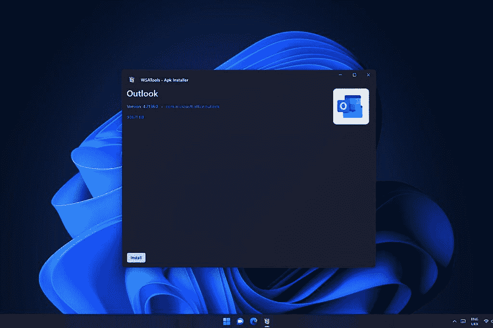
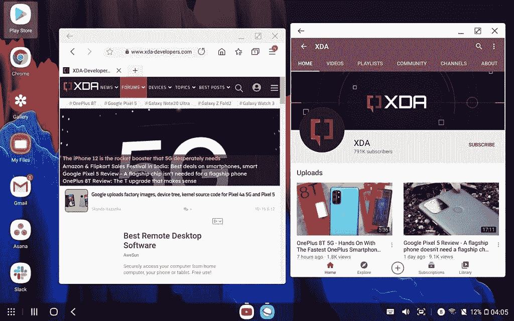
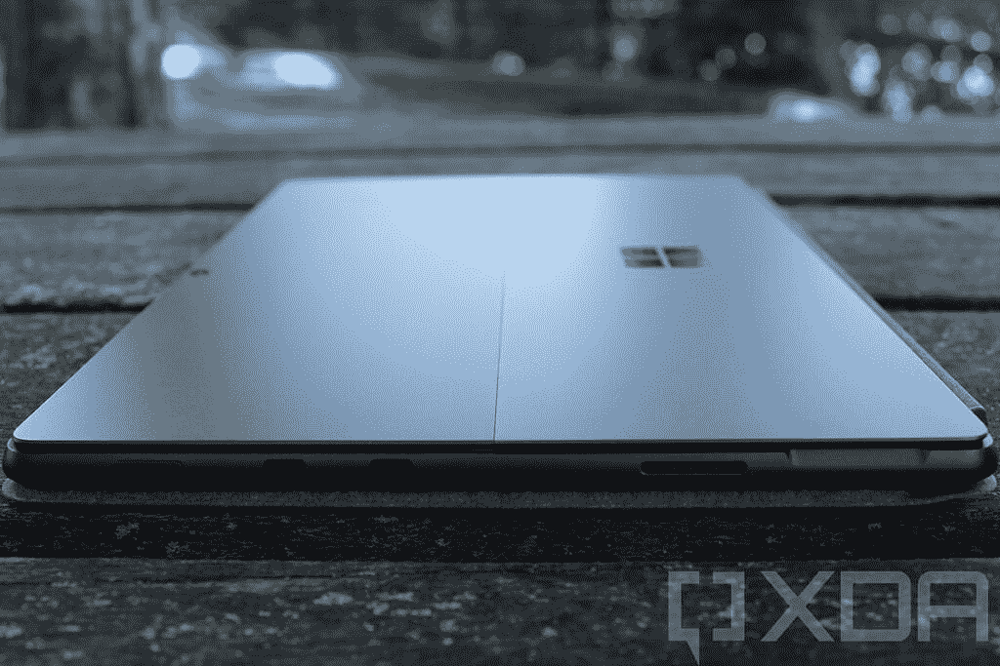

# 三星 Galaxy Tab S8 Ultra vs 微软 Surface Pro 8:最好的平板电脑是什么？

> 原文：<https://www.xda-developers.com/samsung-galaxy-tab-s8-ultra-vs-microsoft-surface-pro-8/>

三星的 Galaxy Tab S8 Ultra 可能是迄今为止最好的 Android 平板电脑，三星显然在这方面投入了很多。它拥有巨大的高分辨率显示屏、强大的处理器和时尚的设计。我们已经亲身体验了 Galaxy Tab S8 Ultra ，但你可能想知道它与其他平板电脑相比如何，或者它是否可以取代笔记本电脑。为了弄清楚这一点，我们将 Galaxy Tab S8 Ultra 与最受欢迎的笔记本电脑替代品之一 [Surface Pro 8](https://www.xda-developers.com/surface-pro-8/) 进行了比较。

现在，这些几乎在每个方面都是完全不同的设备。不同的操作系统、处理器和大小。但是，如果你正在寻找一款可以作为笔记本电脑使用的平板电脑，这两者都有可能出现。那么你应该选择哪一个呢？让我们仔细看看。

## 三星 Galaxy Tab S8 Ultra vs 微软 Surface Pro 8:规格

|  | 

三星 Galaxy Tab S8 Ultra

 | 

微软 Surface Pro 8

 |
| --- | --- | --- |
| **操作系统** | 

*   搭载 OneUI 4.1 的 Android 12

 |  |
| **处理器** | 

*   高通 Snapgradon 8 Gen 1 (1 个基于 Cortex-X2 的内核@ 2.995Ghz，3 个 Cortex-A710 内核@ 2.5GHz，4 个 Cortex-A510 内核@ 1.79 GHz)

 | 

*   英特尔酷睿 i3-1115G4(最高 4.1GHz，双核)(仅限商业客户)
*   英特尔酷睿 i5-1135G7(最高 4.2GHz，四核)
*   英特尔酷睿 i7-1185G7(最高 4.9GHz，四核)

 |
| **图形** | 

*   新高通肾上腺素(未指明)

 |  |
| **闸板** |  |  |
| **存储** |  |  |
| **显示** | 

*   14.6 英寸 Super AMOLED (2960 x 1848)，最高 120Hz 刷新率，支持触摸和手写笔

 | 

*   13 英寸 PixelSense Flow (2880 x 1920)显示屏，最高 120Hz 刷新率，触摸屏，支持 Surface Pen

 |
| **音频** | 

*   带杜比全景声的四声道 AKG 立体声扬声器

 | 

*   两个配有杜比全景声的 2W 立体声扬声器

 |
| **摄像机** | 

*   12MP 标准+ 12MP 超宽(正面)
*   1300 万像素主摄像头，带 AF+600 万像素超宽摄像头(后置)

 | 

*   500 万像素、1080 像素前置网络摄像头
*   10MP 4K/1080 p 后置摄像头

 |
| **生物认证** | 

*   显示屏下的指纹扫描仪

 |  |
| **电池** | 

*   11，200 毫安时(额定)，长达 14 小时的视频播放

 | 

*   51.5 瓦时(额定)，电池续航时间长达 16 小时

 |
| **端口** | 

*   USB Type-C 3.2 Gen 2(带显示端口输出)
*   microSD 卡插槽

 | 

*   2 个 Thunderbolt 4(USB C 类)端口
*   表面连接端口
*   3.5 毫米耳机插孔

 |
| **连通性** |  | 

*   Wi-Fi 6 +蓝牙 5.1
*   可选:LTE(高通骁龙 X20)

 |
| **颜色** |  |  |
| **尺寸(WxDxH)** | 

*   12.85 x 8.21 x 0.22 英寸(326.39 x 208.53 x 5.59 毫米)

 | 

*   11.3 x 8.2 x 0.37 英寸(287.02 x 208.28 x 9.4 毫米)

 |
| **重量** |  |  |
| **起始价格** | 1099.99 美元(8GB/128GB) | 1，099.99 美元(搭载英特尔酷睿 i5 处理器的消费者机型) |

很快，您就可以看出这两款设备之间的一些巨大差异，它们都值得更详细地探究。让我们来看一下全貌。

## 操作系统:Android 12 vs Windows 11

第一大区别是操作系统，坦率地说，这是最重要的一个。Android 和 Windows 运行非常不同的应用程序，因此它们意味着非常不同的事情。

有了 Windows 11，Surface Pro 8 才是真正的 PC。它可以运行你想运行的任何电脑应用，包括 Adobe Photoshop、Premiere，甚至一些游戏。这些应用程序不会全部针对触摸进行优化，但作为笔记本电脑的替代品，Surface Pro 8 更适合，因为它拥有 Android 上没有的所有应用程序。

 <picture></picture> 

Installing an Android app on Windows 11

你也可以用模拟器或 Android 的 Windows 子系统运行许多 Android 应用程序，尽管在这方面性能会不太理想。此外，Android 的 Windows 子系统默认不包含谷歌服务，尽管你可以用一些诡计安装它们。

与此同时，三星 Galaxy Tab S8 Ultra 运行 Android 12，并在此基础上使用三星的 One UI 4.1。马上，这是一个更友好的操作系统，所以如果你的计划是把它作为一个平板电脑而不是一个 PC，它可能是更好的选择。Android 也有一些你可能会喜欢的好处，比如轻松访问谷歌助手。

 <picture></picture> 

Samsung Dex experience

而且如果想当 PC 用，也不错。三星在 Galaxy Tab S8 Ultra 中内置了 DeX 体验，因此当您搭配三星官方书籍封面时，您可以拥有更像 PC 的体验。不过，如果你想运行 Windows 应用，你需要某种远程桌面服务。Android 确实有许多生产力应用程序，包括会议和聊天应用程序，以及像 Microsoft Office 这样的文件编辑应用程序(尽管功能不如 Windows 版本全面)。但是，如果你想要一个真正的 PC 替代品，Android 还没有完全到位，在这方面你最好坚持使用 Windows。

## 性能:两种不同方式的高端平板电脑

比较 Galaxy Tab S8 Ultra 和 Surface Pro 8 的性能并不像你想象的那样简单。这两种设备运行不同的操作系统，具有不同的要求和功能。因此，即使所有规格都相同(事实并非如此)，性能上也必然会有差异。归根结底，这两款都是市场上的高端平板电脑，在任何日常任务中都能表现出色。

Galaxy Tab S8 Ultra 采用高通最新的智能手机处理器，即基于 Arm 技术的骁龙 8 Gen 1。这是一款非常快速的处理器，它比上一代产品有了重大改进，但它仍然是为智能手机设计的。在这种情况下，它非常快，但也有功率限制，因为它也必须对手机足够有效。

与此同时，Surface Pro 8 配备了专为笔记本电脑设计的 15W 英特尔处理器，具有更大的散热空间和更大的功率预算。它配备了英特尔酷睿 i5-1135G7 或酷睿 i7-1185G7。

|  | 

Snapdrago 8 Gen 1 ( [参考设计](https://www.xda-developers.com/qualcomm-snapdragon-8-gen-1-benchmarks/)

 | 

英特尔酷睿 i5-1135G7(平均)

 | 

英特尔酷睿 i7-1185G7(平均)

 |
| --- | --- | --- | --- |
| Geekbench 分数(单核/多核) | 1,235 / 3,758 | 1,248 / 4,205 | 1,407 / 4,867 |

将 CPU 性能与 Geekbench 进行比较，骁龙 8 Gen 1 非常接近英特尔的处理器。正如我们提到的，这只是等式的一小部分，无论如何，这都是非常高端的设备。你在这两方面都获得了很好的体验，但它们在很多方面迎合了不同的需求。

在图形方面，这两个都不会成为你的下一个游戏平台，但都可以处理轻量级游戏。当然，三星 Galaxy Tab S8 Ultra 处于 Android 设备食物链的顶端，因此它可以完美地运行所有 Android 游戏。Surface Pro 8 无法在 Windows 上运行大多数 AAA 游戏，因为这些游戏是为更大、更强大的游戏 PC 设计的。很难直接比较这两者，因为它们在完全不同的市场竞争，并且具有不同的架构。

我们能比较客观的是 RAM 和存储。Surface Pro 8 配备了高达 1TB 的固态硬盘和 32GB 的内存，使其成为最强大的平板电脑之一，并为您提供充足的存储空间。三星 Galaxy Tab S8 Ultra 配备了 16GB 内存和 512GB 存储空间。再说一次，上下文很重要，因为 Android 不会使用 32GB 的 RAM——16GB 将获得您想要的所有性能，甚至更多。几乎没有任何 Android 设备拥有超过这一数量。

最后，还有电池，这是 Galaxy Tab S8 Ultra 可能会更好的一个方面。它配有 11,200mAh 的电池，而 Surface Pro 8 配有 51.5Wh 的电池。这两款设备使用不同的容量测量方法，虽然微软声称长达 16 小时的“典型设备使用”，但我们的 [Surface Pro 8 评测](https://www.xda-developers.com/surface-pro-8-review/)显示，在现实生活条件下，它通常只能持续不到 5 小时。三星声称 Galaxy Tab S8 Ultra 在充电后可以播放长达 14 小时的视频，在现实生活中你应该会更接近这个值。由于更高效的 Arm 处理器，它应该更高效，充电时间更长。

## 显示和声音:Galaxy Tab S8 Ultra 拥有主流 Android 平板电脑中最大的显示屏

说到展示，这两个有点不同，虽然都很棒。三星 Galaxy Tab S8 Ultra 配备了一块巨大的 14.6 英寸 Super AMOLED 显示屏，这是我们在主流 Android 平板电脑上见过的最大显示屏。事实上，这是我们在任何平板电脑上见过的最大显示屏之一。它的长宽比为 16:10，总分辨率为 2960 x 1848，并且具有高达 120Hz 的自适应刷新率。

由于这是一个超级 AMOLED 面板，您可以获得真正的黑色，生动的色彩和高对比度。当然是平板，所以支持触控输入，也支持 S Pen，盒子里自带。Galaxy Tab S8 Ultra 在屏幕周围也有微小的边框，显示屏下方有一个指纹读取器。Galaxy Tab S8 Ultra 的一个潜在缺点是它有一个凹口，有些人可能不喜欢。总的来说，它并不是一个巨大的缺口，它有两个前置摄像头。

Surface Pro 8 的显示屏也很棒，但略小。这是一个 13 英寸的 IPS 面板，它有 2880 x 1920 的分辨率，所以它比 Galaxy Tab S8 Ultra 更清晰。这是一个略高的长宽比(3:2)，在横向方向上给你更多的垂直空间，或者在纵向方向上给你更宽的屏幕。这不是 OLED 面板，所以你不会得到相同的对比度和纯黑色，但它仍然看起来很棒。该显示器还支持高达 120Hz 的自适应刷新率。

 <picture></picture> 

Surface Pro 8

再说一遍，这是一款平板电脑，所以它支持触摸输入和 Surface Pen，但微软不像三星那样将笔包含在盒子中。你可能喜欢 Surface Pro 8 的一点是，它支持 Surface Slim Pen 2 中的触觉反馈，给你用笔在纸上写字的感觉。微软还缩小了这款机型显示屏周围的边框，但它们仍然比三星的平板电脑大。

至于声音，三星 Galaxy Tab S8 Ultra 由于其四扬声器立体声设置也应该更好。它有四个由 AKG 调谐的扬声器，应该会给你一个很好的媒体消费体验。Surface Pro 8 有一个双扬声器设置，屏幕两侧各有一个 2W 扬声器，这很牢固，但不太好。

## 相机:Surface Pro 8 是一台 PC，PC 没有很棒的相机

最后，Galaxy Tab S8 Ultra 也在相机部门胜出。Surface Pro 家族一直拥有 Windows PC 上最好的摄像头之一，它的正面有一个 500 万像素的摄像头，可以播放 1080p 视频。它还包括一个背面带有 4K 视频录制功能的 10MP 摄像头。前置摄像头也有 Windows Hello 面部识别。这对于 Windows PC 来说令人印象深刻，但与 Galaxy Tab S8 Ultra 相比就相形见绌了。

硬件层面，三星 Galaxy Tab S8 Ultra 正面两个摄像头，背面两个摄像头。在正面，你有一个 12MP 主摄像头和另一个 12MP 超宽传感器。在背面，它有一个 1300 万像素的主摄像头和一个 600 万像素的超宽摄像头，因此它的功能和能力远远超过 Surface Pro 8。这款平板电脑还支持 4K 视频录制，但并不是所有的相机都支持。

但这还不是全部，因为 Galaxy Tab S8 Ultra 还具有一系列 Surface Pro 8 所不具备的智能相机功能。例如，Galaxy Tab S8 可以使用超宽摄像头一次查看多个人，然后通过检测谁在说话来聚焦每个人，这对会议很有用。它还具有各种应用程序中可用的背景替换等功能，你甚至可以用相机拍摄画面来创建演示文稿。Surface Pro 8 的某些 Windows 应用程序中可能会出现这种情况，但这是 Galaxy Tab S8 Ultra 的标准功能。

## 设计:Galaxy Tab S8 Ultra 更大但更轻

在设计上，三星 Galaxy Tab S8 Ultra 显然是宽度和重量更大的设备，这要归功于更大的屏幕。由于小边框和更宽的长宽比，它比 Surface Pro 8 高不了多少(横向)，但仍然更大。然而，Galaxy Tab S8 Ultra 薄得令人难以置信——只有 5.5 毫米——而且它也轻得令人惊讶，重量只有 1.6 磅。值得注意的是，它没有内置支架，尽管你可以通过 Galaxy Tab S8 Ultra 的一些[外壳或可选的书籍封面获得这种东西。](https://www.xda-developers.com/best-samsung-galaxy-tab-s8-ultra-cases/)

相比之下，Surface Pro 8 的宽度和重量更小，但厚度明显更厚，为 9.4 毫米。此外，它的重量为 1.96 磅，因此尽管尺寸较小，但还是有点重。两款平板电脑都是在没有键盘的情况下测量的，键盘是可选的，单独出售。

Surface Pro 8 胜出的地方在于端口方面。三星 Galaxy Tab S8 Ultra 有一个 USB Type-C 端口，支持 DisplayPort 输出和 USB 存储设备。您还可以添加一个 microSD 卡来获得更多存储空间。

Surface Pro 8 在 PC 上的连接性不太好，但对于平板电脑来说，它很棒。它有两个 Thunderbolt 4 端口，这意味着你可以连接 Thunderbolt 坞站、外部 GPU 和多个显示器。它以这种方式为你提供了大量的连接选项，加上你有一个用于充电的 Surface Connect 端口(或者如果你喜欢的话，使用 Surface Dock)。你还有一个耳机插孔，这是 Galaxy Tab S8 Ultra 所缺少的。

 <picture></picture> 

Surface Connect port on the Surface Pro 8

最后，在无线连接方面，两款平板电脑相似，但最大的区别在于蜂窝连接。你可以通过骁龙 X20 调制解调器在 Surface Pro 8 上获得可选的 LTE 支持。与此同时，Galaxy Tab S8 Ultra 有可选 5G 支持的型号，在适当的条件下，应该可以提供更快的互联网速度。5G 也更加面向未来，因为这些网络仍在部署和发展中。

## 结果

当进行这样的比较时，没有明确的赢家，但 Galaxy Tab S8 Ultra 有一些很大的优势。屏幕是一个 AMOLED 面板，看起来令人惊叹，理论上，更大的尺寸可以更好地完成工作。此外，尽管更大，但它比 Surface Pro 8 更薄更轻，摄像头也更好。这可能是一款更好的平板电脑，但大屏幕让它对于平板电脑来说有点笨重，而作为笔记本电脑来说更有意义。如果您的使用案例对便携性的要求较低，而对桌面使用的要求较高，Galaxy Tab S8 Ultra 将适合您。

与此同时，Surface Pro 8 的屏幕略小，但它仍然是一个非常高质量的面板，虽然它略重，但由于整体尺寸较小，它可能更适合用作平板电脑。此外，这是一台真正的 PC，支持 Thunderbolt 连接各种外设。

在性能方面，这两款平板电脑都有很好的规格，它们将为您带来全面的可靠体验。Galaxy Tab S8 Ultra 还应该给你更好的电池寿命，所以它更适合作为你旅行时携带的东西。但是硬件只是这里体验的一小部分。

这个决定实际上是你需要平板电脑能运行什么。使用 Galaxy Tab S8 Ultra 上的 Android，您可以运行移动应用程序，这些应用程序大多非常适合娱乐和轻量级工作效率。它非常适合网飞这样的地方，通过视频电话与家人保持联系，撰写一些文档，甚至是一些简单的照片或视频编辑。但是和 Windows 不太一样。

在 Surface Pro 8 上，您可以在笔记本电脑或台式机上运行所有 Windows 应用程序，获得真正的 PC 体验。Photoshop、Premiere 和其他生产力工具更容易找到，通常在 Windows 上提供更多功能。您甚至可以通过 Thunderbolt 端口连接外部 GPU 来玩要求苛刻的 PC 游戏。另外，Surface Pro 8 可以在 Windows 11 上运行许多 Android 应用程序。

如果你知道你想要哪一个，你可以在下面购买你喜欢的平板电脑。如果你想尝试找到更好的价格，你还可以查看 Surface Pro 8 上的[最佳交易](https://www.xda-developers.com/best-surface-pro-8-deals/)或[最佳三星 Galaxy Tab S8 Ultra 交易](https://www.xda-developers.com/best-samsung-galaxy-tab-s8-deals/)。

 <picture></picture> 

Samsung Galaxy Tab S8 Ultra

三星 Galaxy Tab S8 Ultra 是有史以来最大的 Android 平板电脑之一，具有高端规格、出色的显示屏和出色的摄像头。

 <picture></picture> 

Surface Pro 8

##### 微软 Surface Pro 8

Surface Pro 8 是目前最好的 Windows 平板电脑，它是一台真正的 PC，可以取代传统的笔记本电脑。