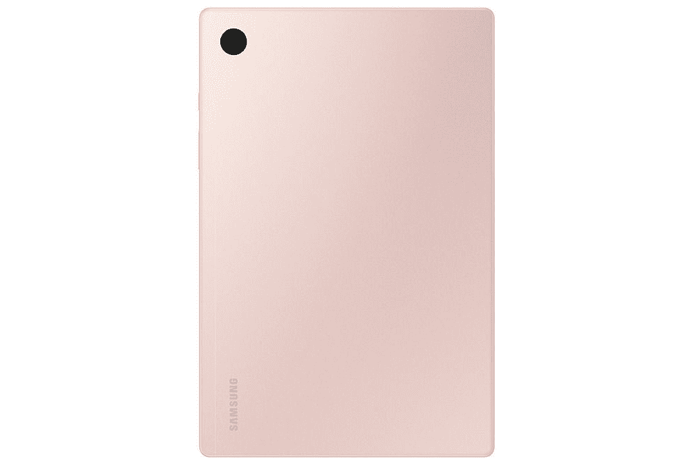

# 三星 Galaxy Tab S8 vs 三星 Galaxy Tab A8:同一家公司，不同的目标受众

> 原文：<https://www.xda-developers.com/samsung-galaxy-tab-s8-vs-samsung-galaxy-tab-a8/>

Galaxy Tab S8 和 Galaxy Tab A8 的名字只有一个字母的区别，但它们是两种截然不同的平板电脑。Galaxy Tab S8 是旗舰产品，也是你现在能买到的最好的 Android 平板电脑之一。今年 1 月，它与更高端的 [Galaxy Tab S8 Ultra](https://www.xda-developers.com/samsung-galaxy-tab-s8-ultra-review/) 一同亮相。另一方面，Galaxy Tab A8 对于那些只想拥有良好多媒体功能的大屏幕设备的人来说，是一个预算友好的选择。

它们如何相互叠加，哪一个最适合你？我们在这种面对面的比较中找到答案。

## 三星 Galaxy Tab S8 与 Galaxy Tab A8:规格

| 

**规格**

 | 

银河标签 S8

 | 

银河 Tab A8

 |
| --- | --- | --- |
| **构建** |  | 

*   玻璃背面
*   金属框架

 |
| **尺寸&重量** | 

*   253.8 x 165.3 x 6.3mm 毫米
*   503 克(Wi-Fi)/507 克(5G)

 | 

*   246.8 x 161.9 x 6.9mm 毫米
*   508 克

 |
| **显示** | 

*   11 英寸 LTPS TFT 液晶屏
*   WQXGA(2560 x 600 像素)
*   276ppi
*   120 赫兹刷新率

 | 

*   10.5 英寸
*   薄膜晶体管液晶显示器
*   1920 x 1200 TFT 液晶显示器

 |
| **SoC** | 

*   高通骁龙 8 代 1

 | 

*   Unisoc Tiger T618 八核处理器(最高 2.0GHz)

 |
| **内存&存储** | 

*   8/12GB 内存
*   128/256GB 存储空间
*   支持 microSD 卡(最高 1TB)

 | 

*   3GB/4GB 内存
*   32GB/GB 存储空间
*   MicroSD 卡支持

 |
| **电池&充电** | 

*   8000 毫安时
*   45W 有线快充支持

 | 

*   7，040 毫安时电池
*   15W 快速充电器(包装盒内)

 |
| **安全** | 侧装式指纹扫描仪 | 

*   面部解锁
*   没有指纹扫描仪

 |
| **后置摄像头** | 

*   初级:1300 万像素，自动对焦
*   超宽:6MP

 |  |
| **前置摄像头** | 12MP | 5MP |
| **端口** |  | 

*   USB 类端口
*   3.5 毫米音频插孔

 |
| **音频** | 

*   由 AKG 调音的四扬声器系统
*   杜比全景声认证
*   3 个麦克风

 | 

*   四声道立体声扬声器
*   杜比全景声支持

 |
| **连通性** | 

*   Wi-Fi 6E
*   蓝牙 5.2
*   5G(某些地区可选)

 | 

*   无线网络 5 (802.11 a/b/g/n/ac)
*   蓝牙 5.0
*   GPS+GLONASS，北斗，伽利略
*   部分型号支持 LTE

 |
| **软件** | 

*   一个基于 Android 12 的 UI 4.1
*   承诺四次 Android 操作系统升级
*   承诺五年的安全补丁

 | 

*   带有一个 UI 3.0 的 Android 11

 |
| **其他特性** | 

*   盒子里有一支钢笔
*   Microsoft Office 365 订阅

 |  |

## 设计与展示

Galaxy Tab S8 是令人印象深刻的 Galaxy Tab S7 的直接继任者，我们称之为 Android 团队在 2020 年必须提供的最好的平板电脑之一。Galaxy Tab S8 是一款彻头彻尾的高端平板电脑，采用玻璃背、金属边框和方形边角。Galaxy Tab S8 的尺寸为 253.8 x 165.3 x 6.33mm 毫米，重量为 503 克，比普通的 [M1 驱动的 iPad Pro](https://www.xda-developers.com/ipad-pro-2021-review/) 更重更高。在背面，你会发现左上角有一个双摄像头模块，垂直于黑色条带，可以容纳和磁性充电你的 S Pen。电源按钮也兼作指纹扫描仪，位于右边缘，而底部则有 USB-C 端口。这里没有耳机插孔。

 <picture></picture> 

Samsung Galaxy Tab S8

Galaxy Tab A8 采用了全塑料结构，鉴于其价格，这是可以理解的。它也有更厚的挡板。背面只有一个摄像头和不显眼的三星标志，给平板电脑一个干净的外观。比 Galaxy Tab S8 略厚略重。物理按键在右边，而 USB-C 端口和 3.5 毫米音频插孔位于底部。

Galaxy Tab S8 采用大型 11 英寸 2K 液晶面板，刷新率为 120Hz，受大猩猩玻璃 5 保护。Galaxy Tab A8 采用 10.5 英寸 TFT LCD 面板，分辨率为 1200 x 1920，标准刷新率为 60Hz。

Galaxy Tab S8 支持通过附带的 S Pen 进行手写笔输入。您可以使用它在大显示屏上绘图、书写和绘制草图。手写笔是压感的，延迟非常低，只有 6.2ms，Galaxy Tab A8 没有配备 S-Pen，也不支持手写笔输入。

## 表演

Galaxy Tab S8 采用高通的骁龙 8 Gen 1 芯片组，是市场上最强大的安卓平板电脑之一。这一点，加上 120Hz 的刷新支持，意味着 Galaxy Tab S8 将快速处理您扔给它的一切，无论是重度游戏、视频编辑还是并排运行多个应用程序。Galaxy Tab S8 还支持 DeX 模式，当您将平板电脑连接到外部显示器、键盘和鼠标时，它会给您带来类似桌面的计算体验。您还可以在平板电脑上以独立模式使用 DeX，方法是将它连接到三星的 Book Cover 键盘。它可以让您将 Galaxy Tab S8 变成笔记本电脑或 PC 的替代品。

与此同时，Galaxy Tab A8 由入门级中端 Unisoc Tiger T618 芯片组提供支持，具有两个运行频率为 2.0GHz 的 Arm Cortex-A75 性能内核和六个主频为 2.0GHz 的 Cortex-A55 效率内核。

Galaxy Tab S8 的基本型号装有 8GB 内存，顶配型号有 12GB 内存。存储选项包括基本型号的 128GB 和顶级型号的 256GB。同时，Galaxy Tab A8 有 3GB/32GB 和 4GB/64GB 两种型号。

## 摄像机

在 Galaxy Tab S8 上，你总共有三个摄像头:两个在后面，一个在前面。后置摄像头设置由一个 13MP f/2.0 主射手和一个 6MP 超宽摄像头组成。此外，前面还有一个 12MP 超宽拍摄器，具有新的自动取景功能(类似于苹果的中央舞台)，可以自动调整拍摄，让你保持在帧中。

Galaxy Tab A8 拥有 8MP 定焦前置摄像头，可以录制 1080p 视频。但是，它不支持自动组帧功能。

## 电池、音频、软件

Galaxy Tab S8 拥有 8,000mAh 的超长电池寿命，三星声称它可以提供长达 15 小时的视频播放或网络浏览。平板电脑通过包装盒内的 45W 快速充电器充电，可以在 1 小时 20 分钟内充满设备。与此同时，Galaxy Tab A8 装有 7040 毫安时电池，并通过 15W 充电器充电。

Galaxy Tab S8 和 Galaxy Tab A8 都配备了强大的四扬声器系统，支持杜比 Atmos 环绕声，可带来身临其境的视频观看和游戏体验。

软件方面，Galaxy Tab S8 开箱即用一个 UI 4 运行 Android 12，而 Tab A8 用一个 UI 3.0 运行 Android 11。虽然三星承诺为 Galaxy Tab S8 提供四年的操作系统更新，但它尚未澄清对中端 Galaxy Tab A8 的立场。

## 结论

Galaxy Tab S8 是该公司的旗舰平板电脑，采用了强大的内部功能和高端设计。它是 M1 驱动的 iPad Pros 的天然竞争对手，虽然 Android 要赶上 iPadOS 还有很长的路要走，但三星在一个 UI 专用软件方面做得很好，如分屏视图、智能开关和 DeX 模式。Galaxy Tab S8 的基本 8GB/128GB 型号起价为 699 美元，有银色、玫瑰金和石墨配色。查看[最佳三星 Galaxy S8 交易](https://www.xda-developers.com/best-samsung-galaxy-tab-s8-deals/)以节省一些钱。

 <picture></picture> 

Samsung Galaxy Tab S8

##### 三星 Galaxy Tab S8

Galaxy Tab S8 是一款旗舰 Android 平板电脑，包装了骁龙 8 Gen1 芯片组和 S-Pen 支持。

 <picture></picture> 

Samsung Galaxy Tab A8

##### 三星 Galaxy Tab A8

Galaxy Tab S8 有一个大显示屏和强大的四扬声器，支持杜比 Atmos。

Galaxy Tab A8 是一款普通的 Android 平板电脑，具有良好的多媒体功能和大屏幕，可以阅读、消费内容或玩游戏。它不支持手写笔，所以你不能做创造性的工作，如绘画。然而，你可以用一个便携式无线键盘连接它，并用一个 folio case 支撑它，把它变成一个基本的工作机器。