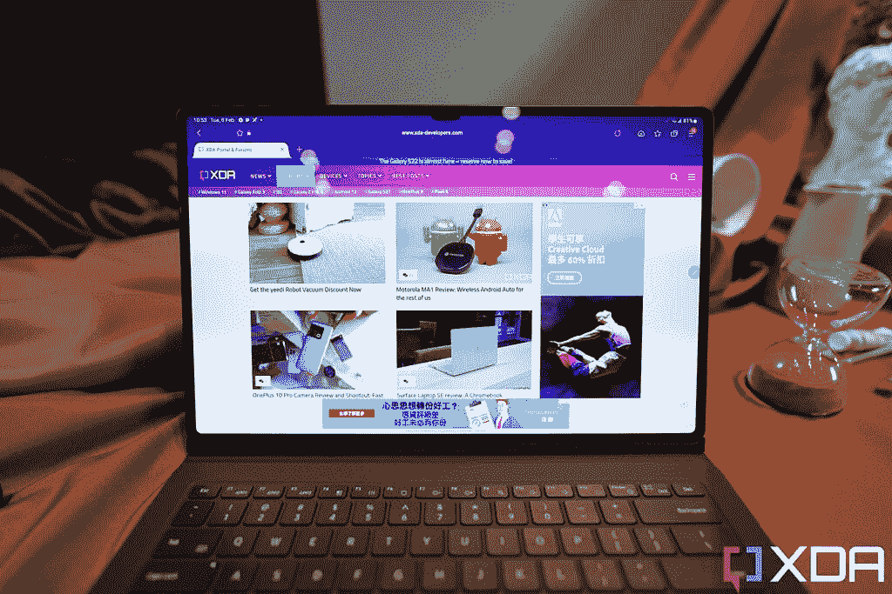

# 三星 Galaxy Tab S8，Tab S8 Plus，Tab S8 Ultra:有什么区别？

> 原文：<https://www.xda-developers.com/samsung-galaxy-tab-s8-vs-samsung-galaxy-tab-s8-plus-vs-samsung-galaxy-tab-s8-ultra/>

三星的新 [Galaxy S22 系列](https://www.xda-developers.com/samsung-galaxy-s22-vs-samsung-galaxy-s22-plus-vs-samsung-galaxy-s22-ultra/)可能吸引了大部分注意力，但在同一场发布会上，这家韩国科技巨头还推出了三款新平板电脑，包括一款“Ultra”型号，这是业内最大的平板电脑之一，比以往任何时候都模糊了平板电脑和笔记本电脑之间的界限。如果你正在市场上寻找一台既能工作又能娱乐的机器，在默认使用 iPad 之前，你应该去[看看三星的 Galaxy Tab S8 系列产品](https://www.xda-developers.com/samsung-galaxy-tab-s8-hands-on/)。让我们来分析一下这三种型号，看看其中是否有一种符合您的需求。

## 获得 Galaxy Tab S8，如果:

*   您想要一款便携式平板电脑，可以轻松地从一个房间带到另一个房间，或者整天放在背包里随身携带
*   你想要一台玩安卓游戏的平板电脑
*   你不想花太多钱

## 获得 Galaxy Tab S8 Plus，如果:

*   你打算做一点有效率的工作
*   你想要更长的电池寿命

## 获得 Galaxy Tab S8 Ultra，如果:

*   你将会做很多有效率的工作
*   您知道平板电脑通常会被固定在桌面上，也就是说，便携性不是您最大的需求
*   你想要尽可能大的屏幕

 <picture></picture> 

Samsung Galaxy Tab S8

##### 三星 Galaxy Tab S8

如果你直接从三星预订 Galaxy Tab S8，你将获得一个免费的书皮键盘 Slim，以扩展平板电脑的功能。

 <picture></picture> 

Samsung Galaxy Tab S8 Plus

##### 三星 Galaxy Tab S8 Plus

如果您直接从三星预订 Galaxy Tab S8 Plus，您将获得相同的免费书皮键盘，从而提高平板电脑的工作效率。

 <picture></picture> 

Samsung Galaxy Tab S8 Ultra

Galaxy Tab S8 Ultra 是最优质的产品，因此免费赠品也更好。您购买的产品附带一个书皮键盘，非常方便。

* * *

## 三星 Galaxy Tab S8 系列:定价和供货情况

三星 Galaxy Tab S8、Tab S8 Plus 和 Tab S8 Ultra 现在可以预订，并将于 2 月 25 日开始发货。价格是:

*   Galaxy Tab S8 的基本款起价为 699 美元，只有 Wi-Fi 连接和 8GB RAM/128GB 存储。还有价格更高的型号，具有 5G 连接、12GB 内存和两倍的存储空间。
*   Galaxy Tab S8 Plus 的基本款起价为 899 美元，只有 Wi-Fi 连接和 8GB RAM/128GB 存储。还有价格更高的型号，具有 5G 连接、12GB 内存和两倍的存储空间。
*   Galaxy Tab S8 Ultra 的基本款起价为 1099 美元，只有 Wi-Fi 连接和 8GB RAM/128GB 存储。还有价格更高的型号，具有 5G 连接、16GB 内存和高达 512GB 的存储空间。

有几笔交易可以降低这些平板电脑的成本。例如，如果你还预订了 Galaxy S22 手机，XDA 的读者可以在三星商店获得额外的 50 美元信用。查看我们的交易列表，了解 Galaxy Tab S8 系列的[最新价格和优惠。](https://www.xda-developers.com/best-samsung-galaxy-tab-s8-deals/)

* * *

## 三星 Galaxy Tab S8 系列:规格

| 

规格

 | 

三星 Galaxy Tab S8

 | 

三星 Galaxy Tab S8 Plus

 | 

三星 Galaxy Tab S8 Ultra

 |
| --- | --- | --- | --- |
| **建造** |  |  |  |
| **尺寸&重量** | 

*   253.8 x 165.3 x 6.3mm 毫米
*   503 克(Wi-Fi)/507 克(5G)

 | 

*   285 x 185 x 5.7mm 毫米
*   567 克(Wi-Fi)/572 克(5G)

 | 

*   326.4 x 208.6 x 5.5mm 毫米
*   726g (Wi-Fi)/728g (5G)

 |
| **显示** | 

*   11 英寸 LTPS TFT 液晶屏
*   WQXGA(2560 x 600 像素)
*   276ppi
*   120 赫兹刷新率

 | 

*   12.4 英寸 Super AMOLED
*   WQXGA+(2800 x 1752 像素)
*   266ppi
*   120 赫兹刷新率

 | 

*   14.6 英寸 Super AMOLED
*   WQXGA+ (2960 x 1848p)
*   240ppi
*   120 赫兹刷新率

 |
| **SoC** | 高通骁龙 8 代 1 | 高通骁龙 8 代 1 | 高通骁龙 8 代 1 |
| **内存&存储** | 

*   8/12GB 内存
*   128/256GB 存储空间
*   支持 microSD 卡(最高 1TB)

 | 

*   8/12GB 内存
*   128/256GB 存储空间
*   支持 microSD 卡(最高 1TB)

 | 

*   8/12/16GB 内存
*   128/256/512GB 存储空间
*   支持 microSD 卡(最高 1TB)

 |
| **电池&充电** | 

*   8000 毫安时
*   45W 有线快充支持

 | 

*   10090 毫安时
*   45W 有线快充支持

 | 

*   11200 毫安时
*   45W 有线快充支持

 |
| **安全** | 侧装式指纹扫描仪 | 显示指纹扫描仪 | 显示指纹扫描仪 |
| **后置摄像头** | 

*   初级:1300 万像素，自动对焦
*   超宽:6MP

 | 

*   初级:1300 万像素，自动对焦
*   超宽:6MP

 | 

*   初级:1300 万像素，自动对焦
*   超宽:6MP

 |
| **前置摄像头** | 12MP | 12MP | 

*   初级:12MP，FF
*   超宽:12MP

 |
| **端口** | USB 3.2 类型 C | USB 3.2 类型 C | USB 3.2 类型 C |
| **音频** | 

*   由 AKG 调音的四扬声器系统
*   杜比全景声认证
*   3 个麦克风

 | 

*   由 AKG 调音的四扬声器系统
*   杜比全景声认证
*   3 个麦克风

 | 

*   由 AKG 调音的四扬声器系统
*   杜比全景声认证
*   3 个麦克风

 |
| **连通性** | 

*   Wi-Fi 6E
*   蓝牙 5.2
*   5G(某些地区可选)

 | 

*   Wi-Fi 6E
*   蓝牙 5.2
*   5G(某些地区可选)

 | 

*   Wi-Fi 6E
*   蓝牙 5.2
*   5G(某些地区可选)

 |
| **软件** | 

*   一个基于 Android 12 的 UI 4.1
*   承诺四次 Android 操作系统升级
*   承诺五年的安全补丁

 | 

*   一个基于 Android 12 的 UI 4.1
*   承诺四次 Android 操作系统升级
*   承诺五年的安全补丁

 | 

*   一个基于 Android 12 的 UI 4.1
*   承诺四次 Android 操作系统升级
*   承诺五年的安全补丁

 |
| **其他特征** | 

*   盒子里有一支钢笔
*   Microsoft Office 365 订阅

 | 

*   盒子里有一支钢笔
*   Microsoft Office 365 订阅

 | 

*   盒子里有一支钢笔
*   Microsoft Office 365 订阅

 |

## 三星 Galaxy Tab S8 系列硬件和设计:尺寸是最大的区别

所有三款 Galaxy Tab S8 看起来都非常像你所期待的平板电脑——它有一个铝制外壳，前面有一个屏幕，周围有边框，按平板电脑的标准来看很薄，但按智能手机的标准来看很厚。这三款平板电脑有许多相同的组件:它们都运行骁龙 8 Gen 1；拥有相同的后置摄像头系统；经过杜比 Atmos 认证的同一个四扬声器系统；相同的软件；相同的 S-Pen(包含在平板电脑中)；和相同的连通性。

至于这三款平板电脑之间的差异，显然是尺寸上的:它们都有不同的屏幕尺寸(11 英寸、12.4 英寸、14.6 英寸)，所以这意味着不同的尺寸和重量。虽然三个屏幕都以 120Hz 的频率刷新，但 11 英寸的 Galaxy Tab S8 的面板是液晶面板，而另外两个则使用三星的“超级 AMOLED”(又名有机发光二极管)。由于采用了 LCD，Galaxy Tab S8 还在侧面的电源按钮中内置了指纹扫描仪，而其他两款 AMOLED 平板电脑则有一个显示指纹传感器。

Ultra 型号的显示被一个小缺口打断。虽然它不像 iPhone 凹槽那样深入屏幕，但仍然不美观。它存在的原因是 Galaxy Tab S8 Ultra packs 双前置摄像头，包括一个超宽。Galaxy Tab S8 和 Tab S8 Plus 只有一个网络摄像头。

 <picture></picture> 

The Galaxy Tab S8 Ultra has a notch.

三星发布了所有三款平板电脑的官方键盘保护套，虽然这些都是完全可选的，但对于 Ultra 来说，这似乎是必须的。这是因为 Ultra 重 726 克(超过 1.6 磅)，宽 326 毫米，对大多数人来说太大了，不能经常用作手持平板电脑。

这些键盘保护套被三星称为“书籍封面键盘”，实际上是一个两件式保护套:背面带支架，前面带键盘和触控板。键盘构造精良，宽敞的按键提供了相当大的移动空间。三星的用户界面也为触控板进行了很好的优化——它支持多手指滑动手势。

Galaxy Tab S8 系列包含相对较大的电池，并且可以以 45W 的速度充满。vanilla Galaxy Tab S8 配备了 8000 毫安时的电池，Galaxy Tab S8 Plus 配备了 10090 毫安时的电池，Ultra 型号配备了 11200 毫安时的电池。三星承诺所有三款设备都有全天电池续航时间，但我们将不得不对这些进行测试。

这三种型号都有 WiFi-only 和 WiFi+蜂窝变体，但具体的可用性和蜂窝技术因地区而异。例如，欧洲的一些地区可以选择所有三种平板电脑的纯 WiFi 和 WiFi+5G 版本。而像美国这样的地区在平板电脑上没有 5G，只有 4G LTE，而且也只是在中间的 Galaxy Tab S8 Plus 上。这不是三种平板电脑之间的内在差异，但你必须注意这一点，因为手机连接平板电脑有自己的优势。

* * *

## 三星 Galaxy Tab S8 系列:软件保持一致

三星明白它不能依靠谷歌来解决 Android 应用程序的缩放问题，所以它在 DeX 模式下建立了自己的解决方案

当谈到 Android 平板电脑时，科技媒体有一个普遍的共识:它们不太好用，尤其是与 iPad 相比。问题从来都不是硬件，因为像三星、华为和小米这样的公司总是能够制造出优秀的硬件。问题出在软件上:大多数 Android 应用程序都是为纵向屏幕设计的，在宽屏横向屏幕上效果不佳。这是一个先有鸡还是先有蛋的问题:应用程序开发人员不会费心为 Android 平板电脑优化应用程序，因为平板电脑行业由 iPads 主导，但想要使用 Android 平板电脑的人会因糟糕的应用程序体验而却步。

三星明白它不能依靠谷歌来解决这个问题，所以它在 DeX 模式下建立了自己的解决方案。这基本上将移动三星用户界面变成了类似 Windows 用户界面的东西，在屏幕底部有一个任务栏，应用程序在可调整大小的窗口中打开。这极大地改善了 Android 上的平板电脑体验，因为拒绝以横向模式打开的应用程序仍然可以在 DeX 中以原生纵向形式打开。同样，浮动窗口显著改善了多任务处理，因为 Android 的分屏多任务处理虽然对智能手机很好，但在平板电脑上看起来却很大。

DeX 模式需要打开，如果你关闭它，那么 Galaxy Tab S8 系列的行为就像一部巨型 Android 手机，特别是三星手机，在 Android 12 上运行一个 UI 4.1。

Galaxy Tab S8 系列具有高度的通用性，因为它可以像巨型智能手机或台式机一样使用，并且两种 UI 都支持 S-Pen 手写笔。无论是画草图，记笔记，还是在照片编辑应用程序中进行精确切割，手写笔都可以派上用场。最重要的是，它包含在 Galaxy Tab S8 中，而不是额外购买。

## 三星 Galaxy Tab S8 系列:哪款适合你？

居中的 Galaxy Tab S8 Plus 可能是大多数人的最佳选择，因为它的 12.4 英寸屏幕对于出色的媒体消费和生产力工作来说足够大，但也没有那么大(像 Ultra 一样)，以至于用一只手在家里到处携带会很麻烦。对于那些想要节省一点钱或者想要最大便携性的人来说，基本型号的 Galaxy Tab S8 是一个可靠的选择，但它的 LCD 面板明显低于其他两款的有机发光二极管屏幕。

与此同时，Galaxy Tab S8 Ultra 就像它的“Ultra”手机一样，是一台矫枉过正的机器。如果你知道你会在桌子上使用它，经常做适当的电脑工作，这是一款你会想买的平板电脑。

如果你想在市场上买一台既能工作又能娱乐的机器，在默认使用 iPad 之前，你应该先看看三星的产品

无论如何，这些都很可能成为今年最好的安卓平板电脑——这不仅仅是因为三星制造了最好的屏幕，或者这些设备运行的是骁龙 8 Gen 1。是 DeX 模式。这是安卓平板电脑的游戏规则改变者。事实上，当 DeX 模式按预期运行良好时，它在多任务处理方面甚至比 iPad Pro 更好。现在，如果应用程序开发人员最终能够更多地关注 Android 平板电脑，而不是仅仅为 iPadOS 构建一切，那该多好。

 <picture></picture> 

Samsung Galaxy Tab S8

##### 三星 Galaxy Tab S8

如果你直接从三星预订 Galaxy Tab S8，你将获得一个免费的书皮键盘 Slim，以扩展平板电脑的功能。

 <picture></picture> 

Samsung Galaxy Tab S8 Plus

##### 三星 Galaxy Tab S8 Plus

如果您直接从三星预订 Galaxy Tab S8 Plus，您将获得相同的免费书皮键盘，从而提高平板电脑的工作效率。

 <picture></picture> 

Samsung Galaxy Tab S8 Ultra

Galaxy Tab S8 Ultra 是最优质的产品，因此免费赠品也更好。您购买的产品附带一个书皮键盘，非常方便。