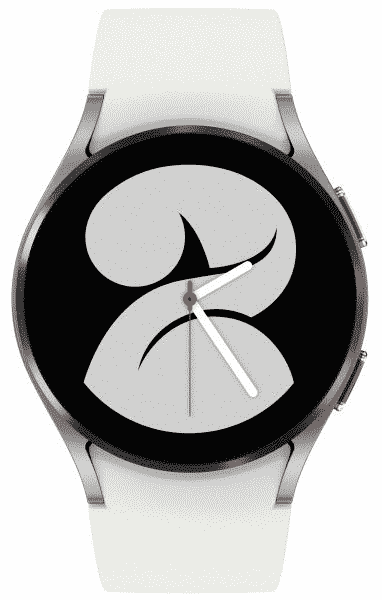
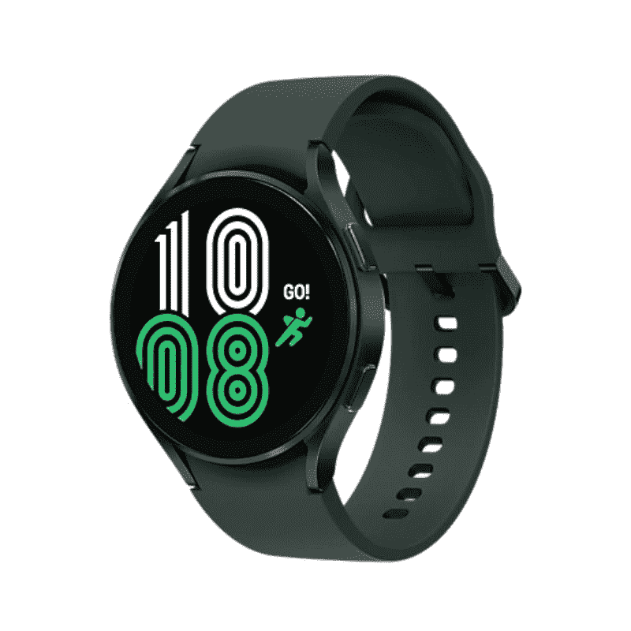
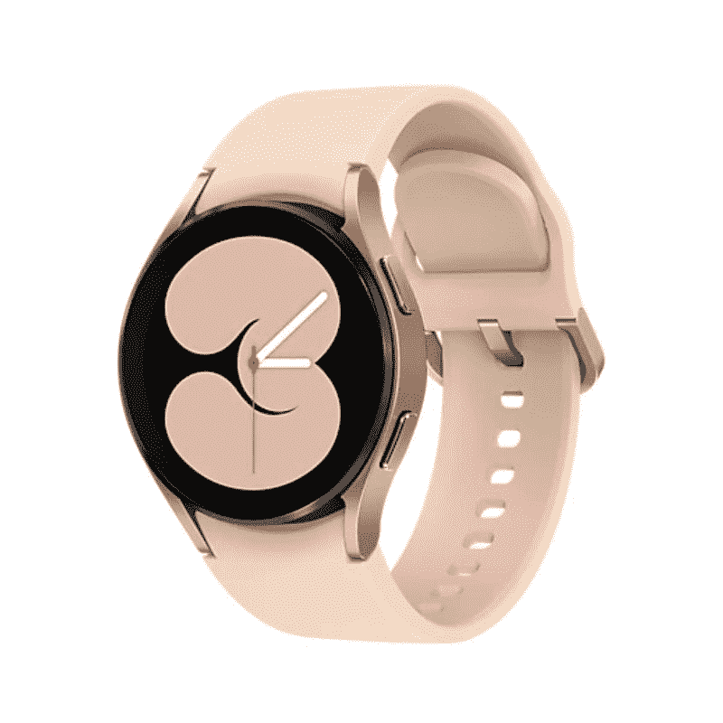
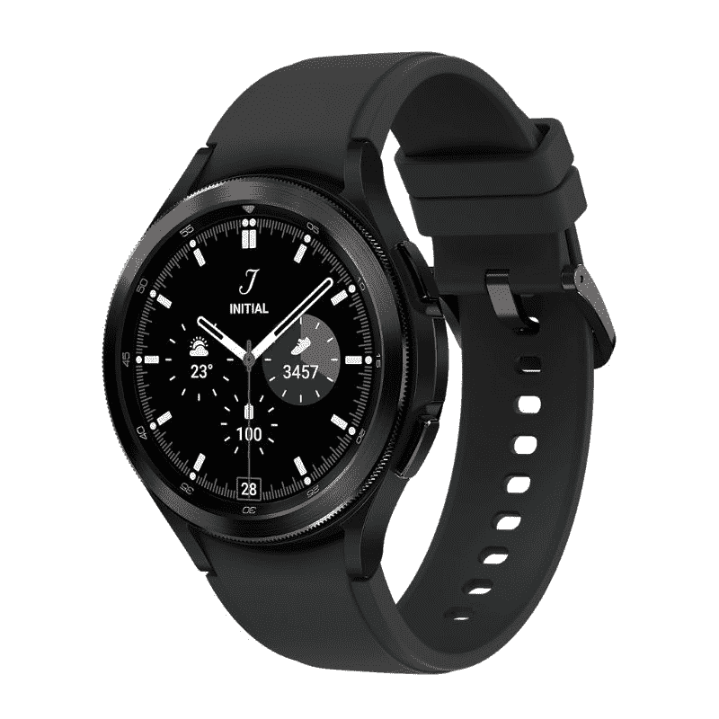
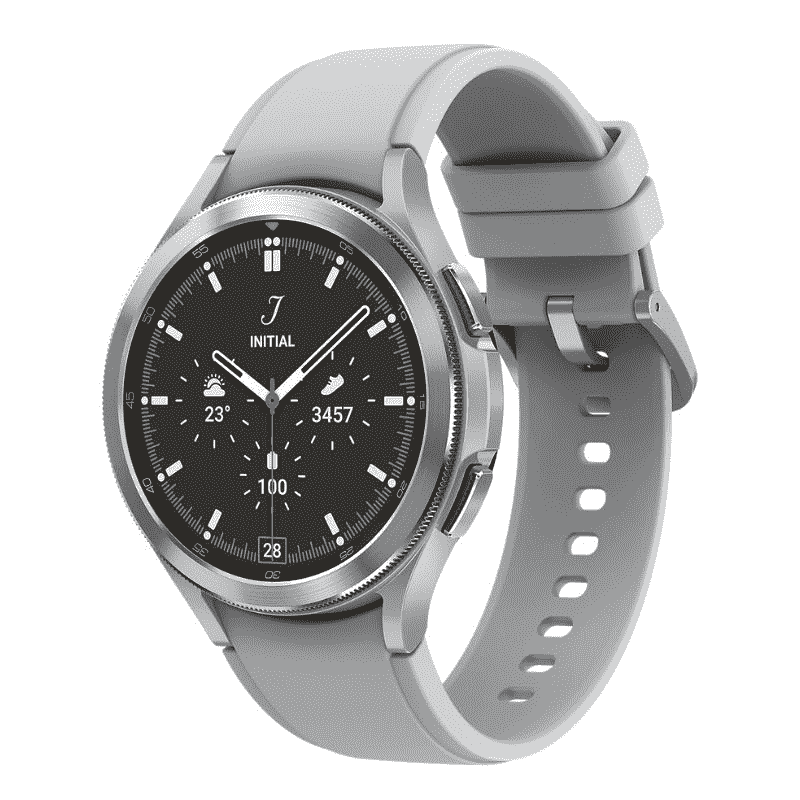

# Galaxy Watch 4 和 Galaxy Watch 4 Classic 都有什么颜色？

> 原文：<https://www.xda-developers.com/samsung-galaxy-watch-4-classic-colors/>

# Galaxy Watch 4 和 Galaxy Watch 4 Classic 都有什么颜色？

想知道三星 Galaxy Watch 4 系列有哪些颜色可供选择？我们解释所有的 Galaxy Watch 4 颜色和尺寸。

[三星 Galaxy Watch 4](https://www.xda-developers.com/samsung-galaxy-watch-4/) 和 [Watch 4 Classic](https://www.xda-developers.com/samsung-galaxy-watch-4-classic-review/) 是第一批运行在谷歌和三星统一智能手表平台上的智能手表。这两款智能手表在最近的三星 Unpacked 活动中首次亮相。Galaxy Watch 4 系列有几个令人兴奋的新功能，如果你打算购买其中一个，你可能会想知道可用的颜色和尺寸选项。

智能手表不仅是一个小工具，也是一个时尚配件，因为你几乎每天都戴着它。这就是为什么对很多人来说，手表的颜色和表带也是决定购买新智能手表的重要因素。值得庆幸的是，三星提供了一些选项，根据你想要的外观来选择。如果你想要一个严肃的外观，有一些微妙和隐秘的东西，而如果你想让每个人都注意到你的新手表，也有一个 blingy 选项！挑一个你最喜欢的。

## 三星 Galaxy Watch 4:颜色和尺寸

三星将提供四种颜色的 Galaxy Watch 4——黑色、银色、绿色和玫瑰金——以及两种表盘尺寸——40 毫米和 44 毫米。值得注意的是，绿色将专属于 44 毫米型号，而玫瑰金将仅限于 40 毫米型号。

*   <picture></picture>

    银色

    ##### 三星 Galaxy Watch 4 经典

    银色变种是另一个基本款。搭配白色表带，它看起来永远优雅。

*   <picture></picture>

    绿色

    ##### 三星 Galaxy Watch 4 经典款

    Galaxy Watch 4 的绿色变种带有深橄榄绿色调。如果你想找些不同的东西，它会很适合你。

*   <picture></picture>

    玫瑰金

    ##### 三星 Galaxy Watch 4 Classic

    玫瑰金是手表 4 的绚丽色彩选择。这可能是两极化的，但有很多这种色调的粉丝。

## 三星 Galaxy Watch 4 Classic:颜色和尺寸

Galaxy Watch 4 Classic 将零售两种表盘尺寸——42 毫米和 46 毫米——以及两种颜色——黑色和银色。

 <picture></picture> 

Black

##### 三星 Galaxy Watch 4 经典版

由于三星在 Watch 4 Classic 上追求经典的手表外观，它只选择了基本款，黑色是永恒的。

 <picture></picture> 

Silver

##### 三星 Galaxy Watch 4 经典版

如果你不喜欢黑色，银色款是经典款的唯一选择。还好看起来很优雅。

* * *

据三星称，两款智能手表的表带都是可更换的。因此，您将有大量选项来定制您喜欢的智能手表。我们在市场上挑选了[最佳 Galaxy Watch 4 表带](https://www.xda-developers.com/best-galaxy-watch-4-bands/)来帮助你进行搜索。

您打算购买两款新的三星智能手表中的哪一款，以及哪种颜色？请在评论区告诉我们。