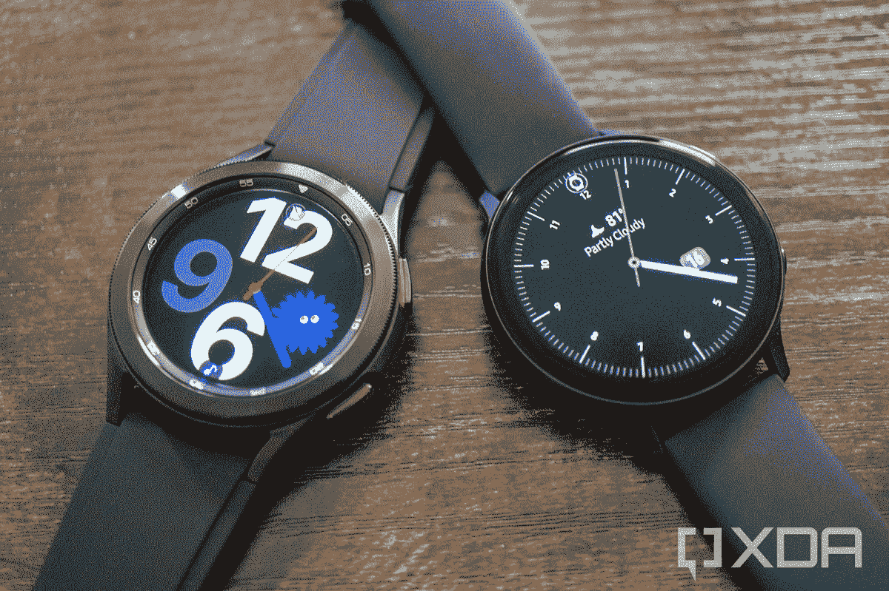
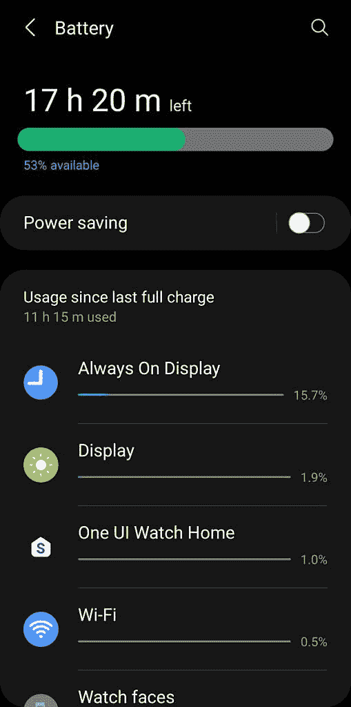

# 三星 Galaxy Watch 4 经典回顾:迄今为止最好的 Wear OS 手表

> 原文：<https://www.xda-developers.com/samsung-galaxy-watch-4-classic-review/>

尽管三星和谷歌已经在手机和平板电脑上合作多年，但可穿戴设备却并非如此。三星只发布了一款搭载谷歌可穿戴软件(当时叫 Android Wear)的手表 [Gear Live](https://forum.xda-developers.com/f/samsung-gear-live.3263/) ，之后的每一款可穿戴设备都使用了三星自己的 Tizen 平台。尽管在大多数领域，Tizen 都比 Wear OS 更加精致，但唯一一家生产 Tizen 手表的公司是三星，该公司没有进行太多的应用开发。与此同时，Wear OS 由于硬件不佳和同样缺乏软件开发而停滞不前。

今年早些时候，三星和谷歌宣布他们将在可穿戴设备上合作。三星承诺将其智能手表转向 Wear OS，同时为该平台贡献代码和其他资源，谷歌将*实际上*开始投资新的应用和服务平台。这种合作关系也可能为其他 Wear OS 手表使用三星的 Exynos 芯片打开大门，但这些还没有实现。

这一合作关系的第一款产品是三星 Galaxy Watch 4，有现代和“经典”两种款式——我从三星收到了后者。Galaxy Watch 4 是第一款运行 Wear OS 3 的手表，搭配全新的 [Exynos W920 芯片组](https://news.samsung.com/global/samsung-introduces-the-industrys-first-5nm-processor-powering-the-next-generation-of-wearables?utm_source=rss&utm_medium=direct)和其他高端内部硬件。有很多令人兴奋的事情，但 Galaxy Watch 4 真的是一款好的智能手表吗，特别是与 Apple Watch Series 6 相比？请继续阅读，寻找答案，如果你正在购买，我们有[最佳表带](https://www.xda-developers.com/best-galaxy-watch-4-bands/)的综述。

## Galaxy Watch 4 经典规格

| 

规格

 | 

三星 Galaxy Watch 4 经典版

 |
| --- | --- |
| **尺寸** | 42 毫米和 46 毫米 |
| **尺寸&重量** | 

*   42 毫米:41.5×41.5×11.2 毫米，46.5 克
*   46 毫米:45.5×45.5×11.0 毫米，52 克
*   不锈钢外壳

 |
| **显示** | 

*   42 毫米:1.19 英寸(330PPI)
*   46 毫米:1.36 英寸(330PPI)

 |
| **SoC** | exy nos W920(5 纳米) |
| **闸板&存放** | 

*   1.5GB 内存
*   16GB 内部存储

 |
| **电池&充电** | 

*   42 毫米:247 毫安时
*   46 毫米:361 毫安时

 |
| **传感器** | 加速度计，气压计，陀螺仪，地磁，光，三星生物活性传感器 |
| **连通性** | LTE、蓝牙 5.0、Wi-Fi 802.11 a/b/g/n 2.4+5GHz、NFC、GPS/Glonass/北斗/Gallileo |
| **耐久性** | 

*   5 大气压防水
*   IP68
*   军用标准 810G

 |
| **软件** | 用一个 UI 3 穿 OS 3 |

*关于这篇评论:我收到了三星美国公司租借的 42mm Galaxy Watch 4 Classic。三星对这篇评论没有编辑意见。*

## 设计和硬件

三星已经销售了两种不同风格的智能手表:时尚的 Galaxy Watch Active 和更传统设计的 Galaxy Watch。今年，该公司将同时更新这两种设计，因此无论你选择哪一种，你都将获得相同的内部硬件。我收到的 Galaxy Watch 4 Classic 尺寸较小，为 42 毫米，但也有 46 毫米的版本，两种尺寸都有银色可选。

经典设计看起来几乎与早期的 Galaxy Watch 3 相同，采用金属设计，屏幕周围有凸起的边框。与早期的 Galaxy 手表一样，Galaxy Watch 4 Classic 允许你用手指旋转表圈来滚动浏览你打开的任何内容。这仍然是 Galaxy Watch 系列的最佳功能之一，我很高兴它一直坚持到过渡到 Wear OS——只要你购买 Watch 4 经典款。

 <picture></picture> 

Galaxy Watch 4 Classic (left) next to the Galaxy Watch Active 2 (right)

手表侧面的右侧有两个按钮，与以前的 Galaxy 手表的位置相同，但现在更平，略大。最上面的按钮可以带你到手表表面，按住它可以打开 Bixby 语音助手。下方的按键作为返回键，长按打开 Samsung Pay。您可以在手表的设置中自定义长按操作。

手表的背面完全是玻璃，中央有几个健康传感器。就像以前的 Galaxy 手表一样，Galaxy Watch 4 Classic 使用无线充电来充电，但三星仍然锁定了充电器的兼容性。只有盒子中包含的基座和少数三星制造的充电器是官方兼容的(如[、50 美元的充电板 Duo](https://www.amazon.com/SAMSUNG-Wireless-Universally-Compatible-Samsung/dp/B08NRX4X1B?tag=xda-4kr71p0-20&ascsubtag=UUxdaUeUpU3793&asc_refurl=https%3A%2F%2Fwww.xda-developers.com%2Fsamsung-galaxy-watch-4-classic-review%2F&asc_campaign=Short-Term) )，尽管这款手表已经被[证明可以使用](https://9to5google.com/2021/08/16/galaxy-watch-4-charging-qi-pixel-5/)Pixel 5 的电池共享功能和少数(并非全部)非三星充电板。

我仍然喜欢更时尚的非经典 Galaxy 手表，但不可否认的是，Galaxy Watch 4 Classic 是目前设计最好的智能手表之一。

不可否认，Galaxy Watch 4 Classic 是设计最好的智能手表之一。

## 软件穿戴 OS 3 在 Galaxy Watch 4 上首次亮相

Galaxy Watch 4 系列的定义功能是新的软件体验。Watch 4 不仅是第一款发布的 Wear OS 3 手表，也是第一款(谷歌认证的)带有大量定制界面的 Wear OS 手表。在此之前，谷歌只允许手表制造商预装自己的应用程序，而不是改变软件的整体外观和感觉。

Galaxy Watch 4 对 Wear OS 的改变如此之多，如此重要，以至于我写了一篇关于软件体验的专门文章。如果你想知道所有的细节，可以去读一下，但简短的版本是，Galaxy Watch 4 的软件是三星旧的 Tizen 平台和谷歌的 Wear OS 的混合。它有 Play Store、地图和其他谷歌应用，但手表的其他部分完全是定制的。

这与三星在手机和平板电脑上使用的方法相同——Android 是核心，但大部分软件和界面都是三星制造的。你仍然可以下载所有你想要的谷歌应用，只有一个例外。谷歌助手不可用，这使得 Galaxy Watch 4 成为第一款没有某种形式的谷歌搜索的 Wear OS 手表*。[三星目前正在“与谷歌密切合作”](https://www.xda-developers.com/galaxy-watch-4-doesnt-have-youtube-music-or-google-assistant-yet/)为手表带来助手和其他功能，但至少目前，你还停留在 Bixby 助手上。*

 *Galaxy Watch 4 还有一个奇怪的问题，它不适用于其他 Wear OS(或 Tizen)手表:[它不能与 iPhones 配合使用](https://www.xda-developers.com/galaxy-watch-4-not-compatible-with-apple-iphone/)。三星没有说明原因，但有可能 Galaxy 可穿戴应用的 iOS 版本尚未更新以支持新手表。其他所有 Wear OS 手表都使用谷歌的 Wear OS 应用进行配对和同步，Android 和 iOS 都可以使用。

## 性能和电池寿命

Galaxy Watch 4 Classic 使用三星自己的 [Exynos W920 芯片组](https://news.samsung.com/global/samsung-introduces-the-industrys-first-5nm-processor-powering-the-next-generation-of-wearables)，而不是大多数其他 Wear OS 手表中的高通骁龙 Wear 芯片。三星也一直在努力为 Wear OS 带来性能和电池寿命的改善，所以 Galaxy Watch 4 似乎是迄今为止最快的 Wear OS 智能手表也就不足为奇了。

Galaxy Watch 4 似乎是迄今为止最快的穿戴式操作系统智能手表

Galaxy Watch 4 Classic 的性能让我印象深刻。时不时还是会有一些抖动，尤其是在快速滚动磁贴时，但这款手表总体来说反应灵敏，速度很快。像地图和 Play Store 这样的应用程序只需要一两秒钟就可以打开，而且不像其他一些 Wear OS 手表(像 Fossil Group 的大多数手表一样)，Galaxy Watch 的屏幕以 60Hz 的频率运行。

 <picture></picture> 

My Galaxy Watch 4 Classic had 53% battery remaining after 11 hours of light use with AOD on.

电池续航时间也很长，尽管不如我的 44 毫米 Galaxy Watch Active 2 和 Tizen 出色。在启用了永远显示功能的手表 Active 2 上，我通常会在一天结束时剩余 60-70%的电池，但 Galaxy Watch 4 Classic 的电池使用量在一天结束时达到了 50%左右。这更符合典型的 Wear OS 电池寿命。值得注意的是，不同的 Galaxy Watch 4 Classic 尺寸有不同的电池——我的 42 毫米型号有 257 毫安时电池，而 46 毫米型号则有 361 毫安时电池。

## 结论 Galaxy Watch 4 是最适合佩戴的操作系统手表

在混合使用 Wear OS 和 Galaxy 智能手表多年后，我很高兴看到这两者的组合会是什么样子。我原本期待高质量的硬件搭配谷歌软件，但这更像是三星软件和硬件搭配一盎司谷歌。如果你在隐藏 Play Store 图标的同时递给我 Galaxy Watch 4 Classic，并告诉我这是另一款基于 Tizen 的 Galaxy Watch，我会相信你。

到目前为止，我已经使用三星手机和平板电脑作为我的主要设备大约两年了，所以我不介意该公司的 One UI 皮肤和其他变化。然而，如果你在等待一款使用谷歌“材料你”设计语言的手表，Galaxy Watch 4 可能不适合你。谷歌助手的缺席很奇怪，但除了这一个例外，你不会失去以前 Wear OS 手表的任何功能。

**[三星 Galaxy Watch 4 系列论坛](https://forum.xda-developers.com/f/samsung-galaxy-watch-4.12439/)**

总之，如果你喜欢三星以前的手表，你会喜欢 Galaxy Watch 4 Classic(和普通手表 4)。如果你想买一款 Wear OS 手表，你大概应该买这款，除非你*真的*需要手腕上的谷歌助手。

 <picture></picture> 

Galaxy Watch 4

##### 三星 Galaxy Watch 4 经典版

Galaxy Watch 4 是三星最新一代的智能手表，这款经典机型保留了早期手表中令人喜爱的旋转表圈。

 <picture></picture> 

Silver

##### 三星 Galaxy 手表 4

如果你想要一个没有旋转表圈的更简约的外观，标准的 Galaxy Watch 4 提供了与经典款相同的所有功能。*