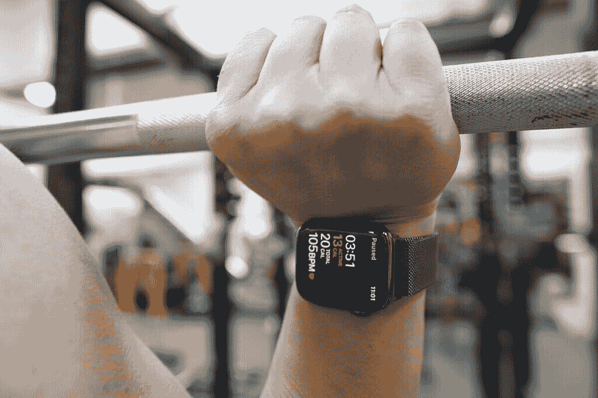
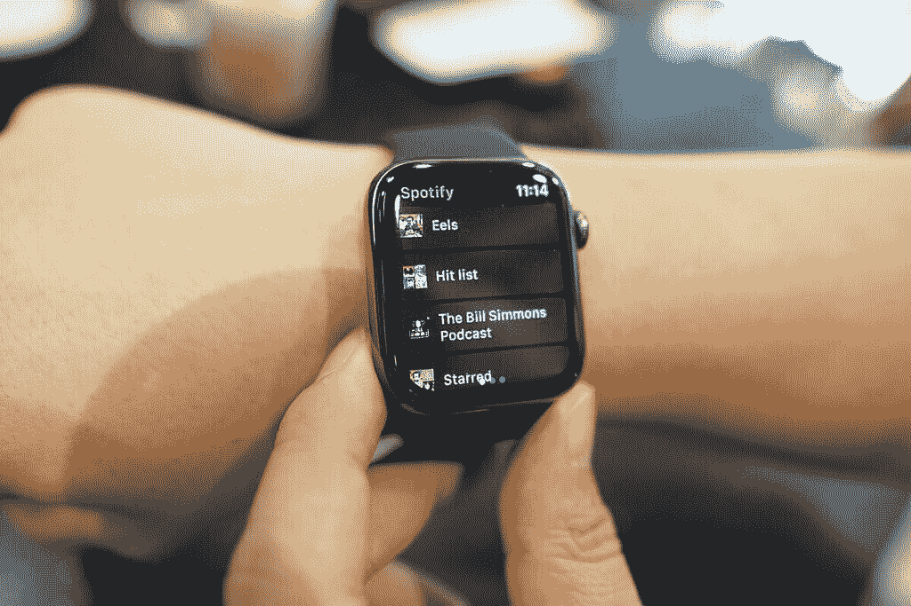
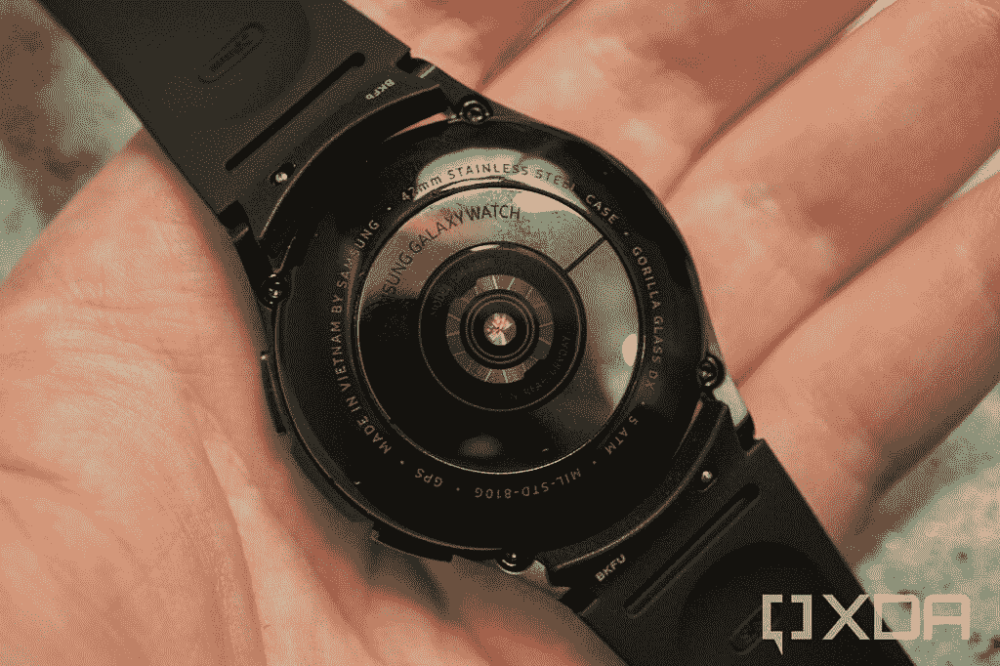

# 三星 Galaxy Watch 4 Classic vs Apple Watch 系列 6

> 原文：<https://www.xda-developers.com/samsung-galaxy-watch-4-classic-vs-apple-watch-6/>

三星新款 [Galaxy Watch 4](https://www.xda-developers.com/samsung-galaxy-watch-4/) 系列来了。它包括 Galaxy Watch 4 Classic，顾名思义，它具有经典的钟表外观。随着 Apple Watch Series 6 成为智能手表市场的黄金标准，人们很自然地将新款三星智能手表与苹果产品进行比较，这就是我们在这里要做的事情。我们将对比三星 Galaxy Watch 4 Classic 和 Apple Watch Series 6，看看这两款智能手表的实力如何。

**导航本指南:**

## 三星 Galaxy Watch 4 Classic vs Apple Watch 系列 6:规格

|  | 

三星 Galaxy Watch 4 经典版

 | 

Apple Watch 系列 6

 |
| --- | --- | --- |
| 

显示

 | 

*   46 毫米:1.36 英寸(450×450)，330ppi
*   42 毫米:1.19 英寸(396×396)，330ppi
*   超级 AMOLED
*   带 DX 的康宁大猩猩玻璃

 | 

*   44 毫米:(368×448)
*   40 毫米:(324×394)
*   LTPO·有机发光二极管
*   离子 X 或蓝宝石水晶玻璃

 |
| 

处理器

 | exy nos W920(5 纳米) | 苹果 S6 |
| 

记忆

 | 

*   1.5GB 内存+ 16GB 内部存储

 | 32GB 内部存储 |
| 

尺寸和重量

 | 

*   不锈钢外壳
*   46 毫米:45.5 x 45.5 x 11mm 毫米，52 克
*   42 毫米:41.5 x 41.5 x 11.2mm 毫米，46.5 克

 | 

*   44 毫米:44 x 38 x 10.7mm 毫米(不锈钢 47.1 克，铝 36.5 克，钛 41.3 克)
*   40 毫米:40 x 34 x 10.7mm 毫米(不锈钢 39.7 克，铝 30.5 克，钛 34.6 克)

 |
| 

电池

 | 

*   46 毫米:361 毫安时
*   42 毫米:247 毫安时

 | 长达 18 小时 |
| 

传感器

 | 加速度计、气压计、陀螺传感器、地磁传感器、光线传感器、三星生物活性传感器(光学心率传感器+电心脏传感器+生物电阻抗分析传感器) | 指南针、高度计、血氧传感器、电子心脏传感器、光学心脏传感器、加速度计、陀螺仪、环境光传感器 |
| 

连通性

 | Wi-Fi 802.11b/g/n、蓝牙 5.0、GPS、NFC、LTE(可选) | Wi-Fi 802.11b/g/n、蓝牙 5.0、GPS、LTE(可选) |
| 

持久性

 | 5 大气压+ IP68 / MIL-STD-810G | 防水深度可达 50 米 |
| 

价格

 | 起价 349.99 美元 | 起价 399 美元 |

## 设计和展示

简而言之，三星和苹果智能手表的设计非常不同。虽然三星已经采用了传统的手表外观和用于导航的旋转表圈，但你将在 Apple Watch Series 6 上获得矩形、弯曲的设计和用于导航的数字表冠。

Apple Watch 上有很多颜色和材料可供选择，而三星 Watch 上，你只能选择不锈钢和三种颜色。也就是说，你也可以选择普通的三星 Galaxy Watch 4，它由铝制成，有更多的颜色。

很难比较这些智能手表的显示屏尺寸，因为它们的形状不同，但你可以在每英寸几乎相同的像素(PPI)下获得一个永远在线的有机发光二极管显示屏。三星还使用康宁大猩猩玻璃和 DX 来保护显示屏，而苹果在低端型号上包装了 Ion-X 玻璃，在高端型号上包装了蓝宝石晶体玻璃。虽然 Ion-X 玻璃在性能方面与 Gorilla 玻璃相似，但蓝宝石水晶玻璃通常更坚固耐用。

## 三星 Galaxy Watch 4 Classic vs Apple Watch 系列 6:内部

 <picture></picture> 

Apple Watch Series 6

Apple Watch Series 6 配备了该公司的双核 s 6 处理器。另一方面，你将在三星 Galaxy Watch 4 Classic 中获得双核 Exynos W920。这两款芯片都能够提供出色的性能。

此外，两款智能手表都支持 GPS、蓝牙 5.0 和 Wi-Fi 802.11b/g/n。系列 6 还包括 32GB 内部存储、血氧传感器、电子心脏传感器和光学心脏传感器。相比之下，Watch 4 Classic 配备了 16GB 的内部存储和该公司新的生物活性传感器，可以读取光学心率、电心率、血氧水平，并计算身体成分。

## 操作系统和智能手机兼容性

Galaxy Watch 4 Classic 运行在由谷歌和三星开发的新智能手表平台“Wear OS Powered by Samsung”上。它包含了常规 Wear OS 和 Tizen 的元素。在最新的 Wear OS 版本上，三星也在使用其 One UI 手表界面。

三星表示，Watch 4 Classic 只能在装有谷歌移动服务(GMS)的 Android 6.0 或更高版本设备上使用。这意味着 iPhones 和华为的 GMS 安卓手机运气不佳。

 <picture></picture> 

Apple Watch Series 6

由于新的 Wear OS 版本，Galaxy Watch 4 Classic 可以访问谷歌和三星的应用程序，如谷歌地图、三星支付、SmartThings 和 Bixby 以及第三方应用程序，如 Calm、Strava、Spotify 和 Adidas Running。

Apple Watch Series 6 运行在 watchOS 7 上。它可以通过应用商店访问大量的应用程序。几乎所有你能在 Galaxy Watch 4 Classic 上获得的应用程序都可以在 App Store 上获得，还有更多。Series 6 上的板载应用程序选择也很棒。

在设备兼容性方面，Series 6 和它的前辈一样，只支持 iPhones。没有安卓支持。

总的来说，在软件和应用程序可用性方面，Series 6 比 Galaxy Watch 4 Classic 有优势，但看看未来几个月 Wear OS 3 和 One UI Watch 如何发展将会很有趣。

## 健康和保健功能

 <picture></picture> 

Samsung Galaxy Watch 4 Classic

三星 Galaxy Watch 4 和 Apple Watch Series 6 包括一系列健康、保健和智能手机伴侣功能。

Galaxy Watch 4 Classic 的生物活性传感器可以监控您的血压，检测 AFib 不规则心跳，并测量血氧水平。它还可以计算你的身体成分，包括骨骼肌、基础代谢率、身体水分和身体脂肪百分比。

此外，智能手表提供了广泛的指导锻炼和高级睡眠跟踪功能，能够检测和记录您的鼾声。

另一方面，Apple Watch Series 6 可以随时跟踪你的血氧水平、心率并生成心电图。它还可以跟踪你的睡眠，帮助你实现个人睡眠目标。

此外，该手表还提供多种精确测量的健身模式。可以访问付费健身+订阅，它为您提供由专业教练进行的锻炼目录等。

### 三星 Galaxy Watch 4 Classic vs Apple Watch 系列 6:定价

三星 Galaxy Watch 4 Classic 起价 349.99 美元，提供蓝牙和 LTE 版本。有 42mm 和 46mm 两种尺寸。Apple Watch Series 6 起价 399 美元，提供 GPS 和 GPS +蜂窝两种版本。系列 6 有 40mm 和 44mm 两种尺寸。

## 应该买哪个？

在三星 Galaxy Watch 4 Classic 和 Apple Watch Series 6 之间做出决定非常容易，这在很大程度上取决于你使用的智能手机。如果你有一部 Android 手机，Galaxy Watch 4 Classic 是有意义的。但如果你有一部 iPhone，没有比 Apple Watch Series 6 更好的手表了。也就是说，如果你既想买新的智能手表，又想买新的智能手机——智能手表将在你的购买决定中发挥重要作用——那么拥有更全面应用支持的 Apple Watch Series 6 仍然是一个更好的选择。

 <picture></picture> 

Samsung Galaxy Watch 4 Classic

##### 三星 Galaxy Watch 4 经典版

三星 Galaxy Watch 4 Classic 有 42 毫米和 46 毫米两种尺寸。它还运行在新的“由三星支持的 Wear OS”平台上。

 <picture></picture> 

Apple Watch Series 6

##### Apple Watch 系列 6

Apple Watch Series 6 是该公司的旗舰智能手表。它提供 40 毫米和 44 毫米的外壳尺寸，并提供仅 GPS 和 GPS +蜂窝变体。

这两款智能手表你打算买哪一款？请在评论区告诉我们。此外，如果你正在购买智能手表，请查看 Galaxy Watch 4 的最佳表带。