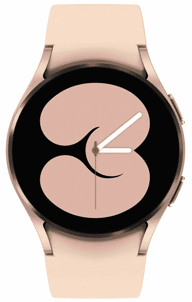
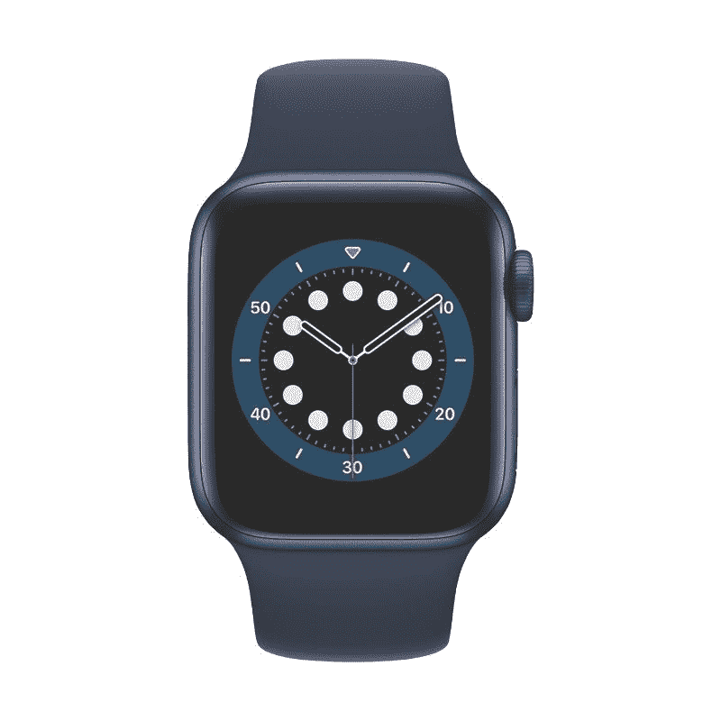

# 三星 Galaxy Watch 4 vs Apple Watch 6:应该买哪一款智能手表？

> 原文：<https://www.xda-developers.com/samsung-galaxy-watch-4-vs-apple-watch-6/>

三星宣布了其最新的智能手表——Galaxy Watch 4(T1)——与前代相比，它有许多改进。Galaxy Watch 4 的两大亮点是，它运行在[谷歌新的 Wear OS 平台上，上面有三星的皮肤](https://www.xda-developers.com/wear-os-3-galaxy-watch-4-oneui-watch-review/)，以及三星新的生物活性传感器，这使它在健康跟踪方面得到了提升。有了这些新的改进，Android 似乎终于成为了苹果手表(Apple Watch)的竞争对手。如果你想买一款新的智能手表，却不知道 Galaxy Watch 4 和 Apple Watch 6 哪个更好，下面是你需要的对比。

### 三星 Galaxy Watch 4 vs Apple Watch 6 规格

## 三星 Galaxy Watch 4 vs Apple Watch 6:规格

| 

规格

 | 

三星 Galaxy 手表 4

 | 

苹果手表 6

 |
| --- | --- | --- |
| 尺寸 |  |  |
| 尺寸和重量 | 

*   40 毫米:40.4×39.3×9.8 毫米，25.9 克
*   44 毫米:44.4×43.3×9.8 毫米，30.3 毫米
*   铝制外壳

 | 

*   40 毫米:40 x 34 x 10.7mm 毫米(不锈钢 39.7 克，铝 30.5 克，钛 34.6 克)
*   44 毫米:44 x 38 x 10.7mm 毫米(不锈钢 47.1 克，铝 36.5 克，钛 41.3 克)

 |
| 显示 | 

*   40 毫米:396x396
*   44 毫米:450x450

 | 

*   40 毫米:324x394
*   44 毫米:368x448

 |
| 处理器 | exy nos W920(5 纳米) | 苹果 S6 |
| 记忆 | 

*   1.5GB 内存
*   16GB 内部存储

 |  |
| 电池 | 

*   42 毫米:247 毫安时
*   46 毫米:361 毫安时

 | 长达 18 小时 |
| 传感器 | 加速度计，气压计，陀螺仪，地磁，光，三星生物活性传感器 | 指南针、高度计、血氧传感器、电子心脏传感器、光学心脏传感器、加速度计、陀螺仪、环境光传感器 |
| 连通性 | 

*   长期演进
*   蓝牙 5.0
*   Wi-Fi 802.11 a/b/g/n 2.4+5GHz
*   国家足球联盟
*   GPS/Glonass/北斗/Gallileo

 | 

*   长期演进
*   蓝牙 5.0
*   Wi-Fi 802.11 a/b/g/n 2.4+5GHz
*   国家足球联盟
*   GPS/Glonass/北斗/Gallileo

 |
| 持久性 | 

*   5 大气压防水
*   IP68
*   军用标准 810G

 | 防水深度可达 50 米 |
| 操作系统（Operating System） | OneUI 手表 | WatchOS 7 |

## 设计和展示

Galaxy Watch 4 和 Apple Watch Series 6 的设计都截然不同。乍一看，你会发现 Galaxy Watch 4 有一个更传统的外观，圆形表盘，类似于传统手表。另一方面，Apple Watch 6 有一个带数字表冠的矩形表盘。表冠用于滚动列表，甚至可以按下并用作按钮。

虽然 Galaxy Watch 4 没有表冠，但它的显示屏周围有一个触摸电容边框，你可以用它来滚动或浏览用户界面。鉴于两款手表表盘形状的不同，显示屏也有所不同。两款手表都有一个 OLED 面板，但 Apple Watch 上的那个是矩形的，边缘是弯曲的。Galaxy Watch 4 上的显示屏是一个合适的圆形，很多人可能更喜欢这个圆形。然而，矩形显示器允许在显示器上看到稍微更多的内容。

至于构造，Galaxy Watch 4 由铝制成，Apple Watch 6 的基本款也是如此。然而，Apple Watch 6 也有不锈钢版本和钛版本，如果你愿意挥霍的话。 [Galaxy Watch 4 也有经典款](https://www.xda-developers.com/samsung-galaxy-watch-4-classic-review/)可供选择，这款手表由不锈钢制成，具有稍微更高级的感觉。归根结底，这完全取决于个人喜好。有些人可能更喜欢矩形表盘，而有些人可能更喜欢圆形表盘的传统外观。

## 内部:性能和用户界面

苹果在手表上使用自己的硅，Apple Watch 6 配有 S6 芯片。苹果的硬件和软件优化确保了 Apple Watch 6 在浏览应用和菜单时的流畅。这款手表反应灵敏，用起来感觉很爽快。它还无缝集成到苹果生态系统中，允许你在没有密码的情况下解锁 iPhone 和 Mac，允许你将手表用作 iPhone 相机的取景器，自动连接到 AirPods 等。Apple Watch 6 也有蜂窝版本。使用手表上的应用商店，您可以在 Apple Watch 上下载几个与健身、工作效率、娱乐等相关的应用程序。

Galaxy Watch 4 使用三星的 Exynos W920 SoC，这是该品牌基于 5 纳米制造工艺的最新智能手表芯片组。处理器速度快，能效高，当与谷歌开发的最新 OneUI 手表软件相结合时，Galaxy Watch 4 还可以在手表上的不同应用程序和菜单之间飞行。Galaxy Watch 4 也可以很好地与三星设备同步，因为它使用了许多三星的默认应用和服务。Galaxy Watch 4 也有 LTE 版本。虽然前几代 Galaxy Watch 由于 Tizen 而在功能方面受到限制，但 Galaxy Watch 4 基于 Wear OS 的事实允许用户从谷歌 Play 商店安装应用程序。

## 健康特征和兼容性

Apple Watch 6 和 Galaxy Watch 4 在健康功能方面得分都很高。Apple Watch 6 具有心率监测器、SpO2 监测器、心电图、跌倒检测以及常规步数和卡路里跟踪功能。Galaxy Watch 4 拥有所有这些功能，并由于一种新的生物活性传感器而具有测量身体成分的能力。

Galaxy Watch 4 最适合三星设备，但它也兼容所有安装了谷歌服务的安卓手机。与之前版本的 Galaxy Watch 不同，Galaxy Watch 4 不能与 iPhone 或任何其他 iOS 设备配对。另一方面，Apple Watch 6 只能与 iPhone 配合使用，根本无法与任何 Android 手机配对。

## 电池寿命和价格

由于这两款智能手表都有很多功能，一次充电最多可以使用两天。两款智能手表都通过磁性圆盘充电，充满电大约需要两个小时。电池寿命一直是拥有 Apple Watch 或 Galaxy Watch 等智能手表的最大缺点之一。如果你打算定期使用它来跟踪你的活动或发送通知，你必须每天给它充电。

三星 Galaxy 手表 40 毫米型号的起价为 249 美元，更大的 44 毫米型号的起价为 279 美元。Apple Watch 6 推出时 40 毫米版本的价格为 399 美元，但现在价格已降至 300 美元左右。这两款手表都有手机型号，如果你想得到这些型号，你必须额外付费。

## 三星 Galaxy Watch 4 vs Apple Watch 6:该买哪个？

在这场 Galaxy Watch 4 与 Apple Watch 6 的战争中，你买哪块智能手表最终会归结为你使用哪部智能手机和你更喜欢哪种生态系统锁定。如果你是安卓用户，Galaxy Watch 4 可以说是目前智能手机领域最好的智能手表。您将获得大量健康功能、出色的显示屏、强大的处理器和最新的 Wear OS 平台。如果你有三星手机，那就更好了。

 <picture></picture> 

Samsung Galaxy Watch 4

##### 三星 Galaxy 手表 4

三星 Galaxy Watch 4 配备了最新的 OneUI 手表平台，是 Android 用户的绝佳选择。

然而，如果你使用 iPhone，Apple Watch 仍然是智能手表之王，你不会错的。即使在苹果生态系统中，它也是目前最好的苹果手表。

 <picture></picture> 

Apple Watch Series 6

##### Apple Watch 系列 6

如果你有一部 iPhone，Apple Watch Series 6 无疑是你能得到的最好的智能手表。

如果你正在考虑购买更高端的 Galaxy Watch 版本 Galaxy Watch 4 Classic，那么我们也有一个与 Apple Watch 6 的[对比。如果你已经决定购买 Galaxy Watch 4，请查看我们汇编的](https://www.xda-developers.com/galaxy-watch-4-classic-vs-apple-watch-6/)[最佳表带](https://www.xda-developers.com/best-galaxy-watch-4-bands/)，你可以购买这些表带来定制你的新手表。