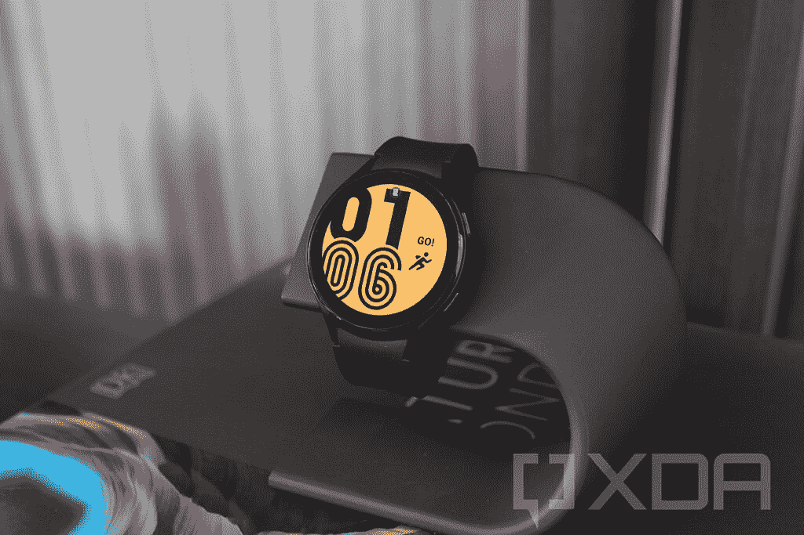
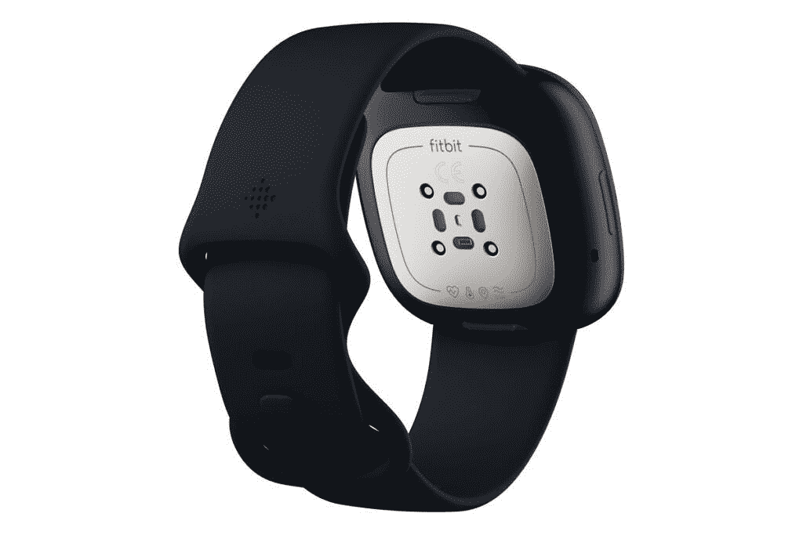
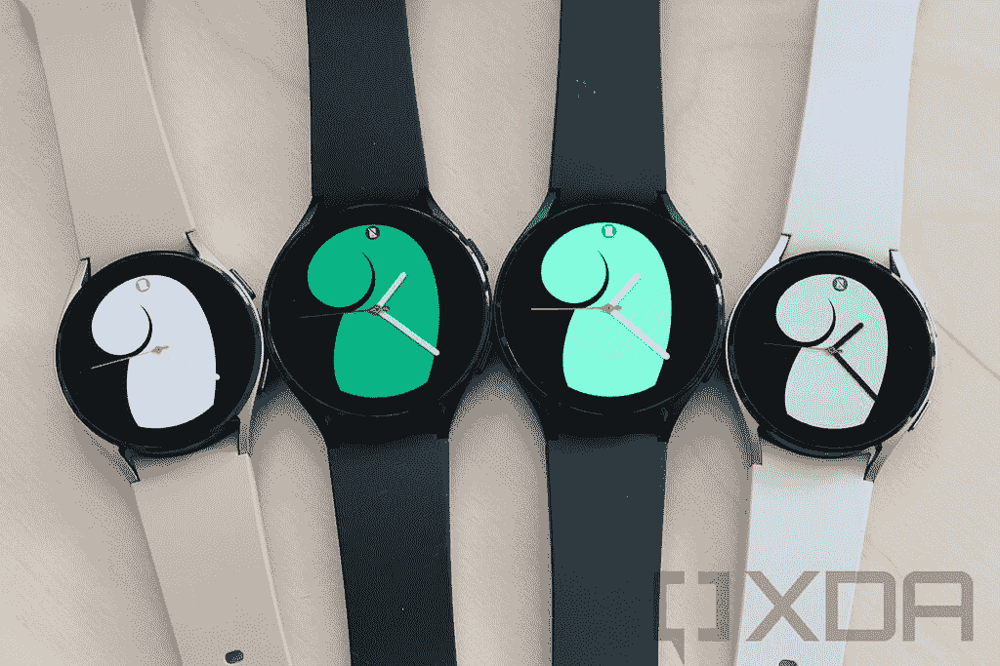
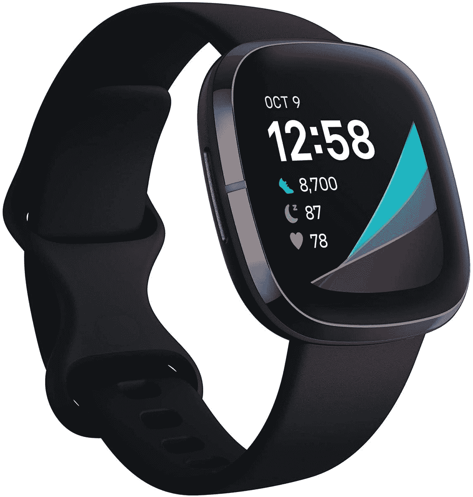

# 三星 Galaxy Watch 4 vs Fitbit Sense:你该买哪款智能手表？

> 原文：<https://www.xda-developers.com/samsung-galaxy-watch-4-vs-fitbit-sense/>

三星的新 [Galaxy Watch 4](https://www.xda-developers.com/samsung-galaxy-watch-4/) 进入了一个拥挤的可穿戴设备市场，这个市场有很多选择。其竞争对手之一是 2020 年首次亮相的 Fitbit Sense，现在的零售价格与 Galaxy Watch 4 相同。那么，如果你有 250 美元，买哪一款智能手表更有意义呢？这一对比就知道了。

**导航本指南:**

## 三星 Galaxy Watch 4 vs Fitbit Sense:规格

|  | 

三星 Galaxy 手表 4

 | 

Fitbit Sense

 |
| --- | --- | --- |
| 

显示

 | 

*   44 毫米:1.36 英寸(450×450)，330ppi
*   40 毫米:1.19 英寸(396×396)，330ppi
*   超级 AMOLED
*   带 DX 的康宁大猩猩玻璃

 | 

*   1.58″ (336×336)
*   AMOLED
*   康宁大猩猩玻璃 3

 |
| 

处理器

 | exy nos W920(5 纳米) | 未知的 |
| 

记忆

 | 

*   1.5GB 内存+ 16GB 内部存储

 | 未知的 |
| 

尺寸和重量

 | 

*   铝制外壳
*   44 毫米:44.4 x 43.3 x 9.8mm 毫米，30.3 克
*   40 毫米:40.4 x 39.3 x 9.8mm 毫米，25.9 克

 | 

*   不锈钢外壳
*   40.4 x 40.4 x 12.4 毫米

 |
| 

电池

 | 

*   44 毫米:361 毫安时
*   40 毫米:247 毫安时

 | 未知的 |
| 

传感器

 | 加速度计、气压计、陀螺传感器、地磁传感器、光线传感器、三星生物活性传感器(光学心率传感器+电心脏传感器+生物电阻抗分析传感器) | 加速度计、陀螺仪、高度计、环境光传感器、皮肤温度传感器、光学心率传感器、用于 SpO2 监测的红色和红外传感器、用于 ECG 和 EDA 的电子传感器 |
| 

连通性

 | Wi-Fi 802.11a/b/g/n、蓝牙、NFC、LTE(可选) | Wi-Fi 802.11b/g/n、蓝牙 5.0、NFC |
| 

价格

 | 起价 249.99 美元 | $249.95 |

## 设计和展示

 <picture></picture> 

Samsung Galaxy Watch 4

Galaxy Watch 4 和 Fitbit Sense 看起来真的很不一样。三星手表有圆形装甲铝制表盘和[20 毫米可互换表带](https://www.xda-developers.com/best-galaxy-watch-4-bands/)。它的侧面还有两个常规按钮和一个用于导航的触摸面板。

另一方面，Sense 采用 squircle 不锈钢表盘和带有专有安装系统的可互换表带。此外，它的左侧还有一个电容式按钮。

来到屏幕上，Galaxy Watch 在 40 毫米型号上有 1.2 英寸的 Super AMOLED 显示屏，在 44 毫米型号上有 1.4 英寸的 Super AMOLED 面板。相比之下，Fitbit Sense 只有一种尺寸，配有 1.58 英寸的有机发光二极管显示屏。尽管鉴于 Sense 上的显示屏更大，智能手表似乎比三星智能手表大得多，但 40 毫米的 Galaxy Watch 4 和 Fitbit Sense 的尺寸并没有太大差异。

总的来说，虽然 Galaxy Watch 4 的设计更像是一个传统的钟表，许多人都会喜欢，但 Apple Watch 让 squircle 表盘变得非常常见。所以挑一个不挑一个，看你个人喜好。

## 三星 Galaxy Watch 4 vs Fitbit Sense:内部

 <picture></picture> 

Fitbit Sense

三星在 Galaxy Watch 4 中使用了其双核 Exynos W920 处理器，使智能手表变得快速响应。但 Fitbit 智能手表中的芯片上没有任何信息。这两款智能手表还配有 Wi-Fi、蓝牙、GPS、NFC、加速度计、陀螺仪传感器和光线传感器。此外，三星还提供了 Watch 4 的 LTE 版本，该版本包括蜂窝连接功能，这一功能在出售的 Fitbit Sense 版本中并不存在。

转到传感器，传感器决定了智能手表可以提供什么样的健康和健康功能，三星包括了一个生物活性传感器，可以读取光学心率、电心率、血氧水平，并计算身体成分。另一方面，Sense 具有光学心率传感器、用于 ECG 和 EDA(皮肤电活动)的电子传感器以及皮肤温度传感器。

## 操作系统和智能手机兼容性

你可能已经知道，Galaxy Watch 4 使用了新的“由三星支持的 Wear OS”平台。该平台包括 Wear OS 和 Tizen 的元素。此外，三星的 One UI 手表界面也存在于智能手表中。

根据三星的说法，Watch 4 将只能与带有谷歌移动服务(GMS)的 Android 6.0 或更高版本的设备配合使用。这意味着 iPhones 和华为的 GMS 安卓手机运气不佳。

Fitbit Sense 运行在该公司的 Fitbit OS 5.0 上，兼容 Android 和 iOS。你需要一部安装了 iOS 12.2 或更高版本的 iPhone，或者一部安装了 7.0 或更高版本的 Android 手机。也就是说，当你使用 iPhone 时，你会失去一些功能。

最后，你可以在两款智能手表上选择合适的应用和表盘。

## 健康和保健功能

 <picture></picture> 

Fitbit Sense

与市场上大多数优质智能手表一样，Galaxy Watch 4 和 Fitbit Sense 具有许多健康和保健功能。此外，智能手表可以作为智能手机的伴侣，显示信息、来电和应用程序通知。

就具体的健康和健康功能而言，Galaxy Watch 4 Classic 的生物活性传感器可以监测你的血压，检测 AFib 不规则心跳，并测量血氧水平。它还可以计算你的身体成分，包括骨骼肌、基础代谢率、身体水分和身体脂肪百分比。此外，您还可以获得广泛的指导锻炼和高级睡眠跟踪，并能够检测和记录您的鼾声。

Fitbit Sense 可以跟踪你的压力水平，检测 AFib 不规则心跳，监控你的皮肤温度，并测量血氧水平。它还提供睡眠跟踪，并免费订阅 Fitbit Premium 六个月，提供高级跟踪细节和更深入的见解。此外，您还可以从 Fitbit 获得付费私人教练服务，以帮助您实现健身目标。

## 三星 Galaxy Watch 4 vs Fitbit Sense:定价和颜色选择

 <picture></picture> 

Samsung Galaxy Watch 4

Galaxy Watch 4 的 Wi-Fi 版本标价 250 美元，而其 LTE 版本的零售价为 300 美元。尽管 Fitbit 以 330 美元的价格推出了 Sense，但后来已经打折至 250 美元。不幸的是，智能手表没有 LTE 版本。

你可以购买黑色、银色、绿色和玫瑰金的 Watch 4，而 Sense 则有碳色、灰白色和月白色。

## 应该买哪款智能手表？

三星 Galaxy Watch 4 和 Fitbit Sense 提供了很多类似的功能。这些智能手表上的健康和健康跟踪选项非常可靠。但如果你想要一款具有蜂窝连接功能的智能手表，Galaxy Watch 4 是你在这两款手表中的唯一选择。否则，在这两款智能手表之间做出选择将在很大程度上取决于你使用的智能手机。

Galaxy Watch 4 为三星用户提供了比任何其他智能手表都好得多的集成，包括 Sense。对于其余的 Android 用户来说，Fitbit Sense 是更好的选择，除非你想成为三星生态系统的一部分。

你打算买哪一款智能手表？请在评论区告诉我们。同时，请务必阅读我们的 [Galaxy Watch 4 与 Apple Watch Series 6](https://www.xda-developers.com/samsung-galaxy-watch-4-vs-apple-watch-6/) 的对比。

 <picture></picture> 

Samsung Galaxy Watch 4

##### 三星 Galaxy 手表 4

三星 Galaxy Watch 4 是一款新的“由三星支持的穿戴式操作系统”智能手表。它有 40 毫米和 44 毫米两种尺寸。

 <picture></picture> 

Fitbit Sense

##### Fitbit Sense

Fitbit Sense 是该公司迄今为止最先进的智能手表。它配备了 1.58 英寸的 AMOLED 显示屏和大量与健康相关的传感器。