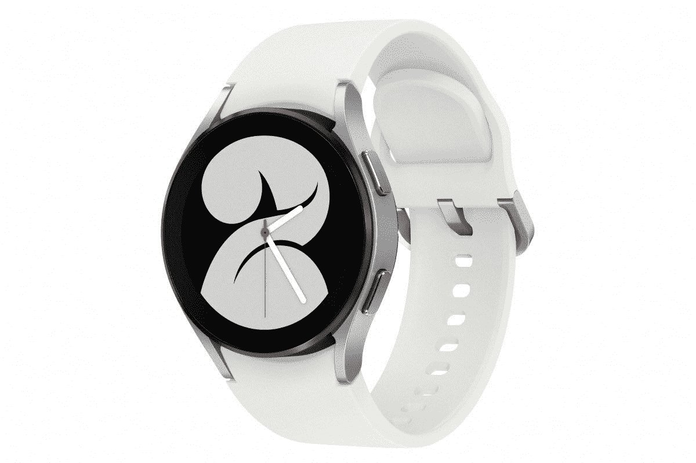

# 三星 Galaxy Watch 4 vs Galaxy Watch 3:该买哪个？

> 原文：<https://www.xda-developers.com/samsung-galaxy-watch-4-vs-galaxy-watch-3/>

长期以来，苹果手表一直是最值得购买的智能手表。不过它最大的缺点是只能在 iPhone 上使用。如果你是安卓用户，包括三星在内的各种原始设备制造商有几种选择。Galaxy Watch 3 是最好的 Android 智能手表之一，但有一个主要的警告——它运行三星的 Tizen OS，缺少一些第三方应用程序。

新的 [Galaxy Watch 4](https://www.xda-developers.com/samsung-galaxy-watch-4/) 刚刚宣布，其中一个亮点是它配备了基于谷歌最新版本 Wear OS 的 [OneUI 手表。如果你打算购买一款新的智能手表，却不知道应该买哪一款 Galaxy Watch 4 还是 Galaxy Watch 3——我们会让你更轻松！](https://www.xda-developers.com/wear-os-3-galaxy-watch-4-oneui-watch-review/)

### 三星 Galaxy Watch 4 vs 三星 Galaxy Watch 3 规格

三星 Galaxy Watch 4 vs 三星 Galaxy Watch 3:规格

| 

规格

 | 

三星 Galaxy Watch 4 经典版

 | 

三星 Galaxy 手表 3

 |
| --- | --- | --- |
| 尺寸 |  |  |
| 尺寸和重量 | 

*   40 毫米:40.4×39.3×9.8 毫米，25.9 克
*   44 毫米:44.4×43.3×9.8 毫米，30.3 毫米
*   铝制外壳

 | 

*   41 毫米:41.0 x 42.5 x 11.3 毫米，48 克
*   45 毫米:45.0 x 46.2 x 11.1 毫米，53 克

 |
| 显示 | 

*   40 毫米:1.19 英寸(330PPI)
*   44 毫米:1.36 英寸(330PPI)

 | 

*   41 毫米:1.2 英寸
*   45 毫米:1.4 英寸

 |
| 处理器 | exy nos W920(5 纳米) | exy nos 9110(10 纳米) |
| 记忆 | 

*   1.5GB 内存
*   16GB 内部存储

 | 

*   1GB 内存
*   8GB 内部存储

 |
| 电池 | 

*   40 毫米:247 毫安时
*   44 毫米:361 毫安时

 | 

*   41 毫米:247 毫安时
*   45 毫米:340 毫安时

 |
| 传感器 | 加速度计，气压计，陀螺仪，地磁，光，三星生物活性传感器 | 加速度计、气压计、陀螺仪、心电图、光、PPG |
| 连通性 | LTE、蓝牙 5.0、Wi-Fi 802.11 a/b/g/n 2.4+5GHz、NFC、GPS/Glonass/北斗/Gallileo | LTE、蓝牙 5.0、Wi-Fi 802.11 a/b/g/n 2.4+5GHz、NFC、GPS/Glonass/北斗/Gallileo |
| 持久性 | 

*   5 大气压防水
*   IP68
*   军用标准 810G

 | 

*   5 大气压防水
*   IP68
*   军用标准 810G

 |
| 操作系统（Operating System） | OneUI 手表 | Tizen 操作系统 |

在我们进行比较之前，需要注意的是，标准的 Galaxy Watch 4 取代了去年的 Galaxy Watch Active 2，而 Galaxy Watch 3 正在被 Galaxy Watch 4 Classic 取代。如果你打算购买 Galaxy Watch 4 Classic，并想知道它与 Galaxy Watch 3 相比如何，我们[也对这两款手表](https://www.xda-developers.com/samsung-galaxy-watch-4-classic-vs-galaxy-watch-3/)进行了比较。

## Galaxy Watch 4 vs Galaxy Watch 3:设计和显示

与去年的 Galaxy Watch 3 相比，新的 Galaxy Watch 4 在内部和外部都有更新更好的硬件。不过，两款智能手表遵循的设计语言有很大不同。Galaxy Watch 4 具有更休闲、更运动的外观，而 Galaxy Watch 3 看起来更正式，就像传统的钟表一样。Galaxy Watch 4 的显示屏周围有一个触摸电容表圈，而 Galaxy Watch 3 有一个旋转表圈。长相总是很主观的，所以你可以决定哪一个更适合你。

两款智能手表都有大小相似的有机发光二极管显示屏。Galaxy Watch 3 的表盘大了 1 毫米，但在日常使用中你不会注意到这一点。你可以选择 40 毫米和 44 毫米两种尺寸的 Galaxy Watch 4，而 Galaxy Watch 3 则有 41 毫米和 45 毫米两种尺寸。Galaxy Watch 4 比 Watch 3 薄得多，这要归功于三星新的生物活性传感器，该传感器将所有健康跟踪功能集成到一个单元中。

## 内部和健康特征

在内部，Galaxy Watch 4 采用了最新的 Exynos W920 芯片组，该芯片组基于 5 纳米制造工艺。这个芯片比 Galaxy Watch 3 上的 Exynos 9110 快得多，也更省电。Galaxy Watch 4 还获得了更多的内存和存储空间——1.5 GB 和 16GB，而不是 Galaxy Watch 3 的 1GB 和 8GB。更多的内存有助于更流畅的性能和更多的存储空间，这意味着你现在可以在手表上安装更多的应用程序和离线存储更多的音乐。节能芯片意味着，两款手表的电池容量几乎相同，Galaxy Watch 4 将为你提供更好的电池续航时间。

至于健康功能，由于我们前面提到的生物活性传感器，Galaxy Watch 4 带来了一些改进和新功能。Galaxy Watch 3 具备所有基本功能，如活动跟踪、心率监测和 SpO2 监测。还有 ECG 功能。除了这些功能，Galaxy Watch 4 还获得了其他功能，如监测血压的能力，该手表的主要亮点之一是测量身体成分的能力。你可以检查你的身体质量指数，脂肪水平，水位等。就像你用智能秤得到的一样。如果这些功能对你来说很重要，那么获得 Galaxy Watch 4 就很有意义。

## Galaxy Watch 4 vs Galaxy watch 3:软件

除了新的生物活性传感器，Galaxy Watch 的另一个重大变化是新的软件体验。三星称其为 OneUI Watch，本质上是谷歌最新 Wear OS 更新的一个版本。Galaxy Watch 4 和 Watch 4 Classic 是第一批配备最新版本 Wear OS 的智能手表，但配备了三星的一系列插件。三星一直在他们的智能手表上使用 Tizen，尽管与早期版本的 Wear OS 相比，它有助于实现更流畅的用户界面和更好的电池性能，但它在功能方面有所欠缺。

## 判决:你应该买哪一个？

你只能在运行 Tizen 的 Galaxy Watch 3 上使用三星的应用程序和少数第三方应用程序，而由于与 Wear OS 的集成，你可以在 Galaxy Watch 4 上从谷歌 Play 商店下载大量应用程序。Galaxy Watch 4 可以与任何装有谷歌 GMS 内核的安卓设备配对，因此它不能与 iPhone 甚至一些华为设备配合使用。另一方面，Galaxy Watch 3 没有这样的限制，甚至可以与 iPhone 配对。

## 应该买哪个？

新款 Galaxy Watch 4 的 40 毫米基本款起价为 249.99 美元，而旧款 Galaxy Watch 3 在三星网站上的零售价仍为 349 美元。考虑到所有的新功能和改进，通过比更新的产品多花 100 美元来获得 Galaxy Watch 3 是没有意义的。如果你想要更好的外观，你可以花 349 美元购买三星 Galaxy Watch 4 Classic，它拥有 Galaxy Watch 4 的所有功能，以及不锈钢机身和与 Galaxy Watch 3 类似的设计。

 <picture></picture> 

Samsung Galaxy Watch 4

##### 三星 Galaxy 手表 4

三星 Galaxy Watch 4 拥有一个新的生物活性传感器，以及一个名为 One UI Watch 的新的统一软件平台。

除非你在 Galaxy Watch 3 上买得很划算，或者你想将你的三星智能手表与你的 iPhone 配对(想知道你为什么会这样做而不是买一只[苹果手表](https://www.xda-developers.com/best-apple-watch/)？)，Galaxy Watch 4 应该是你显而易见的选择。

 <picture></picture> 

Samsung Galaxy Watch 3

##### 三星 Galaxy 手表 3

Galaxy Watch 3 运行在 Tizen 操作系统和一个旧芯片上，但如果你找到一个好的交易，它仍然是一个不错的选择。

如果你是安卓用户，你可能一直渴望一款能与苹果手表竞争的好智能手表，看起来三星终于有了赢家。如果你想知道 Galaxy Watch 4 与 Apple Watch Series 6 相比如何，我们有一个[专门的比较](https://www.xda-developers.com/samsung-galaxy-watch-4-vs-galaxy-watch-active-2/)来突出两种手表之间的差异。如果你决定购买三星 Galaxy Watch 4，我们也有一个[最佳乐队](https://www.xda-developers.com/best-galaxy-watch-4-bands/)的列表，你可以购买来搭配你的风格。