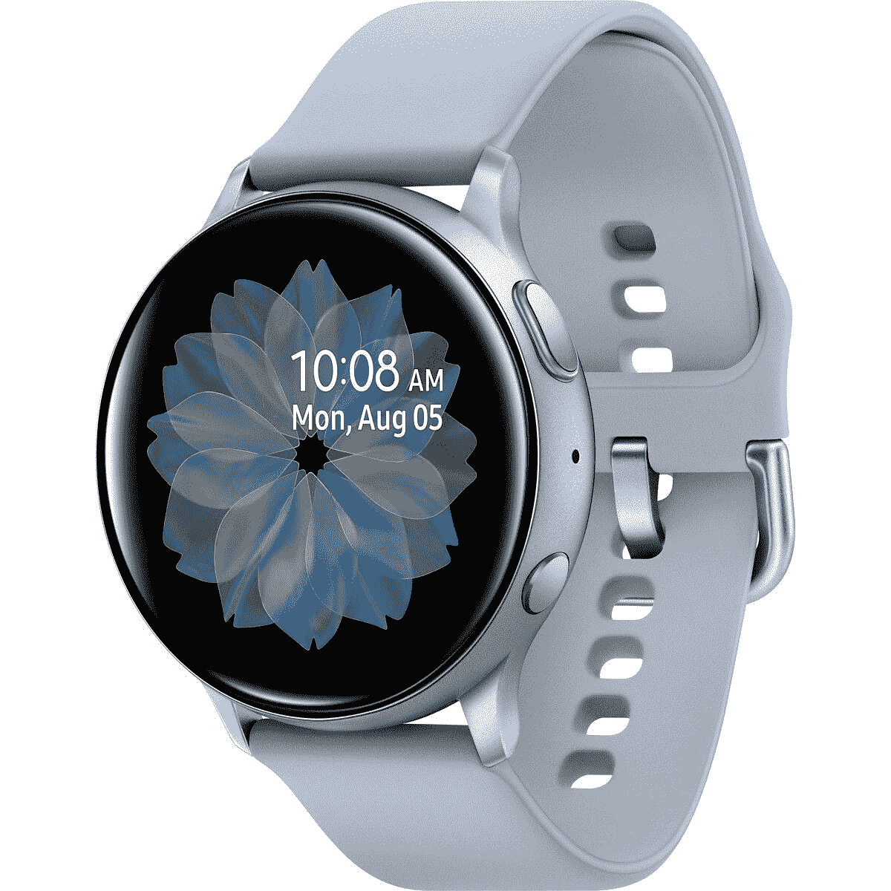

# 三星 Galaxy Watch 4 vs Watch Active 2:One UI Watch 的时候到了

> 原文：<https://www.xda-developers.com/samsung-galaxy-watch-4-vs-galaxy-watch-active-2/>

三星已经宣布了 Galaxy Watch 4(T1)，通过它，三星将“活跃”的绰号重新纳入了主要阵容。与它的精神前身 Galaxy Watch Active 2 相比，有一些重大改进。这些来自软件和硬件两个方面，这是一件大事，不仅对三星，对更广泛的 Android 生态系统也是如此。

它有更大的内存、更大的存储空间、更好的处理器和更低的起价。不仅如此，还使用了全新的操作系统。三星终于在智能手表中抛弃了 Tizen。

### 三星 Galaxy Watch 4 vs 三星 Galaxy Watch Active 2 规格

## 三星 Galaxy Watch 4 vs 三星 Galaxy Watch Active 2:规格

|  | 

三星 Galaxy 手表 4

 | 

三星 Galaxy Watch 4 经典版

 | 

三星 Galaxy Watch Active 2

 |
| --- | --- | --- | --- |
| 

显示

 | 

*   44 毫米:1.36 英寸(450x450 英寸)，330ppi
*   40 毫米:1.19 英寸(396x396 英寸)，330ppi

 | 

*   46 毫米:1.36 英寸(450x450 英寸)，330ppi
*   42 毫米:1.19 英寸(396x396 英寸)，330ppi

 | 

*   44 毫米:1.4 英寸(360x360 英寸)
*   40 毫米:1.2 英寸(360x360 英寸)

 |
| 

处理器

 | exy nos W920(5 纳米) | Exynos 9110 双核 1.15GHz |
| 

记忆

 | 

*   1.5GB 内存+ 16GB 内部存储

 | 

*   LTE: 1.5GB 内存+ 4GB 内部内存
*   蓝牙:768MB 内存+ 4GB 内置内存

 |
| 

尺寸和重量

 | 

*   铝制外壳
*   44 毫米:44.4 x 43.3 x 9.8mm 毫米，30.3 克
*   40 毫米:40.4 x 39.3 x 9.8mm 毫米，25.9 克

 | 

*   不锈钢外壳
*   46 毫米:45.5 x 45.5 x 11mm 毫米，52 克
*   42 毫米:41.5 x 41.5 x 11.2mm 毫米，46.5 克

 | 

*   44 毫米:44 x 44 x 10.9mm 毫米(不锈钢 42 克，铝 30 克)
*   40 毫米:40 x 40 x 10.9mm 毫米(不锈钢 37 克，铝 26 克)

 |
| 

电池

 | 

*   44 毫米:361 毫安时
*   40 毫米:247 毫安时

 | 

*   46 毫米:361 毫安时
*   42 毫米:247 毫安时

 | 

*   44 毫米:340 毫安时
*   40 毫米:247 毫安时

 |
| 

传感器

 | 加速度计、气压计、陀螺传感器、地磁传感器、光线传感器、三星生物活性传感器(光学心率传感器+电心脏传感器+生物电阻抗分析传感器) | 加速度计、陀螺仪、气压计、HRM、环境光 |
| 

价格

 | 起价 249.99 美元 | 起价 349.99 美元 | 起价 269.99 美元 |

## 硬件:三星 Galaxy Watch 4 在各方面都胜过 Galaxy Watch Active 2

新的 Galaxy Watch 4 和 Galaxy Watch 4 Classic 拥有三星自己的 Exynos W920 处理器。这是 Galaxy 手表中第一个 5 纳米处理器。它肯定击败了 Galaxy Watch Active 2 中的双核 Exynos 9110。不过，这并不奇怪。更新的处理器无疑会是更快的处理器。

内存也是 1.5GB，但存储空间从三星 Galaxy Watch Active 2 的 4GB 增加到了 Galaxy Watch 4 的 16GB。44 毫米型号的电池也更大，为 361 毫安时，尽管较小型号的电池大小相同。较小的那个实际上轻了 0.1 克，而较大的那个重了 0.3 克，实际上没有人会在意这一点，因为你无法分辨 0.3 克和 0.1 克的区别。

的确，Galaxy Watch 4 上的一切都比 Galaxy Watch Active 2 上的好一点。它有更好的处理器，四倍的存储空间，更大的电池。虽然这涵盖了“感觉更快”的标准，但让我们谈谈你实际上可以看到和感觉到的东西。

Galaxy Watch 4 上的屏幕分辨率更高。它在 1.36 英寸的屏幕上显示为 450 x 450，较大的型号(44 毫米或 46 毫米，取决于你选择的型号)和较小的型号(40 毫米或 42 毫米)上显示为 396 x 396 1.19 英寸。这使得它的像素密度为 330ppi，远远高于 Galaxy Watch Active 2，后者的屏幕为 360 x 360，尺寸为 1.4 或 1.2 英寸。换句话说，Galaxy Watch 4 上的东西看起来更清晰更漂亮。

Galaxy Watch 4 还拥有一个新的三星生物活性传感器，这是一个三合一的传感器，可以检测心率(PPG)、心电图和生物电阻抗分析(BIA)。这家韩国公司表示，这种新型传感器具有开创性，的确令人印象深刻。

## 软件:Tizen 现在没了

回到谷歌 I/O，该公司[宣布正在重建 Wear OS](https://www.xda-developers.com/samsung-and-google-just-are-rebuilding-wear-os-to-challenge-the-apple-watch/) ，这是对智能手表 OS 的一个急需的改进，智能手表 OS 已经很长时间没有任何有意义的变化了。它承诺的一件事是一个结合谷歌 Wear 操作系统和 Tizen 的统一平台，ti Zen 是三星智能手表上使用的操作系统。

我们通过三星 Galaxy Watch 4 尝到了新的统一平台的味道。它使用三星所谓的 One UI Watch，旨在提供两个世界的最佳功能。这些世界当然是谷歌服务和三星服务。

这些谷歌服务包括来自谷歌 Play 商店的应用程序。事实上，通过 Galaxy Watch 4，你可以访问 Wear OS 应用的生态系统，而不仅仅是 Galaxy Watch Active 2 可用的 Tizen 应用。你还可以得到谷歌地图，以及你所缺少的任何东西。但它仍然可以很好地与你的三星手机配合使用，同步你的设置等。这真是两全其美。但作为补充说明，Galaxy Watch 4 不能与没有 GMS(谷歌移动服务)的设备配合使用，这意味着你甚至不能将其与苹果 iPhone 或华为设备配对。Galaxy Watch Active 2 仍然兼容 Android 和 iOS，因此兼容性更广。

## 结论:应该买 Galaxy Watch 4 还是 Galaxy Watch Active 2？

你应该买哪一款一直是个棘手的问题，尤其是智能手表。答案是三星 Galaxy Watch 4，因为它的硬件更好，软件也得到了极大的改进。然而，许多智能手表用户喜欢打折。如果这是你的第一块智能手表，你可能看不到额外购买三星 Galaxy Watch 4 的好处。

不过，事情是这样的。新产品比旧产品更好，除了那些公司犯愚蠢错误的罕见情况，例如在非 GMS 设备上不兼容。有了更新的产品，您也将获得更好的支持。事实上，不要指望 Galaxy Watch Active 2 会有任何新功能，因为 One UI Watch 是未来的新事物。

 <picture></picture> 

Samsung Galaxy Watch 4

##### 三星 Galaxy 手表 4

三星 Galaxy Watch 4 拥有一个新的生物活性传感器，以及一个名为 One UI Watch 的新的统一软件平台。

最终，三星拥有一些可以与大多数安卓手机配对的最好的手表。较新的 Watch 4 不支持 iOS，所以如果这是你想要的，你会想看看[与苹果手表](https://www.xda-developers.com/samsung-galaxy-watch-4-classic-vs-apple-watch-6/)相比如何。Galaxy Watch 4，尤其是 One UI 手表软件，将 Android 体验提升到了另一个水平。

 <picture></picture> 

Samsung Galaxy Watch Active 2

##### 三星 Galaxy Watch Active 2

三星 Galaxy Watch Active 2 仍然运行 Tizen，但它有 4G 型号，或者有你选择的铝或不锈钢。

如果你决定买一支，一定要去看看[有哪些不同的乐队](https://www.xda-developers.com/best-galaxy-watch-4-bands/)。