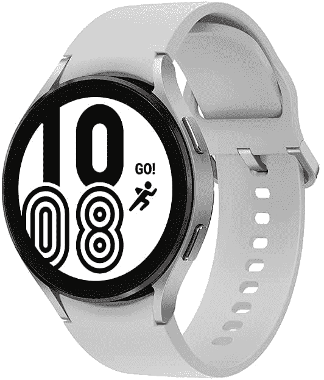
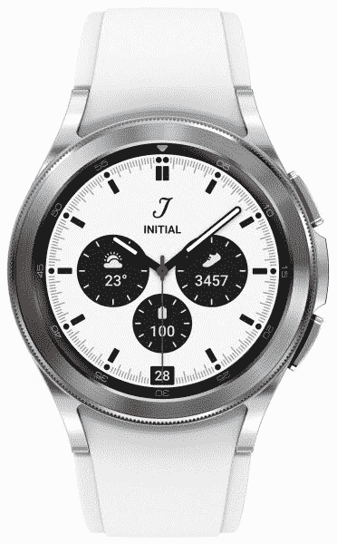

# 三星 Galaxy Watch 4 和 Galaxy Watch 4 Classic 上市

> 原文：<https://www.xda-developers.com/samsung-galaxy-watch-4-watch-4-classic-launched/>

最近结束的谷歌 I/O 标志着谷歌 Wear OS 平台的新开端。谷歌宣布，他们将与三星合作，对 Wear OS 进行急需的改革。几个月后，我们现在有了第一款运行最新版本 Wear OS 的智能手表，尽管上面有三星的 One UI 层——Galaxy Watch 4 和 Galaxy Watch 4 Classic。这两款智能手表都是在三星的 *Unpacked* 活动上与 [Galaxy Z Fold 3](https://www.xda-developers.com/samsung-galaxy-z-fold-3/) 、 [Galaxy Z Flip 3](https://www.xda-developers.com/samsung-galaxy-z-flip-3/) 和 [Galaxy Buds 2](https://www.xda-developers.com/samsung-galaxy-buds-2/) 一起发布的。

## Galaxy Watch 4 和 Galaxy Watch 4 Classic:规格

| 

规格

 | 

三星 Galaxy 手表 4

 | 

三星 Galaxy Watch 4 经典版

 |
| --- | --- | --- |
| 尺寸 |  |  |
| 尺寸和重量 | 

*   40 毫米:40.4 x 39.3 x 9.8 毫米，25.9 克
*   44 毫米:44.4 x 43.3 x 9.8 毫米，30.3 毫米
*   铝制外壳

 | 

*   42 毫米:41.5 x 41.5 x 11.2 毫米，46.5 克
*   46 毫米:45.5 x 45.5 x 11.0 毫米，52 克
*   不锈钢外壳

 |
| 显示 | 

*   40 毫米:1.19 英寸(330PPI)
*   44 毫米:1.36 英寸(330PPI)

 | 

*   42 毫米:1.19 英寸(330PPI)
*   46 毫米:1.36 英寸(330PPI)

 |
| 处理器 | exy nos W920(5 纳米) | exy nos W920(5 纳米) |
| 记忆 | 

*   1.5GB 内存
*   16GB 内部存储

 | 

*   1.5GB 内存
*   16GB 内部存储

 |
| 电池 | 

*   40 毫米:247 毫安时
*   44 毫米:361 毫安时

 | 

*   42 毫米:247 毫安时
*   46 毫米:361 毫安时

 |
| 传感器 | 加速度计，气压计，陀螺仪，地磁，光，三星生物活性传感器 | 加速度计，气压计，陀螺仪，地磁，光，三星生物活性传感器 |
| 操作系统（Operating System） | 一个 UI 手表 | 一个 UI 手表 |

Galaxy Watch 4 和 Galaxy Watch 4 Classic 都是高端智能手表，具有一些非常吸引人的功能。这两款手表都使用三星最新的 [Exynos W920](https://www.xda-developers.com/samsung-exynos-w920-wearable-chip-detailed/) 芯片组，基于 5 纳米制造工艺。该芯片组应该能够提高性能并延长电池寿命。手表上的显示屏也是高分辨率的，你可以根据手腕的大小选择两种尺寸。

今年 Galaxy Watch 4 和 Watch 4 Classic 有两大亮点，第一个是三星的生物活性传感器。它基本上集成了智能手表上的所有基本传感器，如光学心率、电子心率和生物电阻抗分析传感器。它还首次在智能手表上进行身体成分测量，可以帮助您测量骨骼肌、脂肪量、身体质量指数、身体水分等参数。

两款手表的第二大亮点是新的 One UI 手表。取代 Tizen 的是三星与谷歌合作打造的新智能手表平台。One UI Watch 基于 Wear OS，因此它将允许用户安装三星和谷歌应用程序。像地图这样的第一方谷歌应用程序现在可以与像 Strava、Spotify 等第三方应用程序无缝协作。[谷歌还重新设计了几款智能手表应用](https://www.xda-developers.com/google-wear-os-3-apps/)，它们在 Watch 4 系列上首次亮相。

两款手表都有 1.5GB 的内存和 16GB 的板载存储空间。三星承诺一次充电的电池寿命可达 40 小时，但这只有在我们使用后才能知道。三星还将在一些地区提供 LTE 连接。Galaxy Watch 4 取代了 Galaxy Watch Active 2，Watch 4 Classic 是为寻求类似于传统钟表的智能手表的用户而设计的。

## 定价和可用性

三星 Galaxy Watch 4 40 毫米版本的起价为 249.99 美元，而 Galaxy Watch 4 Classic 的起价为 50 美元，42 毫米版本的起价为 349.99 美元。这两款手表将于 8 月 27 日开始在[三星网站](https://shop-links.co/1748230224856687968?u1=73fe9c13-fbda-4bd9-ac21-1d081385e9a4)上购买。这款手表还将有 Thom Browne 限量版可供购买。查看下表，了解所有型号的完整定价详情。

 <picture></picture> 

Samsung Galaxy Watch 4

##### 三星 Galaxy 手表 4

Galaxy Watch 4 是三星最新的可穿戴设备，配备了新的 One UI 手表平台。

 <picture></picture> 

Samsung Galaxy Watch 4 Classic

##### 三星 Galaxy Watch 4 经典版

Galaxy Watch 4 Classic 是三星最新可穿戴设备的更高级版本，该设备配备了新的 One UI 手表平台。