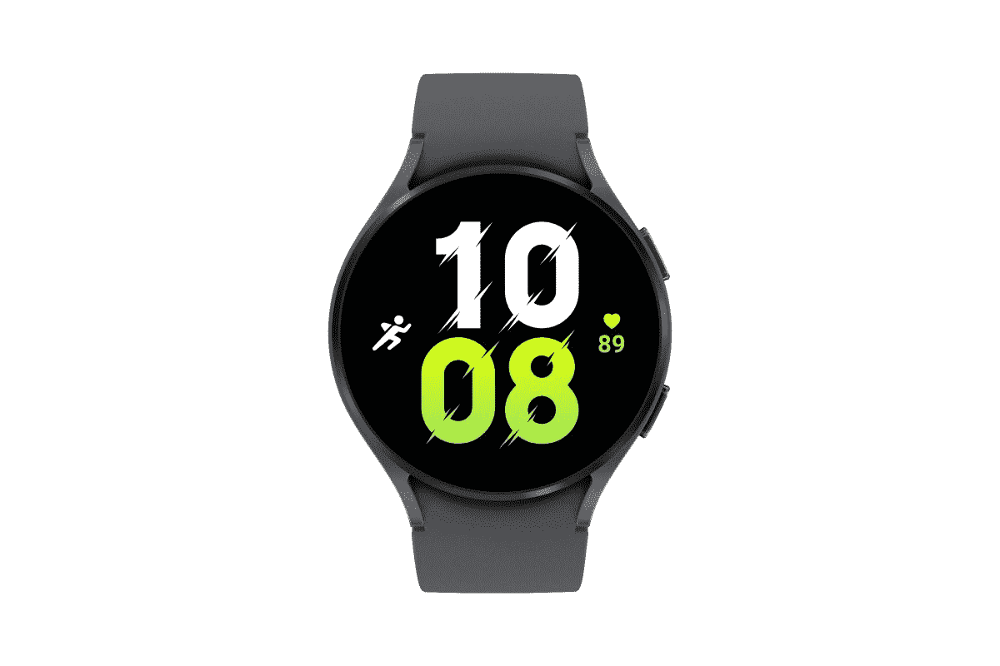
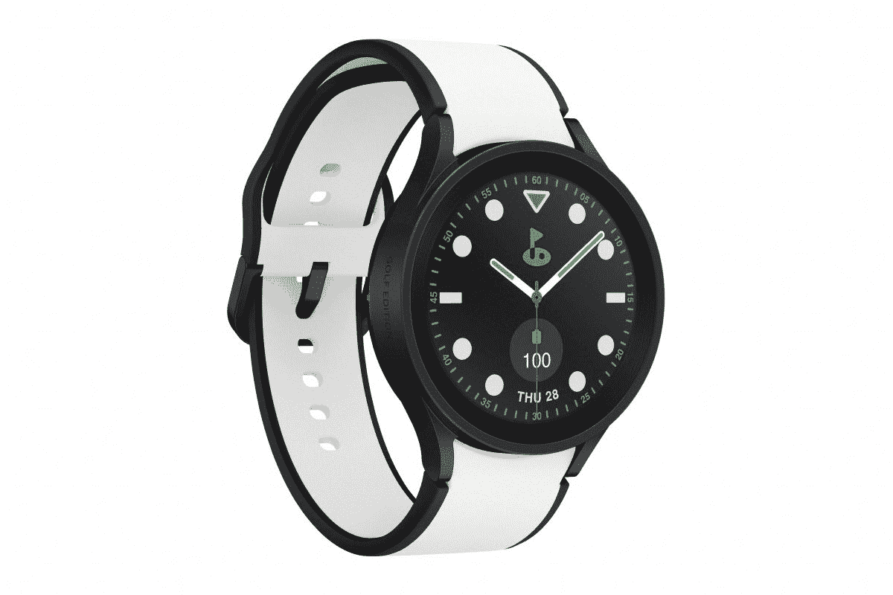

# 三星 Galaxy Watch 5 系列能测你的体温吗？

> 原文：<https://www.xda-developers.com/samsung-galaxy-watch-5-body-temperature/>

# 三星 Galaxy Watch 5 系列能测你的体温吗？

三星 Galaxy Watch 5 系列可以测量你的体温，但情况要比这复杂一点。

最近推出的[三星 Galaxy Watch 5](https://www.xda-developers.com/samsung-galaxy-watch-5-review/) 和 Galaxy Watch 5 Pro，以及 [Galaxy Z Flip 4](https://www.xda-developers.com/samsung-galaxy-z-flip-4-hands-on) 和 Galaxy Z Fold 4。虽然这些手表带来了一些新的花样，但它们也带回了一些旧的花样。三星 Galaxy Watch 5 系列可以从技术上*测量你的体温，但至少目前还不能。这是因为三星在手表中包含了皮肤温度传感器，但目前还没有办法实际使用它。*

该公司尚未说明是什么原因，但据推测是监管机构批准的事情。在某些地区，三星需要获得批准才能推出一些医疗相关功能，这就是为什么我们会出现 Galaxy Watch 心电图和血压功能[需要一个经过修改的应用程序才能在选定的几个](https://www.xda-developers.com/how-to-enable-ecg-blood-pressure-monitoring-samsung-galaxy-watch-4/)以外的其他地区使用的情况。因此，即使皮肤温度传感器在未来被启用，它也可能是有限的。

不过，也不全是坏消息。多年来，三星一直在不断地将对其手表功能的支持扩展到新的地区，因此，即使在一些监管机构批准后，它不会在你所在的地区立即可用，也不意味着它永远不会可用。我不会出去买一个，纯粹是希望用它来读取温度，但这仍然是可能的。

 <picture></picture> 

Samsung Galaxy Watch 5

Galaxy Watch 5 是一款出色的 Wear OS 智能手表，具有高级健康功能。

 <picture></picture> 

Samsung Galaxy Watch 5 Pro

Galaxy Watch 5 Pro 面向健身爱好者，提供了更耐用的设计。

至于你可以用它来做什么，因为这是一个皮肤温度读数，它不会完全准确。它可以用来测量你在锻炼或睡觉时的体温，我确信它可以用来给出发烧的指示，而不是结论性的陈述。该公司还没有给出很多信息，说明它在发布时将用于什么功能，所以我们将拭目以待，看看它有什么锦囊妙计！