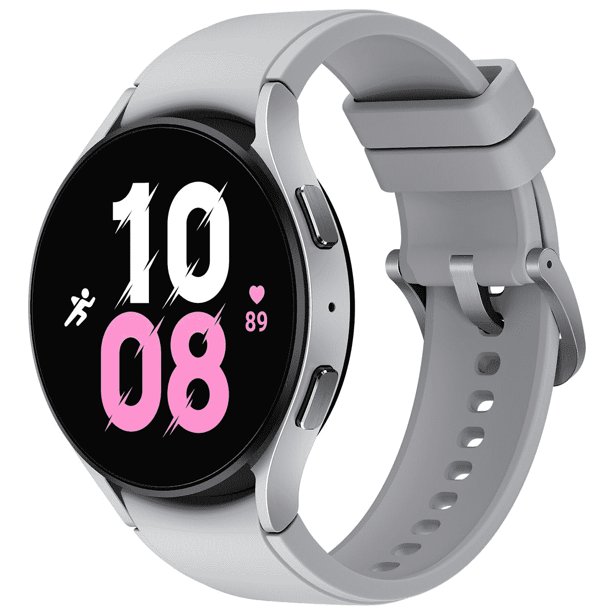
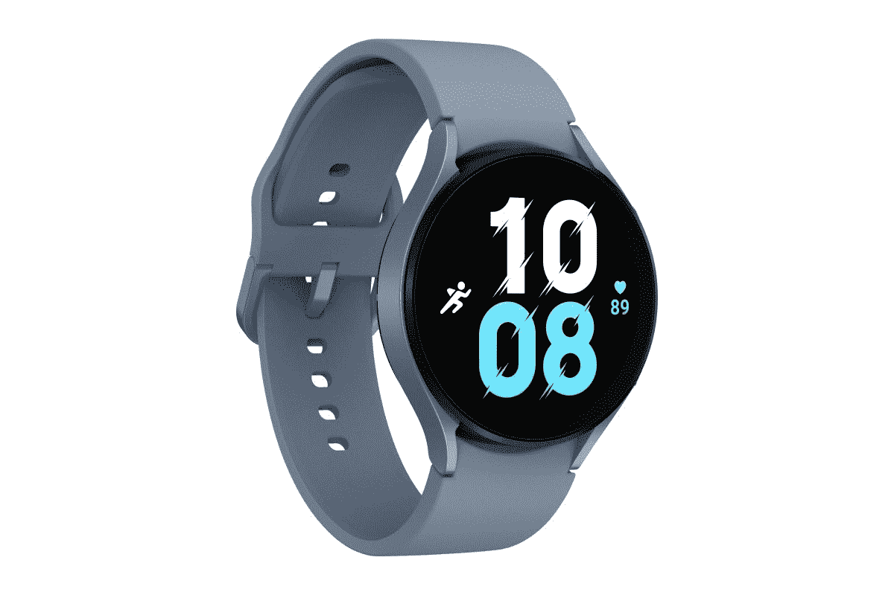
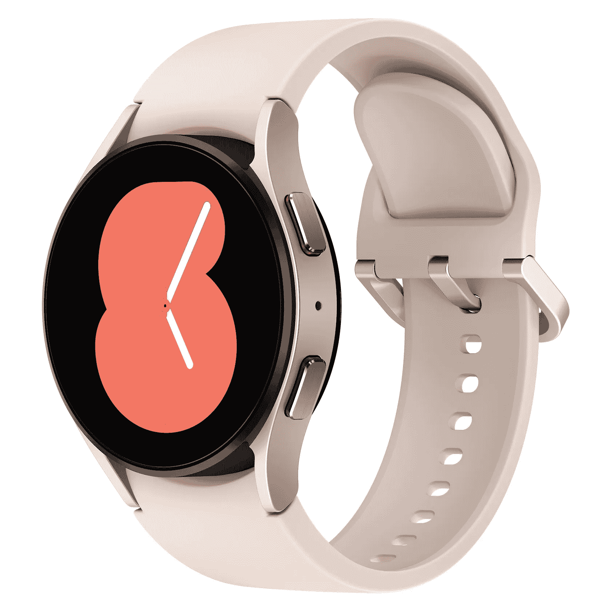
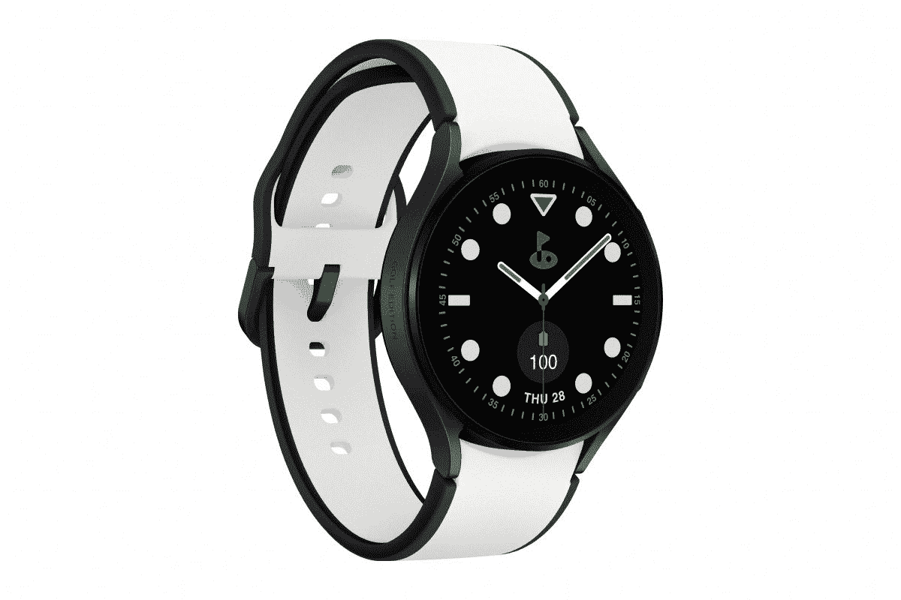

# 三星 Galaxy Watch 5 系列有哪些颜色？

> 原文：<https://www.xda-developers.com/samsung-galaxy-watch-5-colors/>

在 Galaxy Unpacked 2022 活动上，三星正式拉开了新款 [Galaxy Watch 5](https://www.xda-developers.com/samsung-galaxy-watch-5-launch/) 和 [Galaxy Watch 5 Pro](https://www.xda-developers.com/samsung-galaxy-watch-5-pro-launch/) 以及 [Galaxy Z Fold 4](https://www.xda-developers.com/samsung-galaxy-z-fold-4-hands-on/) 和 [Galaxy Z Flip 4](https://www.xda-developers.com/samsung-galaxy-z-flip-4-hands-on/) 的帷幕。Galaxy Watch 4 是一个巨大的成功，三星希望今年新的 Galaxy Watch 5 系列能够重复同样的奇迹。三星最新的 Wear OS 智能手表并不是对去年型号的彻底升级，但它们仍然带来了几项显著的改进，包括更耐用的设计、更长的电池寿命、新的健康工具等等。像去年一样，三星为新的智能手表提供了几种令人兴奋的颜色选择。此外，你还可以使用 Bespoke Studio 进一步个性化 Galaxy Watch 5 系列的外观和感觉，让你选择型号、尺寸、表壳和表带。这是你需要知道的一切。

## 标准 Galaxy Watch 5 的颜色(40 毫米和 44 毫米)

Galaxy Watch 5 有五种颜色——石墨色、银色、玫瑰金、紫色和蓝宝石色。作为参考，Galaxy Watch 4 有四种颜色。紫色和蓝宝石是 Galaxy Watch 5 的全新颜色，也是最令人兴奋的颜色。Galaxy Watch 4 的幻影绿色已经消失。玫瑰金、紫色和银色是 40 毫米版本独有的颜色，而 44 毫米版本将获得蓝宝石、石墨和银色。还有一款高尔夫版车型，配有黑色表壳和白色表带。

此外，三星还推出了新的表带系列，包括双色 sport、NATO band、Athletic sport、Global Goals、Titanium Link 手镯和 Milanese (SUS)表带。

*   <picture></picture>

    三星 Galaxy Watch 5

    不喜欢沉闷的暗色调？那么这款银色的拉丝漆面可能正是你所需要的。但请记住，银色更容易沾上污渍和污迹。

*   <picture></picture>

    三星 Galaxy Watch 5

    蓝宝石是 Galaxy Watch 4 (44mm)的新颜色选项。这是一种较浅的蓝色，看起来很运动。它非常适合健身者和跑步者。

*   <picture></picture>

    Galaxy Watch 5 40mm 粉金

    粉金与去年持平。它看起来很优雅，带有强烈的时尚感。此颜色选项仅适用于较小的 40 毫米版本。

*   <picture></picture>

    三星 Galaxy Watch 5

    该版本采用银色外壳，搭配宝来紫色表带，与 Galaxy Z Flip 4 完美搭配。这种引人注目的配色是 40 毫米版本独有的。

*   <picture></picture>

    三星 Galaxy Watch 5 高尔夫版

    ##### 三星 Galaxy Watch 5 高尔夫版

    运动而优雅，Galaxy Watch 5 黄金版必将回头率。它采用黑色外壳和黑色边框的白色表带。它有 40 毫米和 44 毫米两种尺寸。

## Galaxy Watch 5 Pro 的颜色(45 毫米)

顶级 Galaxy Watch 5 Pro 的颜色选择不那么令人兴奋，也很有限。你只能得到黑色钛和灰色钛的颜色。无论好坏，今年没有银色。取而代之的是全新的 Galaxy Watch 5 Pro 高尔夫版。

*   <picture></picture>

    三星 Galaxy Watch 5 Pro

    如果你不是太喜欢无聊的黑色，灰钛或许适合你。它看起来很精致，色调较浅。

*   <picture></picture>

    三星 Galaxy Watch 5 Pro

    ##### 三星 Galaxy Watch 5 Pro Golf Edition

    搭配黑色表壳、白色表带，顶部按键周围的绿色点缀，Galaxy Watch 5 Pro Golf Edition 脱颖而出。

## 定制工作室

三星的 Bespoke Studio 是您的一站式商店，可以随心所欲地个性化和定制您的 Galaxy Watch 5 和 Galaxy Watch 5 Pro。要制作自己的 Galaxy Watch 5，请访问 Samsung.com，选择型号和尺寸，然后从众多表带中挑选多达 1，032 种独特的组合。

你倾向于更有趣的 Galaxy Watch 5 还是 Galaxy Watch 5 Pro 的经典外观？请在下面的评论中告诉我们！