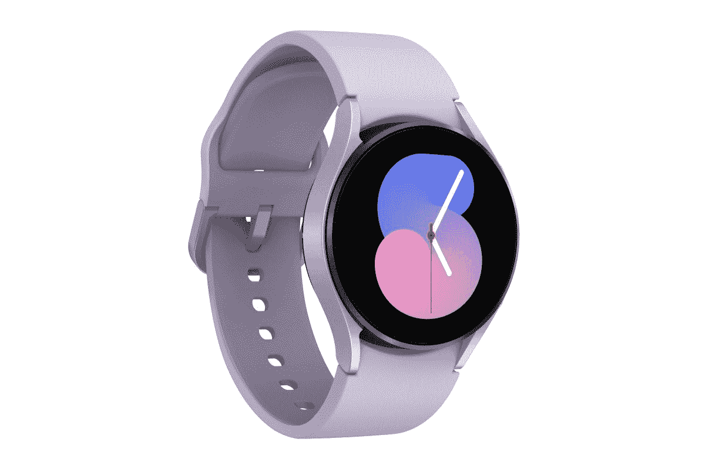

# 三星 Galaxy Watch 5 系列有旋转表圈吗？

> 原文：<https://www.xda-developers.com/samsung-galaxy-watch-5-rotating-bezel/>

像[三星 Galaxy Watch 5](https://www.xda-developers.com/samsung-galaxy-watch-5-review/) 或 [Galaxy Watch 5 Pro](https://www.xda-developers.com/samsung-galaxy-watch-5-pro-launch/) 这样的智能手表上旋转表圈的用途与传统机械表非常不同。例如，在机械表上，潜水员通常会使用表圈来帮助跟踪他们的氧气罐中还剩多少空气。可以很有把握地说，这在现代智能手表上是不一样的。

但旋转挡板有其用途，三星过去就证明了这一点。 [Galaxy Watch 4 Classic](https://www.xda-developers.com/samsung-galaxy-watch-4-classic-rotating-bezel/) 有一个旋转表圈，如果需要，可以用来浏览手表的用户界面。然而，普通的 Galaxy Watch 4 跳过了这一点，采用了触摸感应边框。现在 Galaxy Watch 5 系列来了，三星走了哪条路？

## 不再有旋转挡板

旋转表圈不复存在。Galaxy Watch 5 和 Galaxy Watch 5 Pro 都有一个触摸感应边框。关键是保留了功能。旋转表圈可能看起来更好，实际的物理和触觉反馈还有很多可说的，但它已经消失了。但效用至少被保留了下来，尽管在执行上仍存在分歧。现在，这两款腕表更加协调一致。不过，你仍然有两个物理按钮，所以它不是一个完全只有触摸的界面。

不过，Galaxy Watch 5 系列有很多很棒的功能。自从转向 Wear OS，你现在可以开箱即用地访问关键的谷歌应用和服务，包括 YouTube 音乐和地图。睡眠跟踪已经得到了很大的改善，户外活动的粉丝会喜欢 Watch 5 Pro。它由蓝宝石玻璃覆盖，并由钛包裹，非常耐用。手表 5 Pro 也符合 IP68 和 MIL-STD-810H 标准。

 <picture></picture> 

Samsung Galaxy Watch 5

三星最新的手表包含 WearOS、触摸屏、坚固的电池寿命以及一些很棒的健身和睡眠跟踪功能。

这两款手表都可以通过 LTE 连接进行免提操作，并且都内置了一系列健身功能。它们甚至看起来也很不错！