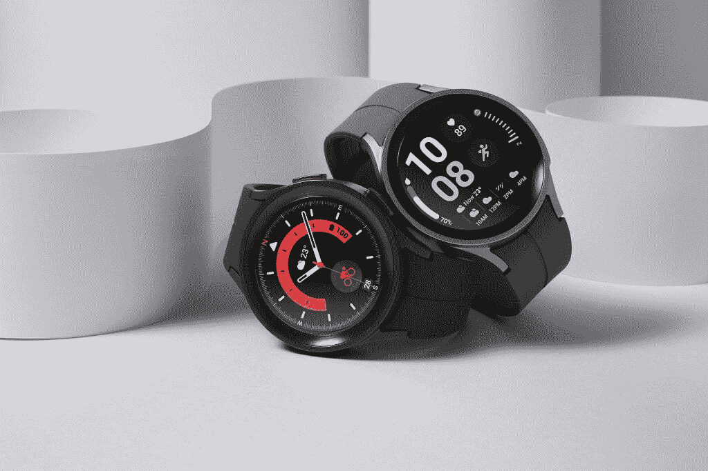

# 会有三星 Galaxy Watch 5 Ultra 吗？

> 原文：<https://www.xda-developers.com/samsung-galaxy-watch-5-ultra/>

# 会有三星 Galaxy Watch 5 Ultra 吗？

虽然一些消息称三星今年可能会推出 Galaxy Watch 5 Ultra，但 Galaxy Watch 5 Pro 是今年最顶级的 Wear OS 智能手表。

三星最近在其年中 Galaxy Unpacked 活动中发布了 [Galaxy Z Fold 4](https://www.xda-developers.com/samsung-galaxy-z-fold-4-hands-on/) 和 [Galaxy Z Flip 4](https://www.xda-developers.com/samsung-galaxy-z-flip-4-hands-on/) 以及一系列新的 Wear OS 智能手表。在发布会之前，我们看到了关于新智能手表的各种泄露，表明 [Galaxy Watch 5](https://www.xda-developers.com/samsung-galaxy-watch-5-review/) 阵容将包括一个新的顶级版本，配有钛表壳和蓝宝石玻璃。有人猜测这可能是 Galaxy Watch 5 Ultra，但事实并非如此。尽管 Galaxy Watch 5 系列包括一款采用钛表壳和蓝宝石玻璃的新旗舰机型，但三星并没有为这款机型冠以“Ultra”的绰号。

三星全新的 Wear OS 智能手表阵容包括三种型号——Galaxy Watch 5(40 毫米)、Galaxy Watch 5(44 毫米)和 Galaxy Watch 5 Pro(45 毫米)。由于我们还没有看到任何关于今年第四款 Galaxy Watch 的泄露，所以可以肯定地说不会有 Galaxy Watch 5 Ultra。如果你急切地等待一个，你可以选择 Galaxy Watch 5 Pro。这是普通 Galaxy Watch 5 的加固版，具有更大的 1.4 英寸显示屏和更大的 590mAh 电池组。

 <picture></picture> 

The Galaxy Watch 5 Pro is the top-of-the-line Wear OS smartwatch from Samsung for this year.

Galaxy Watch 5 Pro 还采用了改进的 D-Buckle 运动表带，比非 Pro 版本上的硅胶表带更耐用。在功能方面，Galaxy Watch 5 Pro 提供了普通型号的一切，以及 GPX 支持，允许你在三星健康应用程序上记录并与远足爱好者分享你的徒步旅行。如果你喜欢徒步旅行或骑自行车，你也可以使用智能手表追踪下载徒步旅行和骑自行车的路线，供离线使用，并利用其追踪功能安全回家。

 <picture></picture> 

Samsung Galaxy Watch 5 Pro

Galaxy Watch 5 Pro 是三星最新的旗舰 Wear OS 智能手表，尽管它没有“Ultra”的绰号，但它仍然比普通的 Galaxy Watch 5 有所改进。

Galaxy Watch 5 Pro 将于 8 月 26 日开始在美国销售。它将有两种标准配色可供选择——灰钛和黑钛。灰色钛金属款配有配套的灰色表带，而黑色钛金属款配有黑色表带。三星还提供了一款特殊的高尔夫版手表，有黑色外壳和白色表带。Galaxy Watch 5 Pro 有蓝牙和 LTE 两种版本，售价分别为 449.99 美元和 499.99 美元。