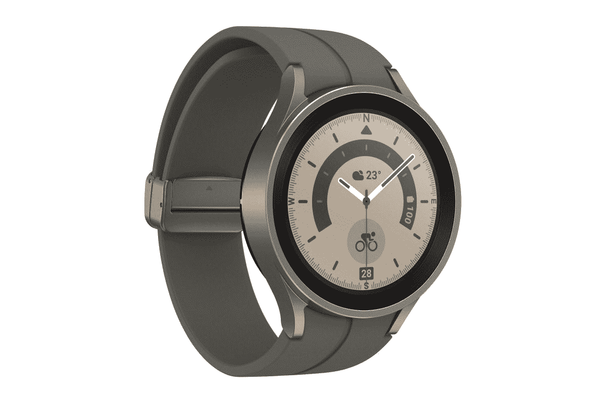

# 三星 Galaxy Watch 5 系列防水吗？手表有 IP 等级吗？

> 原文：<https://www.xda-developers.com/samsung-galaxy-watch-5-water-resistance/>

三星备受期待的 [Galaxy Watch 5](https://www.xda-developers.com/samsung-galaxy-watch-5-review/) 系列正式来了。新的 Galaxy Watch 5 和 [Galaxy Watch 5 Pro](https://www.xda-developers.com/samsung-galaxy-watch-5-pro-launch/) 在 Galaxy Watch 4 系列成功的基础上，带来了几项关键的升级，包括 60%更强的显示屏、15%更大的电池、更快的充电速度和新的健康功能。但是这些新的智能手表防水吗？

## Galaxy Watch 5 和 Galaxy Watch 5 Pro 防水吗？

简单的回答是肯定的。Galaxy Watch 5 和 Galaxy Watch 5 Pro 的防尘防水等级均为 IP68。此外，两款腕表均通过了 5ATM 标准认证，防水深度可达 50 米。5ATM 的额定值尤其重要，因为这意味着你可以在游泳、潜水或浮潜时安全地使用 Galaxy Watch 5。这比 IP68 等级提供了更强大的防水保护，可以保护设备免受偶然的水暴露，但不能承受压力和水活动。

 <picture></picture> 

Samsung Galaxy Watch 5

Galaxy Watch 5 采用了更耐用的设计，具有 IP68 + 5ATM 防水性能。

Galaxy Watch 5 和 Galaxy Watch 5 Pro 具有防尘和防水功能，这一事实不应令人感到惊讶。毕竟，他们的前辈，Galaxy Watch 4 和 [Galaxy Watch 4 Classic](https://www.xda-developers.com/samsung-galaxy-watch-4-classic-review/) ，也拥有同样的收视率。此外，可穿戴设备预计会提供某种防水保护，因为它们更有可能暴露在水或液体中。虽然 Galaxy Watch 5 系列具有防水功能，但您不应该将其暴露在海水、化学物质和强腐蚀性液体中。

## 迄今为止最耐用的三星智能手表

除了防水，Galaxy Watch 5 还通过了 MIL-STS-816 标准认证。这意味着它可以承受多种恶劣条件，包括暴露在极端温度、冲击、跌落、潮湿和积雪下。

 <picture></picture> 

Samsung Galaxy Watch 5 Pro

Galaxy Watch 5 Pro 提供了更大的电池、更耐用的设计和 IP68 + 5ATM 防水性能。

Galaxy Watch 5 和 Galaxy Watch 5 Pro 采用蓝宝石水晶玻璃，比之前三星智能手表上的 Gorilla Glass DX 坚固 60%，并配有防水外壳，是三星迄今为止最耐用的智能手表。

最新的三星手表比上一代机型有了几项显著的改进，包括皮肤温度分析、改进的睡眠跟踪、锻炼后的实时恢复跟踪、一些新的表盘等等。