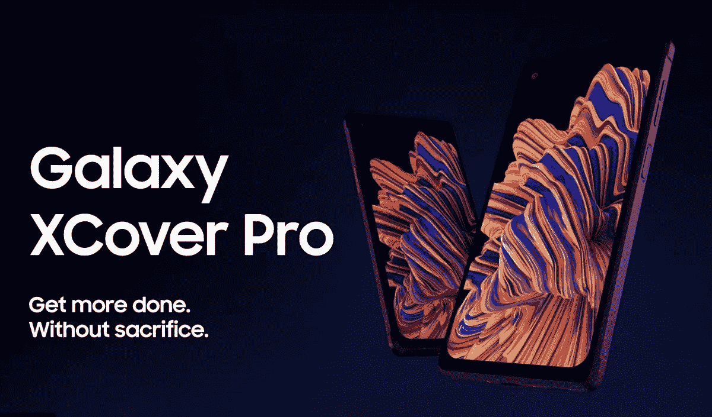

# 三星 Galaxy XCover 6 Pro 官方渲染图和规格泄露

> 原文：<https://www.xda-developers.com/samsung-galaxy-xcover-6-pro-official-renders-and-specifications/>

三星[未公布的 Galaxy XCover 6 Pro](https://www.xda-developers.com/galaxy-xcover-6-pro-leak-specs/) 再次向世界展示了自己，这一次，由于来自 *@OnLeaks* 和 *GizNext* 的报道，我们对其传闻中的规格有了更全面的了解和更多细节。Galaxy XCover 6 Pro 不是三星 Galaxy 系列智能手机中外观最时尚的，但它在风格上的不足应该有望通过其坚固的设计来弥补，这种设计旨在承受意外跌落或暴力冲击。

Galaxy XCover 6 Pro 的尺寸为 169 毫米 x 80mm 毫米 x 10mm 毫米，具有纹理外观，据报道重量为 235 克。这款手机将采用 6.6 英寸的 TFT LCD 显示屏，分辨率为 1080 x 2408 像素，为 FHD+。正如你所料，由于这不是旨在成为一个顶级的模型，它将只配备 60Hz 显示面板。至于引擎盖下的东西，这款智能手机应该配备高通的骁龙 778G SoC、6GB RAM 和 128GB 内部存储。

在设备的右侧，将有音量、电源和 XCover 键的物理按钮。这个按钮在[以前的型号](https://www.xda-developers.com/samsung-galaxy-xcover5-launch/)中见过，可以设置为启动特定的应用程序或手机的特定功能。手机顶部将有一个 3.5 毫米的耳机，以及另一个红色的物理按键。截至目前，红色按钮的功能尚不清楚，但据推测，它可以为手机的数字助理提供一键访问。

此外，Galaxy XCover 6 Pro 将使用 50MP 主摄像头，搭配 12MP 超宽和 8MP 宽的摄像头传感器。最后，该设备将由 4050 毫安时的电池供电，并将运行 Android 12。虽然上述规格不是很令人印象深刻，但最重要的可能是手机的耐用性，它能够承受冲击，灰尘，以及液体损害。

遗憾的是，目前还不清楚这款产品何时会上市，所以如果你现在正在寻找一种坚固的选择，你可以购买三星 Galaxy XCover Pro，它提供了类似的设计，只是规格略有不同。

 <picture></picture> 

Galaxy XCover Pro

##### 三星 Galaxy XCover Pro

Galaxy XCover Pro 提供了一款坚固设计的强大智能手机。这款智能手机可以以 399.99 美元的价格购买。

* * *

**来源:[giz next](https://www.giznext.com/news/giznext-exclusive-samsung-galaxy-xcover6-pro-official-renders-and-full-specifications-leaked/)**