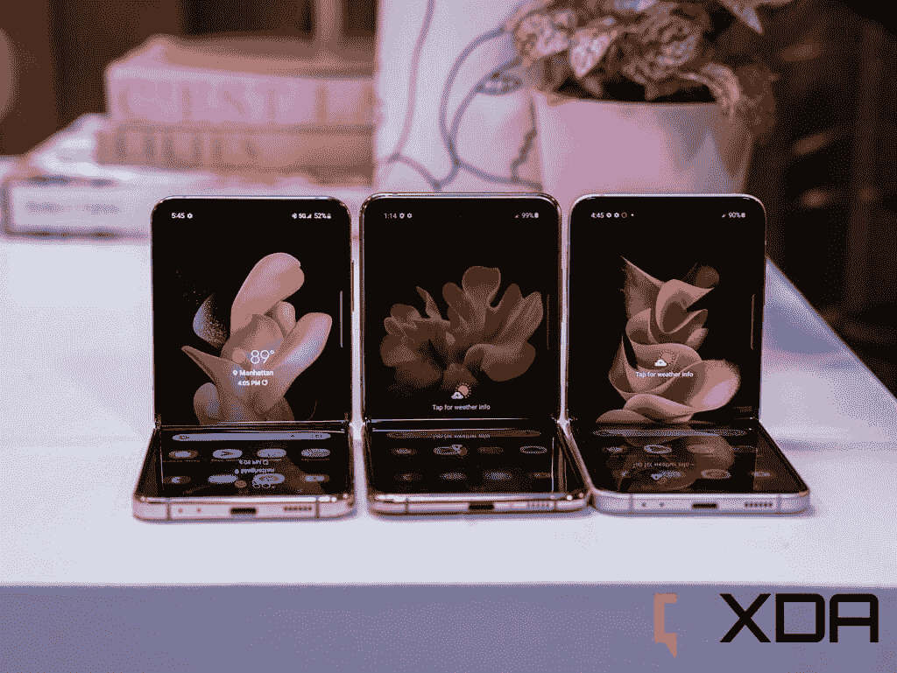
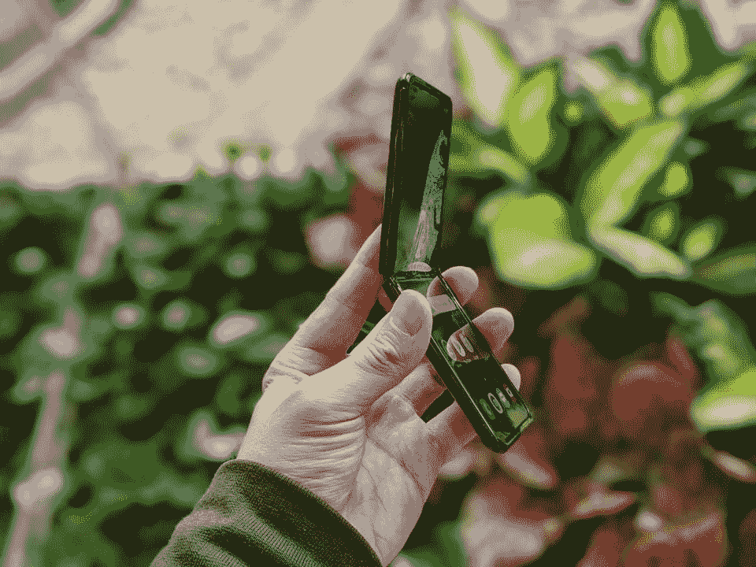
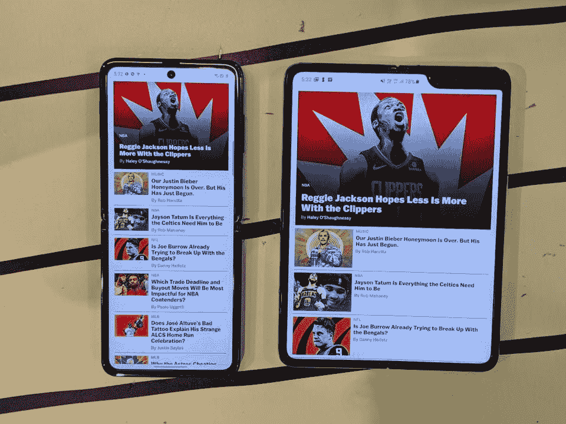
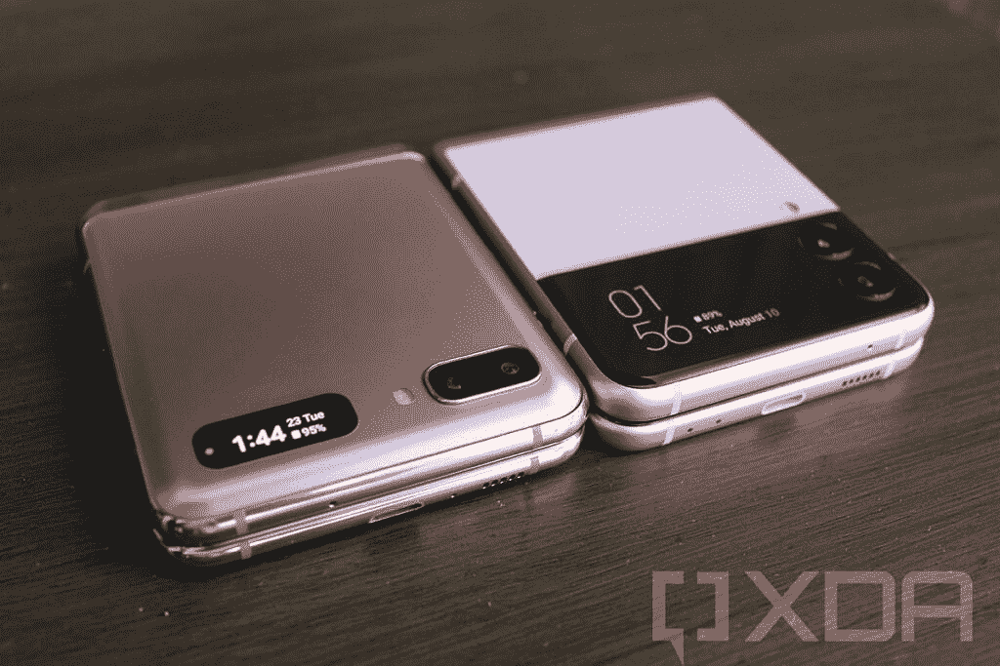
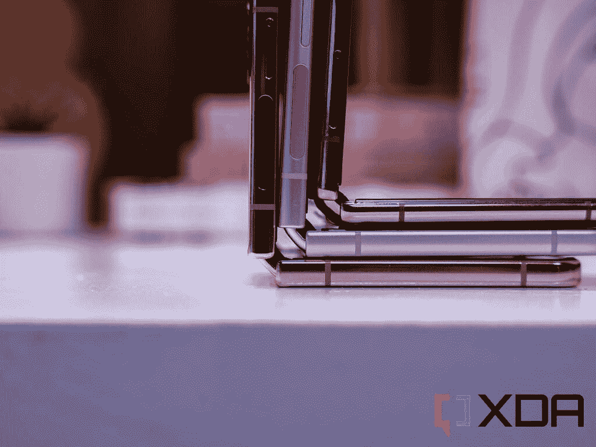
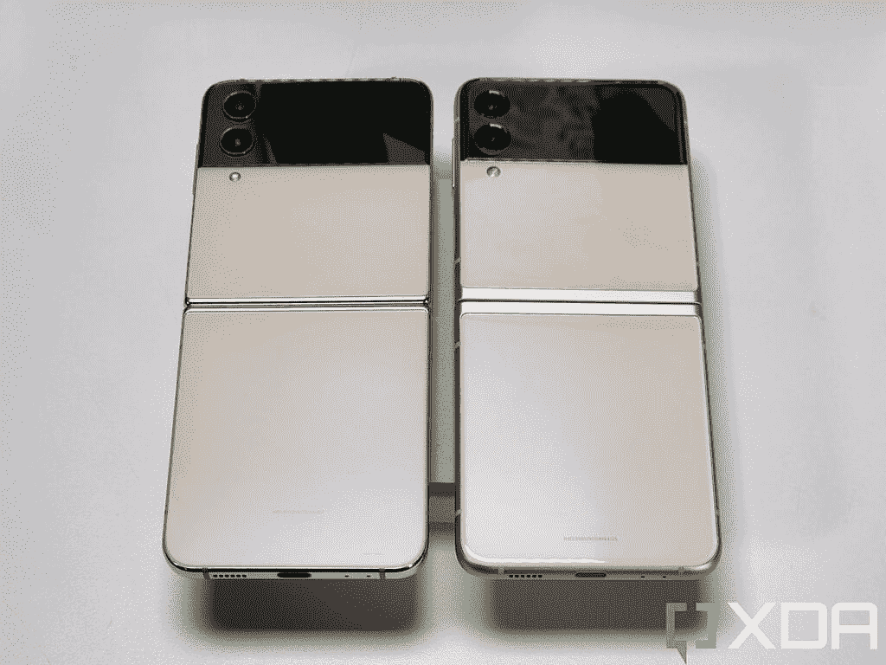
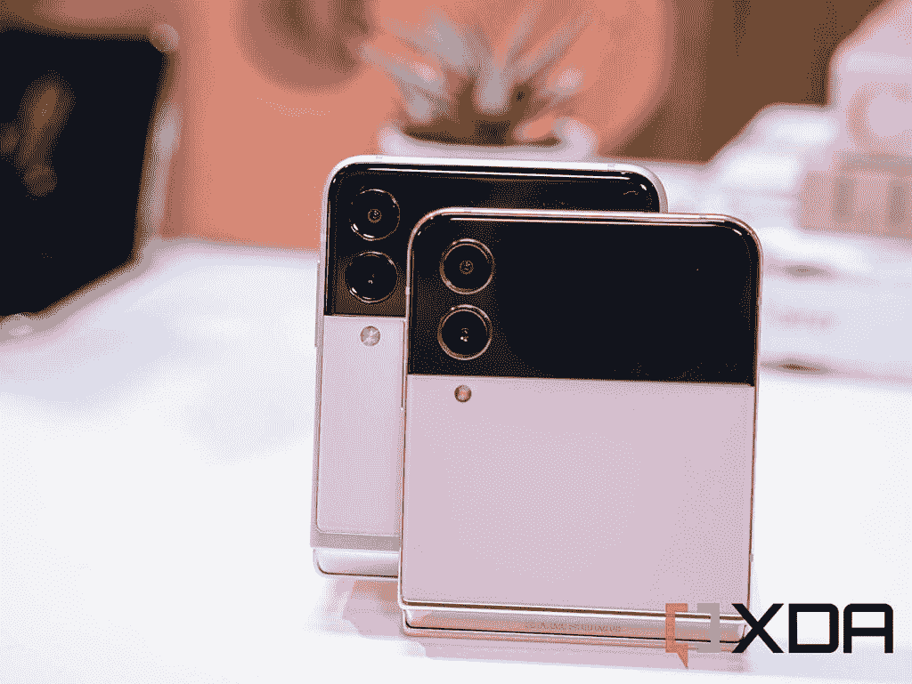

# Galaxy Z Flip 1 到 4:三星的翻盖式可折叠手机多年来是如何发展的

> 原文：<https://www.xda-developers.com/samsung-galaxy-z-flip-1-to-4-evolution/>

无论是研究公司收集的销售数据，三星自己的营销声明，还是我自己在多个国家看到人们使用什么手机的亲身经历，很明显三星 Galaxy Z Flip 3 是一个大热门，可能是第一款获得主流地位的可折叠手机，而不是一款小众的、仅供发烧友使用的设备。

对于我们许多科技媒体人来说，这并不意外，他们去年预测 Galaxy Z Flip 3 会有更广泛的吸引力。翻盖可折叠带来了前两次翻盖的重大改进，但也许最重要的是，三星设法将价格降到了四位数以下(比上一次翻盖便宜了 50%)。

现在随着 [Galaxy Z Flip 4](https://www.xda-developers.com/samsung-galaxy-z-flip-4-hands-on/) 的推出，三星希望保持这一势头，尽管今年的型号是一个更温和的迭代更新。但这没关系，因为期望每年都有重大改进是不现实的。在本文中，让我们回顾一下 Galaxy Z Flip 的所有四代产品，看看三星的翻盖可折叠手机这些年来是如何发展的。

 <picture></picture> 

The Galaxy Z Flip 4 (middle) surrounded by the Galaxy Z Flip 3 (left) and Galaxy Z Flip 5G (right).

 <picture></picture> 

Samsung Galaxy Z Flip 4

新的 Galaxy Z Flip 4 采用了绝对令人敬畏的 Z Flip 3，并添加了一点抛光和一个更节能的 SoC，以实现更好的全方位可折叠。

* * *

## 三星 Galaxy Z Flip:翻盖式的复活

Z Flip 于 2020 年 2 月推出，仅比最初的 Galaxy Fold 推迟了五个月，它将推出三款一直是三星可折叠系列的产品。第一个是超薄玻璃技术，这种技术让塑料弯曲 OLED 面板的质地更接近玻璃。第二:Z Flip 是第一款带有铰链的可折叠手机，可以在折叠时保持原位，三星称之为“灵活模式”。第三个更轻浮:这是三星推出 Z 品牌时的设备(最初的折叠只是被命名为 Galaxy Fold，没有任何不必要的随机字母)。

 <picture></picture> 

The original Galaxy Z Flip was a new bleeding edge mobile that also felt familiar.

与 Galaxy Fold 不同，Galaxy Z Flip 是一种我们以前没有见过的新形式，从一开始就感觉很熟悉:这是对 21 世纪初翻盖手机的回归。Galaxy Z Flip 采用了更传统的 6.7 英寸屏幕，展开后感觉就像一部普通的平板手机。应用程序在这款手机上运行也没有问题，不像 Galaxy Fold，它在头几个月处理了大量应用程序扩展问题。

 <picture></picture> 

The original Flip (left) and the original Fold (right).

让我们回到灵活模式，这是一个巧妙的想法，极大地改善了可折叠的功能。最初的 Galaxy Fold 有一个铰链，只有在完全打开或折叠时才能保持静止。当它在两者之间时，它会像死鱼一样扑腾。Galaxy Z Fold 更加坚固的铰链可以保持静止，这不仅激发了人们对铰链制造质量的更多信心，还使设备可以免提使用。因为屏幕的上半部分基本上可以保持直立，Galaxy Z Flip 允许用户不用手来自拍或视频通话，而不需要支撑手机。

由于 Galaxy Fold 已经在零售市场上销售了几个月，没有出现重大问题，所以这次消费者和媒体对其耐用性的怀疑少了很多。

事后看来，Galaxy Z Flip 确实有一些令人困惑的限制，但由于外形的新鲜感，这些限制被忽略了。第一个是，这款手机配备了更老的高通骁龙 855 Plus 芯片，它不支持 5G(人们普遍认为，最初 Fold 的推迟推出也推迟了 Flip 的首次亮相，它本来应该在 2019 年底推出)。第二个问题是 1.1 英寸的小“外壳显示器”，它只适合显示通知图标和时间。这意味着 Galaxy Z Flip 是一款每次你想用它做任何事情时都必须打开的手机。

* * *

## 三星 Galaxy Z Flip 5G:仅仅是一个处理器凸起

第二款 Flip 与其说是真正的下一代设备，不如说是原始 Flip 的略微修改版本。这基本上是同一款手机，只是它运行在支持 5G 的新骁龙 865 Plus 芯片上。较新的骁龙芯片也带来了优越的 CPU 和 GPU 性能，但这种差异不是白天和黑夜，因为以前的手机也有一个高端芯片。

* * *

## 三星 Galaxy Z Flip 3:让可折叠手机成为主流的手机

正如开头所提到的，Galaxy Z Flip 3 是三星的一大成功，不难看出为什么:三星在这一代产品中做出了重大改进，同时以某种方式将价格降低了 50%(999 美元，而 Galaxy Z Flip 5G 的价格为 1450 美元)。

第一个改进:外部“盖显示器”比以前的 Flip 的外部屏幕大 4 倍。这是一个足够大的增长，Flip 3 现在可以在折叠的形式下做一些智能手机的事情(如阅读短信、查看天气和控制音乐播放)。之前的两次翻转在折叠形态下基本无法使用。

 <picture></picture> 

The Galaxy Z Flip 3's much larger cover display (right) compared to the left.

第二个改进是三星使 Flip 3 更加耐用:不仅框架用三星的“装甲铝”加固，显示屏用大猩猩玻璃 Victus 涂层覆盖，而且 Flip 3 还获得了官方的 IPX8 评级，这使它能够承受水的飞溅(就像在雨中使用一样)。Flip 和 Galaxy Z Fold 3 是第一款拥有任何官方 ip 等级的可折叠手机。

Galaxy Z Flip 3 基本上解决了人们最初对可折叠手机的所有批评:它们太脆弱，太昂贵。与有些平淡的前两次翻转相比，我们在 XDA 也是双色设计的忠实粉丝。

* * *

## 三星 Galaxy Z Flip 4:如果它没坏，就不要修理它

与第二代 Galaxy Z Flip 非常相似，第四代 Galaxy Z Flip 4 主要是迭代更新，带回了相同的设计。铰链得到了改进，因此“脊柱”在折叠状态下不会突出太多。但与 Galaxy Z Fold 4 不同的是，这一变化明显改变了手感，但这里的情况并非如此，因为垂直折叠的性质意味着当设备折叠时，我们的手不会真正接触到铰链区域。从机械角度来说，并且纯粹基于手感，Galaxy Z Fold 4 和去年的手机没有太大区别，尽管 Galaxy Z Flip 4 整体上只是薄了一根头发(展开时薄了 0.8mm，折叠时薄了 1.6mm)。

 <picture></picture> 

The Galaxy Z Flip 4's hinge (bottom) doesn't stick out as much as previous Flips.

这并不是说 Galaxy Z Flip 4 没有带来改进。与去年 Galaxy Z Flip 3 的骁龙 888 相比，更新的高通骁龙 8 Plus Gen 1 SoC 的电池续航时间明显更长，三星还为外部显示器添加了更多软件功能，以及灵活模式。

 <picture></picture> 

The Galaxy Z Flip 4 (left) and Z Flip 3 (right).

现在，您可以通过免提方式将视频传输到 YouTube、Instagram、脸书等网站。Google Meet 等谷歌应用程序也进行了更好的优化，以利用 Galaxy Z Flip 4 的独特外形。

三星还表示，Galaxy Z Flip 4 比以往任何时候都更耐用，改进的“装甲铝”加强了框架，大猩猩玻璃 Victus Plus 保护了显示屏。尽管如此，你可能会想用一个盒子来保护 Galaxy Z Flip 4，而且有很多好的选择。

 <picture></picture> 

Galaxy Z Flip 3 (back) and Galaxy Z Flip 4 (front)

总的来说，Galaxy Z Flip 系列的演变不像 Z Fold 系列的演变那样充满起伏。但这是因为 Flip 使用了一种更经得起考验的设计，而且它的优势是在原始折叠之后，原始折叠承受了试错的冲击。即使今年没有价格下降，Galaxy Z Flip 4 也带来了足够的微妙改进，进一步说服大众，可折叠手机将会继续存在。

 <picture></picture> 

Samsung Galaxy Z Flip 4

新的 Galaxy Z Flip 4 采用了绝对令人敬畏的 Z Flip 3，并添加了一点抛光和一个更节能的 SoC，以实现更好的全方位可折叠。