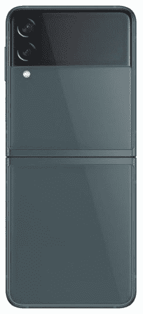
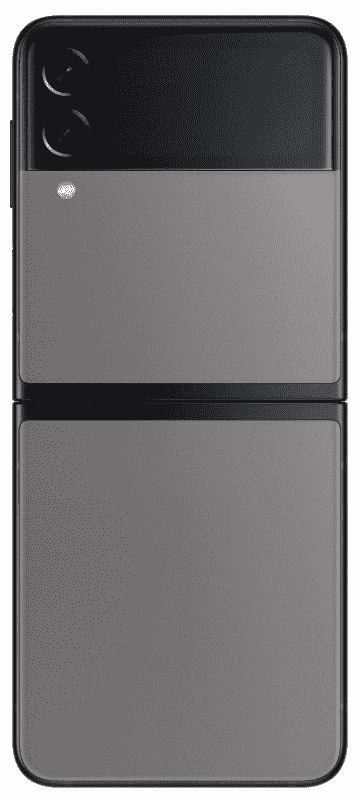
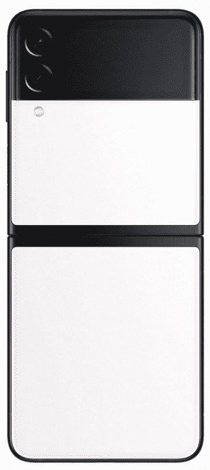

# 三星 Galaxy Z Flip 3 有哪些颜色？

> 原文：<https://www.xda-developers.com/samsung-galaxy-z-flip-3-colors/>

虽然 Galaxy Z Flip 4 已经取代了 Galaxy Z Flip 3，成为三星可折叠产品线中的最新翻盖手机，但去年的型号仍然是一个很好的选择。 [Galaxy Z Flip 4](https://www.xda-developers.com/samsung-galaxy-z-flip-4-review/) 是一个增量更新。除了更快的芯片组、略好的摄像头以及微小的设计和耐用性改进，它并没有带来太多东西。这意味着你可以以折扣价买到去年的款式，而不会错过任何实质性的东西，从而节省一大笔钱。如果这是你打算做的，那么检查 Galaxy Z Flip 3 的所有颜色和口味将是一个好主意——它们有很多！

## Galaxy Z Flip 3 种颜色

Galaxy Z Flip 3 有八种令人惊叹的颜色。奶油色、幻影黑、淡紫色和绿色是标准颜色，而蓝色、黄色、白色和粉色可用于 Galaxy Z Flip 3 定制版，并为三星商店所独有。定制版可以让你随心所欲地定制手机的外观和感觉。您可以混搭和选择不同的背面、正面和边框颜色，打造自己的标志性外观。

 <picture></picture> 

Samsung Galaxy Z Flip 3

Z Flip 3 的奶油色版本看起来很优雅，配有银色边框。

 <picture></picture> 

Green

Galaxy Z Flip 3 的绿色版本看起来像是胡克绿色的深色版本。

 <picture></picture> 

Lavender

如果你想脱颖而出，Z Flip 3 的淡紫色版本可以帮助你。它相当丰富多彩和令人兴奋。

 <picture></picture> 

Phantom Black

更喜欢基础的？幻影黑 Galaxy Z Flip 3 就是为你打造的。四周都是纯黑的。

 <picture></picture> 

Gray

这款三星在线商店专属的颜色变体配有黑色框架，与机身其余部分的灰色形成了完美的互补。

 <picture></picture> 

White

Z Flip 3 的白色变体不仅仅是纯白。它还有一个黑色的框架，就像灰色的变体一样，给它增添了更多的个性。

 <picture></picture> 

Pink

Z Flip 3 的粉色版本看起来更像玫瑰金。此外，像其他三星在线商店专属颜色一样，它也有一个黑色框架。

由于 Galaxy Z Flip 3 有如此多的颜色选择，每个人都将能够找到一些与他们交谈并补充他们风格的东西。

三星 Galaxy Z Flip 3 采用 6.7 英寸全高清+ AMOLED 柔性屏幕和 1.9 英寸 AMOLED 盖板屏幕。它由高通骁龙 888 SoC 驱动，搭配 8GB 内存和高达 256GB 的板载存储。你还可以获得侧装指纹传感器、3，300mAh 双电池和 IPX8 防水功能。

成像能力方面，背部有两个摄像头——12MP 广角主射手和 12MP 超广角摄像头。正面有一个 10MP 自拍摄像头。最后，这款手机运行在 Android 11 上，只有一个用户界面。

* * *

你打算买哪种颜色的？请在评论区告诉我们。此外，不要忘记查看[最佳 Galaxy Z Flip 3 交易](https://www.xda-developers.com/best-galaxy-z-flip-3-deals/)文章，在手机上找到一些优惠。我们还为新的可折叠收集了[最佳案例，以保护它。](https://www.xda-developers.com/best-galaxy-z-flip-3-cases/)